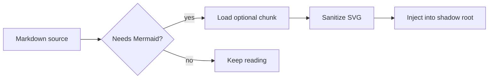

# Mermaid diagram

The Phase A source block below is hydrated only after the optional Mermaid chunk arrives.

```mermaid
flowchart LR
  Input[Markdown source] --> Scan{Needs Mermaid?}
  Scan -->|yes| Lazy[Load optional chunk]
  Scan -->|no| Text[Keep reading]
  Lazy --> Safe[Sanitize SVG]
  Safe --> Shadow[Inject into shadow root]
```

The surrounding prose remains selectable and readable while the diagram loads.
