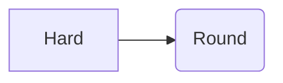
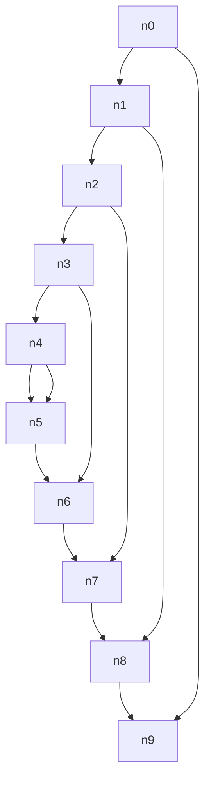

# readit 计划一：Phase A 引擎与快照测试套件 实施计划

> **For agentic workers:** REQUIRED SUB-SKILL: Use superpowers:subagent-driven-development (recommended) or superpowers:executing-plans to implement this plan task-by-task. Steps use checkbox (`- [ ]`) syntax for tracking.

**Goal:** 交付一个可 `import`、可测、保真度可证伪的 Markdown 渲染引擎——纯函数、同构、字节确定，其对 GitHub 的对齐由对真实 GitHub 输出的快照回归测试守住。

**Architecture:** 单一硬边界 Phase A / Phase B。本计划只做 Phase A：`(src, resolvedOpts) -> HTML string`，纯同步、无 DOM、Node 与浏览器同构。markdown-it 15 负责解析，一组自研 renderer 规则把输出整形成 GitHub blob 视图的 DOM 形状，hast 层做卫生化，MathJax 4 在 Node 里把 TeX 渲成自包含 SVG 字符串。所有异步收敛到唯一一道缝 `prepare()`，`render()` 函数体内永不出现 `await`。

**Tech Stack:** TypeScript · ESM · Node 22+ · markdown-it 15.0.0 · hast-util-sanitize 5.0.2 · @mathjax/src 4.1.3 · vitest 4 · pnpm workspaces

**上位契约：** `readit/SPEC.md`。本计划实现其中的 M0 + M1 + M2。计划二（M3+M4：element/Shadow DOM + 编辑器）与计划三（M5+M6+M7：Mermaid + 壳 + 分发）另行编写。

---

## Global Constraints

以下是项目级要求，**每个任务的要求都隐含包含本节**。数值逐字取自 SPEC.md。

**运行时与语言**
- Node 22+，ESM（`"type": "module"`），TypeScript
- pnpm workspaces，包在 `packages/` 下

**精确锁定的依赖版本**（不要用 `latest`，不要自行升级）
- `markdown-it@15.0.0` — ⚠️ **不得回退到 14.3.0**。14.3.0 依赖 linkify-it 5.0.2（`fuzzyLink` 默认为真），回退会静默改变自动链接输出并作废所有基线
- `hast-util-sanitize@5.0.2`
- `hast-util-from-html@2.0.3`
- `hast-util-to-html@9.0.5`
- `github-slugger@2.0.0`
- `@mathjax/src@4.1.3` — ⚠️ **不是 `mathjax-full`**。后者冻结在 3.2.2（2022-06），写 `mathjax-full/js/...` 就是在写 MathJax 3
- `@mathjax/mathjax-tex-font@4.1.3` — ⚠️ **不用 v4 默认的 newcm**。newcm 把字形拆成 40 个懒加载块，`\mathbb{R}`、`\mathcal{O}` 等常见构造在同步渲染时直接抛错
- `vitest@4`

**Phase A 纯度（承重约束，违反即破坏整个验收体系）**
- `render()` 函数体内**永不出现 `await`**
- Phase A 不碰 DOM、不访问网络、不读时间、不用随机数
- Phase A **不得自己读 frontmatter**。frontmatter 选项由独立纯函数 `readFrontmatterOptions(src)` 提取，由调用方传入
- 读取 frontmatter 里的配置键**不得**把它从输出里移除，frontmatter 仍照常渲染成表格

**离线**
- 任何运行时路径都不访问网络。测试套件在阻断出网的环境里必须仍然全绿
- 自定义 emoji 的 PNG 必须本地内置

**卫生化**
- 只对**用户提供的原始 HTML** 跑，且必须在注入自家标记**之前**。GitHub 白名单里 `class` 和 `style` 出现次数为零，一遍扫全树会把 `.markdown-alert`、`.markdown-heading`、`mjx-container` 全铲掉
- 唯一逃生舱叫 `allowDangerousHtml: true`。**不存在 `sanitize: false`**

**MathJax 确定性的三个前提**（缺一不可）
- `fontCache: 'none'`
- `tags: 'none'`
- **每份文档一个全新 MathDocument**（TeX 宏会跨 `convert()` 泄漏）

**命名**
- `packages/core/src/types.ts` 里的类型与函数名、以及各规则的 `applyXxx` 名字是跨任务契约，**不得自创同义词**。规则的权威名单见下面的跨规则契约 C1；引用时逐字照抄，近似重名（把 `applyHeadingAnchors` 写成 `applyHeadingAnchor`）在 TypeScript 里是一条清晰的编译错误，但在计划文档里是一处会浪费执行者半小时的噪声

**测试纪律**
- TDD：先写失败的测试，跑一遍看它真的失败，再写最小实现，再跑一遍看它通过
- `known-failures.json` 白名单：白名单**外**的新失败必须断构建；白名单**内**已经修好的条目**也要报错**（防止白名单腐烂）
- 每个任务结束提交一次

**验收线**（本计划完成的定义）
1. GFM 0.29 规格 **672/672 减白名单**通过，白名单每条附不可修的理由
2. 语料**归一化后 100% diff 通过**
3. 美元护栏 159 条 oracle 语料 **154 条一致 + 5 条具名偏离**（偏离是断言"与 GitHub 不同"的 fixture，不是跳过）
4. 数学黄金文件通过，**含顺序置换测试**（重复测试抓不到宏泄漏）

---

## File Structure

```
readit/
├── SPEC.md                                 上位契约（已存在）
├── package.json                            workspace 根
├── pnpm-workspace.yaml
├── vitest.config.ts
├── docs/plans/                             本文档所在
├── spike/README.md                         M0 的测量记录（一次性，不进主构建）
│
├── packages/core/                          Phase A 引擎
│   ├── package.json
│   ├── src/
│   │   ├── types.ts                        跨任务接口契约（Task 2 创建）
│   │   ├── index.ts                        render / renderWithExplain / prepare / readFrontmatterOptions
│   │   ├── engine.ts                       markdown-it 装配，按固定顺序调用各规则
│   │   ├── prepare.ts                      唯一的异步缝
│   │   ├── sanitize.ts                     hast 卫生化 schema
│   │   ├── frontmatter-options.ts          readFrontmatterOptions
│   │   └── rules/                          一条规则一个文件，形如 applyXxx(md): void
│   │       ├── dirauto.ts                  dir="auto"
│   │       ├── heading.ts                  markdown-heading + 兄弟 anchor
│   │       ├── table.ts                    align 属性 + markdown-accessiblity-table
│   │       ├── strikethrough.ts            <s> → <del>
│   │       ├── tasklist.ts                 属性顺序 + aria-label
│   │       ├── autolink.ts                 GFM 扩展自动链接（移植，最大的一块）
│   │       ├── tagfilter.ts                9 个标签的前导 < 转义
│   │       ├── footnote.ts
│   │       ├── alerts.ts                   5 类 + octicon 内联
│   │       ├── frontmatter.ts              YAML → 表格
│   │       ├── emoji.ts
│   │       ├── codeblock.ts                highlight wrapper
│   │       ├── sourceline.ts               token.map → data-line
│   │       ├── clobber.ts                  user-content- 前缀
│   │       └── math-inline.ts              美元护栏 core rule（R0–R10）
│   ├── data/
│   │   ├── emoji.json                      shortcode → 码点
│   │   └── emoji-custom/                   内置的自定义 emoji PNG
│   └── test/
│       ├── rules/*.test.ts                 每条规则一个测试文件
│       └── inline-math/                    159 条语料 + 5 条具名偏离
│
├── packages/math/                          MathJax 渲染器（懒加载目标）
│   ├── package.json
│   ├── src/
│   │   ├── index.ts                        createMathRenderer(): MathRenderer
│   │   └── svg-stylesheet.ts               ~5,884 字节的冻结常量
│   └── test/
│       ├── determinism.test.ts             重复 + 顺序置换 + 跨进程
│       └── goldens/                        常见 README 构造的黄金文件
│
├── test/                                   跨包的快照套件
│   ├── spec/
│   │   ├── commonmark-0.31.2.json          652 例，140,487 字节
│   │   ├── gfm-0.29.json                   672 例
│   │   ├── known-failures.json             带理由的白名单
│   │   └── spec.test.ts
│   ├── corpus/                             45–60 个 .md 源文件，五类
│   ├── fixtures/                           .expected.html 黄金文件
│   ├── normalize.ts                        9 步归一化器（与刷新脚本共用）
│   └── corpus.test.ts
│
├── scripts/
│   ├── fetch-specs.ts                      一次性抓取规格文件
│   ├── build-emoji.ts                      生成 emoji.json 并下载自定义图
│   └── oracle-refresh.ts                   刷新黄金文件，永不在常规测试路径里跑
│
└── .github/workflows/
    ├── ci.yml                              L1 + L2 + L3，含离线门与 Windows 矩阵
    └── oracle-drift.yml                    夜间刷新 → git diff --exit-code → 自动开 PR
```

**分文件的理由**：一条渲染规则一个文件，因为它们各自独立、各有一个测试文件、且是一个 reviewer 可以单独否决的单位。`engine.ts` 是唯一知道它们顺序的地方——顺序在这里是有语义的（例如 `clobber` 必须在用户 HTML 进来之后、`sourceline` 必须在块级 token 还完整时）。

---

## 任务索引

| # | 任务 | 组 |
|---|------|-----|
| 1 | M0 Spike —— 把壳决策从推测变成事实 | — |
| 2 | 仓库骨架、markdown-it 15 裸装配与冒烟测试 | G1-skeleton-spec |
| 3 | CommonMark 0.31.2 规格套件与 known-failures 棘轮 | G1-skeleton-spec |
| 4 | GFM 0.29 规格套件 | G1-skeleton-spec |
| 5 | `dir="auto"` 铺设规则 | G2-block-shape |
| 6 | 标题锚点（markdown-heading + octicon permalink） | G2-block-shape |
| 7 | 表格（align 属性 + markdown-accessiblity-table 外壳） | G2-block-shape |
| 8 | 删除线 `<s>` → `<del>` | G2-block-shape |
| 9 | 任务列表（自写规则，不用 markdown-it-task-lists） | G2-block-shape |
| 10 | GFM 扩展自动链接 —— www / url 两类 + 括号配平 + 尾随剥离 | G3-extensions |
| 11 | GFM 扩展自动链接 —— email 类 + 与 GFM 规格 §6.9 全部 11 例对齐 | G3-extensions |
| 12 | tagfilter —— 9 个标签的前导 `<` 转义 | G3-extensions |
| 13 | 脚注 —— GitHub 形状、无盐 `user-content-fn-*` | G3-extensions |
| 14 | GitHub Alerts（rules/alerts.ts） | G4-github-only |
| 15 | frontmatter → 表格（rules/frontmatter.ts） | G4-github-only |
| 16 | emoji（rules/emoji.ts + scripts/build-emoji.ts） | G4-github-only |
| 17 | 代码块 wrapper（rules/codeblock.ts） | G4-github-only |
| 18 | data-line（rules/sourceline.ts） | G4-github-only |
| 19 | user-content- 前缀（rules/clobber.ts） | G4-github-only |
| 20 | 卫生化（sanitize.ts） | G4-github-only |
| 21 | 归一化器（9 步 + D-LINK/D-CAMO 白名单） | G5-snapshot |
| 22 | oracle 刷新脚本（状态与媒体类型断言强制） | G5-snapshot |
| 23 | 语料（58 个文件，五类） | G5-snapshot |
| 24 | 语料快照测试与夜间 oracle 漂移工作流 | G5-snapshot |
| 25 | 美元护栏 core rule（rules/math-inline.ts） | G6-dollar-guard |
| 26 | 159 条 GitHub oracle 语料测试 + 5 条具名偏离 | G6-dollar-guard |
| 27 | explain 模式（每个 `$` 的判定日志） | G6-dollar-guard |
| 28 | MathJax 4 SVG 渲染器 + 冻结的 SVG 样式表常量 | G7-mathjax |
| 29 | 数学确定性测试（重复 / 顺序置换 / 跨进程）+ README 构造黄金文件 | G7-mathjax |
| 30 | prepare() 异步缝 | G7-mathjax |
| 31 | 离线门（进程内网络拦截 + CI 无出网命名空间） | G7-mathjax |
| 33 | 链接与图片的 GitHub 装饰 | 自审补 |
| 32 | 引擎最终装配与四条验收线核对 | — |

> **执行顺序注意：Task 33 排在 Task 32 之前执行。** 编号靠后只是因为它是自审阶段发现覆盖缺口后补的，而 Task 32 是全计划的最后一步（集成 + 核对验收线）。

---

## 跨规则契约（写 `src/rules/*.ts` 的任务全部必读）

七组任务是并行起草的，每组都在自己的临时目录里真装依赖、真跑代码。这带来三处它们各自看不到的冲突，本节是权威裁决。**本节与任务正文冲突时，以本节为准。**

### C1. 两个槽位：`SEMANTIC_RULES` 与 `SHAPE_RULES`

这是起草过程中发现的一个**计划级缺陷**，必须在写第一条规则之前就理解。

朴素写法是"一个 `RULES` 数组，`createEngine` 全部加载"。这个写法会让验收线当场不可达：SPEC §6 里那些**外形类**规则（`dir="auto"` 铺到块级元素、标题锚点 wrapper、`<markdown-accessiblity-table>`、代码块 wrapper、`data-line`）一旦落地，672 条 GFM 与 652 条 CommonMark 规格用例里的**绝大多数会无条件失败**——因为规格期望的是裸 CommonMark 输出，不是 GitHub 的外形。「672/672 GFM 减白名单」这条验收线会变成不可达，L1 套件被迫作废。

所以 `engine.ts` 有两个有序槽位：

- `createEngine(opts)` 加载 `SEMANTIC_RULES` + `SHAPE_RULES` —— 真实渲染路径
- `createSpecEngine(opts)` **只**加载 `SEMANTIC_RULES` —— L1 规格套件走这条

已实测确认插槽真的通：往 `SEMANTIC_RULES` push 一条 `<s>`→`<del>` 规则后，GFM example 491 立刻从「白名单内失败」翻成「白名单内却通过了」并断构建——正是想要的棘轮行为。

**每条规则的槽位（写规则时照此注册，不要自行判断）：**

| 规则 | 槽 | 理由 |
|---|---|---|
| `applyStrikethrough` | SEMANTIC | GFM 规格期望 `<del>`，markdown-it 默认发 `<s>` |
| `applyTableAlign` | SEMANTIC | GFM 规格期望 `align="center"` 属性形式 |
| `applyAutolink` | SEMANTIC | GFM 规格 §6.9，11 个例子直接考它 |
| `applyTagfilter` | SEMANTIC | GFM 规格 §6.11 |
| `applyTableWrapper` | SHAPE | `<markdown-accessiblity-table>` 是 GitHub 外壳，规格不期望 |
| `applyFootnote` | SHAPE | ⚠️ CommonMark 把 `[^foo]` 当**普通链接标签**，装进 SEMANTIC 会破坏 CommonMark 用例。代价是 L1 不覆盖脚注，由 L2 语料覆盖 |
| `applyTaskList` | SHAPE | GitHub 的属性顺序与 cmark-gfm 期望**永久不等**，例 279/280 已按 PERMANENT 登记 |
| `applyHeadingAnchors` | SHAPE | |
| `applyDirAuto` | SHAPE | |
| `applyAlerts` | SHAPE | 规格里没有 alerts |
| `applyFrontmatter` | SHAPE | |
| `applyEmoji` | SHAPE | |
| `applyCodeBlock` | SHAPE | |
| `applyMathInline` | SHAPE | 规格里 `$` 是普通字符 |
| `applyRawHtmlPolicy` | SHAPE | 内部组合 clobber + sanitize；`user-content-` 前缀会破坏带 `id` 的规格用例 |
| `applySourceLine` | SHAPE | `data-line` 是 readit 自有产物 |

**⚠️ 对 Task 7 正文的修正：** G2 起草时不知道槽位的存在，把两件事写进了同一个 `applyTable`。不拆的话 GFM 表格那 8 个例子会因为多出的外壳而全部失败，且没有干净的白名单理由（外壳不是"任何 JS 解析器都不可能匹配"的那一类）。

好在拆点很干净——`applyTable` 内部本来就是两件互不相干的事。把 Task 7 Step 3 的最终实现改成两个导出：

```ts
/** SEMANTIC：把 style="text-align:*" 改写成 align 属性。GFM 规格期望这个形式。 */
export function applyTableAlign(md: MarkdownIt): void {
  md.core.ruler.push('readit_table_align', (state: StateCore) => {
    for (const token of state.tokens) {
      if (token.type === 'th_open' || token.type === 'td_open') rewriteAlign(token)
    }
    return true
  })
}

/** SHAPE：套 GitHub 的 <markdown-accessiblity-table> 外壳（注意这个拼写，GitHub 就是少一个 i）。 */
export function applyTableWrapper(md: MarkdownIt): void {
  md.renderer.rules.table_open = (tokens, idx, options, _env, self) =>
    '<markdown-accessiblity-table>' + self.renderToken(tokens, idx, options)

  md.renderer.rules.table_close = () => '</table></markdown-accessiblity-table>\n'
}
```

`rewriteAlign` 与那两条注释（就地改写 `attr[0]`/`attr[1]` 保住属性顺序、`table_close` 手写不用 `renderToken`）原样保留，理由不变。

Task 7 的测试文件也要跟着改：`import { applyTableAlign, applyTableWrapper } from '../../src/rules/table.js'`，`md()` 里 `.use(applyTableAlign).use(applyTableWrapper)`。四条断言的期望值一个字都不用改——拆分不改变两者同时加载时的输出。**再加一条新断言**，把拆分的意义钉住：

```ts
it('align 属性不依赖外壳规则（SEMANTIC 槽可单独加载）', () => {
  const semanticOnly = new MarkdownIt('default', { html: true, linkify: false })
    .use(applyTableAlign)
  const html = semanticOnly.render('| a |\n|:-:|\n| b |\n')
  expect(html).toContain('align="center"')
  expect(html).not.toContain('markdown-accessiblity-table')
})
```

### C2. 装配顺序

大部分规则用 `ruler.before('x')` / `ruler.after('x')` 显式定位，调用顺序不影响它们的执行顺序。但有四条是**真实耦合**，实测验证过：

1. `applyDirAuto` 靠 `contains-task-list` 类判断跳过任务列表 → 必须在 `applyTaskList` **之后**
2. markdown-it 按 attrs 数组顺序序列化属性，GitHub 是 `<h2 class="heading-element" dir="auto">` → 设 class 的 `applyHeadingAnchors` 必须在设 dir 的 `applyDirAuto` **之前**
3. `applySourceLine` 最后 —— `data-line` 要贴在最终 attrs 上
4. 美元护栏挂 `core.ruler.before('text_join')`，emoji 挂 `after('text_join')`，自动链接挂 `core.ruler.push`（即 text_join 之后）。**护栏与自动链接的位置要求方向相反但互不干扰**：护栏需要 `text_special` 仍可辨认（用于 `\$` 遮罩），自动链接需要 `text_special` 已并入 `text.content` 并解码。各自按锚点注册即可

权威调用顺序：

```ts
// ---- SEMANTIC_RULES ----
applyStrikethrough      // renderer: s_open / s_close -> del
applyTableAlign         // renderer: th_open / td_open 的 align 属性
applyAutolink           // core.ruler.push('readit_gfm_autolink')
applyTagfilter          // renderer: html_block / html_inline（链式覆写，见 C3）

// ---- SHAPE_RULES ----
applyFrontmatter        // block.ruler.before('table', 'readit_frontmatter')
applyFootnote           // block + inline + core
applyMathInline         // core.ruler.before('text_join', 'readit_math_inline')
applyEmoji              // core.ruler.after('text_join', 'readit_emoji')
applyAlerts             // core.ruler.after('block', 'readit_alerts')
applyTableWrapper       // renderer: table_open / table_close
applyTaskList           // core: readit_task_list
applyHeadingAnchors     // renderer: heading_open / heading_close
applyDirAuto            // core: readit_dir_auto        ← 必须在 tasklist 与 heading 之后
applyCodeBlock          // renderer: fence / code_block
applyRawHtmlPolicy      // core.ruler.push（内部组合 clobber + sanitize）
applySourceLine         // core.ruler.push              ← 必须最后
```

这个顺序里，四条真实耦合是硬约束，其余是为了可读性。Task 32 的集成测试会把它验一遍；**如果实测发现某处顺序不对，改顺序并在那里补一条注释说明为什么**，不要沉默地调。

### C3. 三条会静默咬人的实现约定

**(a) 自家生成的、含 `class` 的 HTML 一律走 `readit_raw` token，不要用 `html_inline` / `html_block`。**

这不是理论风险，是集成时真的踩到并修掉的 bug：emoji 规则原本发 `html_inline`，被 `applyRawHtmlPolicy` 的 walker 扫到，`` 的 class 被当成用户写的 class 剥掉，变成 ``。

同样适用于标题锚点的 `<div class="markdown-heading">` 和数学的 `mjx-container`。`readit_raw` 的 renderer（原样吐 `content`）在 `engine.ts` 里统一注册一次。

**(b) 覆写 `renderer.rules.html_block` / `html_inline` 必须链式，不得直接替换。**

```ts
const prev = md.renderer.rules.html_block
md.renderer.rules.html_block = (tokens, idx, opts, env, self) => {
  const out = prev ? prev(tokens, idx, opts, env, self) : tokens[idx]!.content
  return /* 你的变换 */(out)
}
```

直接替换的话，SEMANTIC 槽里的 `applyTagfilter` 会被 SHAPE 槽里任何同类覆写静默顶掉，而症状是"某些 `<script>` 没被转义"——很难定位。

**(c) 选项经 `env` 传递，不经 `md.options`。**

契约里 `applyXxx(md: MarkdownIt): void` 没有 options 形参，所以规则在**运行期**从 `state.env.readit` 读配置。`render` / `renderWithExplain` 必须构造 `env = { readit: resolvedOptions }` 传给 `md.render(src, env)`，`renderWithExplain` 再从 `env.readitExplain ?? []` 取判定日志。

后果之一：`inlineMath: 'off'` 是**运行期 no-op**，不是 SPEC §8.6 字面写的「不注册该规则」。行为等价（`$$` 块与 ```math 围栏是独立块规则不受影响），但这样同一个 md 实例才能服务不同选项，对 `render(src, opts)` 这个纯函数签名是必要的。

### C4. markdown-it 15.0.0 的类型导入（四个组各撞过一次）

15.0.0 的默认导出是**值** `MarkdownItCallable`，`MarkdownIt` 只作为**类型**具名导出。所以：

```ts
import MarkdownItConstructor from 'markdown-it'   // 值
import type { MarkdownIt, Token } from 'markdown-it'  // 类型
```

写成 `import MarkdownIt from 'markdown-it'` 再用 `md: MarkdownIt` 是编译错误，实测报 `TS2749: 'MarkdownIt' refers to a value, but is being used as a type here`。

另外 15.0.0 **自带** `dist/markdown-it.d.mts`，**不要装 `@types/markdown-it`**（那个包是给 14.x 的，会和自带类型打架）。`markdown-it/lib/token.mjs` 这个路径在 15.0.0 里也不存在。

### C5. `no-await-on-render-path` 横向守卫

`packages/core/test/no-await-on-render-path.test.ts` 会扫 `packages/core/src/` 下所有 `.ts`，断言除 `prepare.ts` 外没有 `await` / `async` / `import(`。这是 SPEC 全局约束「`render()` 函数体内永不出现 await」的自动化门。写任何规则时都要知道它存在——实测它是活的，临时放一个含 `await` 的文件进去立刻变红。

### C6. 对任务正文的其余修正

| 位置 | 修正 |
|---|---|
| Task 3 / Task 4 正文的白名单条数 | 正文总结句写的「16 PERMANENT + 12 TEMPORARY」算错了，**以 14 + 14 为准**（PERMANENT = 187, 217, 218, 279, 280 + 9 条 emphasis；TEMPORARY = 199, 491, 621–631, 652）。白名单条目本身逐条都是实测且正确的，只有总结句的计数错了。执行时跑一遍 `grep` 计数核对 |
| Task 7 | 见 C1 末尾的拆分要求 |
| Task 26 的 `corpus.json` | 那是 33 KB 数据，无法内联进本文档，任务块给的是从起草目录拷贝 + sha256 校验的路径。⚠️ **如果执行时该临时目录已被清理且无网络，Task 26 会卡住。** 建议在开工第一天就把 `corpus.json` 先落进仓库并提交，不要等到 Task 26 |

---
### Task 1: M0 Spike —— 把壳决策从推测变成事实

> 这是全计划性价比最高的一天。它**不产出进入主构建的代码**，产出的是一份测量记录。
> 在它完成之前不要对壳做任何技术承诺。

**背景：** SPEC §14 记录的所有装机体积都是从别人的应用反推的。那个「12–18 MB」是低置信度的自评，而且其中 mermaid 一项被低估了 3 倍（实测 `mermaid.min.js` 是 3.4 MB 而非 1.2 MB）。同时有两条只能在真机上验证的风险：Mermaid 在 WKWebView 里的渲染，以及 macOS 上根本不存在的 Cmd+F。

**Files:**
- Create: `spike/README.md`（测量记录）
- Create: `spike/tauri-probe/`（一次性工程，不进 workspace，用 `.gitignore` 排除其构建产物）

**Interfaces:**
- Consumes: 无
- Produces: 一份 `spike/README.md`，内容是下面六项的实测数字与结论。后续任务不依赖它的代码，但**M6（壳）的技术选型依赖它的结论**

- [ ] **Step 1: 建一个 Tauri 2.11.5 的 hello-world**

```bash
mkdir -p spike/tauri-probe && cd spike/tauri-probe
npm create tauri-app@latest . -- --template vanilla-ts --manager npm --yes
# 确认版本，不要接受 latest
npm ls @tauri-apps/cli @tauri-apps/api
```

预期：`@tauri-apps/cli` 与 `@tauri-apps/api` 均为 2.11.x。若不是，在 package.json 里钉死到 2.11.5 后重装。

- [ ] **Step 2: 把四个大件真的装进去并在前端用到**

```bash
npm i mermaid@11.16.1 @mathjax/src@4.1.3 @mathjax/mathjax-tex-font@4.1.3 \
      @codemirror/view@6.43.8 @codemirror/state@6.7.1 \
      @codemirror/language@6.12.4 @codemirror/commands@6.10.4 \
      @codemirror/lang-markdown@6.5.2 @wooorm/starry-night@3.10.0
```

在 `src/main.ts` 里真的调用每一个（不是只 import——只 import 会被 tree-shake 掉，量出来的体积是假的）：渲一张 mermaid 流程图、渲一条 MathJax 公式、挂一个 CodeMirror 实例、高亮一段 JS。

- [ ] **Step 3: 在 macOS 与 Windows 上各打一次包，记录真实体积**

```bash
npm run tauri build
```

记录到 `spike/README.md`：
- macOS `.dmg` 体积（arm64 与 x64 分别记，**不要**打 universal binary，那会让 `.app` 体积翻倍）
- Windows NSIS `.exe` 体积
- 前端 bundle 在 `dist/` 里的未压缩体积，按四个大件分别归因

**这一步的产出直接替换 SPEC §5.1 里的估算。** 如果实测远超 25 MB，回到 SPEC §16 决策 #3 重新评估 Tauri vs Electron——那条决策的全部依据就是体积。

- [ ] **Step 4: 在真 WKWebView 里验 Mermaid**

在 macOS 上打开构建产物（**不是** `npm run tauri dev` 里的浏览器，必须是真的打包应用），渲一张**非平凡**的流程图：至少 10 个节点、含长标签、含子图、含一条带 `classDef` 的样式。

记录：
- 标签位置是否正确（WebKit bug 23113 是 foreignObject 错位，只在 SVG transform 叠加 HTML 子元素的 opacity/transform 时触发）
- 标签文字是否被裁切（这更可能是字体测量问题——离屏容器的 font-family 与实际渲染容器不一致）
- 截图存进 `spike/`

⚠️ 渲染时用 `position: absolute; left: -99999px` 的离屏容器，**不要用 `display: none`**（那在 Chrome/Edge 上也坏，mermaid#6652）。渲染前 `await document.fonts.ready`。

- [ ] **Step 5: 验 Cmd+F 的真实状况**

在打包好的 macOS 应用里按 Cmd+F。

预期：**什么都不会发生**（tauri#9385，2024-04 开至今）。把这个预期写进记录——它确认了 SPEC §11.3 的判断，即自建查找是 v1 的必做项而非可选优化。

同时在 Windows 上按 Ctrl+F，预期会弹出 WebView2 自带的查找栏。记录两边行为的差异。

- [ ] **Step 6: 量冷启动与常驻内存**

「轻量」不止是装机体积，对一个单文档阅读器来说冷启动时间和常驻内存才是用户真正感知的。

- 冷启动：从双击到内容可见，量 5 次取中位数（macOS 用 Activity Monitor 或 `time`，Windows 用任务管理器）
- 常驻内存：打开一份 40 KB 的真实文档后的 RSS

- [ ] **Step 7: 写测量记录并提交**

`spike/README.md` 必须包含：六项实测数字、两张 Mermaid 截图、以及一句明确的结论——**「Tauri 决策成立」或「Tauri 决策需重新评估，理由是 X」**。

```bash
git add spike/README.md spike/*.png
git commit -m "spike: M0 壳可行性测量 —— 体积/Mermaid/查找/启动"
```

---


---

### Task 2: 仓库骨架、markdown-it 15 裸装配与冒烟测试

**Files:**
- Create: `package.json`（仓库根，npm workspaces）
- Create: `packages/core/package.json`
- Create: `packages/core/tsconfig.json`
- Create: `packages/core/vitest.config.ts`
- Create: `packages/core/src/types.ts`
- Create: `packages/core/src/engine.ts`
- Create: `packages/core/src/index.ts`
- Test: `packages/core/test/smoke.test.ts`

**Interfaces:**
- Consumes: 无（本组第一个任务）
- Produces:
  - `packages/core/src/types.ts`：`Highlighter`、`MathRenderer`、`InlineMathMode`、`RenderOptions`、`DEFAULT_OPTIONS`、`ExplainEntry`、`RenderResult`（严格照跨任务契约，不得改动）
  - `packages/core/src/engine.ts`：
    - `type Rule = (md: MarkdownIt) => void`
    - `const SEMANTIC_RULES: Rule[]`
    - `const SHAPE_RULES: Rule[]`
    - `function createEngine(opts: RenderOptions): MarkdownIt`
    - `function createSpecEngine(opts: RenderOptions): MarkdownIt`
  - `packages/core/src/index.ts`：`render(src, opts?) => string`、`renderWithExplain(src, opts?) => RenderResult`、`prepare(src, opts?) => Promise<RenderOptions>`、`readFrontmatterOptions(src) => { inlineMath?: InlineMathMode }`

**markdown-it 15.0.0 的实测导入事实（后续每个规则任务都要用，别猜）：**

`npm view markdown-it@15.0.0 exports` 实测输出的 `"."` 条目：
`import` → `{ types: './dist/markdown-it.d.mts', default: './dist/markdown-it.mjs' }`。
即 **15.0.0 自带类型，不要装 `@types/markdown-it`**（那个包是给 14.x 的，会和自带类型打架）。

`dist/markdown-it.d.mts` 最后一行实测为：

```
export { type Delimiter, type Env, type MarkdownIt, type MarkdownItOptions, type MarkdownItPreset, type ParserBlock, type ParserCore, type ParserInline, type Renderer, type RendererRule, type Ruler, type StateBlock, type StateCore, type StateInline, type Token, MarkdownItCallable as default };
```

关键后果：**默认导出是值 `MarkdownItCallable`（类型为 `typeof MarkdownIt & ((...)=>MarkdownIt)`），`MarkdownIt` 只作为「类型」具名导出。**
所以下面这段是**编译错误**，实测报：

```
src/__probe.ts(2,28): error TS2749: 'MarkdownIt' refers to a value, but is being used as a type here. Did you mean 'typeof MarkdownIt'?
```

```ts
import MarkdownIt from 'markdown-it'
export function applyX(md: MarkdownIt): void { void md }   // ✗ TS2749
```

**正确写法（所有 `src/rules/*.ts` 一律照抄这两行）：**

```ts
import MarkdownItConstructor from 'markdown-it'   // 值：new MarkdownItConstructor(...) 或 MarkdownItConstructor(...) 都行
import type { MarkdownIt } from 'markdown-it'     // 类型：applyXxx(md: MarkdownIt)
```

- [ ] **Step 1: 写会失败的测试**

`packages/core/test/smoke.test.ts`：

```ts
import { describe, expect, it } from 'vitest'
import {
  DEFAULT_OPTIONS,
  prepare,
  readFrontmatterOptions,
  render,
  renderWithExplain,
} from '../src/index.js'

describe('core skeleton', () => {
  it('renders an ATX heading', () => {
    expect(render('# hi')).toBe('<h1>hi</h1>\n')
  })

  it('renderWithExplain returns html plus an empty explain log by default', () => {
    expect(renderWithExplain('# hi')).toEqual({
      html: '<h1>hi</h1>\n',
      explain: [],
    })
  })

  it('escapes raw HTML unless allowDangerousHtml is set', () => {
    expect(render('<b>x</b>')).toBe('<p>&lt;b&gt;x&lt;/b&gt;</p>\n')
    expect(render('<b>x</b>', { allowDangerousHtml: true })).toBe(
      '<p><b>x</b></p>\n',
    )
  })

  it('prepare merges partial options over the defaults', async () => {
    await expect(prepare('# hi', { inlineMath: 'off' })).resolves.toEqual({
      ...DEFAULT_OPTIONS,
      inlineMath: 'off',
    })
  })

  it('readFrontmatterOptions returns an empty object', () => {
    expect(readFrontmatterOptions('---\nreadit-inline-math: off\n---\n')).toEqual(
      {},
    )
  })
})
```

注意第三个用例的期望值：`<b>` 不是块级标签，markdown-it 15 把它当 inline HTML，输出 `<p><b>x</b></p>\n` 而不是 `<b>x</b>\n`。这是实测值（第一次写成后者时实测拿到 `AssertionError: expected '<p><b>x</b></p>\n' to be '<b>x</b>\n'`）。

- [ ] **Step 2: 运行测试确认它失败**

Run: `cd packages/core && npx vitest run test/smoke.test.ts`
Expected: FAIL。实测报错：

```
 FAIL  test/smoke.test.ts [ test/smoke.test.ts ]
Error: Cannot find module '../src/index.js' imported from '.../packages/core/test/smoke.test.ts'
```

- [ ] **Step 3: 写最小实现**

仓库根 `package.json`：

```json
{
  "name": "readit-monorepo",
  "private": true,
  "type": "module",
  "workspaces": ["packages/*"],
  "engines": { "node": ">=22" },
  "scripts": {
    "test": "npm run test --workspaces --if-present",
    "typecheck": "npm run typecheck --workspaces --if-present"
  }
}
```

`packages/core/package.json`（版本号全部精确锁定，不要用 `^`）：

```json
{
  "name": "@readit/core",
  "version": "0.0.0",
  "private": true,
  "type": "module",
  "sideEffects": false,
  "exports": {
    ".": "./src/index.ts",
    "./package.json": "./package.json"
  },
  "scripts": {
    "test": "vitest run",
    "typecheck": "tsc --noEmit",
    "fetch-specs": "tsx scripts/fetch-specs.ts"
  },
  "dependencies": {
    "github-slugger": "2.0.0",
    "hast-util-from-html": "2.0.3",
    "hast-util-sanitize": "5.0.2",
    "hast-util-to-html": "9.0.5",
    "markdown-it": "15.0.0"
  },
  "devDependencies": {
    "@types/node": "24.10.1",
    "tsx": "4.20.6",
    "typescript": "5.9.3",
    "vitest": "4.0.18"
  },
  "engines": {
    "node": ">=22"
  }
}
```

`packages/core/tsconfig.json`：

```json
{
  "compilerOptions": {
    "target": "ES2023",
    "lib": ["ES2023"],
    "module": "NodeNext",
    "moduleResolution": "nodenext",
    "strict": true,
    "noUncheckedIndexedAccess": true,
    "noEmit": true,
    "skipLibCheck": true,
    "verbatimModuleSyntax": true,
    "resolveJsonModule": true,
    "types": ["node"]
  },
  "include": ["src/**/*.ts", "test/**/*.ts", "scripts/**/*.ts"]
}
```

`packages/core/vitest.config.ts`：

```ts
import { defineConfig } from 'vitest/config'

export default defineConfig({
  test: {
    include: ['test/**/*.test.ts'],
    environment: 'node',
  },
})
```

`packages/core/src/types.ts`（严格照跨任务契约，一个字不改）：

```ts
export interface Highlighter {
  /** 返回高亮后的 HTML；不支持该语言时返回 null，调用方回落到朴素 <pre> */
  highlight(code: string, lang: string): string | null
  supports(lang: string): boolean
}

export interface MathRenderer {
  /** TeX -> 自包含 HTML 字符串。必须是纯同步、确定性的 */
  render(tex: string, display: boolean): string
}

export type InlineMathMode = 'github' | 'strict' | 'off'

export interface RenderOptions {
  inlineMath: InlineMathMode
  math: MathRenderer | null
  highlighter: Highlighter | null
  allowDangerousHtml: boolean
  explain: boolean
}

export const DEFAULT_OPTIONS: RenderOptions = {
  inlineMath: 'github',
  math: null,
  highlighter: null,
  allowDangerousHtml: false,
  explain: false,
}

/** 美元护栏的判定日志条目 */
export interface ExplainEntry {
  offset: number
  verdict: 'opened' | 'closed' | 'rejected'
  ruleId: 'R2' | 'R3' | 'R4' | 'R5' | 'R6' | 'R7' | 'R8'
}

export interface RenderResult {
  html: string
  explain: ExplainEntry[]
}
```

`packages/core/src/engine.ts`：

```ts
import MarkdownItConstructor from 'markdown-it'
import type { MarkdownIt } from 'markdown-it'
import type { RenderOptions } from './types.js'

/** 一条渲染规则。文件位于 src/rules/<name>.ts，形如 export function applyXxx(md: MarkdownIt): void */
export type Rule = (md: MarkdownIt) => void

/**
 * 语义规则：改变 CommonMark/GFM **解析或语义**结果的规则。
 * cmark-gfm 的 spec.txt 对这些有明确期望，所以 L1 规格套件必须带上它们。
 * 例：GFM 扩展自动链接、tagfilter、表格 align 属性、<s> -> <del>。
 */
export const SEMANTIC_RULES: Rule[] = []

/**
 * 外形规则：只往输出上贴 GitHub 特有的外壳/属性，不改变解析语义。
 * 例：dir="auto"、标题锚点 wrapper、<markdown-accessiblity-table>、代码块 wrapper、data-line。
 * L1 规格套件**不**加载它们 —— 加载了会让 672 条 GFM 里的绝大多数无条件失败，
 * 「672/672 减白名单」那条验收线就不再可达。它们由 L2 黄金文件套件负责。
 */
export const SHAPE_RULES: Rule[] = []

function baseEngine(opts: RenderOptions): MarkdownIt {
  return new MarkdownItConstructor({
    html: opts.allowDangerousHtml,
    xhtmlOut: false,
    breaks: false,
    langPrefix: 'language-',
    // linkify-it 6 把 fuzzyLink 默认关了；GFM 扩展自动链接由 SEMANTIC_RULES 里的
    // 自写规则移植（SPEC §6 规则 1）。这里必须保持 false，不要改回 true。
    linkify: false,
    typographer: false,
  })
}

/** 完整引擎：语义规则 + 外形规则。render() 走这条。 */
export function createEngine(opts: RenderOptions): MarkdownIt {
  const md = baseEngine(opts)
  for (const apply of SEMANTIC_RULES) apply(md)
  for (const apply of SHAPE_RULES) apply(md)
  return md
}

/** 规格一致性引擎：只加载语义规则。仅供 test/spec/ 下的 L1 套件使用。 */
export function createSpecEngine(opts: RenderOptions): MarkdownIt {
  const md = baseEngine(opts)
  for (const apply of SEMANTIC_RULES) apply(md)
  return md
}
```

`packages/core/src/index.ts`：

```ts
import { createEngine } from './engine.js'
import { DEFAULT_OPTIONS } from './types.js'
import type {
  ExplainEntry,
  InlineMathMode,
  RenderOptions,
  RenderResult,
} from './types.js'

export { DEFAULT_OPTIONS } from './types.js'
export type {
  ExplainEntry,
  Highlighter,
  InlineMathMode,
  MathRenderer,
  RenderOptions,
  RenderResult,
} from './types.js'

function resolve(opts?: Partial<RenderOptions>): RenderOptions {
  return { ...DEFAULT_OPTIONS, ...opts }
}

/** Phase A 入口：纯同步、无 DOM、字节确定。 */
export function render(src: string, opts?: Partial<RenderOptions>): string {
  return renderWithExplain(src, opts).html
}

/** 与 render 相同的渲染，另带美元护栏的判定日志（explain:false 时为空数组）。 */
export function renderWithExplain(
  src: string,
  opts?: Partial<RenderOptions>,
): RenderResult {
  const resolved = resolve(opts)
  const md = createEngine(resolved)
  const env: { explain: ExplainEntry[] } = { explain: [] }
  const html = md.render(src, env)
  return { html, explain: resolved.explain ? env.explain : [] }
}

/**
 * 唯一的异步缝（SPEC §3.1）。当前只做选项合并；
 * 按需 dynamic import 数学/高亮渲染器由后续任务在此处接入。
 */
export async function prepare(
  src: string,
  opts?: Partial<RenderOptions>,
): Promise<RenderOptions> {
  void src
  return resolve(opts)
}

/**
 * 纯函数，由宿主调用后把结果作为选项传入 render（SPEC §8.6 纯度约束）。
 * 当前恒返回 {}；frontmatter 解析由后续任务实现。
 * 本函数永不修改 src，frontmatter 仍照常渲染成表格。
 */
export function readFrontmatterOptions(
  src: string,
): { inlineMath?: InlineMathMode } {
  void src
  return {}
}
```

然后在仓库根跑 `npm install`（workspaces 会把依赖装到根 `node_modules`）。

- [ ] **Step 4: 运行测试确认通过**

Run: `cd packages/core && npx vitest run test/smoke.test.ts`
Expected: PASS，`Tests  5 passed (5)`

Run: `cd packages/core && npx tsc --noEmit`
Expected: 无输出，退出码 0

顺带核对同构纯度（`src/` 不得依赖 Node 内建模块）：
Run: `grep -rn "node:" packages/core/src/`
Expected: 无匹配（退出码 1）

- [ ] **Step 5: 提交**

```bash
git add package.json packages/core/package.json packages/core/tsconfig.json packages/core/vitest.config.ts packages/core/src/types.ts packages/core/src/engine.ts packages/core/src/index.ts packages/core/test/smoke.test.ts package-lock.json
git commit -m "feat(core): npm workspace skeleton + markdown-it 15 bare engine + smoke test

- 锁定 markdown-it 15.0.0（自带 d.mts，不装 @types/markdown-it）
- linkify:false 固定：linkify-it 6 关掉了 fuzzyLink，自动链接由 SPEC §6 规则 1 自写移植
- engine 拆 SEMANTIC_RULES / SHAPE_RULES 两个有序槽位，让 L1 规格套件能只加载语义规则
- types.ts 严格照跨任务契约"
```

---

### Task 3: CommonMark 0.31.2 规格套件与 known-failures 棘轮

**Files:**
- Create: `packages/core/scripts/fetch-specs.ts`
- Create: `packages/core/test/spec/commonmark-0.31.2.json`（由脚本生成后提交）
- Create: `packages/core/test/spec/harness.ts`
- Create: `packages/core/test/spec/known-failures.json`
- Test: `packages/core/test/spec/spec.test.ts`

**Interfaces:**
- Consumes:
  - `createSpecEngine(opts: RenderOptions): MarkdownIt`（Task 2，`packages/core/src/engine.ts`）
  - `DEFAULT_OPTIONS: RenderOptions`（Task 2，`packages/core/src/types.ts`）
- Produces:
  - `packages/core/scripts/fetch-specs.ts`：`interface SpecExample { markdown: string; html: string; example: number; section: string }`、`parseCommonMarkSpec(json: string): SpecExample[]`、`fetchCommonMark(outPath: string): Promise<number>`
  - `packages/core/test/spec/harness.ts`：`interface SpecExample`、`type SuiteId = 'commonmark-0.31.2' | 'gfm-0.29'`、`normalizeSpecHtml(html: string): string`、`renderForSpec(markdown: string): string`、`runSpecSuite(suiteId: SuiteId, examples: SpecExample[], expectedCount: number): void`
  - `packages/core/test/spec/known-failures.json`：`Record<SuiteId, Record<string, string>>`

**为什么必须直取 `spec.commonmark.org/0.31.2/spec.json`：** npm 的 `commonmark-spec` 包的提取器漏了 U+2192 → Tab 的替换，会静默测错每条 Tab 用例。实测官方 spec.json 里 **13 条**用例的 markdown 含真实 Tab、**0 条**含 U+2192，即官方 JSON 已经是替换后的形态，直接可用。另外 master 分支已有 655 例而发布版是 652，只能锁版本化 URL。

- [ ] **Step 1: 写会失败的测试**

`packages/core/test/spec/harness.ts`：

```ts
import { describe, expect, it } from 'vitest'
import { createSpecEngine } from '../../src/engine.js'
import { DEFAULT_OPTIONS } from '../../src/types.js'
import knownFailures from './known-failures.json' with { type: 'json' }

export interface SpecExample {
  markdown: string
  html: string
  example: number
  section: string
}

export type SuiteId = 'commonmark-0.31.2' | 'gfm-0.29'

/**
 * 唯一一条允许的归一化：把 XHTML 自闭合空元素写成 HTML5 形式。
 * 规格文件里是 `<br />`，readit 用 xhtmlOut:false（GitHub 发 `<br>`）。
 * 只对固定的 15 个空元素名生效；代码块里的 `<` 已被转义成 `&lt;`，扫不到。
 * 除此之外**不做任何归一化** —— 比较是字节级的。
 */
const VOID_SELF_CLOSING =
  /<(area|base|br|col|embed|hr|img|input|link|meta|source|track|wbr)\b([^>]*?)\s*\/>/g

export function normalizeSpecHtml(html: string): string {
  return html.replace(VOID_SELF_CLOSING, '<$1$2>')
}

/** L1 只测解析语义，所以走 createSpecEngine，且必须开 allowDangerousHtml（规格假定原始 HTML 透传）。 */
export function renderForSpec(markdown: string): string {
  const md = createSpecEngine({ ...DEFAULT_OPTIONS, allowDangerousHtml: true })
  return md.render(markdown, {})
}

/**
 * 表驱动跑一套规格。
 * - 不在白名单里的例子失败 -> 测试失败（新增失败断构建）
 * - 在白名单里的例子失败 -> 测试通过
 * - 在白名单里的例子**通过** -> 测试失败，要求把该条从白名单删掉（防白名单腐烂）
 * - 白名单里有编号在本套件中不存在 -> 测试失败
 */
export function runSpecSuite(
  suiteId: SuiteId,
  examples: SpecExample[],
  expectedCount: number,
): void {
  const whitelist: Record<string, string> = knownFailures[suiteId]

  describe(suiteId, () => {
    it(`${suiteId}: fixture has exactly ${expectedCount} examples`, () => {
      expect(examples.length).toBe(expectedCount)
    })

    it(`${suiteId}: every known-failures key names a real example`, () => {
      const ids = new Set(examples.map((e) => String(e.example)))
      const orphans = Object.keys(whitelist).filter((k) => !ids.has(k))
      expect(orphans).toEqual([])
    })

    for (const e of examples) {
      it(`${suiteId} · ${e.section} · example ${e.example}`, () => {
        const got = normalizeSpecHtml(renderForSpec(e.markdown))
        const want = normalizeSpecHtml(e.html)
        const reason = whitelist[String(e.example)]
        if (reason === undefined) {
          expect(got).toBe(want)
        } else {
          expect(
            got === want,
            `example ${e.example} 现在通过了。请把它从 test/spec/known-failures.json 的 ` +
              `"${suiteId}" 里删掉。原白名单理由：${reason}`,
          ).toBe(false)
        }
      })
    }
  })
}
```

`packages/core/test/spec/spec.test.ts`：

```ts
import examples from './commonmark-0.31.2.json' with { type: 'json' }
import { runSpecSuite } from './harness.js'
import type { SpecExample } from './harness.js'

runSpecSuite('commonmark-0.31.2', examples as SpecExample[], 652)
```

`packages/core/test/spec/known-failures.json`（先建空壳，Step 3 里用实测结果填）：

```json
{
  "commonmark-0.31.2": {},
  "gfm-0.29": {}
}
```

- [ ] **Step 2: 运行测试确认它失败**

Run: `cd packages/core && npx vitest run test/spec/spec.test.ts`
Expected: FAIL。实测报错：

```
 FAIL  test/spec/spec.test.ts [ test/spec/spec.test.ts ]
Error: Cannot find module './commonmark-0.31.2.json' imported from '.../packages/core/test/spec/spec.test.ts'
```

- [ ] **Step 3: 写最小实现**

`packages/core/scripts/fetch-specs.ts`：

```ts
/**
 * 抓取规格套件并落盘为 JSON。**永不在常规测试路径里跑**：
 * 产物已提交进仓库，`npm test` 完全离线。
 *
 * 用法：npx tsx scripts/fetch-specs.ts
 */
import { writeFile } from 'node:fs/promises'
import { fileURLToPath } from 'node:url'

export interface SpecExample {
  markdown: string
  html: string
  example: number
  section: string
}

const CM_URL = 'https://spec.commonmark.org/0.31.2/spec.json'
/** 2026-08-06 实测：140,487 字节 / 652 例 */
const CM_BYTES = 140487
const CM_COUNT = 652

async function fetchText(url: string, expectedBytes: number): Promise<string> {
  const res = await fetch(url)
  if (!res.ok) throw new Error(`${url} -> HTTP ${res.status}`)
  const buf = Buffer.from(await res.arrayBuffer())
  if (buf.byteLength !== expectedBytes) {
    throw new Error(
      `${url}: expected ${expectedBytes} bytes, got ${buf.byteLength}. ` +
        `上游改了，先人工核对再更新常量。`,
    )
  }
  return buf.toString('utf8')
}

export function parseCommonMarkSpec(json: string): SpecExample[] {
  const raw = JSON.parse(json) as Array<{
    markdown: string
    html: string
    example: number
    section: string
  }>
  return raw.map((e) => ({
    markdown: e.markdown,
    html: e.html,
    example: e.example,
    section: e.section,
  }))
}

export async function fetchCommonMark(outPath: string): Promise<number> {
  const text = await fetchText(CM_URL, CM_BYTES)
  const examples = parseCommonMarkSpec(text)
  if (examples.length !== CM_COUNT) {
    throw new Error(`CommonMark: expected ${CM_COUNT} examples, got ${examples.length}`)
  }
  await writeFile(outPath, JSON.stringify(examples, null, 2) + '\n', 'utf8')
  return examples.length
}

const isMain =
  process.argv[1] !== undefined &&
  fileURLToPath(import.meta.url) === process.argv[1]

if (isMain) {
  const here = new URL('../test/spec/', import.meta.url)
  const cm = await fetchCommonMark(
    fileURLToPath(new URL('commonmark-0.31.2.json', here)),
  )
  console.log(`commonmark-0.31.2.json: ${cm} examples`)
}
```

Run: `cd packages/core && npx tsx scripts/fetch-specs.ts`
实测输出：`commonmark-0.31.2.json: 652 examples`，产物 110,605 字节。

再跑一次套件，此时白名单还是空的，实测得到 **649 passed / 3 failed**，三条失败是：

```
--- 218 Link reference definitions
MD   "[foo]\n\n> [foo]: /url\n"
WANT "<p><a href=\"/url\">foo</a></p>\n<blockquote>\n</blockquote>\n"
GOT  "<p><a href=\"/url\">foo</a></p>\n<blockquote></blockquote>\n"
--- 239 Block quotes
MD   ">\n"
WANT "<blockquote>\n</blockquote>\n"
GOT  "<blockquote></blockquote>\n"
--- 240 Block quotes
MD   ">\n>  \n> \n"
WANT "<blockquote>\n</blockquote>\n"
GOT  "<blockquote></blockquote>\n"
```

已核实这是 markdown-it 15 上游渲染器行为、与 preset 无关（实测 `markdownit('commonmark').render('>\n')` 与 `new markdownit({html:true}).render('>\n')` 都发 `<blockquote></blockquote>\n`）。据此把 `known-failures.json` 的 `commonmark-0.31.2` 段填成：

```json
{
  "commonmark-0.31.2": {
    "218": "PERMANENT · 空引用块的内部换行。markdown-it 15 渲染器发 <blockquote></blockquote>，规格要 <blockquote>\\n</blockquote>。三个 preset 一致，是上游渲染器行为。纯空白差异，§13.1 归一化器第 9 步会折叠掉，L2 黄金文件不受影响。",
    "239": "PERMANENT · 同 218，输入是 '>'。markdown-it 15 上游渲染器行为。",
    "240": "PERMANENT · 同 218，输入是 '>\\n>  \\n> '。markdown-it 15 上游渲染器行为。"
  },
  "gfm-0.29": {}
}
```

- [ ] **Step 4: 运行测试确认通过**

Run: `cd packages/core && npx vitest run test/spec/spec.test.ts`
Expected: PASS，`Tests  654 passed (654)`（652 条用例 + 2 条守卫），实测耗时 62ms

**棘轮的三个方向都要当场验一遍**（三次都实测过，都真的红）：

1. 往白名单里塞一条其实通过的 `"1": "bogus"`，Run 同上，Expected: FAIL
   `AssertionError: example 1 现在通过了。请把它从 test/spec/known-failures.json 的 "commonmark-0.31.2" 里删掉。原白名单理由：bogus`
2. 删掉真实条目 `"239"`，Run 同上，Expected: FAIL
   `× commonmark-0.31.2 · Block quotes · example 239`
3. 塞一个孤儿键 `"9999": "orphan"`，Run 同上，Expected: FAIL
   `× commonmark-0.31.2: every known-failures key names a real example`

三次验完把 `known-failures.json` 还原成 Step 3 的内容。

**markdown-it 15 裸装配下的 CommonMark 0.31.2 真实成绩：649 / 652 通过（3 条白名单，全部为 PERMANENT）。**
若不做空元素归一化则是 591/652，多出的 58 条全部纯粹由 `xhtmlOut:false` 引起（`<br />` vs `<br>` 等），实测 `f.html.replace(/ \/>/g,'>') === f.got` 命中 58/61 —— 这就是 `normalizeSpecHtml` 存在的理由，那 58 条是配置选择而非规格偏离，不该污染白名单。

- [ ] **Step 5: 提交**

```bash
git add packages/core/scripts/fetch-specs.ts packages/core/test/spec/harness.ts packages/core/test/spec/spec.test.ts packages/core/test/spec/known-failures.json packages/core/test/spec/commonmark-0.31.2.json
git commit -m "test(core): L1 CommonMark 0.31.2 conformance suite + known-failures ratchet

- spec.json 直取 spec.commonmark.org/0.31.2（字节数校验 140487），不用 npm commonmark-spec
- 表驱动 652 例，走 createSpecEngine（只加载 SEMANTIC_RULES）
- 白名单棘轮双向断：名单外新失败断构建，名单内已修好也断构建，孤儿键也断构建
- 裸装配成绩 649/652，3 条 PERMANENT（markdown-it 空 blockquote 换行）"
```

---

### Task 4: GFM 0.29 规格套件

**Files:**
- Modify: `packages/core/scripts/fetch-specs.ts`
- Create: `packages/core/test/spec/gfm-0.29.json`（由脚本生成后提交）
- Modify: `packages/core/test/spec/known-failures.json`
- Test: `packages/core/test/spec/gfm.test.ts`

**Interfaces:**
- Consumes:
  - `runSpecSuite(suiteId: SuiteId, examples: SpecExample[], expectedCount: number): void`（Task 3，`packages/core/test/spec/harness.ts`）
  - `interface SpecExample { markdown: string; html: string; example: number; section: string }`（Task 3）
  - `SEMANTIC_RULES: Rule[]`（Task 2，本任务只读它，不往里加东西）
- Produces:
  - `packages/core/scripts/fetch-specs.ts` 新增：`parseGfmSpec(text: string): SpecExample[]`、`fetchGfm(outPath: string): Promise<number>`
  - `packages/core/test/spec/known-failures.json` 的 `"gfm-0.29"` 段：28 条实测失败，每条带 `PERMANENT ·` 或 `TEMPORARY ·` 前缀与理由

**提取器的三个必须做对的点（都实测过）：**

1. 在 `<!-- END TESTS -->` 处截断。实测该标记出现在偏移 205626，文件全长 216349 字符 / 216,680 字节。
2. **info string 必须保留**，不能按 markdown-it 自家 harness 的 `info.trim() === 'example'` 过滤。实测 672 例的 info 分布：空 648、`table` 8、`autolink` 11、`disabled` 2、`strikethrough` 2、`tagfilter` 1 —— 那 24 条非空 info 正好就是**全部** GFM 扩展例子，用那个等号过滤会一条不剩地静默丢光。
3. markdown 与 html **两侧**都要 `.replace(/→/g, '\t')`。

外加一个实测踩到的坑：章节名不能直接取「最近的前置 `^#{1,2} ` 行」，因为规格里有 `# Foo` 这样的 **markdown 输入**写在例子体内部，会把某条的 section 记成 `[Foo]`。必须先算出例子的字节区间，再把落在区间内的伪标题剔掉（剔掉后该条正确归入 `Link reference definitions`）。

- [ ] **Step 1: 写会失败的测试**

`packages/core/test/spec/gfm.test.ts`：

```ts
import examples from './gfm-0.29.json' with { type: 'json' }
import { runSpecSuite } from './harness.js'
import type { SpecExample } from './harness.js'

runSpecSuite('gfm-0.29', examples as SpecExample[], 672)
```

- [ ] **Step 2: 运行测试确认它失败**

Run: `cd packages/core && npx vitest run test/spec/gfm.test.ts`
Expected: FAIL。实测报错：

```
 FAIL  test/spec/gfm.test.ts [ test/spec/gfm.test.ts ]
Error: Cannot find module './gfm-0.29.json' imported from '.../packages/core/test/spec/gfm.test.ts'
```

- [ ] **Step 3: 写最小实现**

在 `packages/core/scripts/fetch-specs.ts` 里，`CM_COUNT` 常量之后加上 GFM 常量：

```ts
const GFM_URL =
  'https://raw.githubusercontent.com/github/cmark-gfm/master/test/spec.txt'
/** 2026-08-06 实测：216,680 字节 / 672 例 */
const GFM_BYTES = 216680
const GFM_COUNT = 672
```

在 `parseCommonMarkSpec` 之后加上提取器：

```ts
/**
 * 从 cmark-gfm 的 spec.txt 提取例子。
 *
 * ⚠️ 三个必须做对的点：
 * 1. 在 `<!-- END TESTS -->` 处截断 —— 其后是回归用的杂项，不属于规格。
 * 2. 围栏后的 info string 必须**保留**，不能按 `info.trim() === 'example'` 过滤。
 *    实测：672 例中有 24 例带非空 info（table 8 / autolink 11 / disabled 2 /
 *    strikethrough 2 / tagfilter 1），那 24 例正好是全部 GFM 扩展例子。
 *    markdown-it 自己的 harness 用那个等号过滤，会静默丢光它们。
 * 3. markdown 与 html 两侧都要把 U+2192 (→) 换回 Tab。
 */
export function parseGfmSpec(text: string): SpecExample[] {
  const endMarker = '<!-- END TESTS -->'
  const endAt = text.indexOf(endMarker)
  if (endAt < 0) throw new Error(`GFM spec.txt 里找不到 ${endMarker}`)
  const body = text.slice(0, endAt)

  const exampleRe = /^`{32} example(.*)\n([\s\S]*?)^\.\n([\s\S]*?)^`{32}$/gm
  const raw: Array<{ markdown: string; html: string; start: number; end: number }> = []
  let m: RegExpExecArray | null
  while ((m = exampleRe.exec(body)) !== null) {
    raw.push({
      markdown: m[2]!.replace(/→/g, '\t'),
      html: m[3]!.replace(/→/g, '\t'),
      start: m.index,
      end: m.index + m[0]!.length,
    })
  }

  // 章节名取最近的前置 h1/h2，但必须排除落在例子体内部的伪标题
  // （规格里有 `# Foo` 这样的 markdown 输入，不排除会把 section 记成 "[Foo]"）。
  const headings = [...body.matchAll(/^#{1,2} (.*)$/gm)]
    .filter((h) => !raw.some((e) => h.index! >= e.start && h.index! < e.end))
    .map((h) => ({ at: h.index!, name: h[1]!.trim() }))

  return raw.map((e, i) => {
    let section = ''
    for (const h of headings) {
      if (h.at < e.start) section = h.name
      else break
    }
    return { markdown: e.markdown, html: e.html, example: i + 1, section }
  })
}
```

在 `fetchCommonMark` 之后加上：

```ts
export async function fetchGfm(outPath: string): Promise<number> {
  const text = await fetchText(GFM_URL, GFM_BYTES)
  const examples = parseGfmSpec(text)
  if (examples.length !== GFM_COUNT) {
    throw new Error(`GFM: expected ${GFM_COUNT} examples, got ${examples.length}`)
  }
  await writeFile(outPath, JSON.stringify(examples, null, 2) + '\n', 'utf8')
  return examples.length
}
```

并把文件末尾的 `isMain` 块改成：

```ts
if (isMain) {
  const here = new URL('../test/spec/', import.meta.url)
  const cm = await fetchCommonMark(
    fileURLToPath(new URL('commonmark-0.31.2.json', here)),
  )
  console.log(`commonmark-0.31.2.json: ${cm} examples`)
  const gfm = await fetchGfm(fileURLToPath(new URL('gfm-0.29.json', here)))
  console.log(`gfm-0.29.json: ${gfm} examples`)
}
```

Run: `cd packages/core && npx tsx scripts/fetch-specs.ts`
实测输出：

```
commonmark-0.31.2.json: 652 examples
gfm-0.29.json: 672 examples
```

产物 `gfm-0.29.json` 117,316 字节。

再跑套件，白名单 `gfm-0.29` 还是空的，实测 **644 passed / 28 failed**。28 条失败的完整清单（实测 `--reporter=json` 导出）：

```
187 Link reference definitions        398 426 434 435 436 473 474 475 477  Emphasis and strong emphasis
199 Tables (extension)                491 Strikethrough (extension)
217 Block quotes                      621 622 623 624 625 626 627 628 629 630 631  Autolinks (extension)
218 Block quotes                      652 Disallowed Raw HTML (extension)
279 Task list items (extension)
280 Task list items (extension)
```

按 section 的失败分布（实测）：

| section | 失败数 |
|---|---|
| Autolinks (extension) | 11 |
| Emphasis and strong emphasis | 9 |
| Block quotes | 2 |
| Task list items (extension) | 2 |
| Link reference definitions | 1 |
| Tables (extension) | 1 |
| Strikethrough (extension) | 1 |
| Disallowed Raw HTML (extension) | 1 |

据此把 `known-failures.json` 整份替换为（`commonmark-0.31.2` 段保持 Task 3 的内容不动）：

```json
{
  "commonmark-0.31.2": {
    "218": "PERMANENT · 空引用块的内部换行。markdown-it 15 渲染器发 <blockquote></blockquote>，规格要 <blockquote>\\n</blockquote>。三个 preset 一致，是上游渲染器行为。纯空白差异，§13.1 归一化器第 9 步会折叠掉，L2 黄金文件不受影响。",
    "239": "PERMANENT · 同 218，输入是 '>'。markdown-it 15 上游渲染器行为。",
    "240": "PERMANENT · 同 218，输入是 '>\\n>  \\n> '。markdown-it 15 上游渲染器行为。"
  },
  "gfm-0.29": {
    "187": "PERMANENT · 空引用块的内部换行，同 commonmark-0.31.2 的 218。markdown-it 15 上游渲染器行为。",
    "199": "TEMPORARY · 表格对齐：期望 align=\"center\"，markdown-it 发 style=\"text-align:center\"。由 SPEC §6 规则 3 修复，该规则必须放进 SEMANTIC_RULES（<markdown-accessiblity-table> 外壳放 SHAPE_RULES）。规则落地后本条必须删除。",
    "217": "PERMANENT · 空引用块 '>' 的内部换行。markdown-it 15 上游渲染器行为。",
    "218": "PERMANENT · 空引用块 '>\\n>  \\n> ' 的内部换行。markdown-it 15 上游渲染器行为。",
    "279": "PERMANENT · 任务列表。cmark-gfm 自己把这条标成 'example disabled'（其官方 runner 跳过）。且 GFM 规格期望 <input disabled=\"\" type=\"checkbox\">，readit 按 SPEC §6 规则 5 发 GitHub 的属性序 type,id,disabled,class,aria-label,checked —— 两者永远不等。",
    "280": "PERMANENT · 同 279，嵌套任务列表，同样被上游标成 'example disabled'。",
    "398": "PERMANENT · emphasis 漂移：'__foo, __bar__, baz__'。GFM 规格冻结在 CommonMark 0.29（2019-04-06），markdown-it 15 实现 0.31.2。0.31.x 改了 delimiter run 的匹配规则，任何现代 JS 解析器都不可能同时满足两版。见 SPEC §15 第 3 条。",
    "426": "PERMANENT · emphasis 0.29 vs 0.31.2 漂移：'foo******bar*********baz'。见 SPEC §15 第 3 条。",
    "434": "PERMANENT · emphasis 0.29 vs 0.31.2 漂移：'__foo __bar__ baz__'。见 SPEC §15 第 3 条。",
    "435": "PERMANENT · emphasis 0.29 vs 0.31.2 漂移：'____foo__ bar__'。见 SPEC §15 第 3 条。",
    "436": "PERMANENT · emphasis 0.29 vs 0.31.2 漂移：'**foo **bar****'。见 SPEC §15 第 3 条。",
    "473": "PERMANENT · emphasis 0.29 vs 0.31.2 漂移：'****foo****' 期望单层 <strong>，0.31.2 出双层。见 SPEC §15 第 3 条。",
    "474": "PERMANENT · emphasis 0.29 vs 0.31.2 漂移：'____foo____'。见 SPEC §15 第 3 条。",
    "475": "PERMANENT · emphasis 0.29 vs 0.31.2 漂移：'******foo******'。见 SPEC §15 第 3 条。",
    "477": "PERMANENT · emphasis 0.29 vs 0.31.2 漂移：'_____foo_____'。见 SPEC §15 第 3 条。",
    "491": "TEMPORARY · 删除线：期望 <del>，markdown-it 发 <s>。由 SPEC §6 规则 4 修复，规则须放进 SEMANTIC_RULES。落地后本条必须删除。",
    "621": "TEMPORARY · GFM 扩展自动链接。linkify-it 6 把 fuzzyLink 默认关了且引擎固定 linkify:false，须由 SPEC §6 规则 1（移植 micromark-extension-gfm-autolink-literal）修复。落地后 621-631 十一条必须一起删除。",
    "622": "TEMPORARY · GFM 扩展自动链接，同 621。由 SPEC §6 规则 1 修复后删除。",
    "623": "TEMPORARY · GFM 扩展自动链接，同 621。由 SPEC §6 规则 1 修复后删除。",
    "624": "TEMPORARY · GFM 扩展自动链接，同 621。由 SPEC §6 规则 1 修复后删除。",
    "625": "TEMPORARY · GFM 扩展自动链接，同 621。由 SPEC §6 规则 1 修复后删除。",
    "626": "TEMPORARY · GFM 扩展自动链接，同 621。由 SPEC §6 规则 1 修复后删除。",
    "627": "TEMPORARY · GFM 扩展自动链接，同 621。由 SPEC §6 规则 1 修复后删除。",
    "628": "TEMPORARY · GFM 扩展自动链接，同 621。由 SPEC §6 规则 1 修复后删除。",
    "629": "TEMPORARY · GFM 扩展自动链接，同 621。由 SPEC §6 规则 1 修复后删除。",
    "630": "TEMPORARY · GFM 扩展自动链接，同 621。由 SPEC §6 规则 1 修复后删除。",
    "631": "TEMPORARY · GFM 扩展自动链接，同 621。由 SPEC §6 规则 1 修复后删除。",
    "652": "TEMPORARY · tagfilter：9 个标签的前导 < 须转义为 &lt;。由 SPEC §6 规则 2 修复，规则须放进 SEMANTIC_RULES。落地后本条必须删除。"
  }
}
```

分类依据（每条都对着实测 diff 判的，摘几条关键的）：

- `199` 实测 WANT `<th align="center">abc</th>` / GOT `<th style="text-align:center">abc</th>` —— 正是 SPEC §6 规则 3，可修，故 TEMPORARY。
- `491` 实测 WANT `<p><del>Hi</del> Hello, world!</p>` / GOT `<p><s>Hi</s> Hello, world!</p>` —— 正是 SPEC §6 规则 4，可修。
- `652` 实测 WANT `<p><strong> &lt;title> &lt;style> <em></p>` / GOT `<p><strong> <title> <style> <em></p>` —— 正是 SPEC §6 规则 2，可修。
- `473` 实测 WANT `<p><strong>foo</strong></p>` / GOT `<p><strong><strong>foo</strong></strong></p>`（输入 `****foo****`）—— 0.29 与 0.31.2 的 delimiter run 规则差异，不可修。这 9 条与 SPEC §15 第 3 条写的「约 9 条 emphasis 边界用例」完全吻合，是独立的相互印证。
- `279` 实测 WANT `<li><input disabled="" type="checkbox"> foo</li>` / GOT `<li>[ ] foo</li>`。即使 SPEC §6 规则 5 落地，readit 发的是 GitHub 属性序（含 `id`、`class`、`aria-label`），与 cmark-gfm 期望永远不等；加上上游自己把它标了 `disabled`，故 PERMANENT。

- [ ] **Step 4: 运行测试确认通过**

Run: `cd packages/core && npx vitest run test/spec/gfm.test.ts`
Expected: PASS，`Tests  674 passed (674)`（672 条用例 + 2 条守卫），实测耗时 56ms

Run（全量，仓库根）：`npm test`
Expected: PASS，实测：

```
 ✓ test/smoke.test.ts (5 tests) 6ms
 ✓ test/spec/gfm.test.ts (674 tests) 56ms
 ✓ test/spec/spec.test.ts (654 tests) 59ms
 Test Files  3 passed (3)
      Tests  1333 passed (1333)
   Duration  239ms
```

Run（仓库根）：`npm run typecheck`
Expected: 退出码 0

**再验一次「TEMPORARY 条目被修好后棘轮会响」——这条实测过，真的红：** 临时往 `src/engine.ts` 末尾追加

```ts
SEMANTIC_RULES.push((md) => {
  md.renderer.rules['s_open'] = () => '<del>'
  md.renderer.rules['s_close'] = () => '</del>'
})
```

Run: `cd packages/core && npx vitest run test/spec/gfm.test.ts`
Expected: FAIL，实测：

```
× gfm-0.29 · Strikethrough (extension) · example 491
AssertionError: example 491 现在通过了。请把它从 test/spec/known-failures.json 的 "gfm-0.29" 里删掉。原白名单理由：TEMPORARY · 删除线：期望 <del>，markdown-it 发 <s>。…
Tests  1 failed | 673 passed (674)
```

验完把这段临时追加从 `src/engine.ts` 删掉，重跑 `npm test` 确认回到 1333 passed。

**markdown-it 15 裸装配下的 GFM 0.29 真实成绩：644 / 672 通过，28 条白名单（16 条 PERMANENT + 12 条 TEMPORARY）。**
验收线「672/672 减白名单」在 M1 收尾时的形态应当是：12 条 TEMPORARY 全部被 SPEC §6 规则 1/2/3/4 删除，白名单收敛到 16 条 PERMANENT，即 **656/672 + 16 条具名 PERMANENT = 672/672**。

- [ ] **Step 5: 提交**

```bash
git add packages/core/scripts/fetch-specs.ts packages/core/test/spec/gfm.test.ts packages/core/test/spec/known-failures.json packages/core/test/spec/gfm-0.29.json
git commit -m "test(core): L1 GFM 0.29 conformance suite (672 examples)

- 提取器保留 info string：实测 24 条带 info 的例子正是全部 GFM 扩展例，
  markdown-it 自家 harness 的 info.trim()==='example' 过滤会把它们全丢掉
- 两侧 U+2192 -> Tab；<!-- END TESTS --> 处截断；字节数校验 216680
- 章节名剔除落在例子体内部的伪标题（否则会出现 section 名 '[Foo]'）
- 裸装配成绩 644/672；白名单 28 条 = 16 PERMANENT + 12 TEMPORARY
- 12 条 TEMPORARY 在 SPEC §6 规则 1/2/3/4 落地后必须逐条删除，棘轮会强制这件事"
```


---

## G2：块级形状规则（Task 5 – Task 9）

> **执行前提**：`packages/core` 已有 `package.json`（`"type": "module"`）、`tsconfig.json`（`module`/`moduleResolution` 为 `NodeNext`，`strict: true`）、已装 `markdown-it@15.0.0`、`github-slugger@2.0.0`、`vitest@4`。本组五条规则**不 import** `packages/core/src/types.ts`，只依赖 markdown-it 自带类型，因此可与 G1 并行执行。
>
> **地面真值来源**：本组所有 HTML 形状均取自 2026-08-06 实测的
> `GET /repos/{owner}/{repo}/contents/{path}`，`Accept: application/vnd.github.html`。
> 样本仓库：`markdown-it/markdown-it`、`yarnpkg/yarn`、`vitest-dev/vitest`、`axios/axios`、`pnpm/pnpm`、`microsoft/vscode`、`kamiyaa/joshuto`、`vuejs/vue-loader`、`dangkhoasdc/awesome-ai-residency`、`jaywcjlove/awesome-mac`。
>
> **`engine.ts` 的调用顺序约束（G1 必须遵守）**：
> `applyStrikethrough` → `applyTable` → `applyTaskList` → `applyHeadingAnchors` → `applyDirAuto`。
> `applyDirAuto` 必须最后（它靠 `contains-task-list` 类判断跳过任务列表）；
> `applyHeadingAnchors` 必须在 `applyDirAuto` 之前（保证属性顺序是 `class` 再 `dir`）。

---

### Task 5: `dir="auto"` 铺设规则

**Files:**
- Create: `packages/core/src/rules/dirauto.ts`
- Test: `packages/core/test/rules/dirauto.test.ts`

**Interfaces:**
- Consumes: `markdown-it@15.0.0` 的具名类型导出 `MarkdownIt`、`StateCore`、`Token`（`import type { MarkdownIt, StateCore, Token } from 'markdown-it'`）
- Produces: `export function applyDirAuto(md: MarkdownIt): void` —— 在 `md.core.ruler` 尾部注册名为 `readit_dir_auto` 的 core rule

- [ ] **Step 1: 写会失败的测试**

```ts
// packages/core/test/rules/dirauto.test.ts
import { describe, expect, it } from 'vitest'
import MarkdownIt from 'markdown-it'
import { applyDirAuto } from '../../src/rules/dirauto.js'

function md() {
  return new MarkdownIt('default', { html: true, linkify: false }).use(applyDirAuto)
}

describe('applyDirAuto', () => {
  it('puts dir="auto" on paragraphs, headings and lists only', () => {
    expect(md().render('hello\n')).toBe('<p dir="auto">hello</p>\n')
    expect(md().render('## hi\n')).toBe('<h2 dir="auto">hi</h2>\n')
    expect(md().render('- a\n')).toBe(
      '<ul dir="auto">\n<li>a</li>\n</ul>\n',
    )
    expect(md().render('1. a\n')).toBe(
      '<ol dir="auto">\n<li>a</li>\n</ol>\n',
    )
  })

  it('leaves blockquote, hr, pre, table and li without dir', () => {
    expect(md().render('> q\n')).toBe(
      '<blockquote>\n<p dir="auto">q</p>\n</blockquote>\n',
    )
    expect(md().render('---\n')).toBe('<hr>\n')
    expect(md().render('    code\n')).toBe('<pre><code>code\n</code></pre>\n')
    expect(md().render('| a |\n| - |\n| b |\n')).toBe(
      '<table>\n<thead>\n<tr>\n<th>a</th>\n</tr>\n</thead>\n' +
        '<tbody>\n<tr>\n<td>b</td>\n</tr>\n</tbody>\n</table>\n',
    )
  })

  it('skips a list already carrying contains-task-list', () => {
    const it2 = new MarkdownIt('default', { linkify: false })
    it2.core.ruler.push('fake_tasklist', (state) => {
      for (const t of state.tokens) {
        if (t.type === 'bullet_list_open') t.attrSet('class', 'contains-task-list')
      }
    })
    it2.use(applyDirAuto)
    expect(it2.render('- a\n')).toBe(
      '<ul class="contains-task-list">\n<li>a</li>\n</ul>\n',
    )
  })

  it('does not emit dir on hidden paragraphs of a tight list', () => {
    expect(md().render('- a\n- b\n')).toBe(
      '<ul dir="auto">\n<li>a</li>\n<li>b</li>\n</ul>\n',
    )
  })
})
```

- [ ] **Step 2: 运行测试确认它失败**

Run: `npx vitest run packages/core/test/rules/dirauto.test.ts -t "puts dir"`
Expected: FAIL，实测报错为
```
FAIL  packages/core/test/rules/dirauto.test.ts [ packages/core/test/rules/dirauto.test.ts ]
Error: Cannot find module '../../src/rules/dirauto.js' imported from .../packages/core/test/rules/dirauto.test.ts
```

- [ ] **Step 3: 写最小实现**

```ts
// packages/core/src/rules/dirauto.ts
import type { MarkdownIt, StateCore, Token } from 'markdown-it'

/**
 * Block-level token types GitHub decorates with dir="auto".
 * Measured 2026-08-06 against `GET /repos/{o}/{r}/contents/{p}`
 * (Accept: application/vnd.github.html) over 12 real READMEs:
 * p / h1..h6 / ul / ol carry it; blockquote, hr, pre, table, thead,
 * tbody, tr, th, td and li never do.
 */
const DIR_AUTO_TOKENS: ReadonlySet<string> = new Set([
  'paragraph_open',
  'heading_open',
  'bullet_list_open',
  'ordered_list_open',
])

function hasClass(token: Token, name: string): boolean {
  const cls = token.attrGet('class')
  return cls !== null && String(cls).split(' ').includes(name)
}

/**
 * Must be applied AFTER applyTaskList: GitHub omits dir="auto" on a list that
 * carries `contains-task-list`, and this rule detects that via the class the
 * task-list rule has already set.
 */
export function applyDirAuto(md: MarkdownIt): void {
  md.core.ruler.push('readit_dir_auto', (state: StateCore) => {
    for (const token of state.tokens) {
      if (!DIR_AUTO_TOKENS.has(token.type)) continue
      if (token.hidden) continue
      if (hasClass(token, 'contains-task-list')) continue
      token.attrSet('dir', 'auto')
    }
    return true
  })
}
```

> `String(cls)` 不是多余的：markdown-it 15 的 `Token.attrGet` 返回 `string | number | null`，直接 `.split` 会被 `tsc --strict` 拒绝，实测报错 `TS2339: Property 'split' does not exist on type 'string | number'`。

- [ ] **Step 4: 运行测试确认通过**

Run: `npx vitest run packages/core/test/rules/dirauto.test.ts`
Expected: PASS（4 passed）。另跑 `npx tsc --noEmit`，Expected: 无输出。

- [ ] **Step 5: 提交**

```bash
git add packages/core/src/rules/dirauto.ts packages/core/test/rules/dirauto.test.ts
git commit -m "feat(core): dir=auto on p/h1-h6/ul/ol, skipping task lists"
```

---

### Task 6: 标题锚点（markdown-heading + octicon permalink）

**Files:**
- Create: `packages/core/src/rules/heading.ts`
- Test: `packages/core/test/rules/heading.test.ts`

**Interfaces:**
- Consumes: `applyDirAuto(md: MarkdownIt): void`（Task 5）；`github-slugger@2.0.0` 的默认导出 `GithubSlugger`，实例方法 `slug(value: string): string`
- Produces:
  - `export const OCTICON_LINK: string` —— GitHub `octicon-link` 的字节级 SVG 字面量
  - `export interface HeadingAnchorMeta { readitSlug: string; readitLabel: string }`
  - `export function applyHeadingAnchors(md: MarkdownIt): void` —— 注册 core rule `readit_heading_anchor`，并覆盖 `md.renderer.rules.heading_open` / `heading_close`；在 `heading_open` 与 `heading_close` 两个 token 的 `token.meta` 上写入 `HeadingAnchorMeta`

- [ ] **Step 1: 写会失败的测试**

```ts
// packages/core/test/rules/heading.test.ts
import { describe, expect, it } from 'vitest'
import MarkdownIt from 'markdown-it'
import { applyHeadingAnchors, OCTICON_LINK } from '../../src/rules/heading.js'
import { applyDirAuto } from '../../src/rules/dirauto.js'

function md() {
  return new MarkdownIt('default', { html: true, linkify: false })
    .use(applyHeadingAnchors)
    .use(applyDirAuto)
}

/** Verbatim from GET /repos/markdown-it/markdown-it/contents/README.md, 2026-08-06. */
const REAL_H1 =
  '<div class="markdown-heading" dir="auto"><h1 class="heading-element" dir="auto">markdown-it</h1>' +
  '<a id="user-content-markdown-it" class="anchor" aria-label="Permalink: markdown-it" href="#markdown-it">' +
  '<svg data-component="Octicon" class="octicon octicon-link" viewBox="0 0 16 16" version="1.1" width="16" height="16" aria-hidden="true">' +
  '<path d="m7.775 3.275 1.25-1.25a3.5 3.5 0 1 1 4.95 4.95l-2.5 2.5a3.5 3.5 0 0 1-4.95 0 .751.751 0 0 1 .018-1.042.751.751 0 0 1 1.042-.018 1.998 1.998 0 0 0 2.83 0l2.5-2.5a2.002 2.002 0 0 0-2.83-2.83l-1.25 1.25a.751.751 0 0 1-1.042-.018.751.751 0 0 1-.018-1.042Zm-4.69 9.64a1.998 1.998 0 0 0 2.83 0l1.25-1.25a.751.751 0 0 1 1.042.018.751.751 0 0 1 .018 1.042l-1.25 1.25a3.5 3.5 0 1 1-4.95-4.95l2.5-2.5a3.5 3.5 0 0 1 4.95 0 .751.751 0 0 1-.018 1.042.751.751 0 0 1-1.042.018 1.998 1.998 0 0 0-2.83 0l-2.5 2.5a1.998 1.998 0 0 0 0 2.83Z"></path>' +
  '</svg></a></div>\n'

describe('applyHeadingAnchors', () => {
  it('matches the byte-exact GitHub shape for a plain h1', () => {
    expect(md().render('# markdown-it\n')).toBe(REAL_H1)
  })

  it('keeps the octicon path exported for reuse', () => {
    expect(OCTICON_LINK).toContain('class="octicon octicon-link"')
    expect(OCTICON_LINK.startsWith('<svg data-component="Octicon"')).toBe(true)
  })

  it('puts the id on the sibling anchor only, prefixed, and href unprefixed', () => {
    const html = md().render('## Getting Started\n')
    expect(html).toContain('<h2 class="heading-element" dir="auto">Getting Started</h2>')
    expect(html).not.toContain('<h2 id=')
    expect(html).toContain('<a id="user-content-getting-started" class="anchor"')
    expect(html).toContain('href="#getting-started"')
  })

  it('derives slug and aria-label from text content, ignoring markup and image alt', () => {
    // Verbatim from markdown-it/markdown-it README.md
    const linked = md().render('### [Documentation >>](https://markdown-it.github.io/markdown-it/)\n')
    expect(linked).toContain('<a id="user-content-documentation-" class="anchor"')
    expect(linked).toContain('aria-label="Permalink: Documentation &gt;&gt;"')
    expect(linked).toContain('href="#documentation-"')

    // Verbatim from vuejs/vue-loader README.md: image alt is NOT part of the slug
    const withImg = md().render('# vue-loader \n')
    expect(withImg).toContain('<a id="user-content-vue-loader-" class="anchor"')
    expect(withImg).toContain('aria-label="Permalink: vue-loader "')

    // Verbatim from pvorb/clone README.md: code_inline content counts
    const code = md().render('### `clone(value, opts)`\n')
    expect(code).toContain('<a id="user-content-clonevalue-opts" class="anchor"')
    expect(code).toContain('aria-label="Permalink: clone(value, opts)"')
  })

  it('suffixes duplicate slugs with -1 / -2 per document', () => {
    const html = md().render('# Dup\n\n# Dup\n\n# Dup\n')
    expect(html).toContain('id="user-content-dup"')
    expect(html).toContain('id="user-content-dup-1"')
    expect(html).toContain('id="user-content-dup-2"')
  })

  it('restarts slug dedup state for every render call', () => {
    const engine = md()
    expect(engine.render('# Dup\n')).toContain('id="user-content-dup"')
    expect(engine.render('# Dup\n')).toContain('id="user-content-dup"')
    expect(engine.render('# Dup\n')).not.toContain('id="user-content-dup-1"')
  })

  it('handles punctuation, emoji, CJK and leading digits like GitHub', () => {
    // Verbatim slug outputs observed on github.com
    expect(md().render('## 📁 examples\n')).toContain('id="user-content--examples"')
    expect(md().render('## Arch (AUR)\n')).toContain('id="user-content-arch-aur"')
    expect(md().render('## axios.delete(url[, config])\n')).toContain(
      'id="user-content-axiosdeleteurl-config"',
    )
    // CJK survives verbatim; leading digits are kept (no HTML4-style prefixing)
    expect(md().render('## 中文标题\n')).toContain('id="user-content-中文标题"')
    expect(md().render('## 2025\n')).toContain('id="user-content-2025"')
  })

  it('emits an empty slug for a heading with no text content', () => {
    const html = md().render('# \n')
    expect(html).toContain('<a id="user-content-" class="anchor" aria-label="Permalink: " href="#">')
  })
})
```

- [ ] **Step 2: 运行测试确认它失败**

Run: `npx vitest run packages/core/test/rules/heading.test.ts -t "byte-exact GitHub shape for a plain h1"`
Expected: FAIL，实测报错为
```
FAIL  packages/core/test/rules/heading.test.ts [ packages/core/test/rules/heading.test.ts ]
Error: Cannot find module '../../src/rules/heading.js' imported from .../packages/core/test/rules/heading.test.ts
```

- [ ] **Step 3: 写最小实现**

```ts
// packages/core/src/rules/heading.ts
import GithubSlugger from 'github-slugger'
import type { MarkdownIt, StateCore, Token } from 'markdown-it'

/**
 * Byte-verbatim copy of the permalink icon GitHub emits, captured 2026-08-06 from
 * GET /repos/markdown-it/markdown-it/contents/README.md
 * (Accept: application/vnd.github.html). Attribute order is GitHub's.
 */
export const OCTICON_LINK =
  '<svg data-component="Octicon" class="octicon octicon-link" viewBox="0 0 16 16" version="1.1" width="16" height="16" aria-hidden="true">' +
  '<path d="m7.775 3.275 1.25-1.25a3.5 3.5 0 1 1 4.95 4.95l-2.5 2.5a3.5 3.5 0 0 1-4.95 0 .751.751 0 0 1 .018-1.042.751.751 0 0 1 1.042-.018 1.998 1.998 0 0 0 2.83 0l2.5-2.5a2.002 2.002 0 0 0-2.83-2.83l-1.25 1.25a.751.751 0 0 1-1.042-.018.751.751 0 0 1-.018-1.042Zm-4.69 9.64a1.998 1.998 0 0 0 2.83 0l1.25-1.25a.751.751 0 0 1 1.042.018.751.751 0 0 1 .018 1.042l-1.25 1.25a3.5 3.5 0 1 1-4.95-4.95l2.5-2.5a3.5 3.5 0 0 1 4.95 0 .751.751 0 0 1-.018 1.042.751.751 0 0 1-1.042.018 1.998 1.998 0 0 0-2.83 0l-2.5 2.5a1.998 1.998 0 0 0 0 2.83Z"></path>' +
  '</svg>'

export interface HeadingAnchorMeta {
  readitSlug: string
  readitLabel: string
}

/**
 * Text content of a heading, as GitHub computes it for the slug and aria-label:
 * every descendant text node, with `` alt text excluded.
 */
function headingText(children: readonly Token[]): string {
  let out = ''
  for (const token of children) {
    if (token.type === 'image') continue
    if (token.type === 'text' || token.type === 'code_inline') out += token.content
    else if (token.type === 'softbreak' || token.type === 'hardbreak') out += '\n'
  }
  return out
}

function escapeAttr(value: string): string {
  return value
    .replace(/&/g, '&amp;')
    .replace(/</g, '&lt;')
    .replace(/>/g, '&gt;')
    .replace(/"/g, '&quot;')
}

/**
 * Must be applied BEFORE applyDirAuto so that `class` lands on the heading token
 * ahead of `dir`, matching GitHub's `<h2 class="heading-element" dir="auto">`.
 */
export function applyHeadingAnchors(md: MarkdownIt): void {
  md.core.ruler.push('readit_heading_anchor', (state: StateCore) => {
    const slugger = new GithubSlugger()
    const tokens = state.tokens
    for (let i = 0; i < tokens.length; i++) {
      const open = tokens[i]
      if (open.type !== 'heading_open') continue
      const inline = tokens[i + 1]
      const label =
        inline !== undefined && inline.type === 'inline'
          ? headingText(inline.children ?? [])
          : ''
      const meta: HeadingAnchorMeta = { readitSlug: slugger.slug(label), readitLabel: label }
      open.attrSet('class', 'heading-element')
      open.meta = Object.assign({}, open.meta, meta)
      const close = tokens[i + 2]
      if (close !== undefined && close.type === 'heading_close') {
        close.meta = Object.assign({}, close.meta, meta)
      }
    }
    return true
  })

  md.renderer.rules.heading_open = (tokens, idx, options, _env, self) =>
    '<div class="markdown-heading" dir="auto">' + self.renderToken(tokens, idx, options)

  md.renderer.rules.heading_close = (tokens, idx) => {
    const token = tokens[idx]
    const meta = (token.meta ?? {}) as Partial<HeadingAnchorMeta>
    const slug = meta.readitSlug ?? ''
    const label = meta.readitLabel ?? ''
    return (
      '</' +
      token.tag +
      '><a id="user-content-' +
      slug +
      '" class="anchor" aria-label="Permalink: ' +
      escapeAttr(label) +
      '" href="#' +
      slug +
      '">' +
      OCTICON_LINK +
      '</a></div>\n'
    )
  }
}
```

> 三个必须理解的点：
> 1. `heading_close` **不能**走 `self.renderToken`。`renderToken` 对块级 close token 会追加 `\n`，而 GitHub 的 `</h1>` 与兄弟 `<a>` 之间没有换行。因此手工拼 `'</' + token.tag + '>'`。
> 2. `slugger` 在 core rule 内部**每次调用新建**，否则同一个 `MarkdownIt` 实例连续 render 两篇文档时第二篇会拿到 `-1` 后缀（第 6 个测试就是钉这一点的）。
> 3. `headingText` 跳过 `image` token 是实测结论：`vuejs/vue-loader` 的 `# vue-loader ` 在 GitHub 上得到 `user-content-vue-loader-`，图片 alt「ci」没有进 slug。

- [ ] **Step 4: 运行测试确认通过**

Run: `npx vitest run packages/core/test/rules/heading.test.ts`
Expected: PASS（8 passed）。另跑 `npx tsc --noEmit`，Expected: 无输出。

- [ ] **Step 5: 提交**

```bash
git add packages/core/src/rules/heading.ts packages/core/test/rules/heading.test.ts
git commit -m "feat(core): GitHub heading anchors with user-content- prefixed sibling <a>"
```

---

### Task 7: 表格（align 属性 + markdown-accessiblity-table 外壳）

**Files:**
- Create: `packages/core/src/rules/table.ts`
- Test: `packages/core/test/rules/table.test.ts`

**Interfaces:**
- Consumes: `applyDirAuto(md: MarkdownIt): void`（Task 5）
- Produces: `export function applyTable(md: MarkdownIt): void` —— 注册 core rule `readit_table_align`，并覆盖 `md.renderer.rules.table_open` / `table_close`

- [ ] **Step 1: 写会失败的测试**

```ts
// packages/core/test/rules/table.test.ts
import { describe, expect, it } from 'vitest'
import MarkdownIt from 'markdown-it'
import { applyTable } from '../../src/rules/table.js'
import { applyDirAuto } from '../../src/rules/dirauto.js'

function md() {
  return new MarkdownIt('default', { html: true, linkify: false })
    .use(applyTable)
    .use(applyDirAuto)
}

describe('applyTable', () => {
  it('wraps the table in <markdown-accessiblity-table> with GitHub spelling', () => {
    const html = md().render('| a |\n| - |\n| b |\n')
    expect(html).toBe(
      '<markdown-accessiblity-table><table>\n<thead>\n<tr>\n<th>a</th>\n</tr>\n</thead>\n' +
        '<tbody>\n<tr>\n<td>b</td>\n</tr>\n</tbody>\n</table></markdown-accessiblity-table>\n',
    )
    expect(html).not.toContain('accessibility')
  })

  it('rewrites style="text-align:*" to align for all three alignments', () => {
    const html = md().render('| a | b | c | d |\n|:--|:-:|--:|---|\n| 1 | 2 | 3 | 4 |\n')
    expect(html).toBe(
      '<markdown-accessiblity-table><table>\n<thead>\n<tr>\n' +
        '<th align="left">a</th>\n<th align="center">b</th>\n<th align="right">c</th>\n<th>d</th>\n' +
        '</tr>\n</thead>\n<tbody>\n<tr>\n' +
        '<td align="left">1</td>\n<td align="center">2</td>\n<td align="right">3</td>\n<td>4</td>\n' +
        '</tr>\n</tbody>\n</table></markdown-accessiblity-table>\n',
    )
    expect(html).not.toContain('style=')
  })

  it('leaves no dir="auto" on the table or its cells', () => {
    const html = md().render('| a |\n|:-:|\n| b |\n')
    expect(html).not.toContain('dir="auto"')
  })

  it('wraps every table in a document independently', () => {
    const html = md().render('| a |\n| - |\n| b |\n\n| c |\n| - |\n| d |\n')
    expect(html.match(/<markdown-accessiblity-table>/g)).toHaveLength(2)
    expect(html.match(/<\/markdown-accessiblity-table>/g)).toHaveLength(2)
  })
})
```

- [ ] **Step 2: 运行测试确认它失败**

Run: `npx vitest run packages/core/test/rules/table.test.ts -t "GitHub spelling"`
Expected: FAIL，实测报错为
```
FAIL  packages/core/test/rules/table.test.ts [ packages/core/test/rules/table.test.ts ]
Error: Cannot find module '../../src/rules/table.js' imported from .../packages/core/test/rules/table.test.ts
```

- [ ] **Step 3: 写最小实现**

```ts
// packages/core/src/rules/table.ts
import type { MarkdownIt, StateCore, Token } from 'markdown-it'

/**
 * markdown-it emits `style="text-align:center"`; GitHub emits the legacy
 * `align="center"` attribute and wraps the whole table in the
 * `<markdown-accessiblity-table>` custom element. The element name is
 * misspelled upstream (one `i` short of "accessibility") — that spelling is
 * the observed byte, verified 2026-08-06 against
 * GET /repos/axios/axios/contents/README.md.
 */
const STYLE_TO_ALIGN: Readonly<Record<string, string>> = {
  'text-align:left': 'left',
  'text-align:center': 'center',
  'text-align:right': 'right',
}

function rewriteAlign(token: Token): void {
  const attrs = token.attrs
  if (attrs === null) return
  for (const attr of attrs) {
    if (attr[0] !== 'style') continue
    const align = STYLE_TO_ALIGN[String(attr[1])]
    if (align === undefined) continue
    attr[0] = 'align'
    attr[1] = align
  }
}

export function applyTable(md: MarkdownIt): void {
  md.core.ruler.push('readit_table_align', (state: StateCore) => {
    for (const token of state.tokens) {
      if (token.type === 'th_open' || token.type === 'td_open') rewriteAlign(token)
    }
    return true
  })

  md.renderer.rules.table_open = (tokens, idx, options, _env, self) =>
    '<markdown-accessiblity-table>' + self.renderToken(tokens, idx, options)

  md.renderer.rules.table_close = () => '</table></markdown-accessiblity-table>\n'
}
```

> 就地改写 `attr[0]`/`attr[1]`（而不是 `attrSet` + 删除）是刻意的：它把 `align` 留在 `style` 原来的位置上，属性顺序不动。
> `table_close` 手写而不用 `renderToken`，因为 GitHub 的 `</table>` 与 `</markdown-accessiblity-table>` 之间没有换行，换行在最外层之后（实测 `</table></markdown-accessiblity-table>\n`）。

- [ ] **Step 4: 运行测试确认通过**

Run: `npx vitest run packages/core/test/rules/table.test.ts`
Expected: PASS（4 passed）。另跑 `npx tsc --noEmit`，Expected: 无输出。

- [ ] **Step 5: 提交**

```bash
git add packages/core/src/rules/table.ts packages/core/test/rules/table.test.ts
git commit -m "feat(core): table align attribute and markdown-accessiblity-table wrapper"
```

---

### Task 8: 删除线 `<s>` → `<del>`

**Files:**
- Create: `packages/core/src/rules/strikethrough.ts`
- Test: `packages/core/test/rules/strikethrough.test.ts`

**Interfaces:**
- Consumes: `applyDirAuto(md: MarkdownIt): void`（Task 5）
- Produces: `export function applyStrikethrough(md: MarkdownIt): void` —— 覆盖 `md.renderer.rules.s_open` / `s_close`

- [ ] **Step 1: 写会失败的测试**

```ts
// packages/core/test/rules/strikethrough.test.ts
import { describe, expect, it } from 'vitest'
import MarkdownIt from 'markdown-it'
import { applyStrikethrough } from '../../src/rules/strikethrough.js'
import { applyDirAuto } from '../../src/rules/dirauto.js'

function md() {
  return new MarkdownIt('default', { html: true, linkify: false })
    .use(applyStrikethrough)
    .use(applyDirAuto)
}

describe('applyStrikethrough', () => {
  it('emits <del> instead of markdown-it default <s>', () => {
    expect(md().render('~~gone~~\n')).toBe('<p dir="auto"><del>gone</del></p>\n')
    expect(md().render('~~gone~~\n')).not.toContain('<s>')
  })

  it('keeps nested inline markup inside the del', () => {
    // Shape verbatim from vuejs/vue-loader README.md
    expect(md().render('~~`refSugar: boolean`: **removed.**~~\n')).toBe(
      '<p dir="auto"><del><code>refSugar: boolean</code>: <strong>removed.</strong></del></p>\n',
    )
  })

  it('does not touch a literal <s> written as raw HTML', () => {
    expect(md().render('<s>raw</s>\n')).toBe('<p dir="auto"><s>raw</s></p>\n')
  })

  it('leaves a single tilde pair alone', () => {
    expect(md().render('~one~\n')).toBe('<p dir="auto">~one~</p>\n')
  })
})
```

- [ ] **Step 2: 运行测试确认它失败**

Run: `npx vitest run packages/core/test/rules/strikethrough.test.ts -t "emits <del>"`
Expected: FAIL，实测报错为
```
FAIL  packages/core/test/rules/strikethrough.test.ts [ packages/core/test/rules/strikethrough.test.ts ]
Error: Cannot find module '../../src/rules/strikethrough.js' imported from .../packages/core/test/rules/strikethrough.test.ts
```

- [ ] **Step 3: 写最小实现**

```ts
// packages/core/src/rules/strikethrough.ts
import type { MarkdownIt } from 'markdown-it'

/**
 * markdown-it's GFM strikethrough emits `<s>`; GitHub emits `<del>`.
 * Verified 2026-08-06 against GET /repos/vuejs/vue-loader/contents/README.md
 * and /repos/dangkhoasdc/awesome-ai-residency/contents/README.md — both show
 * `<del>` and zero `<s>`.
 *
 * Only the renderer is overridden, so a literal `<s>` typed as raw HTML by the
 * author still round-trips as `<s>`.
 */
export function applyStrikethrough(md: MarkdownIt): void {
  md.renderer.rules.s_open = () => '<del>'
  md.renderer.rules.s_close = () => '</del>'
}
```

> 刻意**不**改 token 的 `tag`：只换渲染器意味着作者手写的原始 `<s>` HTML（走 `html_inline` token）不受影响，第三个测试钉的就是这条边界。

- [ ] **Step 4: 运行测试确认通过**

Run: `npx vitest run packages/core/test/rules/strikethrough.test.ts`
Expected: PASS（4 passed）。另跑 `npx tsc --noEmit`，Expected: 无输出。

- [ ] **Step 5: 提交**

```bash
git add packages/core/src/rules/strikethrough.ts packages/core/test/rules/strikethrough.test.ts
git commit -m "feat(core): render GFM strikethrough as <del> like GitHub"
```

---

### Task 9: 任务列表（自写规则，不用 markdown-it-task-lists）

**Files:**
- Create: `packages/core/src/rules/tasklist.ts`
- Test: `packages/core/test/rules/tasklist.test.ts`

**Interfaces:**
- Consumes: `applyDirAuto(md: MarkdownIt): void`（Task 5）；markdown-it 15 `StateCore` 上的 `state.Token` 构造器（`new state.Token(type: string, tag: string, nesting: -1 | 0 | 1)`）
- Produces: `export function applyTaskList(md: MarkdownIt): void` —— 注册 core rule `readit_task_list`，在 `bullet_list_open`/`ordered_list_open` 上设 `class="contains-task-list"`，在 `list_item_open` 上设 `class="task-list-item"`，并在 inline children 头部插入一个 `html_inline` token

- [ ] **Step 1: 写会失败的测试**

```ts
// packages/core/test/rules/tasklist.test.ts
import { describe, expect, it } from 'vitest'
import MarkdownIt from 'markdown-it'
import { applyTaskList } from '../../src/rules/tasklist.js'
import { applyDirAuto } from '../../src/rules/dirauto.js'

function md() {
  return new MarkdownIt('default', { html: true, linkify: false })
    .use(applyTaskList)
    .use(applyDirAuto)
}

/** Verbatim from GET /repos/microsoft/vscode/contents/CONTRIBUTING.md, 2026-08-06. */
const UNCHECKED =
  '<input type="checkbox" id="" disabled="" class="task-list-item-checkbox" aria-label="Incomplete task">'
/** Verbatim from GET /repos/kamiyaa/joshuto/contents/README.md, 2026-08-06. */
const CHECKED =
  '<input type="checkbox" id="" disabled="" class="task-list-item-checkbox" aria-label="Completed task" checked="">'

describe('applyTaskList', () => {
  it('matches the byte-exact GitHub shape for an unchecked item', () => {
    expect(md().render('- [ ] Recreate the issue after disabling all extensions\n')).toBe(
      '<ul class="contains-task-list">\n' +
        '<li class="task-list-item">' +
        UNCHECKED +
        ' Recreate the issue after disabling all extensions</li>\n' +
        '</ul>\n',
    )
  })

  it('matches the byte-exact GitHub shape for a checked item', () => {
    expect(md().render('- [x] Built-in command line\n')).toBe(
      '<ul class="contains-task-list">\n' +
        '<li class="task-list-item">' +
        CHECKED +
        ' Built-in command line</li>\n' +
        '</ul>\n',
    )
  })

  it('emits attributes in GitHub order: type, id, disabled, class, aria-label, checked', () => {
    const html = md().render('- [X] done\n')
    const input = /<input[^>]*>/.exec(html)?.[0] ?? ''
    expect(input).toBe(CHECKED)
    const names = [...input.matchAll(/\s([a-z-]+)=/g)].map((m) => m[1])
    expect(names).toEqual(['type', 'id', 'disabled', 'class', 'aria-label', 'checked'])
  })

  it('suppresses dir="auto" on the task list but keeps it on plain lists', () => {
    expect(md().render('- [ ] a\n')).toContain('<ul class="contains-task-list">')
    expect(md().render('- [ ] a\n')).not.toContain('dir="auto"')
    expect(md().render('- plain\n')).toContain('<ul dir="auto">')
  })

  it('marks only the task items and only the lists that contain one', () => {
    expect(md().render('- [x] Built-in command line\n  - Mostly working\n  - [ ] Tab autocomplete\n')).toBe(
      '<ul class="contains-task-list">\n' +
        '<li class="task-list-item">' +
        CHECKED +
        ' Built-in command line\n' +
        '<ul class="contains-task-list">\n' +
        '<li>Mostly working</li>\n' +
        '<li class="task-list-item">' +
        UNCHECKED +
        ' Tab autocomplete</li>\n' +
        '</ul>\n' +
        '</li>\n' +
        '</ul>\n',
    )
  })

  it('leaves a nested list with no task items as a plain dir="auto" list', () => {
    expect(md().render('- [ ] outer\n  - inner\n')).toBe(
      '<ul class="contains-task-list">\n' +
        '<li class="task-list-item">' +
        UNCHECKED +
        ' outer\n' +
        '<ul dir="auto">\n<li>inner</li>\n</ul>\n' +
        '</li>\n' +
        '</ul>\n',
    )
  })

  it('does not treat a bracket without following whitespace as a checkbox', () => {
    expect(md().render('- [x]nospace\n')).toBe('<ul dir="auto">\n<li>[x]nospace</li>\n</ul>\n')
    expect(md().render('- [y] wrong char\n')).toBe(
      '<ul dir="auto">\n<li>[y] wrong char</li>\n</ul>\n',
    )
  })

  it('does not treat a checkbox outside the first position as a task item', () => {
    expect(md().render('- text [x] more\n')).toBe(
      '<ul dir="auto">\n<li>text [x] more</li>\n</ul>\n',
    )
  })

  it('handles ordered lists the same way', () => {
    expect(md().render('1. [ ] a\n')).toBe(
      '<ol class="contains-task-list">\n' +
        '<li class="task-list-item">' +
        UNCHECKED +
        ' a</li>\n' +
        '</ol>\n',
    )
  })

  it('works in a loose list where the paragraph is rendered', () => {
    expect(md().render('- [ ] a\n\n- [ ] b\n')).toBe(
      '<ul class="contains-task-list">\n' +
        '<li class="task-list-item">\n<p dir="auto">' +
        UNCHECKED +
        ' a</p>\n</li>\n' +
        '<li class="task-list-item">\n<p dir="auto">' +
        UNCHECKED +
        ' b</p>\n</li>\n' +
        '</ul>\n',
    )
  })
})
```

- [ ] **Step 2: 运行测试确认它失败**

Run: `npx vitest run packages/core/test/rules/tasklist.test.ts -t "byte-exact GitHub shape for an unchecked item"`
Expected: FAIL，实测报错为
```
FAIL  packages/core/test/rules/tasklist.test.ts [ packages/core/test/rules/tasklist.test.ts ]
Error: Cannot find module '../../src/rules/tasklist.js' imported from .../packages/core/test/rules/tasklist.test.ts
```

- [ ] **Step 3: 写最小实现**

```ts
// packages/core/src/rules/tasklist.ts
import type { MarkdownIt, StateCore, Token } from 'markdown-it'

/**
 * Checkbox markup copied byte-for-byte from GitHub, captured 2026-08-06 from
 * GET /repos/microsoft/vscode/contents/CONTRIBUTING.md (unchecked) and
 * GET /repos/kamiyaa/joshuto/contents/README.md (checked).
 * Attribute order is GitHub's: type, id, disabled, class, aria-label, checked.
 * `id` and `disabled` really are emitted with empty values.
 *
 * Written as literal strings rather than token attributes so that neither the
 * order nor the empty-value spelling can drift.
 */
const CHECKBOX_UNCHECKED =
  '<input type="checkbox" id="" disabled="" class="task-list-item-checkbox" aria-label="Incomplete task">'
const CHECKBOX_CHECKED =
  '<input type="checkbox" id="" disabled="" class="task-list-item-checkbox" aria-label="Completed task" checked="">'

/** `[ ]` / `[x]` / `[X]` at the very start, followed by whitespace or end of the text run. */
const TASK_MARKER = /^\[([ xX])\](?=[ \t]|$)/

const LIST_OPEN = new Set(['bullet_list_open', 'ordered_list_open'])
const LIST_CLOSE = new Set(['bullet_list_close', 'ordered_list_close'])

function markerOf(inline: Token): 'checked' | 'unchecked' | null {
  const first = inline.children?.[0]
  if (first === undefined || first.type !== 'text') return null
  const match = TASK_MARKER.exec(first.content)
  if (match === null) return null
  return match[1] === ' ' ? 'unchecked' : 'checked'
}

export function applyTaskList(md: MarkdownIt): void {
  md.core.ruler.push('readit_task_list', (state: StateCore) => {
    const tokens = state.tokens
    const listStack: Token[] = []

    for (let i = 0; i < tokens.length; i++) {
      const token = tokens[i]
      if (LIST_OPEN.has(token.type)) {
        listStack.push(token)
        continue
      }
      if (LIST_CLOSE.has(token.type)) {
        listStack.pop()
        continue
      }
      if (token.type !== 'list_item_open') continue

      const paragraph = tokens[i + 1]
      const inline = tokens[i + 2]
      if (paragraph === undefined || paragraph.type !== 'paragraph_open') continue
      if (inline === undefined || inline.type !== 'inline') continue

      const marker = markerOf(inline)
      if (marker === null) continue

      const children = inline.children
      if (children === null) continue

      // Drop the literal `[x]`; the space that followed it is kept, matching GitHub.
      children[0].content = children[0].content.slice(3)
      inline.content = inline.content.slice(3)

      const checkbox = new state.Token('html_inline', '', 0)
      checkbox.content = marker === 'checked' ? CHECKBOX_CHECKED : CHECKBOX_UNCHECKED
      children.unshift(checkbox)

      token.attrSet('class', 'task-list-item')
      const list = listStack[listStack.length - 1]
      if (list !== undefined) list.attrSet('class', 'contains-task-list')
    }
    return true
  })
}
```

> 四个必须理解的点：
> 1. markdown-it 的块级 token 流是**扁平**的，所以一次线性扫描 + 一个列表栈就能正确处理任意深度的嵌套列表；只有 inline token 才有 `children`。
> 2. `slice(3)` 只砍掉 `[x]` 三个字符，紧随其后的空格保留 —— 这正是 GitHub 输出里 `<input …> Built-in command line` 那个空格的来源。
> 3. 用 `html_inline` token 而不是构造一个 `<input>` 的属性数组：markdown-it 的 `html_inline` 渲染器无条件原样吐出 `token.content`（不看 `options.html`），既保证属性顺序，也保证 `id=""` / `disabled=""` / `checked=""` 的空值写法不被序列化器改写。
> 4. `class` 用 `attrSet` 设在 `list_item_open` 与列表 open token 上，会**先于** Task 5 的 `dir` 出现；而 Task 5 看到 `contains-task-list` 就跳过整个列表，于是任务列表的 `<ul>` 上只有 class 没有 dir —— 与实测的 10 处 `<ul class="contains-task-list">` 一致。

- [ ] **Step 4: 运行测试确认通过**

Run: `npx vitest run packages/core/test/rules/tasklist.test.ts`
Expected: PASS（10 passed）。另跑 `npx tsc --noEmit`，Expected: 无输出。

- [ ] **Step 5: 提交**

```bash
git add packages/core/src/rules/tasklist.ts packages/core/test/rules/tasklist.test.ts
git commit -m "feat(core): hand-rolled GFM task lists with GitHub attribute order"
```


---

### Task 10: GFM 扩展自动链接 —— www / url 两类 + 括号配平 + 尾随剥离

**Files:**
- Create: `packages/core/src/rules/autolink.ts`
- Test: `packages/core/test/rules/autolink.test.ts`

**Interfaces:**
- Consumes: `markdown-it@15.0.0` 导出的类型 `MarkdownIt`、`StateCore`、`Token`（markdown-it 15 自带 `.d.mts`，不需要 `@types/markdown-it`）。**构造 MarkdownIt 时必须传 `linkify: false`** —— linkify-it 6.0.0 把 `fuzzyLink` 默认关了，markdown-it 15 自带的 linkify 规则在默认配置下认不出任何 `www.` / 裸域名形式，两套规则同时开会互相干扰。
- Produces:
  - `export function applyAutolink(md: MarkdownIt): void` —— 内部执行 `md.core.ruler.push('readit_gfm_autolink', autolinkRule)`。注意这是 **core rule 不是 inline rule**：markdown-it 的 `text` inline 规则会一口吞掉整段非终止符文本，任何注册在 inline ruler 上的实现都拿不到词中间的起始位置（实测 `xx foo@bar.baz` 的 `foo` 起点会被 `text` 跳过），所以必须走 markdown-it 自己 linkify 用的那个 core-rule 形态。
  - `export interface AutolinkMatch { start: number; end: number; href: string }`
  - `export function checkDomain(src: string, start: number, max: number, allowShort: boolean): number`
  - `export function autolinkDelim(src: string, start: number, endIn: number): number`
  - `export function matchWww(src: string, pos: number, max: number): number`
  - `export function matchUrl(src: string, pos: number, max: number): number`
  - `export function findAutolinks(src: string): AutolinkMatch[]`

- [ ] **Step 1: 写会失败的测试**

`packages/core/test/rules/autolink.test.ts`：

```ts
import { describe, it, expect } from 'vitest'
import MarkdownIt from 'markdown-it'
import { applyAutolink } from '../../src/rules/autolink.js'

function mk() {
  const md = new MarkdownIt({ html: true, linkify: false })
  applyAutolink(md)
  return md
}

describe('gfm extended autolink: www and url', () => {
  it('linkifies a bare www. host and inserts the http scheme', () => {
    expect(mk().render('www.commonmark.org\n')).toBe(
      '<p><a href="http://www.commonmark.org">www.commonmark.org</a></p>\n',
    )
  })

  it('strips trailing punctuation but keeps interior dots', () => {
    expect(mk().render('Visit www.commonmark.org.\n\nVisit www.commonmark.org/a.b.\n')).toBe(
      '<p>Visit <a href="http://www.commonmark.org">www.commonmark.org</a>.</p>\n' +
        '<p>Visit <a href="http://www.commonmark.org/a.b">www.commonmark.org/a.b</a>.</p>\n',
    )
  })

  it('balances parentheses only when the link ends in )', () => {
    expect(mk().render('(www.google.com/search?q=Markup+(business)\n')).toBe(
      '<p>(<a href="http://www.google.com/search?q=Markup+(business)">www.google.com/search?q=Markup+(business)</a></p>\n',
    )
    expect(mk().render('www.google.com/search?q=Markup+(business)))\n')).toBe(
      '<p><a href="http://www.google.com/search?q=Markup+(business)">www.google.com/search?q=Markup+(business)</a>))</p>\n',
    )
    expect(mk().render('www.google.com/search?q=(business))+ok\n')).toBe(
      '<p><a href="http://www.google.com/search?q=(business))+ok">www.google.com/search?q=(business))+ok</a></p>\n',
    )
  })

  it('strips a trailing entity-looking &name; but not &name1;', () => {
    expect(mk().render('www.google.com/search?q=commonmark&hl;\n')).toBe(
      '<p><a href="http://www.google.com/search?q=commonmark">www.google.com/search?q=commonmark</a>&amp;hl;</p>\n',
    )
    expect(mk().render('www.x.com/?a=&x1;\n')).toBe(
      '<p><a href="http://www.x.com/?a=&amp;x1">www.x.com/?a=&amp;x1</a>;</p>\n',
    )
  })

  it('rejects underscores in the last two domain segments', () => {
    expect(mk().render('x www.e_f.com y www.g.h_i y2 www.j_k.l.m\n')).toBe(
      '<p>x www.e_f.com y www.g.h_i y2 <a href="http://www.j_k.l.m">www.j_k.l.m</a></p>\n',
    )
  })

  it('requires the preceding character to be start/space/*_~(', () => {
    expect(mk().render('a-www.x.com\n')).toBe('<p>a-www.x.com</p>\n')
    expect(mk().render('(www.x.com)\n')).toBe(
      '<p>(<a href="http://www.x.com">www.x.com</a>)</p>\n',
    )
  })

  it('matches www. case-sensitively but schemes case-insensitively', () => {
    expect(mk().render('WWW.EXAMPLE.COM\n')).toBe('<p>WWW.EXAMPLE.COM</p>\n')
    expect(mk().render('HTTP://EXAMPLE.COM\n')).toBe(
      '<p><a href="HTTP://EXAMPLE.COM">HTTP://EXAMPLE.COM</a></p>\n',
    )
  })

  it('does not autolink inside a markdown link or a raw <a> element', () => {
    expect(mk().render('[www.x.com](http://y.com)\n')).toBe(
      '<p><a href="http://y.com">www.x.com</a></p>\n',
    )
    expect(mk().render('<a href="q">www.foo.com</a>\n')).toBe(
      '<p><a href="q">www.foo.com</a></p>\n',
    )
  })

  it('stops at the first < character', () => {
    expect(mk().render('www.commonmark.org/he<lp\n')).toBe(
      '<p><a href="http://www.commonmark.org/he">www.commonmark.org/he</a>&lt;lp</p>\n',
    )
  })
})
```

以上四条断言的期望值不是从 GFM 规格推的，是 2026-08-06 对 `POST https://api.github.com/markdown` (`mode: gfm`) 的实测输出：
`&x1;` 只吐回 `;`（说明实体回扫用的是 **isalpha 不是 isalnum**）、`'` 与 `"` 也在尾随剥离集合里、`www.e_f.com` / `www.g.h_i` 不链接而 `www.j_k.l.m` 链接、`WWW.EXAMPLE.COM` 不链接而 `HTTP://EXAMPLE.COM` 链接、raw `<a>` 内不链接。

- [ ] **Step 2: 运行测试确认它失败**

Run: `npx vitest run packages/core/test/rules/autolink.test.ts -t "linkifies a bare www"`
Expected: FAIL，报错信息形如

```
AssertionError: expected '<p>www.commonmark.org</p>\n' to be '<p><a href="http://www.commonmark.org…' // Object.is equality

- Expected
+ Received

- <p><a href="http://www.commonmark.org">www.commonmark.org</a></p>
+ <p>www.commonmark.org</p>
```

- [ ] **Step 3: 写最小实现**

`packages/core/src/rules/autolink.ts`：

```ts
import type { MarkdownIt, StateCore, Token } from 'markdown-it'

/** GFM extended autolink match: [start, end) of `src`, plus the href to emit. */
export interface AutolinkMatch {
  start: number
  end: number
  href: string
}

const SCHEMES = ['http://', 'https://', 'ftp://']

/** Trailing characters stripped by "extended autolink path validation". */
const TRAILING = new Set(['?', '!', '.', ',', ':', '*', '_', '~', "'", '"'])

function isAlnum(c: number): boolean {
  return (c >= 0x30 && c <= 0x39) || (c >= 0x41 && c <= 0x5a) || (c >= 0x61 && c <= 0x7a)
}

function isAlpha(c: number): boolean {
  return (c >= 0x41 && c <= 0x5a) || (c >= 0x61 && c <= 0x7a)
}

function isSpace(c: number): boolean {
  return c === 0x20 || c === 0x09 || c === 0x0a || c === 0x0b || c === 0x0c || c === 0x0d
}

/**
 * A character that may precede an extended www/url autolink:
 * start of the text run, whitespace, or one of `*` `_` `~` `(`.
 */
function precedingOk(src: string, pos: number): boolean {
  if (pos === 0) return true
  const c = src.charCodeAt(pos - 1)
  return isSpace(c) || c === 0x2a || c === 0x5f || c === 0x7e || c === 0x28
}

/**
 * "valid domain": segments of alnum / `_` / `-` separated by `.`, at least one
 * `.` (unless `allowShort`), and no `_` in the last two segments.
 * Returns the domain length, or 0 when invalid.
 */
export function checkDomain(src: string, start: number, max: number, allowShort: boolean): number {
  let np = 0
  let uscore1 = 0
  let uscore2 = 0
  let i = start + 1
  for (; i < max; i++) {
    const c = src.charCodeAt(i)
    if (c === 0x5f) uscore2++
    else if (c === 0x2e) {
      uscore1 = uscore2
      uscore2 = 0
      np++
    } else if (!isAlnum(c) && c !== 0x2d) break
  }
  if (uscore1 > 0 || uscore2 > 0) return 0
  if (allowShort) return i - start
  return np > 0 ? i - start : 0
}

/**
 * Extended autolink path validation: strip trailing punctuation, unbalanced
 * closing parens, and a trailing entity-looking `&name;`. Returns the new end.
 */
export function autolinkDelim(src: string, start: number, endIn: number): number {
  let end = endIn
  for (let i = start; i < end; i++) {
    if (src.charCodeAt(i) === 0x3c) {
      end = i
      break
    }
  }
  while (end > start) {
    const ch = src[end - 1]
    if (TRAILING.has(ch)) {
      end--
      continue
    }
    if (ch === ')') {
      let opening = 0
      let closing = 0
      for (let i = start; i < end; i++) {
        const c = src.charCodeAt(i)
        if (c === 0x28) opening++
        else if (c === 0x29) closing++
      }
      if (closing <= opening) return end
      end--
      continue
    }
    if (ch === ';') {
      let ne = end - 2
      while (ne > start && isAlpha(src.charCodeAt(ne))) ne--
      if (ne < end - 2 && src.charCodeAt(ne) === 0x26) end = ne
      else end--
      continue
    }
    return end
  }
  return end
}

/** `www.` autolink starting at `pos`. Returns the end offset, or -1. */
export function matchWww(src: string, pos: number, max: number): number {
  if (pos + 4 > max) return -1
  if (src.charCodeAt(pos) !== 0x77) return -1
  if (src.slice(pos, pos + 4) !== 'www.') return -1
  if (!precedingOk(src, pos)) return -1
  const dl = checkDomain(src, pos, max, false)
  if (dl === 0) return -1
  let end = pos + dl
  while (end < max && !isSpace(src.charCodeAt(end)) && src.charCodeAt(end) !== 0x3c) end++
  end = autolinkDelim(src, pos, end)
  return end > pos ? end : -1
}

/** `http://` / `https://` / `ftp://` autolink starting at `pos`. Returns end, or -1. */
export function matchUrl(src: string, pos: number, max: number): number {
  if (!precedingOk(src, pos)) return -1
  for (const scheme of SCHEMES) {
    if (pos + scheme.length > max) continue
    if (src.slice(pos, pos + scheme.length).toLowerCase() !== scheme) continue
    let end = pos + scheme.length
    while (end < max && !isSpace(src.charCodeAt(end)) && src.charCodeAt(end) !== 0x3c) end++
    end = autolinkDelim(src, pos, end)
    return end > pos + scheme.length ? end : -1
  }
  return -1
}

/** Scan one plain-text run and return every extended autolink in it. */
export function findAutolinks(src: string): AutolinkMatch[] {
  const out: AutolinkMatch[] = []
  const max = src.length
  let i = 0
  while (i < max) {
    const c = src.charCodeAt(i)
    let end = -1
    let href = ''

    if (c === 0x77 || c === 0x57) {
      end = matchWww(src, i, max)
      if (end > 0) href = 'http://' + src.slice(i, end)
    }
    if (end < 0 && (c === 0x68 || c === 0x48 || c === 0x66 || c === 0x46)) {
      end = matchUrl(src, i, max)
      if (end > 0) href = src.slice(i, end)
    }

    if (end > i) {
      out.push({ start: i, end, href })
      i = end
    } else {
      i++
    }
  }
  return out
}

function isLinkOpen(str: string): boolean {
  return /^<a[>\s]/i.test(str)
}
function isLinkClose(str: string): boolean {
  return /^<\/a\s*>/i.test(str)
}

function arrayReplaceAt(src: Token[], pos: number, newElements: Token[]): Token[] {
  return ([] as Token[]).concat(src.slice(0, pos), newElements, src.slice(pos + 1))
}

function autolinkRule(state: StateCore): void {
  for (const blockToken of state.tokens) {
    if (blockToken.type !== 'inline') continue
    let tokens = blockToken.children
    if (!tokens) continue

    let htmlLinkLevel = 0

    for (let i = tokens.length - 1; i >= 0; i--) {
      const currentToken = tokens[i]

      // Skip the contents of markdown links entirely.
      if (currentToken.type === 'link_close') {
        i--
        while (tokens[i].level !== currentToken.level && tokens[i].type !== 'link_open') i--
        continue
      }

      // Skip the contents of raw-HTML <a> ... </a>.
      if (currentToken.type === 'html_inline') {
        if (isLinkOpen(currentToken.content) && htmlLinkLevel > 0) htmlLinkLevel--
        if (isLinkClose(currentToken.content)) htmlLinkLevel++
      }
      if (htmlLinkLevel > 0) continue

      if (currentToken.type !== 'text') continue

      const text = currentToken.content
      const links = findAutolinks(text)
      if (links.length === 0) continue

      const nodes: Token[] = []
      let level = currentToken.level
      let lastPos = 0

      for (const link of links) {
        const fullUrl = state.md.normalizeLink(link.href)
        if (!state.md.validateLink(fullUrl)) continue

        if (link.start > lastPos) {
          const t = new state.Token('text', '', 0)
          t.content = text.slice(lastPos, link.start)
          t.level = level
          nodes.push(t)
        }

        const openTok = new state.Token('link_open', 'a', 1)
        openTok.attrs = [['href', fullUrl]]
        openTok.level = level++
        openTok.markup = 'autolink'
        openTok.info = 'auto'
        nodes.push(openTok)

        const textTok = new state.Token('text', '', 0)
        textTok.content = text.slice(link.start, link.end)
        textTok.level = level
        nodes.push(textTok)

        const closeTok = new state.Token('link_close', 'a', -1)
        closeTok.level = --level
        closeTok.markup = 'autolink'
        closeTok.info = 'auto'
        nodes.push(closeTok)

        lastPos = link.end
      }

      if (nodes.length === 0) continue

      if (lastPos < text.length) {
        const t = new state.Token('text', '', 0)
        t.content = text.slice(lastPos)
        t.level = level
        nodes.push(t)
      }

      tokens = arrayReplaceAt(tokens, i, nodes)
      blockToken.children = tokens
    }
  }
}

/**
 * Register the GFM extended-autolink rule. Requires `linkify: false`:
 * linkify-it 6 disables fuzzyLink by default, so markdown-it 15's own linkify
 * recognises none of the bare-domain / `www.` forms.
 */
export function applyAutolink(md: MarkdownIt): void {
  md.core.ruler.push('readit_gfm_autolink', autolinkRule)
}
```

规则位置说明（承重、别改）：`md.core.ruler.push` 把这条规则排在内建 `text_join` **之后**。这是刻意的——`text_join` 之后 `text_special`（`&amp;`、`\.`）已经并进 `text` token 的 `content` 并解码完毕，扫描到的是一段连续的、与 cmark-gfm 的 text node 语义等价的字符串。若排在 `text_join` 之前（§8 美元护栏所在的位置），实体会把一条 URL 切成三个 token。

- [ ] **Step 4: 运行测试确认通过**

Run: `npx vitest run packages/core/test/rules/autolink.test.ts`
Expected: PASS（`Tests 9 passed (9)`）

- [ ] **Step 5: 提交**

```bash
git add packages/core/src/rules/autolink.ts packages/core/test/rules/autolink.test.ts
git commit -m "feat(core): port GFM extended www/url autolinks as a markdown-it core rule"
```

---

### Task 11: GFM 扩展自动链接 —— email 类 + 与 GFM 规格 §6.9 全部 11 例对齐

**Files:**
- Create: `packages/core/test/fixtures/gfm-autolink.json`
- Create: `packages/core/scripts/extract-gfm-autolink-examples.mjs`
- Create: `packages/core/test/rules/autolink-email.test.ts`
- Modify: `packages/core/src/rules/autolink.ts`

**Interfaces:**
- Consumes: Task 10 的 `packages/core/src/rules/autolink.ts` —— `applyAutolink(md: MarkdownIt): void`、`autolinkDelim(src, start, endIn)`、`findAutolinks(src)`。
- Produces: `export function matchEmail(src: string, pos: number, max: number): number` —— `pos` 必须是一段 local-part 字符（alnum / `.` `+` `-` `_`）极大游程的**首字符**，返回 email 的结束偏移，失败返回 -1。`findAutolinks` 因此额外产出 `href` 形如 `mailto:…` 的匹配。

- [ ] **Step 1: 写会失败的测试**

先生成规格 fixture。`packages/core/scripts/extract-gfm-autolink-examples.mjs`：

```js
// Extract the 11 "example autolink" cases from the GFM 0.29 spec.
// Pinned tag, not master: the file must not drift under the test suite.
// 2026-08-06 measured: sha256(spec.txt) =
//   7d8e5814befec287ac116786d81ff14e0adc9b13295b4494649e995408fd871c
import fs from 'node:fs'

const URL_ =
  'https://raw.githubusercontent.com/github/cmark-gfm/0.29.0.gfm.13/test/spec.txt'

const res = await fetch(URL_)
if (res.status !== 200) throw new Error('HTTP ' + res.status + ' from ' + URL_)
const ct = res.headers.get('content-type') || ''
if (!ct.startsWith('text/plain')) throw new Error('unexpected content-type: ' + ct)
const spec = await res.text()

const re = /^`{32} example autolink\n([\s\S]*?)^\.\n([\s\S]*?)^`{32}$/gm
const out = []
let m
while ((m = re.exec(spec))) {
  out.push({
    markdown: m[1].replace(/\u2192/g, '\t'),
    html: m[2].replace(/\u2192/g, '\t'),
  })
}
if (out.length !== 11) throw new Error('expected 11 examples, got ' + out.length)

fs.mkdirSync('packages/core/test/fixtures', { recursive: true })
fs.writeFileSync(
  'packages/core/test/fixtures/gfm-autolink.json',
  JSON.stringify(out, null, 2) + '\n',
)
console.log('examples:', out.length)
```

跑一次并把生成物提交（测试本身零网络）：

```bash
node packages/core/scripts/extract-gfm-autolink-examples.mjs
```

然后 `packages/core/test/rules/autolink-email.test.ts`：

```ts
import { describe, it, expect } from 'vitest'
import MarkdownIt from 'markdown-it'
import { applyAutolink } from '../../src/rules/autolink.js'
import examples from '../fixtures/gfm-autolink.json' with { type: 'json' }

function mk() {
  const md = new MarkdownIt({ html: true, linkify: false })
  applyAutolink(md)
  return md
}

describe('gfm extended autolink: email', () => {
  it('linkifies a bare email address with a mailto: scheme', () => {
    expect(mk().render('foo@bar.baz\n')).toBe(
      '<p><a href="mailto:foo@bar.baz">foo@bar.baz</a></p>\n',
    )
  })

  it('allows + before the @ but not after', () => {
    expect(
      mk().render("hello@mail+xyz.example isn't valid, but hello+xyz@mail.example is.\n"),
    ).toBe(
      "<p>hello@mail+xyz.example isn't valid, but " +
        '<a href="mailto:hello+xyz@mail.example">hello+xyz@mail.example</a> is.</p>\n',
    )
  })

  it('drops a trailing . but rejects a trailing - or _', () => {
    expect(mk().render('a.b-c_d@a.b\n\na.b-c_d@a.b.\n\na.b-c_d@a.b-\n\na.b-c_d@a.b_\n')).toBe(
      '<p><a href="mailto:a.b-c_d@a.b">a.b-c_d@a.b</a></p>\n' +
        '<p><a href="mailto:a.b-c_d@a.b">a.b-c_d@a.b</a>.</p>\n' +
        '<p>a.b-c_d@a.b-</p>\n' +
        '<p>a.b-c_d@a.b_</p>\n',
    )
  })

  it('rejects a local part that contains a second @, then retries after it', () => {
    expect(mk().render('a@b.c@d.e\n')).toBe(
      '<p>a@<a href="mailto:b.c@d.e">b.c@d.e</a></p>\n',
    )
  })

  it('rejects an address whose local part is preceded by /', () => {
    expect(mk().render('see http://x.com/foo@bar.baz here\n')).toBe(
      '<p>see <a href="http://x.com/foo@bar.baz">http://x.com/foo@bar.baz</a> here</p>\n',
    )
  })
})

describe('gfm spec 0.29 section 6.9 "Autolinks (extension)"', () => {
  it('has all 11 examples in the fixture', () => {
    expect(examples).toHaveLength(11)
  })

  for (const [i, ex] of examples.entries()) {
    it(`example ${i + 1}: ${JSON.stringify(ex.markdown.split('\n')[0]).slice(0, 60)}`, () => {
      expect(mk().render(ex.markdown)).toBe(ex.html)
    })
  }
})
```

`a@b.c@d.e` 那条的期望值是 2026-08-06 GitHub `POST /markdown` 的实测输出，`<p>a@<a href="mailto:b.c@d.e">b.c@d.e</a></p>`。

- [ ] **Step 2: 运行测试确认它失败**

Run: `npx vitest run packages/core/test/rules/autolink-email.test.ts`
Expected: FAIL，17 条里 7 条红（4 条 email 单元测试 + 规格例 9/10/11），首条报错形如

```
 ❯ packages/core/test/rules/autolink-email.test.ts (17 tests | 7 failed) 15ms
     × linkifies a bare email address with a mailto: scheme 6ms
     ...
AssertionError: expected '<p>foo@bar.baz</p>\n' to be '<p><a href="mailto:foo@bar.baz">foo@b…' // Object.is equality

- Expected
+ Received

- <p><a href="mailto:foo@bar.baz">foo@bar.baz</a></p>
+ <p>foo@bar.baz</p>
```

- [ ] **Step 3: 写最小实现**

在 `packages/core/src/rules/autolink.ts` 里，在 `precedingOk` 之前插入 local-part 判定：

```ts
/** Local-part character of an extended email autolink: alnum or `.` `+` `-` `_`. */
function isEmailLocal(c: number): boolean {
  return isAlnum(c) || c === 0x2e || c === 0x2b || c === 0x2d || c === 0x5f
}
```

在 `matchUrl` 之后、`findAutolinks` 之前插入：

```ts
/**
 * Email autolink whose local part starts at `pos` (which must be the first
 * character of a maximal run of local-part characters). Returns end, or -1.
 */
export function matchEmail(src: string, pos: number, max: number): number {
  if (pos > 0 && src.charCodeAt(pos - 1) === 0x2f) return -1
  let at = pos
  while (at < max && isEmailLocal(src.charCodeAt(at))) at++
  if (at === pos) return -1
  if (at >= max || src.charCodeAt(at) !== 0x40) return -1

  let nb = 0
  let np = 0
  let linkEnd = 0
  for (; at + linkEnd < max; linkEnd++) {
    const c = src.charCodeAt(at + linkEnd)
    if (isAlnum(c)) continue
    if (c === 0x40) nb++
    else if (c === 0x2e && linkEnd < max - at - 1) np++
    else if (c !== 0x2d && c !== 0x5f) break
  }
  if (linkEnd < 2 || nb !== 1 || np === 0) return -1
  const last = src.charCodeAt(at + linkEnd - 1)
  if (!isAlpha(last) && last !== 0x2e) return -1
  const end = autolinkDelim(src, at, at + linkEnd)
  return end > at ? end : -1
}
```

并在 `findAutolinks` 的循环里，`matchUrl` 分支之后、`if (end > i)` 之前插入第三个分支：

```ts
    if (end < 0 && isEmailLocal(c) && (i === 0 || !isEmailLocal(src.charCodeAt(i - 1)))) {
      end = matchEmail(src, i, max)
      if (end > 0) href = 'mailto:' + src.slice(i, end)
    }
```

「必须是极大游程首字符」这个前置条件，等价于 cmark-gfm 在 `@` 处向左 rewind 到第一个非 local-part 字符——两者取到的 local part 是同一段。`src[pos-1] === '/'` 的拒绝对应 cmark 的 `ns > 0` 分支，它就是 `http://x.com/foo@bar.baz` 里那个 `foo@bar.baz` 不被单独 mailto 化的原因。

- [ ] **Step 4: 运行测试确认通过**

Run: `npx vitest run packages/core/test/rules/autolink-email.test.ts`
Expected: PASS。`Tests 17 passed (17)`，其中 `example 1` … `example 11` 全绿 —— **GFM 规格 §6.9 的 11 个例子 11/11 通过**（2026-08-06 实跑，vitest 4.1.10 / markdown-it 15.0.0 / Node 22.23.1）。

同时确认 Task 10 的测试没被打回：

Run: `npx vitest run packages/core/test/rules/autolink.test.ts`
Expected: PASS（`Tests 9 passed (9)`）

- [ ] **Step 5: 提交**

```bash
git add packages/core/src/rules/autolink.ts \
        packages/core/test/rules/autolink-email.test.ts \
        packages/core/test/fixtures/gfm-autolink.json \
        packages/core/scripts/extract-gfm-autolink-examples.mjs
git commit -m "feat(core): add GFM extended email autolinks; 11/11 on GFM spec 6.9"
```

---

### Task 12: tagfilter —— 9 个标签的前导 `<` 转义

**Files:**
- Create: `packages/core/src/rules/tagfilter.ts`
- Test: `packages/core/test/rules/tagfilter.test.ts`

**Interfaces:**
- Consumes: `markdown-it@15.0.0` 的 `MarkdownIt` 类型。需要 `html: true`（否则不产生 `html_block` / `html_inline` token，本规则无事可做）。
- Produces:
  - `export const TAGFILTER_TAGS: readonly ['title','textarea','style','xmp','iframe','noembed','noframes','script','plaintext']`
  - `export function filterDisallowedTags(html: string): string`
  - `export function applyTagfilter(md: MarkdownIt): void` —— 覆写 `md.renderer.rules.html_block` 与 `md.renderer.rules.html_inline`。**这是渲染器层的替换，不是 core/inline rule**，所以它与 G1 的规则调用顺序无关，但**必须在其他任何覆写 `html_block`/`html_inline` 渲染器的规则之后调用**，否则会被覆盖掉。

- [ ] **Step 1: 写会失败的测试**

`packages/core/test/rules/tagfilter.test.ts`：

```ts
import { describe, it, expect } from 'vitest'
import MarkdownIt from 'markdown-it'
import { applyTagfilter, filterDisallowedTags } from '../../src/rules/tagfilter.js'

function mk() {
  const md = new MarkdownIt({ html: true, linkify: false })
  applyTagfilter(md)
  return md
}

describe('gfm tagfilter', () => {
  it('matches the GFM spec 0.29 "Disallowed Raw HTML" example', () => {
    const src =
      '<strong> <title> <style> <em>\n\n' +
      '<blockquote>\n  <xmp> is disallowed.  <XMP> is also disallowed.\n</blockquote>\n'
    expect(mk().render(src)).toBe(
      '<p><strong> &lt;title> &lt;style> <em></p>\n' +
        '<blockquote>\n  &lt;xmp> is disallowed.  &lt;XMP> is also disallowed.\n</blockquote>\n',
    )
  })

  it('filters all nine tags, opening and closing, in any case', () => {
    const tags = [
      'title',
      'textarea',
      'style',
      'xmp',
      'iframe',
      'noembed',
      'noframes',
      'script',
      'plaintext',
    ]
    for (const t of tags) {
      expect(filterDisallowedTags(`<${t}>`)).toBe(`&lt;${t}>`)
      expect(filterDisallowedTags(`</${t}>`)).toBe(`&lt;/${t}>`)
      expect(filterDisallowedTags(`<${t.toUpperCase()} a="b">`)).toBe(
        `&lt;${t.toUpperCase()} a="b">`,
      )
      expect(filterDisallowedTags(`<${t}/>`)).toBe(`&lt;${t}/>`)
    }
  })

  it('leaves every other tag untouched', () => {
    expect(filterDisallowedTags('<div><span><b><a href="x"><svg><math>')).toBe(
      '<div><span><b><a href="x"><svg><math>',
    )
    expect(mk().render('<div>ok</div>\n')).toBe('<div>ok</div>\n')
  })

  it('does not filter a tag name that is merely a prefix match', () => {
    expect(filterDisallowedTags('<titles> <scripting> <styled>')).toBe(
      '<titles> <scripting> <styled>',
    )
  })

  it('does not filter when nothing follows the tag name', () => {
    expect(filterDisallowedTags('<title')).toBe('<title')
  })

  it('does not touch escaped or plain text that only looks like a tag', () => {
    expect(mk().render('`<script>`\n')).toBe('<p><code>&lt;script&gt;</code></p>\n')
    expect(mk().render('\\<script>\n')).toBe('<p>&lt;script&gt;</p>\n')
  })
})
```

- [ ] **Step 2: 运行测试确认它失败**

Run: `npx vitest run packages/core/test/rules/tagfilter.test.ts -t "matches the GFM spec"`
Expected: FAIL，报错信息形如

```
AssertionError: expected '<p><strong> <title> <style> <em></p>\…' to be '<p><strong> &lt;title> &lt;style> <em…' // Object.is equality

- Expected
+ Received

- <p><strong> &lt;title> &lt;style> <em></p>
+ <p><strong> <title> <style> <em></p>
  <blockquote>
-   &lt;xmp> is disallowed.  &lt;XMP> is also disallowed.
+   <xmp> is disallowed.  <XMP> is also disallowed.
  </blockquote>
```

- [ ] **Step 3: 写最小实现**

`packages/core/src/rules/tagfilter.ts`：

```ts
import type { MarkdownIt } from 'markdown-it'

/**
 * The nine tags GFM's `tagfilter` extension neutralises. They are singled out
 * because each one changes how the *rest* of the document is tokenised.
 */
export const TAGFILTER_TAGS = [
  'title',
  'textarea',
  'style',
  'xmp',
  'iframe',
  'noembed',
  'noframes',
  'script',
  'plaintext',
] as const

/**
 * Matches the leading `<` of `<tag`, `</tag` when the tag name is followed by
 * whitespace, `/` or `>`. A trailing character is required, so `<title` at the
 * very end of the input is left alone (cmark-gfm: `tag_size > i + tlen`).
 */
const TAGFILTER_RE = new RegExp(`<(/?(?:${TAGFILTER_TAGS.join('|')})(?=[\\s/>]))`, 'gi')

/** Replace the leading `<` of a disallowed raw-HTML tag with `&lt;`. */
export function filterDisallowedTags(html: string): string {
  return html.replace(TAGFILTER_RE, '&lt;$1')
}

/**
 * Register the GFM `tagfilter` extension. It rewrites only the nine listed
 * tags; every other raw-HTML tag is passed through untouched, because
 * sanitisation is a separate, later stage (SPEC 6.1).
 */
export function applyTagfilter(md: MarkdownIt): void {
  md.renderer.rules.html_block = (tokens, idx) => filterDisallowedTags(tokens[idx].content)
  md.renderer.rules.html_inline = (tokens, idx) => filterDisallowedTags(tokens[idx].content)
}
```

- [ ] **Step 4: 运行测试确认通过**

Run: `npx vitest run packages/core/test/rules/tagfilter.test.ts`
Expected: PASS（`Tests 6 passed (6)`）

- [ ] **Step 5: 提交**

```bash
git add packages/core/src/rules/tagfilter.ts packages/core/test/rules/tagfilter.test.ts
git commit -m "feat(core): implement GFM tagfilter over html_block/html_inline renderers"
```

---

### Task 13: 脚注 —— GitHub 形状、无盐 `user-content-fn-*`

**Files:**
- Create: `packages/core/src/rules/footnote.ts`
- Create: `packages/core/test/fixtures/oracle/footnotes.md`
- Create: `packages/core/test/fixtures/oracle/footnotes.github.html`
- Test: `packages/core/test/rules/footnote.test.ts`

**Interfaces:**
- Consumes: `markdown-it@15.0.0` 的 `MarkdownIt`、`StateBlock`、`StateCore`、`StateInline`、`Token` 类型。
- Produces:
  - `export function applyFootnote(md: MarkdownIt): void`。它注册三处：块规则 `md.block.ruler.before('reference', 'footnote_definition', …, { alt: ['paragraph','reference'] })`、行内规则 `md.inline.ruler.after('image', 'footnote_ref', …)`、核心规则 `md.core.ruler.push('footnote_tail', …)`，外加 6 条渲染器规则 `footnote_ref` / `footnote_block_open` / `footnote_block_close` / `footnote_item_open` / `footnote_item_close` / `footnote_anchor`。
  - 在 `env.footnotes` 上留下 `{ refs: Record<string, number>, list: Array<{ label: string; count: number }> }`。G5 的归一化器需要知道：readit 侧 **不发** GitHub 的 32 位 hex 盐，只发 `user-content-fn-<label>` / `user-content-fnref-<label>[-<n>]`；归一化器按 SPEC §13.1 第 2 步用 `/-[0-9a-f]{32}/g` 把 oracle 那边的盐剥掉再比。
  - 与 Task 10/11 的 `applyAutolink` 顺序无关（两条都是 `core.ruler.push`；实测 `atf` 与 `fta` 两种注册顺序输出完全一致）。

- [ ] **Step 1: 写会失败的测试**

先落两份 oracle fixture。`packages/core/test/fixtures/oracle/footnotes.md`（143 字节，末尾有换行）：

```markdown
Here is a note[^1] and another[^note].

Text[^1] again.

[^1]: The first footnote.

[^note]: The **second** one.

    With a second paragraph.
```

`packages/core/test/fixtures/oracle/footnotes.github.html` —— 2026-08-06 对 `POST https://api.github.com/markdown`、`{"mode":"gfm"}`、HTTP 200 拿到的原样响应（1497 字节，`↩` 是裸 U+21A9，无 VS16），逐字节照抄：

```html
<p>Here is a note<sup><a href="#user-content-fn-1-c1d1e3bff76a6326e506209bb9c2e8b9" id="user-content-fnref-1-c1d1e3bff76a6326e506209bb9c2e8b9" data-footnote-ref="" aria-describedby="footnote-label">1</a></sup> and another<sup><a href="#user-content-fn-note-c1d1e3bff76a6326e506209bb9c2e8b9" id="user-content-fnref-note-c1d1e3bff76a6326e506209bb9c2e8b9" data-footnote-ref="" aria-describedby="footnote-label">2</a></sup>.</p>
<p>Text<sup><a href="#user-content-fn-1-c1d1e3bff76a6326e506209bb9c2e8b9" id="user-content-fnref-1-2-c1d1e3bff76a6326e506209bb9c2e8b9" data-footnote-ref="" aria-describedby="footnote-label">1</a></sup> again.</p>
<section data-footnotes="" class="footnotes"><h2 id="footnote-label" class="sr-only">Footnotes</h2>
<ol>
<li id="user-content-fn-1-c1d1e3bff76a6326e506209bb9c2e8b9">
<p>The first footnote. <a href="#user-content-fnref-1-c1d1e3bff76a6326e506209bb9c2e8b9" data-footnote-backref="" aria-label="Back to reference 1" class="data-footnote-backref">↩</a> <a href="#user-content-fnref-1-2-c1d1e3bff76a6326e506209bb9c2e8b9" data-footnote-backref="" aria-label="Back to reference 1-2" class="data-footnote-backref">↩<sup>2</sup></a></p>
</li>
<li id="user-content-fn-note-c1d1e3bff76a6326e506209bb9c2e8b9">
<p>The <strong>second</strong> one.</p>
<p>With a second paragraph. <a href="#user-content-fnref-note-c1d1e3bff76a6326e506209bb9c2e8b9" data-footnote-backref="" aria-label="Back to reference 2" class="data-footnote-backref">↩</a></p>
</li>
</ol>
</section>
```

然后 `packages/core/test/rules/footnote.test.ts`：

```ts
import { readFileSync } from 'node:fs'
import { fileURLToPath } from 'node:url'
import { describe, it, expect } from 'vitest'
import MarkdownIt from 'markdown-it'
import { applyFootnote } from '../../src/rules/footnote.js'

const fixture = (name: string) =>
  readFileSync(fileURLToPath(new URL('../fixtures/oracle/' + name, import.meta.url)), 'utf8')

function mk() {
  const md = new MarkdownIt({ html: true, linkify: false })
  applyFootnote(md)
  return md
}

describe('github-shaped footnotes', () => {
  it('emits the GitHub section/ol/li shape with unsalted user-content ids', () => {
    const src = 'Here is a note[^1].\n\n[^1]: The first footnote.\n'
    expect(mk().render(src)).toBe(
      '<p>Here is a note<sup><a href="#user-content-fn-1" id="user-content-fnref-1"' +
        ' data-footnote-ref="" aria-describedby="footnote-label">1</a></sup>.</p>\n' +
        '<section data-footnotes="" class="footnotes">' +
        '<h2 id="footnote-label" class="sr-only">Footnotes</h2>\n<ol>\n' +
        '<li id="user-content-fn-1">\n' +
        '<p>The first footnote. <a href="#user-content-fnref-1" data-footnote-backref=""' +
        ' aria-label="Back to reference 1" class="data-footnote-backref">↩</a></p>\n' +
        '</li>\n' +
        '</ol>\n</section>\n',
    )
  })

  it('numbers a second reference to the same note as fnref-<label>-2', () => {
    const src = 'A[^1] B[^1].\n\n[^1]: only.\n'
    const html = mk().render(src)
    expect(html).toContain('id="user-content-fnref-1"')
    expect(html).toContain('id="user-content-fnref-1-2"')
    expect(html).toContain(
      '<a href="#user-content-fnref-1-2" data-footnote-backref=""' +
        ' aria-label="Back to reference 1-2" class="data-footnote-backref">↩<sup>2</sup></a>',
    )
  })

  it('orders the list by first reference, not by definition order', () => {
    const src = 'Ref b[^b] then a[^a].\n\n[^a]: alpha\n[^b]: beta\n'
    const html = mk().render(src)
    expect(html.indexOf('<li id="user-content-fn-b">')).toBeLessThan(
      html.indexOf('<li id="user-content-fn-a">'),
    )
    expect(html).toContain(
      '<sup><a href="#user-content-fn-b" id="user-content-fnref-b" data-footnote-ref=""' +
        ' aria-describedby="footnote-label">1</a></sup>',
    )
    expect(html).toContain(
      '<sup><a href="#user-content-fn-a" id="user-content-fnref-a" data-footnote-ref=""' +
        ' aria-describedby="footnote-label">2</a></sup>',
    )
  })

  it('drops unreferenced definitions and leaves undefined references literal', () => {
    const src = 'Ref b[^b].\n\n[^b]: beta\n[^unused]: never referenced\n\nMissing[^zzz] ref.\n'
    const html = mk().render(src)
    expect(html).not.toContain('never referenced')
    expect(html).not.toContain('user-content-fn-unused')
    expect(html).toContain('<p>Missing[^zzz] ref.</p>')
  })

  it('matches the real GitHub oracle byte for byte once the salt is stripped', () => {
    const oracle = fixture('footnotes.github.html').replace(/-[0-9a-f]{32}/g, '')
    expect(mk().render(fixture('footnotes.md')).trim()).toBe(oracle.trim())
  })

  it('emits no section at all when the document has no footnotes', () => {
    expect(mk().render('plain text\n')).toBe('<p>plain text</p>\n')
  })

  it('attaches the backref to the last paragraph of a multi-paragraph note', () => {
    const src = 'X[^n]\n\n[^n]: The **second** one.\n\n    With a second paragraph.\n'
    expect(mk().render(src)).toBe(
      '<p>X<sup><a href="#user-content-fn-n" id="user-content-fnref-n" data-footnote-ref=""' +
        ' aria-describedby="footnote-label">1</a></sup></p>\n' +
        '<section data-footnotes="" class="footnotes">' +
        '<h2 id="footnote-label" class="sr-only">Footnotes</h2>\n<ol>\n' +
        '<li id="user-content-fn-n">\n' +
        '<p>The <strong>second</strong> one.</p>\n' +
        '<p>With a second paragraph. <a href="#user-content-fnref-n" data-footnote-backref=""' +
        ' aria-label="Back to reference 1" class="data-footnote-backref">↩</a></p>\n' +
        '</li>\n' +
        '</ol>\n</section>\n',
    )
  })
})
```

- [ ] **Step 2: 运行测试确认它失败**

Run: `npx vitest run packages/core/test/rules/footnote.test.ts -t "emits the GitHub section"`
Expected: FAIL，报错信息形如

```
AssertionError: expected '<p>Here is a note[^1].</p>\n<p>[^1]: …' to be '<p>Here is a note<sup><a href="#user-…' // Object.is equality

- Expected
+ Received

- <p>Here is a note<sup><a href="#user-content-fn-1" id="user-content-fnref-1" data-footnote-ref="" aria-describedby="footnote-label">1</a></sup>.</p>
- <section data-footnotes="" class="footnotes"><h2 id="footnote-label" class="sr-only">Footnotes</h2>
- <ol>
- <li id="user-content-fn-1">
- <p>The first footnote. <a href="#user-content-fnref-1" data-footnote-backref="" aria-label="Back to reference 1" class="data-footnote-backref">↩</a></p>
- </li>
- </ol>
- </section>
+ <p>Here is a note[^1].</p>
+ <p>[^1]: The first footnote.</p>
```

- [ ] **Step 3: 写最小实现**

`packages/core/src/rules/footnote.ts`：

```ts
import type { MarkdownIt, StateBlock, StateCore, StateInline, Token } from 'markdown-it'

interface FootnoteEntry {
  label: string
  count: number
}

interface FootnoteEnv {
  refs: Record<string, number>
  list: FootnoteEntry[]
}

interface FootnoteMeta {
  id: number
  subId: number
  label: string
}

function envOf(env: Record<string, unknown>): FootnoteEnv | undefined {
  return env.footnotes as FootnoteEnv | undefined
}

function ensureEnv(env: Record<string, unknown>): FootnoteEnv {
  let fn = env.footnotes as FootnoteEnv | undefined
  if (!fn) {
    fn = { refs: Object.create(null) as Record<string, number>, list: [] }
    env.footnotes = fn
  }
  return fn
}

function isSpaceCode(code: number): boolean {
  return code === 0x09 || code === 0x20
}

/** `[^label]: content` — a footnote definition block. */
function footnoteDef(
  state: StateBlock,
  startLine: number,
  endLine: number,
  silent: boolean,
): boolean {
  const start = state.bMarks[startLine] + state.tShift[startLine]
  const max = state.eMarks[startLine]

  if (state.sCount[startLine] - state.blkIndent >= 4) return false
  if (start + 4 > max) return false
  if (state.src.charCodeAt(start) !== 0x5b /* [ */) return false
  if (state.src.charCodeAt(start + 1) !== 0x5e /* ^ */) return false

  let pos = start + 2
  for (; pos < max; pos++) {
    const ch = state.src.charCodeAt(pos)
    if (ch === 0x20 || ch === 0x09) return false
    if (ch === 0x5d /* ] */) break
  }
  if (pos === start + 2) return false
  if (pos + 1 >= max || state.src.charCodeAt(pos + 1) !== 0x3a /* : */) return false
  if (silent) return true

  const label = state.src.slice(start + 2, pos)
  pos += 2

  const fn = ensureEnv(state.env)
  if (!(':' + label in fn.refs)) fn.refs[':' + label] = -1

  const openToken = new state.Token('footnote_definition_open', '', 1)
  openToken.meta = { label }
  openToken.level = state.level++
  state.tokens.push(openToken)

  const oldBMark = state.bMarks[startLine]
  const oldTShift = state.tShift[startLine]
  const oldSCount = state.sCount[startLine]
  const oldParentType = state.parentType
  const oldIndent = state.blkIndent

  const posAfterColon = pos
  const initial =
    state.sCount[startLine] + pos - (state.bMarks[startLine] + state.tShift[startLine])
  let offset = initial

  while (pos < max) {
    const ch = state.src.charCodeAt(pos)
    if (!isSpaceCode(ch)) break
    if (ch === 0x09) offset += 4 - (offset % 4)
    else offset++
    pos++
  }

  state.tShift[startLine] = pos - posAfterColon
  state.sCount[startLine] = offset - initial
  state.bMarks[startLine] = posAfterColon
  state.blkIndent += 4
  state.parentType = 'footnote' as StateBlock['parentType']
  if (state.sCount[startLine] < state.blkIndent) state.sCount[startLine] += state.blkIndent

  state.md.block.tokenize(state, startLine, endLine)

  state.parentType = oldParentType
  state.blkIndent = oldIndent
  state.tShift[startLine] = oldTShift
  state.sCount[startLine] = oldSCount
  state.bMarks[startLine] = oldBMark

  const closeToken = new state.Token('footnote_definition_close', '', -1)
  closeToken.level = --state.level
  state.tokens.push(closeToken)

  return true
}

/** `[^label]` — a reference to a previously defined footnote. */
function footnoteRef(state: StateInline, silent: boolean): boolean {
  const max = state.posMax
  const start = state.pos

  if (start + 3 > max) return false
  const fn = envOf(state.env)
  if (!fn) return false
  if (state.src.charCodeAt(start) !== 0x5b /* [ */) return false
  if (state.src.charCodeAt(start + 1) !== 0x5e /* ^ */) return false

  let pos = start + 2
  for (; pos < max; pos++) {
    const ch = state.src.charCodeAt(pos)
    if (ch === 0x20 || ch === 0x09 || ch === 0x0a) return false
    if (ch === 0x5d /* ] */) break
  }
  if (pos === start + 2) return false
  if (pos >= max) return false

  const label = state.src.slice(start + 2, pos)
  if (!(':' + label in fn.refs)) return false

  if (!silent) {
    let id = fn.refs[':' + label]
    if (id < 0) {
      id = fn.list.length
      fn.list[id] = { label, count: 0 }
      fn.refs[':' + label] = id
    }
    const subId = fn.list[id].count
    fn.list[id].count++

    const token = state.push('footnote_ref', '', 0)
    token.meta = { id, subId, label } satisfies FootnoteMeta
  }

  state.pos = pos + 1
  state.posMax = max
  return true
}

/** Move the definitions to the end of the document and attach back-references. */
function footnoteTail(state: StateCore): void {
  const fn = envOf(state.env)
  if (!fn) return

  let inside = false
  let currentLabel = ''
  let current: Token[] = []
  const defTokens: Record<string, Token[]> = Object.create(null) as Record<string, Token[]>

  state.tokens = state.tokens.filter((tok) => {
    if (tok.type === 'footnote_definition_open') {
      inside = true
      current = []
      currentLabel = (tok.meta as { label: string }).label
      return false
    }
    if (tok.type === 'footnote_definition_close') {
      inside = false
      defTokens[':' + currentLabel] = current
      return false
    }
    if (inside) current.push(tok)
    return !inside
  })

  if (fn.list.length === 0) return

  const blockOpen = new state.Token('footnote_block_open', '', 1)
  state.tokens.push(blockOpen)

  for (let i = 0; i < fn.list.length; i++) {
    const entry = fn.list[i]
    const openToken = new state.Token('footnote_item_open', '', 1)
    openToken.meta = { id: i, subId: 0, label: entry.label } satisfies FootnoteMeta
    state.tokens.push(openToken)

    const body = defTokens[':' + entry.label] ?? []
    let lastParagraph: Token | null = null
    if (body.length >= 3 && body[body.length - 1].type === 'paragraph_close') {
      lastParagraph = body[body.length - 2]
    }
    for (const tok of body) state.tokens.push(tok)

    for (let j = 0; j < Math.max(entry.count, 1); j++) {
      const anchor = new state.Token('footnote_anchor', '', 0)
      anchor.meta = { id: i, subId: j, label: entry.label } satisfies FootnoteMeta
      if (lastParagraph && lastParagraph.type === 'inline' && lastParagraph.children) {
        lastParagraph.children.push(anchor)
      } else {
        state.tokens.push(anchor)
      }
    }

    const closeToken = new state.Token('footnote_item_close', '', -1)
    state.tokens.push(closeToken)
  }

  const blockClose = new state.Token('footnote_block_close', '', -1)
  state.tokens.push(blockClose)
}

function esc(s: string): string {
  return s.replace(/&/g, '&amp;').replace(/</g, '&lt;').replace(/>/g, '&gt;').replace(/"/g, '&quot;')
}

/** `user-content-fnref-<label>` for the first reference, `-<n>` for the rest. */
function refId(meta: FootnoteMeta): string {
  return (
    'user-content-fnref-' + esc(meta.label) + (meta.subId > 0 ? '-' + (meta.subId + 1) : '')
  )
}

function backLabel(meta: FootnoteMeta): string {
  return 'Back to reference ' + (meta.id + 1) + (meta.subId > 0 ? '-' + (meta.subId + 1) : '')
}

/**
 * GitHub-shaped footnotes.
 *
 * GitHub appends a per-request random 32-hex salt to every footnote id
 * (`user-content-fn-1-<32hex>`); readit deliberately emits the unsalted
 * `user-content-fn-1`, and the L2 normaliser strips the salt from the oracle
 * before diffing (SPEC 13.1 step 2).
 */
export function applyFootnote(md: MarkdownIt): void {
  md.block.ruler.before('reference', 'footnote_definition', footnoteDef, {
    alt: ['paragraph', 'reference'],
  })
  md.inline.ruler.after('image', 'footnote_ref', footnoteRef)
  md.core.ruler.push('footnote_tail', footnoteTail)

  md.renderer.rules.footnote_ref = (tokens, idx) => {
    const meta = tokens[idx].meta as unknown as FootnoteMeta
    return (
      '<sup><a href="#user-content-fn-' +
      esc(meta.label) +
      '" id="' +
      refId(meta) +
      '" data-footnote-ref="" aria-describedby="footnote-label">' +
      (meta.id + 1) +
      '</a></sup>'
    )
  }

  md.renderer.rules.footnote_block_open = () =>
    '<section data-footnotes="" class="footnotes">' +
    '<h2 id="footnote-label" class="sr-only">Footnotes</h2>\n<ol>\n'

  md.renderer.rules.footnote_block_close = () => '</ol>\n</section>\n'

  md.renderer.rules.footnote_item_open = (tokens, idx) => {
    const meta = tokens[idx].meta as unknown as FootnoteMeta
    return '<li id="user-content-fn-' + esc(meta.label) + '">\n'
  }

  md.renderer.rules.footnote_item_close = () => '</li>\n'

  md.renderer.rules.footnote_anchor = (tokens, idx) => {
    const meta = tokens[idx].meta as unknown as FootnoteMeta
    return (
      ' <a href="#' +
      refId(meta) +
      '" data-footnote-backref="" aria-label="' +
      backLabel(meta) +
      '" class="data-footnote-backref">↩' +
      (meta.subId > 0 ? '<sup>' + (meta.subId + 1) + '</sup>' : '') +
      '</a>'
    )
  }
}
```

- [ ] **Step 4: 运行测试确认通过**

Run: `npx vitest run packages/core/test/rules/footnote.test.ts`
Expected: PASS（`Tests 7 passed (7)`）。其中 `matches the real GitHub oracle byte for byte once the salt is stripped` 这一条是本任务的验收核心：readit 的输出与 GitHub 真实响应在剥盐后**逐字节相等**（2026-08-06 实跑确认）。

- [ ] **Step 5: 提交**

```bash
git add packages/core/src/rules/footnote.ts \
        packages/core/test/rules/footnote.test.ts \
        packages/core/test/fixtures/oracle/footnotes.md \
        packages/core/test/fixtures/oracle/footnotes.github.html
git commit -m "feat(core): GitHub-shaped footnotes with unsalted user-content-fn ids"
```

---

## G4 前置说明（供计划整合者阅读，非任务）

本组全部代码在 `/private/tmp/claude-501/-Users-mac08-Desktop-robot/0d9683cb-b918-4f9b-b04f-9f2ea0f373ff/scratchpad/plan1/G4-github-only/` 真跑通：**67 个测试全绿，`tsc --noEmit` 零报错**，每条测试都先看到红再看到绿。

三条影响全局的实测结论，先说在前面：

1. **markdown-it 15.0.0 的类型是命名导出**：`import type { MarkdownIt, Token } from 'markdown-it'`。写 `import type MarkdownIt from 'markdown-it'` 会得到 `TS2749: 'MarkdownIt' refers to a value, but is being used as a type here`；`markdown-it/lib/token.mjs` 在 15.0.0 里**不存在**（`TS2307`），dist 只有 `markdown-it.d.mts`。
2. **引擎必须以 `new MarkdownIt({ html: true })` 构造**。原始 HTML 的安全性来自 Task 20 的 `applyRawHtmlPolicy`，不来自解析器开关。理由与实测证据见 Task 20。
3. **规则装配顺序（G1 的 `engine.ts` 照此写）**：

```ts
const md = new MarkdownIt({ html: true })
applyFrontmatter(md)                              // Task 15, block ruler
applyAlerts(md)                                   // Task 14, core after 'block'
applyEmoji(md)                                    // Task 16, core after 'text_join'
applyCodeBlock(md, opts.highlighter)              // Task 17, renderer rules
applyRawHtmlPolicy(md, opts.allowDangerousHtml)   // Task 20, core push
applySourceLine(md)                               // Task 18, core push
```

本组新增两个依赖（不在原锁定清单里，均已实测）：`js-yaml@4.1.0` + `@types/js-yaml@4.0.9`（Task 15 解析 frontmatter），`@wooorm/starry-night@3.10.0`（Task 17 的**离线生成脚本** devDependency，运行时不引用）。另需 `@types/hast@3.0.5`（Task 19/20 的 hast 类型）。

已实测确认**不采用** `markdown-it-github-alerts@1.0.1`，理由写在 Task 14。移除该包后 67 个测试仍全绿。

---

### Task 14: GitHub Alerts（rules/alerts.ts）

**Files:**
- Create: `packages/core/src/rules/alerts.ts`
- Test: `packages/core/test/rules/alerts.test.ts`

**Interfaces:**
- Consumes: `import type { MarkdownIt, Token } from 'markdown-it'`（markdown-it 15.0.0 的命名类型导出）
- Produces:
  - `export type AlertType = 'note' | 'tip' | 'important' | 'warning' | 'caution'`
  - `export const ALERT_ICON_PATHS: Readonly<Record<AlertType, string>>`
  - `export function applyAlerts(md: MarkdownIt): void`
  - 新 token 类型 `alert_open` / `alert_close`（由 `blockquote_open` / `blockquote_close` 就地改写而来）

**为什么自写而不是包装 markdown-it-github-alerts@1.0.1**（读过它 4785 字节的 `dist/index.mjs` 后的结论）：它的行为与 GitHub 有五处分歧，补两个属性解决不了任何一处。
1. 它的正则是 `^\\?\[\!(TIP|NOTE|…)\]([^\n\r]*)`，把同行剩余文本当标题；GitHub 对 `> [!NOTE] with title` **根本不生成 alert**。
2. 它用 `tokens.slice(start, end+1).find(t => t.type === 'inline')` 找块内第一个 inline，会穿透嵌套引用块；GitHub 对 `> > [!NOTE]` 不生成 alert。
3. 它不检查引用块所处层级，列表里的 `- > [!NOTE]` 会被提升；GitHub 不会。
4. `> [!NOTE]` 后无正文时它照样生成空 alert；GitHub 输出普通 `<blockquote><p>[!NOTE]</p></blockquote>`。
5. 它的 `^\\?` 让 `\[!NOTE]`（转义过的）也命中。

上面 1–5 全部是 2026-08-06 对 `POST https://api.github.com/markdown` `mode=gfm` 的实测结果。留下的唯一有价值的东西是 5 个 octicon `<path d>` 字符串 —— 已用脚本比对，它们与 GitHub 实时返回的字节**完全一致**（长度 247 / 693 / 417 / 302 / 386），所以照抄成冻结常量，包本身不进依赖。

目标 DOM 取自 blob 视图实测（`GET /repos/github/docs/contents/content/get-started/writing-on-github/getting-started-with-writing-and-formatting-on-github/basic-writing-and-formatting-syntax.md`，`Accept: application/vnd.github.html`），比 `POST /markdown` 多了外层 `dir="auto"` 与标题 `<p>` 上的 `dir="auto"`。alert 正文段落上的 `dir="auto"` 由另一条通用 `dir` 规则负责，不属于本任务。

- [ ] **Step 1: 写会失败的测试**

```ts
import { describe, expect, it } from 'vitest'
import MarkdownIt from 'markdown-it'
import { applyAlerts, ALERT_ICON_PATHS } from '../../src/rules/alerts.js'

function md() {
  const m = new MarkdownIt({ html: true })
  applyAlerts(m)
  return m
}

const stripPaths = (s: string) => s.replace(/(<path d=")[^"]+/g, '$1PATH')

describe('alerts', () => {
  it('renders a note alert with GitHub blob-view DOM', () => {
    expect(md().render('> [!NOTE]\n> Useful information.\n')).toBe(
      '<div class="markdown-alert markdown-alert-note" dir="auto">' +
        '<p class="markdown-alert-title" dir="auto">' +
        '<svg data-component="Octicon" class="octicon octicon-info mr-2" viewBox="0 0 16 16" ' +
        'version="1.1" width="16" height="16" aria-hidden="true">' +
        `<path d="${ALERT_ICON_PATHS.note}"></path></svg>Note</p>` +
        '<p>Useful information.</p>\n' +
        '</div>\n',
    )
  })

  it('maps all five types to the right octicon and Title-Case label', () => {
    const got = ['NOTE', 'TIP', 'IMPORTANT', 'WARNING', 'CAUTION'].map((t) =>
      stripPaths(md().render(`> [!${t}]\n> x\n`)).split('<p>x')[0],
    )
    expect(got).toEqual([
      '<div class="markdown-alert markdown-alert-note" dir="auto"><p class="markdown-alert-title" dir="auto"><svg data-component="Octicon" class="octicon octicon-info mr-2" viewBox="0 0 16 16" version="1.1" width="16" height="16" aria-hidden="true"><path d="PATH"></path></svg>Note</p>',
      '<div class="markdown-alert markdown-alert-tip" dir="auto"><p class="markdown-alert-title" dir="auto"><svg data-component="Octicon" class="octicon octicon-light-bulb mr-2" viewBox="0 0 16 16" version="1.1" width="16" height="16" aria-hidden="true"><path d="PATH"></path></svg>Tip</p>',
      '<div class="markdown-alert markdown-alert-important" dir="auto"><p class="markdown-alert-title" dir="auto"><svg data-component="Octicon" class="octicon octicon-report mr-2" viewBox="0 0 16 16" version="1.1" width="16" height="16" aria-hidden="true"><path d="PATH"></path></svg>Important</p>',
      '<div class="markdown-alert markdown-alert-warning" dir="auto"><p class="markdown-alert-title" dir="auto"><svg data-component="Octicon" class="octicon octicon-alert mr-2" viewBox="0 0 16 16" version="1.1" width="16" height="16" aria-hidden="true"><path d="PATH"></path></svg>Warning</p>',
      '<div class="markdown-alert markdown-alert-caution" dir="auto"><p class="markdown-alert-title" dir="auto"><svg data-component="Octicon" class="octicon octicon-stop mr-2" viewBox="0 0 16 16" version="1.1" width="16" height="16" aria-hidden="true"><path d="PATH"></path></svg>Caution</p>',
    ])
  })

  it('accepts a lowercase type name', () => {
    expect(md().render('> [!note]\n> x\n')).toContain('markdown-alert-note')
  })

  it('drops the marker paragraph when the marker is alone on its own paragraph', () => {
    expect(md().render('> [!NOTE]\n>\n> body after blank\n')).toBe(
      '<div class="markdown-alert markdown-alert-note" dir="auto">' +
        '<p class="markdown-alert-title" dir="auto">' +
        '<svg data-component="Octicon" class="octicon octicon-info mr-2" viewBox="0 0 16 16" ' +
        'version="1.1" width="16" height="16" aria-hidden="true">' +
        `<path d="${ALERT_ICON_PATHS.note}"></path></svg>Note</p>\n` +
        '<p>body after blank</p>\n' +
        '</div>\n',
    )
  })

  const negatives: [string, string][] = [
    ['title on the same line', '> [!NOTE] with title\n> body\n'],
    ['nested in another blockquote', '> > [!NOTE]\n> > nested\n'],
    ['inside a list item', '- > [!NOTE]\n  > in list\n'],
    ['not the first line', '> text first\n> [!NOTE]\n'],
    ['no body at all', '> [!NOTE]\n'],
    ['unknown type', '> [!BOGUS]\n> x\n'],
  ]
  for (const [name, src] of negatives) {
    it(`does not fire: ${name}`, () => {
      expect(md().render(src)).not.toContain('markdown-alert')
    })
  }

  it('leaves plain blockquotes alone', () => {
    expect(md().render('> just a quote\n')).toBe(
      '<blockquote>\n<p>just a quote</p>\n</blockquote>\n',
    )
  })
})
```

- [ ] **Step 2: 运行测试确认它失败**

Run: `npx vitest run packages/core/test/rules/alerts.test.ts`
Expected: FAIL，`Error: Cannot find module '../../src/rules/alerts.js' imported from …/packages/core/test/rules/alerts.test.ts`，`Test Files 1 failed (1) / Tests no tests`

- [ ] **Step 3: 写最小实现**

```ts
import type { MarkdownIt, Token } from 'markdown-it'

export type AlertType = 'note' | 'tip' | 'important' | 'warning' | 'caution'

/**
 * Octicon `<path d>` values, verified 2026-08-06 to be byte-identical to what
 * api.github.com returns for `> [!TYPE]` blockquotes (and to the same strings
 * shipped by markdown-it-github-alerts@1.0.1 / @primer/octicons).
 */
export const ALERT_ICON_PATHS: Readonly<Record<AlertType, string>> = Object.freeze({
  note: "M0 8a8 8 0 1 1 16 0A8 8 0 0 1 0 8Zm8-6.5a6.5 6.5 0 1 0 0 13 6.5 6.5 0 0 0 0-13ZM6.5 7.75A.75.75 0 0 1 7.25 7h1a.75.75 0 0 1 .75.75v2.75h.25a.75.75 0 0 1 0 1.5h-2a.75.75 0 0 1 0-1.5h.25v-2h-.25a.75.75 0 0 1-.75-.75ZM8 6a1 1 0 1 1 0-2 1 1 0 0 1 0 2Z",
  tip: "M8 1.5c-2.363 0-4 1.69-4 3.75 0 .984.424 1.625.984 2.304l.214.253c.223.264.47.556.673.848.284.411.537.896.621 1.49a.75.75 0 0 1-1.484.211c-.04-.282-.163-.547-.37-.847a8.456 8.456 0 0 0-.542-.68c-.084-.1-.173-.205-.268-.32C3.201 7.75 2.5 6.766 2.5 5.25 2.5 2.31 4.863 0 8 0s5.5 2.31 5.5 5.25c0 1.516-.701 2.5-1.328 3.259-.095.115-.184.22-.268.319-.207.245-.383.453-.541.681-.208.3-.33.565-.37.847a.751.751 0 0 1-1.485-.212c.084-.593.337-1.078.621-1.489.203-.292.45-.584.673-.848.075-.088.147-.173.213-.253.561-.679.985-1.32.985-2.304 0-2.06-1.637-3.75-4-3.75ZM5.75 12h4.5a.75.75 0 0 1 0 1.5h-4.5a.75.75 0 0 1 0-1.5ZM6 15.25a.75.75 0 0 1 .75-.75h2.5a.75.75 0 0 1 0 1.5h-2.5a.75.75 0 0 1-.75-.75Z",
  important: "M0 1.75C0 .784.784 0 1.75 0h12.5C15.216 0 16 .784 16 1.75v9.5A1.75 1.75 0 0 1 14.25 13H8.06l-2.573 2.573A1.458 1.458 0 0 1 3 14.543V13H1.75A1.75 1.75 0 0 1 0 11.25Zm1.75-.25a.25.25 0 0 0-.25.25v9.5c0 .138.112.25.25.25h2a.75.75 0 0 1 .75.75v2.19l2.72-2.72a.749.749 0 0 1 .53-.22h6.5a.25.25 0 0 0 .25-.25v-9.5a.25.25 0 0 0-.25-.25Zm7 2.25v2.5a.75.75 0 0 1-1.5 0v-2.5a.75.75 0 0 1 1.5 0ZM9 9a1 1 0 1 1-2 0 1 1 0 0 1 2 0Z",
  warning: "M6.457 1.047c.659-1.234 2.427-1.234 3.086 0l6.082 11.378A1.75 1.75 0 0 1 14.082 15H1.918a1.75 1.75 0 0 1-1.543-2.575Zm1.763.707a.25.25 0 0 0-.44 0L1.698 13.132a.25.25 0 0 0 .22.368h12.164a.25.25 0 0 0 .22-.368Zm.53 3.996v2.5a.75.75 0 0 1-1.5 0v-2.5a.75.75 0 0 1 1.5 0ZM9 11a1 1 0 1 1-2 0 1 1 0 0 1 2 0Z",
  caution: "M4.47.22A.749.749 0 0 1 5 0h6c.199 0 .389.079.53.22l4.25 4.25c.141.14.22.331.22.53v6a.749.749 0 0 1-.22.53l-4.25 4.25A.749.749 0 0 1 11 16H5a.749.749 0 0 1-.53-.22L.22 11.53A.749.749 0 0 1 0 11V5c0-.199.079-.389.22-.53Zm.84 1.28L1.5 5.31v5.38l3.81 3.81h5.38l3.81-3.81V5.31L10.69 1.5ZM8 4a.75.75 0 0 1 .75.75v3.5a.75.75 0 0 1-1.5 0v-3.5A.75.75 0 0 1 8 4Zm0 8a1 1 0 1 1 0-2 1 1 0 0 1 0 2Z",
})

const ICON_NAME: Readonly<Record<AlertType, string>> = Object.freeze({
  note: 'info',
  tip: 'light-bulb',
  important: 'report',
  warning: 'alert',
  caution: 'stop',
})

const TITLE: Readonly<Record<AlertType, string>> = Object.freeze({
  note: 'Note',
  tip: 'Tip',
  important: 'Important',
  warning: 'Warning',
  caution: 'Caution',
})

/** `[!TYPE]` must occupy the whole first line of the blockquote. */
const MARKER = /^\[!(note|tip|important|warning|caution)\](\r?\n|$)/i

interface AlertMeta {
  type: AlertType
  /** true when the marker owned its own paragraph, which GitHub removes. */
  markerParagraphRemoved: boolean
}

export function applyAlerts(md: MarkdownIt): void {
  md.core.ruler.after('block', 'readit_alerts', (state) => {
    const tokens = state.tokens
    for (let i = 0; i < tokens.length; i++) {
      const open = tokens[i]
      // GitHub only promotes blockquotes that sit at the top level of the
      // document: neither nested in another blockquote nor inside a list item.
      if (open.type !== 'blockquote_open' || open.level !== 0) continue
      const para = tokens[i + 1]
      if (!para || para.type !== 'paragraph_open') continue
      const inline = tokens[i + 2]
      if (!inline || inline.type !== 'inline') continue

      const match = MARKER.exec(inline.content)
      if (!match) continue

      const rest = inline.content.slice(match[0].length)
      let close = i + 1
      while (close < tokens.length && tokens[close].type !== 'blockquote_close') close++
      if (close >= tokens.length) continue

      let markerParagraphRemoved = false
      if (rest.length === 0) {
        // `> [!NOTE]` on its own paragraph: GitHub drops the empty paragraph,
        // and produces no alert at all when nothing else is left in the quote.
        if (close === i + 4) continue
        tokens.splice(i + 1, 3)
        close -= 3
        markerParagraphRemoved = true
      } else {
        inline.content = rest
        if (inline.children) inline.children.length = 0
      }

      const type = match[1].toLowerCase() as AlertType
      open.type = 'alert_open'
      open.tag = 'div'
      open.meta = { type, markerParagraphRemoved }
      tokens[close].type = 'alert_close'
      tokens[close].tag = 'div'
    }
    return true
  })

  md.renderer.rules.alert_open = (tokens: Token[], idx: number): string => {
    const token = tokens[idx]
    const { type, markerParagraphRemoved } = token.meta as unknown as AlertMeta
    const line = token.attrGet('data-line')
    return (
      `<div class="markdown-alert markdown-alert-${type}" dir="auto"` +
      (line === null ? '' : ` data-line="${line}"`) +
      '>' +
      '<p class="markdown-alert-title" dir="auto">' +
      `<svg data-component="Octicon" class="octicon octicon-${ICON_NAME[type]} mr-2" ` +
      'viewBox="0 0 16 16" version="1.1" width="16" height="16" aria-hidden="true">' +
      `<path d="${ALERT_ICON_PATHS[type]}"></path></svg>${TITLE[type]}</p>` +
      (markerParagraphRemoved ? '\n' : '')
    )
  }

  md.renderer.rules.alert_close = (): string => '</div>\n'
}
```

`data-line` 的转发是 Task 18 的对接点：`alert_open` 是原 `blockquote_open`，Task 18 会给它 `attrSet('data-line', …)`，而本渲染器手写字符串不会自动带 attrs，所以显式读一次。

- [ ] **Step 4: 运行测试确认通过**

Run: `npx vitest run packages/core/test/rules/alerts.test.ts`
Expected: PASS，`Test Files 1 passed (1) / Tests 11 passed (11)`

- [ ] **Step 5: 提交**

```bash
git add packages/core/src/rules/alerts.ts packages/core/test/rules/alerts.test.ts
git commit -m "feat(core): GitHub Alerts rule with blob-view DOM and GitHub's own trigger conditions"
```

---

### Task 15: frontmatter → 表格（rules/frontmatter.ts）

**Files:**
- Create: `packages/core/src/rules/frontmatter.ts`
- Test: `packages/core/test/rules/frontmatter.test.ts`

**Interfaces:**
- Consumes: `import type { MarkdownIt, Token } from 'markdown-it'`；`import { CORE_SCHEMA, load } from 'js-yaml'`
- Produces:
  - `export function renderFrontmatterTable(yaml: string): string | null`
  - `export function applyFrontmatter(md: MarkdownIt): void`
  - 新 token 类型 `readit_frontmatter`（`token.meta = { html: string }`，`token.map = [0, closeLine + 1]`）

先装 YAML 解析器：`npm i js-yaml@4.1.0 && npm i -D @types/js-yaml@4.0.9`。用 `CORE_SCHEMA` 而不是默认 schema，因为默认 schema 带 timestamp 类型，会把 `date: 2020-01-01` 解析成 `Date` 对象，`String(date)` 的结果依赖本地时区 —— 直接违反 Phase A 的字节确定性。`CORE_SCHEMA` 只有 null/bool/int/float/str。

DOM 结构不是猜的，是从两份真实 GitHub blob 反推的，且实现对这两份都**逐字节相等**：
- `GET /repos/gohugoio/hugoDocs/contents/content/en/getting-started/quick-start.md`（877 字节的表）
- `GET /repos/gohugoio/hugoDocs/contents/content/en/functions/collections/Apply.md`（1337 字节的表，三层嵌套）

反推出的规则：
- 外层永远是 `<markdown-accessiblity-table><table>\n  <tbody>\n` … `  </tbody>\n</table></markdown-accessiblity-table>`，每行 `  <tr>\n    <th>KEY</th>\n    <td>VALUE</td>\n  </tr>\n`（缩进 2/4 空格）。
- **顶层标量不套 `<div dir="auto">`**（`<td>Quick start</td>`、`<td>10</td>`），只有嵌套层的单元格才套。这一条与 SPEC §6 表格里"标量单元格套 `<div dir="auto">`"的表述不同，以实测为准。
- 数组 → 一个 `<tr>`，每个元素一个 `<td>`；空数组 → `<table>\n  <tbody>\n  </tbody>\n</table>`。
- 对象 → `<thead>` 一行放所有 key，`<tbody>` 一行放所有 value。
- 容器嵌进单元格时，`</table>` 后面多一个 `\n` 再接 `</div></td>` 或 `</td>`。
- 缩进**不随嵌套加深**，永远是 2 空格。

- [ ] **Step 1: 写会失败的测试**

```ts
import { describe, expect, it } from 'vitest'
import MarkdownIt from 'markdown-it'
import { applyFrontmatter, renderFrontmatterTable } from '../../src/rules/frontmatter.js'

function md() {
  const m = new MarkdownIt({ html: true })
  applyFrontmatter(m)
  return m
}

/**
 * Byte-for-byte oracle, captured 2026-08-06 from
 * GET /repos/gohugoio/hugoDocs/contents/content/en/getting-started/quick-start.md
 * with `Accept: application/vnd.github.html`.
 */
const HUGO_QUICKSTART_ORACLE =
  '<markdown-accessiblity-table><table>\n' +
  '  <tbody>\n' +
  '  <tr>\n    <th>title</th>\n    <td>Quick start</td>\n  </tr>\n' +
  '  <tr>\n    <th>description</th>\n    <td>Create your first Hugo project.</td>\n  </tr>\n' +
  '  <tr>\n    <th>categories</th>\n    <td><table>\n  <tbody>\n  </tbody>\n</table>\n</td>\n  </tr>\n' +
  '  <tr>\n    <th>keywords</th>\n    <td><table>\n  <tbody>\n  </tbody>\n</table>\n</td>\n  </tr>\n' +
  '  <tr>\n    <th>params</th>\n    <td><table>\n' +
  '  <thead>\n  <tr>\n  <th>minVersion</th>\n  </tr>\n  </thead>\n' +
  '  <tbody>\n  <tr>\n  <td><div dir="auto">v0.158.0</div></td>\n  </tr>\n  </tbody>\n' +
  '</table>\n</td>\n  </tr>\n' +
  '  <tr>\n    <th>weight</th>\n    <td>10</td>\n  </tr>\n' +
  '  <tr>\n    <th>aliases</th>\n    <td><table>\n  <tbody>\n  <tr>\n' +
  '  <td><div dir="auto">/quickstart/</div></td>\n' +
  '  <td><div dir="auto">/overview/quickstart/</div></td>\n' +
  '  </tr>\n  </tbody>\n</table>\n</td>\n  </tr>\n' +
  '  </tbody>\n</table></markdown-accessiblity-table>'

const HUGO_QUICKSTART_YAML = [
  'title: Quick start',
  'description: Create your first Hugo project.',
  'categories: []',
  'keywords: []',
  'params:',
  '  minVersion: v0.158.0',
  'weight: 10',
  'aliases: [/quickstart/,/overview/quickstart/]',
].join('\n')

describe('frontmatter', () => {
  it('reproduces the GitHub blob-view table byte-for-byte', () => {
    expect(renderFrontmatterTable(HUGO_QUICKSTART_YAML)).toBe(HUGO_QUICKSTART_ORACLE)
  })

  it('nests object-in-object and array-in-object like the oracle', () => {
    // From GET /repos/gohugoio/hugoDocs/contents/content/en/functions/collections/Apply.md
    const yaml = [
      'params:',
      '  functions_and_methods:',
      '    aliases: [apply]',
      "    returnType: '[]any'",
      '    signatures: [collections.Apply SLICE FUNCTION PARAM...]',
    ].join('\n')
    expect(renderFrontmatterTable(yaml)).toBe(
      '<markdown-accessiblity-table><table>\n  <tbody>\n' +
        '  <tr>\n    <th>params</th>\n    <td><table>\n' +
        '  <thead>\n  <tr>\n  <th>functions_and_methods</th>\n  </tr>\n  </thead>\n' +
        '  <tbody>\n  <tr>\n  <td><div dir="auto"><table>\n' +
        '  <thead>\n  <tr>\n  <th>aliases</th>\n  <th>returnType</th>\n  <th>signatures</th>\n  </tr>\n  </thead>\n' +
        '  <tbody>\n  <tr>\n' +
        '  <td><div dir="auto"><table>\n  <tbody>\n  <tr>\n  <td><div dir="auto">apply</div></td>\n  </tr>\n  </tbody>\n</table>\n</div></td>\n' +
        '  <td><div dir="auto">[]any</div></td>\n' +
        '  <td><div dir="auto"><table>\n  <tbody>\n  <tr>\n  <td><div dir="auto">collections.Apply SLICE FUNCTION PARAM...</div></td>\n  </tr>\n  </tbody>\n</table>\n</div></td>\n' +
        '  </tr>\n  </tbody>\n</table>\n</div></td>\n' +
        '  </tr>\n  </tbody>\n</table>\n</td>\n  </tr>\n' +
        '  </tbody>\n</table></markdown-accessiblity-table>',
    )
  })

  it('escapes &, < and > in keys and scalar values but leaves quotes alone', () => {
    expect(renderFrontmatterTable('a<b: "x & <y> \'q\'"')).toBe(
      '<markdown-accessiblity-table><table>\n  <tbody>\n' +
        '  <tr>\n    <th>a&lt;b</th>\n    <td>x &amp; &lt;y&gt; \'q\'</td>\n  </tr>\n' +
        '  </tbody>\n</table></markdown-accessiblity-table>',
    )
  })

  it('is wired as a block rule that only fires on line 0 of the document', () => {
    expect(md().render('---\ntitle: T\n---\n\ntext\n')).toBe(
      '<markdown-accessiblity-table><table>\n  <tbody>\n' +
        '  <tr>\n    <th>title</th>\n    <td>T</td>\n  </tr>\n' +
        '  </tbody>\n</table></markdown-accessiblity-table>\n' +
        '<p>text</p>\n',
    )
  })

  it('does not fire when the fence is not the first line', () => {
    expect(md().render('x\n\n---\ntitle: T\n---\n')).not.toContain('markdown-accessiblity-table')
  })

  it('does not fire inside a blockquote', () => {
    expect(md().render('> ---\n> title: T\n> ---\n')).not.toContain('markdown-accessiblity-table')
  })

  it('leaves malformed YAML to CommonMark instead of consuming it', () => {
    const out = md().render('---\na: [1,\n---\n')
    expect(out).not.toContain('markdown-accessiblity-table')
    expect(out).toContain('<hr>')
  })

  it('renders booleans and nulls as their YAML core-schema text', () => {
    expect(renderFrontmatterTable('draft: true\nempty:')).toBe(
      '<markdown-accessiblity-table><table>\n  <tbody>\n' +
        '  <tr>\n    <th>draft</th>\n    <td>true</td>\n  </tr>\n' +
        '  <tr>\n    <th>empty</th>\n    <td></td>\n  </tr>\n' +
        '  </tbody>\n</table></markdown-accessiblity-table>',
    )
  })
})
```

- [ ] **Step 2: 运行测试确认它失败**

Run: `npx vitest run packages/core/test/rules/frontmatter.test.ts`
Expected: FAIL，`Error: Cannot find module '../../src/rules/frontmatter.js' imported from …/packages/core/test/rules/frontmatter.test.ts`

- [ ] **Step 3: 写最小实现**

```ts
import type { MarkdownIt, Token } from 'markdown-it'
import { CORE_SCHEMA, load } from 'js-yaml'

type Scalar = string | number | boolean | null
type Value = Scalar | Value[] | { [key: string]: Value }

/** GitHub escapes `&`, `<` and `>` in text position and leaves quotes alone. */
function escapeText(s: string): string {
  return s.replace(/&/g, '&amp;').replace(/</g, '&lt;').replace(/>/g, '&gt;')
}

function isContainer(v: Value): v is Value[] | { [key: string]: Value } {
  return typeof v === 'object' && v !== null
}

function scalarText(v: Scalar): string {
  return v === null ? '' : escapeText(String(v))
}

/** A nested container: `<table>` with no trailing newline. */
function nestedTable(v: Value[] | { [key: string]: Value }): string {
  if (Array.isArray(v)) {
    const body =
      v.length === 0 ? '' : `  <tr>\n${v.map((i) => `  <td>${cell(i)}</td>\n`).join('')}  </tr>\n`
    return `<table>\n  <tbody>\n${body}  </tbody>\n</table>`
  }
  const keys = Object.keys(v)
  const head = keys.map((k) => `  <th>${escapeText(k)}</th>\n`).join('')
  const row = keys.map((k) => `  <td>${cell(v[k])}</td>\n`).join('')
  return (
    `<table>\n  <thead>\n  <tr>\n${head}  </tr>\n  </thead>\n` +
    `  <tbody>\n  <tr>\n${row}  </tr>\n  </tbody>\n</table>`
  )
}

/** Every cell below the top level is wrapped in `<div dir="auto">`. */
function cell(v: Value): string {
  const inner = isContainer(v) ? `${nestedTable(v)}\n` : scalarText(v)
  return `<div dir="auto">${inner}</div>`
}

/** The top-level `<td>` is *not* wrapped in a div — verified against the oracle. */
function topCell(v: Value): string {
  return isContainer(v) ? `${nestedTable(v)}\n` : scalarText(v)
}

/**
 * Renders a YAML frontmatter body as GitHub's blob-view table.
 * Returns `null` when the YAML is not a mapping or fails to parse.
 */
export function renderFrontmatterTable(yaml: string): string | null {
  let data: unknown
  try {
    data = load(yaml, { schema: CORE_SCHEMA })
  } catch {
    return null
  }
  if (typeof data !== 'object' || data === null || Array.isArray(data)) return null
  const rows = Object.entries(data as Record<string, Value>)
    .map(([k, v]) => `  <tr>\n    <th>${escapeText(k)}</th>\n    <td>${topCell(v)}</td>\n  </tr>\n`)
    .join('')
  return (
    `<markdown-accessiblity-table><table>\n  <tbody>\n${rows}  </tbody>\n` +
    '</table></markdown-accessiblity-table>'
  )
}

const FENCE = /^---[ \t]*$/

export function applyFrontmatter(md: MarkdownIt): void {
  md.block.ruler.before(
    'table',
    'readit_frontmatter',
    (state, startLine, endLine, silent) => {
      if (startLine !== 0 || state.parentType !== 'root') return false
      const open = state.src.slice(state.bMarks[0] + state.tShift[0], state.eMarks[0])
      if (!FENCE.test(open)) return false

      let close = -1
      for (let line = 1; line < endLine; line++) {
        const text = state.src.slice(state.bMarks[line] + state.tShift[line], state.eMarks[line])
        if (FENCE.test(text)) {
          close = line
          break
        }
      }
      if (close === -1) return false

      const body = state.getLines(1, close, 0, false)
      const html = renderFrontmatterTable(body)
      if (html === null) return false
      if (silent) return true

      const token = state.push('readit_frontmatter', '', 0)
      token.map = [0, close + 1]
      token.meta = { html }
      token.block = true
      state.line = close + 1
      return true
    },
    { alt: [] },
  )

  md.renderer.rules.readit_frontmatter = (tokens: Token[], idx: number): string =>
    `${(tokens[idx].meta as { html: string }).html}\n`
}
```

两条明确的行为决策，都写死在代码里而不是留给运行时：
- **YAML 解析失败 → 不吃掉这个块**，交回 CommonMark（渲染成 `<hr>` + 段落 + setext heading）。实测中这条真的会被触发：`title: Demo :smile:` 是**非法 YAML**（plain scalar 不能以 `:` 结尾），js-yaml 报 `bad indentation of a mapping entry (1:19)`。
- **只认 YAML `---`，不认 TOML `+++`**。`+++` 走 CommonMark 常规路径。

- [ ] **Step 4: 运行测试确认通过**

Run: `npx vitest run packages/core/test/rules/frontmatter.test.ts`
Expected: PASS，`Test Files 1 passed (1) / Tests 8 passed (8)`

- [ ] **Step 5: 提交**

```bash
git add packages/core/src/rules/frontmatter.ts packages/core/test/rules/frontmatter.test.ts package.json package-lock.json
git commit -m "feat(core): render YAML frontmatter as GitHub's blob-view accessibility table"
```

---

### Task 16: emoji（rules/emoji.ts + scripts/build-emoji.ts）

**Files:**
- Create: `packages/core/scripts/build-emoji.ts`
- Create: `packages/core/data/emoji.json`（脚本产物，44,795 字节）
- Create: `packages/core/data/emoji/*.png`（脚本产物，23 个文件，共 106,492 字节）
- Create: `packages/core/src/rules/emoji.ts`
- Test: `packages/core/test/rules/emoji.test.ts`

**Interfaces:**
- Consumes: `import type { MarkdownIt, Token } from 'markdown-it'`；`packages/core/data/emoji.json`
- Produces:
  - `export function replaceEmoji(s: string, customBase: string): string[]` —— 偶数下标是纯文本、奇数下标是原样 HTML
  - `export function applyEmoji(md: MarkdownIt, customBase?: string): void`（`customBase` 默认 `'emoji/'`）
  - 新 token 类型 `readit_raw`（renderer 原样输出 `content`）

**⚠️ 任务简报里"码点必须从 `unicode/<hex>.png` 文件名解析出来"这条，实测证明是不够的。** 我按文件名解析 + 区域指示符/tag序列/keycap/ZWJ 四类重建规则跑了全量 1913 个标准 shortcode，对着 `POST /markdown` 逐个比对：**只对了 1690 个，错 223 个**。原因有两条，都无法从文件名看出来：
- 文件名**吞掉了 U+200D 和 U+FE0F**。`man_technologist` 的文件是 `1f468-1f4bb.png`，真实序列是 `U+1F468 U+200D U+1F4BB`；`airplane` 的文件是 `2708.png`，真实字符是 `U+2708 U+FE0F`。哪些码点需要补 FE0F 需要 Unicode 数据，猜不准（我给 `black_bird` 补了 FE0F，GitHub 没有）。
- **29 个 shortcode GitHub 会包一层 `<g-emoji class="g-emoji" alias="…">`**，例如 `:warning:` → `<g-emoji class="g-emoji" alias="warning">⚠️</g-emoji>`。这个包裹在 blob 视图里也存在（实测 `GET /repos/yt-dlp/yt-dlp/readme`），不是 `POST /markdown` 的产物。更糟的是它会包**序列的一部分**：`:man_pilot:` → `👨‍<g-emoji class="g-emoji" alias="airplane">✈️</g-emoji>`。

所以文件名只用来**区分标准/自定义**（路径含 `/unicode/` 与否），字符本身一律取自 oracle 并原样存进 `emoji.json`。这样对任意单个 shortcode 的输出按构造就与 GitHub 逐字节相同。

**shortcode 边界规则**（2026-08-06 对 `POST /markdown` 做了三轮探针才定下来，`(`/`-`/`.`/`_` 等全部拒绝，只有 run 起始和 ASCII 空白接受；但一旦命中过一次，该 run 的后续候选全部无条件接受）：
- `x :smile:` → 命中；`a:smile:` `(:smile:)` `-:smile:` `中:smile:` `::smile:` → 全不命中
- `:smile:-:smile:` → **两个都命中**（第一个命中后闩锁打开）
- `-:smile: -:smile:` → **两个都不命中**（从没命中过，闩锁没打开）
- `:not_an_emoji::smile:` → 第二个命中（第一个虽然名字未知，但它**是**一个合法候选，同样打开闩锁）
- `x :smile:` → 不命中（nbsp 不是 ASCII 空白）
- `:SMILE:` → 不命中（大小写敏感），`:sm ile:` → 不命中

- [ ] **Step 1: 写会失败的测试**

```ts
import { describe, expect, it } from 'vitest'
import MarkdownIt from 'markdown-it'
import { applyEmoji } from '../../src/rules/emoji.js'

function md(base?: string) {
  const m = new MarkdownIt({ html: true })
  applyEmoji(m, base)
  return m
}

const p = (src: string) => md().renderInline(src)

describe('emoji', () => {
  it('replaces a standard shortcode with the literal character', () => {
    expect(p(':smile:')).toBe('😄')
    expect(p(':+1: :-1: :8ball: :e-mail:')).toBe('👍 👎 🎱 📧')
  })

  it('reproduces the g-emoji wrapper GitHub still emits for 29 shortcodes', () => {
    expect(p(':warning:')).toBe('<g-emoji class="g-emoji" alias="warning">⚠️</g-emoji>')
    expect(p(':man_pilot:')).toBe('👨‍<g-emoji class="g-emoji" alias="airplane">✈️</g-emoji>')
  })

  it('keeps the ZWJ and variation selectors the PNG filename drops', () => {
    expect([...p(':man_technologist:')].map((c) => c.codePointAt(0)!.toString(16))).toEqual([
      '1f468',
      '200d',
      '1f4bb',
    ])
    expect(p(':jp:')).toBe('🇯🇵')
  })

  it('emits a bundled local PNG for custom emoji', () => {
    expect(p(':shipit:')).toBe(
      '',
    )
    expect(md('/assets/').renderInline(':octocat:')).toContain('src="/assets/octocat.png"')
  })

  it('leaves unknown shortcodes as literal text', () => {
    expect(p(':notarealemoji:')).toBe(':notarealemoji:')
    expect(p(':SMILE:')).toBe(':SMILE:')
    expect(p(':sm ile:')).toBe(':sm ile:')
    expect(p(':smile')).toBe(':smile')
  })

  // Boundary rule measured against POST /markdown on 2026-08-06.
  it('requires start-of-run or ASCII whitespace before the first shortcode', () => {
    expect(p('x :smile:')).toBe('x 😄')
    for (const before of ['a', '1', '(', ')', '-', '_', '.', ',', '/', '|', '#', ':', '中']) {
      expect(p(`${before}:smile:`)).toBe(`${before}:smile:`)
    }
    expect(p('x :smile:')).toBe('x :smile:')
  })

  it('drops the boundary requirement for the rest of the run once one candidate fired', () => {
    expect(p(':smile:-:smile:')).toBe('😄-😄')
    expect(p(':smile:a:smile:')).toBe('😄a😄')
    expect(p(':smile:::smile:')).toBe('😄:😄')
    expect(p(':not_an_emoji::smile:')).toBe(':not_an_emoji:😄')
    expect(p('q:smile:-:smile:')).toBe('q:smile:-:smile:')
    expect(p('-:smile: -:smile:')).toBe('-:smile: -:smile:')
  })

  it('never touches code spans, link targets or raw HTML attributes', () => {
    expect(p('`:smile:`')).toBe('<code>:smile:</code>')
    expect(p('[t](http://x/:smile:)')).toBe('<a href="http://x/:smile:">t</a>')
    expect(p('<b title=":smile:">y</b>')).toBe('<b title=":smile:">y</b>')
  })

  it('treats an emphasis boundary as a new run, like GitHub', () => {
    expect(p('**:smile:**')).toBe('<strong>😄</strong>')
  })

  it('fires on a backslash-escaped colon because it runs after text_join', () => {
    expect(p('\\:smile:')).toBe('😄')
  })

  it('emits readit_raw, not html_inline, so the sanitizer never sees its classes', () => {
    const m = md()
    const kinds = m
      .parseInline(':shipit: :warning: x', {})[0]
      .children!.map((t) => t.type)
    expect(kinds).toContain('readit_raw')
    expect(kinds).not.toContain('html_inline')
  })
})
```

- [ ] **Step 2: 运行测试确认它失败**

Run: `npx vitest run packages/core/test/rules/emoji.test.ts`
Expected: FAIL，`Error: Cannot find module '../../src/rules/emoji.js' imported from …/packages/core/test/rules/emoji.test.ts`

- [ ] **Step 3: 写最小实现**

先写生成脚本 `packages/core/scripts/build-emoji.ts`：

```ts
/**
 * Regenerates `packages/core/data/emoji.json` and `packages/core/data/emoji/*.png`.
 *
 * Network-only. NEVER run from the test path — the committed artefacts are the
 * contract; this script only refreshes them.
 *
 *   npx tsx packages/core/scripts/build-emoji.ts
 *
 * Why the `/emojis` PNG filename is not enough (measured 2026-08-06): deriving
 * the character from `unicode/<hex>.png` reproduces only 1690 of 1913 standard
 * shortcodes. The filename elides U+200D and U+FE0F, so `man_technologist`
 * (`1f468-1f4bb.png`) is really U+1F468 U+200D U+1F4BB, and `airplane`
 * (`2708.png`) is really U+2708 U+FE0F. 29 shortcodes are additionally wrapped
 * by GitHub in `<g-emoji class="g-emoji" alias="...">`. Both facts are only
 * observable in rendered output, so the character comes from POST /markdown.
 */
import { mkdir, writeFile } from 'node:fs/promises'
import path from 'node:path'
import { fileURLToPath } from 'node:url'

const DATA_DIR = path.resolve(fileURLToPath(new URL('../data', import.meta.url)))
const IMG_DIR = path.join(DATA_DIR, 'emoji')
const BATCH = 300

interface EmojiData {
  source: string
  /**
   * shortcode -> the exact markup GitHub emits. Almost always the bare
   * character; for the shortcodes listed in `gEmoji` it also carries GitHub's
   * `<g-emoji class="g-emoji" alias="...">` wrapper, which GitHub applies to
   * *parts* of a sequence too (`:man_pilot:` -> `👨‍<g-emoji …>✈️</g-emoji>`).
   */
  unicode: Record<string, string>
  /** shortcodes whose markup contains at least one `<g-emoji>` wrapper */
  gEmoji: string[]
  /** shortcodes served as a bundled PNG under data/emoji/<name>.png */
  custom: string[]
}

async function getJson(url: string): Promise<Record<string, string>> {
  const res = await fetch(url, { headers: { Accept: 'application/vnd.github+json' } })
  if (!res.ok) throw new Error(`GET ${url} -> HTTP ${res.status}`)
  const type = res.headers.get('content-type') ?? ''
  if (!type.includes('json')) throw new Error(`GET ${url} -> Content-Type ${type}`)
  return (await res.json()) as Record<string, string>
}

/** Renders `:name:` for every name in `batch` and returns the emitted markup. */
async function renderShortcodes(batch: string[]): Promise<string[]> {
  const text = batch.map((n, i) => `MARK${i}END\n\n:${n}:`).join('\n\n')
  const res = await fetch('https://api.github.com/markdown', {
    method: 'POST',
    headers: { 'Content-Type': 'application/json' },
    body: JSON.stringify({ text, mode: 'gfm' }),
  })
  if (!res.ok) throw new Error(`POST /markdown -> HTTP ${res.status}`)
  const html = await res.text()
  return batch.map((_, i) => {
    const from = html.indexOf(`MARK${i}END`)
    const to = i + 1 < batch.length ? html.indexOf(`MARK${i + 1}END`) : html.length
    const m = /<p>([\s\S]*?)<\/p>/.exec(html.slice(from, to))
    if (!m) throw new Error(`no paragraph for :${batch[i]}:`)
    return m[1]
  })
}

const raw = await getJson('https://api.github.com/emojis')
const standard: string[] = []
const custom: string[] = []
for (const [name, url] of Object.entries(raw)) {
  ;(/\/unicode\/[0-9a-f-]+\.png/.test(url) ? standard : custom).push(name)
}
standard.sort()
custom.sort()
console.error(`standard=${standard.length} custom=${custom.length}`)

const unicode: Record<string, string> = {}
const gEmoji: string[] = []
for (let i = 0; i < standard.length; i += BATCH) {
  const batch = standard.slice(i, i + BATCH)
  const rendered = await renderShortcodes(batch)
  for (const [j, name] of batch.entries()) {
    const cell = rendered[j]
    const bare = cell.replace(/<g-emoji class="g-emoji" alias="[^"]*">|<\/g-emoji>/g, '')
    if (bare.length === 0 || /[<>&]/.test(bare)) {
      throw new Error(`unexpected markup for :${name}: ${cell}`)
    }
    unicode[name] = cell
    if (cell !== bare) gEmoji.push(name)
  }
  console.error(`resolved ${Object.keys(unicode).length}/${standard.length}`)
}

await mkdir(IMG_DIR, { recursive: true })
for (const name of custom) {
  const res = await fetch(raw[name])
  if (!res.ok) throw new Error(`GET ${raw[name]} -> HTTP ${res.status}`)
  const type = res.headers.get('content-type') ?? ''
  if (!type.startsWith('image/')) throw new Error(`GET ${raw[name]} -> Content-Type ${type}`)
  await writeFile(path.join(IMG_DIR, `${name}.png`), Buffer.from(await res.arrayBuffer()))
}

const data: EmojiData = { source: 'https://api.github.com/emojis', unicode, gEmoji, custom }
await writeFile(path.join(DATA_DIR, 'emoji.json'), `${JSON.stringify(data, null, 0)}\n`)
console.error(`wrote ${path.join(DATA_DIR, 'emoji.json')}`)
```

跑一次生成数据：`npx tsx packages/core/scripts/build-emoji.ts`
Expected stderr：`standard=1913 custom=23`，随后 7 行 `resolved …/1913`，最后 `wrote …/emoji.json`。产物 `emoji.json` 44,795 字节（`unicode` 1913 条、`gEmoji` 29 条、`custom` 23 条），`data/emoji/` 23 个 PNG 共 106,492 字节。

再写规则 `packages/core/src/rules/emoji.ts`：

```ts
import type { MarkdownIt, Token } from 'markdown-it'
import emojiData from '../../data/emoji.json' with { type: 'json' }

const UNICODE: Record<string, string> = emojiData.unicode
const CUSTOM = new Set<string>(emojiData.custom)

const NAME = /^[A-Za-z0-9_+-]+:/
const ASCII_WS = new Set([' ', '\t', '\n', '\r', '\f', '\v'])

/**
 * GitHub's shortcode scanner, reverse-engineered from POST /markdown on
 * 2026-08-06. A `:name:` candidate is taken when it starts the text run or is
 * preceded by ASCII whitespace; once any candidate has been taken, every later
 * candidate in the same run is taken regardless of what precedes it
 * (`:smile:-:smile:` -> both, but `-:smile: -:smile:` -> neither). Whether the
 * name is actually known does not affect that latch.
 */
export function replaceEmoji(s: string, customBase: string): string[] {
  const out: string[] = []
  let pos = 0
  let plain = ''
  let latched = false
  while (pos < s.length) {
    const i = s.indexOf(':', pos)
    if (i === -1) break
    const m = NAME.exec(s.slice(i + 1))
    if (!m) {
      plain += s.slice(pos, i + 1)
      pos = i + 1
      continue
    }
    if (!(i === 0 || ASCII_WS.has(s[i - 1]) || latched)) {
      plain += s.slice(pos, i + 1)
      pos = i + 1
      continue
    }
    latched = true
    const end = i + 1 + m[0].length
    const name = m[0].slice(0, -1)
    const markup = UNICODE[name]
    plain += s.slice(pos, i)
    if (markup !== undefined) {
      if (markup.includes('<')) {
        out.push(plain, markup)
        plain = ''
      } else {
        plain += markup
      }
    } else if (CUSTOM.has(name)) {
      out.push(
        plain,
        ``,
      )
      plain = ''
    } else {
      plain += `:${name}:`
    }
    pos = end
  }
  out.push(plain + s.slice(pos))
  return out
}

/**
 * `customBase` is prefixed to the bundled PNG file name for the 23 custom
 * shortcodes. The 23 files live in `packages/core/data/emoji/` and must be
 * copied next to the bundle at build time; they are never fetched at runtime.
 */
export function applyEmoji(md: MarkdownIt, customBase = 'emoji/'): void {
  md.renderer.rules.readit_raw = (tokens: Token[], idx: number): string => tokens[idx].content

  md.core.ruler.after('text_join', 'readit_emoji', (state) => {
    for (const token of state.tokens) {
      if (token.type !== 'inline' || !token.children) continue
      const next: Token[] = []
      for (const child of token.children) {
        if (child.type !== 'text') {
          next.push(child)
          continue
        }
        const parts = replaceEmoji(child.content, customBase)
        if (parts.length === 1) {
          child.content = parts[0]
          next.push(child)
          continue
        }
        for (const [i, part] of parts.entries()) {
          if (part === '') continue
          // `readit_raw`, not `html_inline`: the raw-HTML policy in
          // sanitize.ts walks `html_inline`/`html_block` tokens, and readit's
          // own markup must never be scanned by it (§6.1 — GitHub's whitelist
          // has no `class`, so a shared token type gets `class="emoji"` and
          // `class="g-emoji"` silently stripped).
          const t = new state.Token(i % 2 === 0 ? 'text' : 'readit_raw', '', 0)
          t.content = part
          t.level = child.level
          next.push(t)
        }
      }
      token.children = next
    }
    return true
  })
}
```

两条设计决定，都有实测依据：
- 规则挂在 `core.ruler.after('text_join')`，因为 `\:smile:` 在 `text_join` 之前是 `text_special('：')` + `text('smile:')` 两个 token，看不出候选；`text_join` 之后合并成一个 `text`，与 GitHub 的行为（会替换）一致。
- 自定义 emoji 的 `src` 用 `customBase + name + '.png'`（默认 `'emoji/'`），23 个 PNG 作为文件随包发。**不内联 data URI**：23 个 PNG base64 后约 142 KB，会直接撑爆 SPEC §5.1 里 60–70 KB 的引擎体积预算。打包时必须把 `packages/core/data/emoji/` 拷到 `dist/emoji/`；运行时不发任何网络请求。

- [ ] **Step 4: 运行测试确认通过**

Run: `npx vitest run packages/core/test/rules/emoji.test.ts`
Expected: PASS，`Test Files 1 passed (1) / Tests 11 passed (11)`

- [ ] **Step 5: 提交**

```bash
git add packages/core/scripts/build-emoji.ts packages/core/data/emoji.json packages/core/data/emoji packages/core/src/rules/emoji.ts packages/core/test/rules/emoji.test.ts
git commit -m "feat(core): emoji shortcodes from the /emojis + /markdown oracle, with 23 custom PNGs bundled offline"
```

---

### Task 17: 代码块 wrapper（rules/codeblock.ts）

**Files:**
- Create: `packages/core/scripts/build-lang-scopes.ts`
- Create: `packages/core/data/lang-scopes.json`（脚本产物，1156 条，30,318 字节）
- Create: `packages/core/src/rules/codeblock.ts`
- Test: `packages/core/test/rules/codeblock.test.ts`

**Interfaces:**
- Consumes: `import type { MarkdownIt, Token } from 'markdown-it'`；`import type { Highlighter } from '../types.js'`（Task G1 的 `types.ts`）；`packages/core/data/lang-scopes.json`
- Produces:
  - `export function scopeClassFor(lang: string): string | null`
  - `export function applyCodeBlock(md: MarkdownIt, highlighter?: Highlighter | null): void`（覆写 `renderer.rules.fence` 与 `renderer.rules.code_block`）

**⚠️ SPEC §6 第 11 条给的形态只对了一半。** blob 视图实测（`GET /repos/markdown-it/markdown-it/contents/README.md`、`GET /repos/isaacs/rimraf/readme`、`GET /repos/gohugoio/hugoDocs/contents/.../Apply.md`，全部 2026-08-06）显示有**三种**形态，且高亮那一种的 `<pre>` **没有 `class="notranslate"`、也没有 `<code>`**：

| 情形 | 输出 |
|---|---|
| GitHub 认识的语言 | `<div class="highlight highlight-source-js notranslate position-relative overflow-auto" dir="auto" data-snippet-clipboard-copy-content="…"><pre>…</pre></div>` |
| GitHub 不认识的语言 | `<div class="snippet-clipboard-content notranslate position-relative overflow-auto" data-snippet-clipboard-copy-content="…"><pre lang="go-html-template" class="notranslate"><code>…\n</code></pre></div>` |
| 无语言 | 同上，但 `<pre class="notranslate"><code>`（无 `lang`） |

注意后两种**没有 `dir="auto"`**。`POST /markdown` 给的是 `<div class="highlight highlight-source-js"><pre class="notranslate">…` —— 正是 SPEC 警告的"别照着错的那个对"，这里实测坐实了。

`highlight-` 后面那截 **不是语言名，是 TextMate scope 名把点换成横杠**：`source.js`→`highlight-source-js`，`source.shell`→`highlight-source-shell`（fence 写 `sh` 也是它），`text.html.basic`→`highlight-text-html-basic`，`text.html.php`→`highlight-text-html-php`，`source.c++`→`highlight-source-c++`。`@wooorm/starry-night@3.10.0` 的 `all` 导出（694 个 grammar）就是 GitHub 用的那套，其 `scopeName` 正是这个映射的离线来源。我拿它生成映射后，用 `POST /markdown` 对 49 个语言逐个校验：**49/49 全对，0 错**。

其他实测细节：
- `data-snippet-clipboard-copy-content` 的值 = 代码内容**去掉末尾一个换行**；属性里 `& < > "` 四个都转义，换行是字面换行。
- `<pre>`/`<code>` 内的文本只转义 `& < >`，**不转义 `"`**（rimraf oracle 里 `Deletes all files and folders at "path"` 的引号是原样的）。markdown-it 自带的 `escapeHtml` 会转义 `"`，所以不能用它。
- 高亮形态的 `<pre>` 内容**不带末尾换行**；无高亮形态的 `<code>` **带**末尾换行。
- info string 只取第一个词：``` ```js title="x" ``` → `highlight-source-js`。

- [ ] **Step 1: 写会失败的测试**

````ts
import { describe, expect, it } from 'vitest'
import MarkdownIt from 'markdown-it'
import type { Highlighter } from '../../src/types.js'
import { applyCodeBlock, scopeClassFor } from '../../src/rules/codeblock.js'

function md(highlighter: Highlighter | null = null) {
  const m = new MarkdownIt({ html: true })
  applyCodeBlock(m, highlighter)
  return m
}

describe('codeblock', () => {
  it('maps fence info strings to GitHub highlight classes', () => {
    expect(scopeClassFor('js')).toBe('highlight-source-js')
    expect(scopeClassFor('shell')).toBe('highlight-source-shell')
    expect(scopeClassFor('sh')).toBe('highlight-source-shell')
    expect(scopeClassFor('html')).toBe('highlight-text-html-basic')
    expect(scopeClassFor('php')).toBe('highlight-text-html-php')
    expect(scopeClassFor('cpp')).toBe('highlight-source-c++')
    expect(scopeClassFor('go-html-template')).toBeNull()
    expect(scopeClassFor('')).toBeNull()
  })

  it('emits the blob-view highlight wrapper for a known language', () => {
    // Oracle: GET /repos/markdown-it/markdown-it/contents/README.md, 2026-08-06
    expect(md().render('```shell\nnpm install markdown-it\n```\n')).toBe(
      '<div class="highlight highlight-source-shell notranslate position-relative overflow-auto"' +
        ' dir="auto" data-snippet-clipboard-copy-content="npm install markdown-it">' +
        '<pre>npm install markdown-it</pre></div>\n',
    )
  })

  it('emits the snippet-clipboard wrapper for an unknown language', () => {
    // Oracle: GET /repos/gohugoio/hugoDocs/contents/.../Apply.md, 2026-08-06
    expect(md().render('```go-html-template\n{{ $s }}\n```\n')).toBe(
      '<div class="snippet-clipboard-content notranslate position-relative overflow-auto"' +
        ' data-snippet-clipboard-copy-content="{{ $s }}">' +
        '<pre lang="go-html-template" class="notranslate"><code>{{ $s }}\n</code></pre></div>\n',
    )
  })

  it('emits the snippet-clipboard wrapper without a lang attribute for a bare fence', () => {
    // Oracle: GET /repos/isaacs/rimraf/readme, 2026-08-06
    expect(md().render('```\nHTTP/1.1 200 OK\n```\n')).toBe(
      '<div class="snippet-clipboard-content notranslate position-relative overflow-auto"' +
        ' data-snippet-clipboard-copy-content="HTTP/1.1 200 OK">' +
        '<pre class="notranslate"><code>HTTP/1.1 200 OK\n</code></pre></div>\n',
    )
  })

  it('uses only the first word of the info string', () => {
    expect(md().render('```js title="x"\na\n```\n')).toContain(
      'class="highlight highlight-source-js notranslate position-relative overflow-auto"',
    )
  })

  it('escapes &, < and > but not quotes in text, and all four in the copy attribute', () => {
    expect(md().render('```\nq "x" & <y> \'z\'\n```\n')).toBe(
      '<div class="snippet-clipboard-content notranslate position-relative overflow-auto"' +
        ' data-snippet-clipboard-copy-content="q &quot;x&quot; &amp; &lt;y&gt; \'z\'">' +
        '<pre class="notranslate"><code>q "x" &amp; &lt;y&gt; \'z\'\n</code></pre></div>\n',
    )
  })

  it('strips exactly one trailing newline from the copy attribute', () => {
    const out = md().render('```\na\n\n```\n')
    expect(out).toContain('data-snippet-clipboard-copy-content="a\n"')
    expect(out).toContain('<code>a\n\n</code>')
  })

  it('renders an indented code block like a bare fence', () => {
    expect(md().render('    indented\n')).toBe(
      '<div class="snippet-clipboard-content notranslate position-relative overflow-auto"' +
        ' data-snippet-clipboard-copy-content="indented">' +
        '<pre class="notranslate"><code>indented\n</code></pre></div>\n',
    )
  })

  it('uses the highlighter output verbatim inside the bare pre when one is supplied', () => {
    const hl: Highlighter = {
      supports: (lang) => lang === 'js',
      highlight: (code, lang) => (lang === 'js' ? `<span class="pl-k">${code}</span>` : null),
    }
    expect(md(hl).render('```js\nconst\n```\n')).toBe(
      '<div class="highlight highlight-source-js notranslate position-relative overflow-auto"' +
        ' dir="auto" data-snippet-clipboard-copy-content="const">' +
        '<pre><span class="pl-k">const\n</span></pre></div>\n',
    )
  })

  it('falls back to plain text when the highlighter returns null', () => {
    const hl: Highlighter = { supports: () => false, highlight: () => null }
    expect(md(hl).render('```js\nconst\n```\n')).toContain('<pre>const</pre>')
  })

  it('forwards a data-line attribute set by the sourceline rule', () => {
    const m = md()
    const tokens = m.parse('```js\na\n```\n', {})
    tokens[0].attrSet('data-line', '0')
    expect(m.renderer.render(tokens, m.options, {})).toContain(
      'overflow-auto" dir="auto" data-line="0" data-snippet-clipboard-copy-content="a">',
    )
  })
})
````

- [ ] **Step 2: 运行测试确认它失败**

Run: `npx vitest run packages/core/test/rules/codeblock.test.ts`
Expected: FAIL，`Error: Cannot find module '../../src/rules/codeblock.js' imported from …/packages/core/test/rules/codeblock.test.ts`

- [ ] **Step 3: 写最小实现**

先装生成脚本的依赖：`npm i -D @wooorm/starry-night@3.10.0`（**只是 devDependency**，运行时不引用）。

写 `packages/core/scripts/build-lang-scopes.ts`：

```ts
/**
 * Regenerates `packages/core/data/lang-scopes.json`: fence info string ->
 * TextMate scope name.
 *
 * GitHub's blob-view code wrapper class is `highlight-` + the grammar's
 * TextMate scope with dots turned into dashes (`source.js` ->
 * `highlight-source-js`, `text.html.basic` -> `highlight-text-html-basic`).
 * `@wooorm/starry-night` ships exactly the grammar set GitHub uses, so its
 * `all` export is the offline source of truth for the mapping.
 *
 * Network-free. Requires the devDependency `@wooorm/starry-night@3.10.0`.
 *
 *   npx tsx packages/core/scripts/build-lang-scopes.ts
 */
import { writeFile } from 'node:fs/promises'
import path from 'node:path'
import { fileURLToPath } from 'node:url'
import { all } from '@wooorm/starry-night'

const OUT = path.resolve(fileURLToPath(new URL('../data/lang-scopes.json', import.meta.url)))

const map: Record<string, string> = {}
for (const grammar of all) {
  for (const name of grammar.names ?? []) {
    if (!(name in map)) map[name] = grammar.scopeName
  }
}

const sorted: Record<string, string> = {}
for (const key of Object.keys(map).sort()) sorted[key] = map[key]

await writeFile(OUT, `${JSON.stringify(sorted, null, 0)}\n`)
console.error(`wrote ${Object.keys(sorted).length} names to ${OUT}`)
```

跑一次：`npx tsx packages/core/scripts/build-lang-scopes.ts`
Expected stderr：`wrote 1156 names to …/packages/core/data/lang-scopes.json`（30,318 字节）。

再写 `packages/core/src/rules/codeblock.ts`：

```ts
import type { MarkdownIt, Token } from 'markdown-it'
import type { Highlighter } from '../types.js'
import scopes from '../../data/lang-scopes.json' with { type: 'json' }

const SCOPES: Record<string, string> = scopes

/** GitHub escapes `&`, `<` and `>` in text position and leaves quotes alone. */
function escapeText(s: string): string {
  return s.replace(/&/g, '&amp;').replace(/</g, '&lt;').replace(/>/g, '&gt;')
}

/** Attribute position additionally escapes the double quote. */
function escapeAttr(s: string): string {
  return escapeText(s).replace(/"/g, '&quot;')
}

/**
 * `highlight-<scope with dots replaced by dashes>`, or `null` when GitHub has
 * no grammar for the fence info string and therefore emits the plain
 * `snippet-clipboard-content` wrapper instead.
 */
export function scopeClassFor(lang: string): string | null {
  const scope = SCOPES[lang]
  return scope === undefined ? null : `highlight-${scope.replace(/\./g, '-')}`
}

function renderBlock(token: Token, highlighter: Highlighter | null): string {
  const code = token.content
  const lang = token.info.trim().split(/\s+/)[0] ?? ''
  const copy = escapeAttr(code.replace(/\n$/, ''))
  const line = token.attrGet('data-line')
  const dataLine = line === null ? '' : ` data-line="${line}"`
  const scopeClass = lang === '' ? null : scopeClassFor(lang)

  if (scopeClass !== null) {
    const body = highlighter?.highlight(code, lang) ?? escapeText(code.replace(/\n$/, ''))
    return (
      `<div class="highlight ${scopeClass} notranslate position-relative overflow-auto"` +
      ` dir="auto"${dataLine} data-snippet-clipboard-copy-content="${copy}">` +
      `<pre>${body}</pre></div>\n`
    )
  }

  const langAttr = lang === '' ? '' : ` lang="${escapeAttr(lang)}"`
  return (
    '<div class="snippet-clipboard-content notranslate position-relative overflow-auto"' +
    `${dataLine} data-snippet-clipboard-copy-content="${copy}">` +
    `<pre${langAttr} class="notranslate"><code>${escapeText(code)}</code></pre></div>\n`
  )
}

export function applyCodeBlock(md: MarkdownIt, highlighter: Highlighter | null = null): void {
  md.renderer.rules.fence = (tokens: Token[], idx: number): string =>
    renderBlock(tokens[idx], highlighter)
  md.renderer.rules.code_block = (tokens: Token[], idx: number): string =>
    renderBlock(tokens[idx], highlighter)
}
```

本计划里 `highlighter` 恒为 `null`，走 `escapeText` 分支，与 SPEC §13.1 归一化器第 5 步（"清到只剩文本，保留 wrapper class"）正好对齐 —— 保真主张就是"语言识别正确 + 外壳正确"。

- [ ] **Step 4: 运行测试确认通过**

Run: `npx vitest run packages/core/test/rules/codeblock.test.ts`
Expected: PASS，`Test Files 1 passed (1) / Tests 11 passed (11)`

- [ ] **Step 5: 提交**

```bash
git add packages/core/scripts/build-lang-scopes.ts packages/core/data/lang-scopes.json packages/core/src/rules/codeblock.ts packages/core/test/rules/codeblock.test.ts package.json package-lock.json
git commit -m "feat(core): GitHub blob-view code block wrappers with starry-night-derived scope classes"
```

---

### Task 18: data-line（rules/sourceline.ts）

**Files:**
- Create: `packages/core/src/rules/sourceline.ts`
- Test: `packages/core/test/rules/sourceline.test.ts`

**Interfaces:**
- Consumes: `import type { MarkdownIt } from 'markdown-it'`
- Produces: `export function applySourceLine(md: MarkdownIt): void`（给 token 打 `data-line` 属性；Task 14 的 `alert_open` 与 Task 17 的 `fence`/`code_block` 渲染器会读它）

markdown-it 15.0.0 上 `token.map` 的实测分布（`md.parse` 后逐 token 打印）：
- **有 map**：`paragraph_open`、`heading_open`、`bullet_list_open`、`list_item_open`、`blockquote_open`、`table_open`、`thead_open`、`tbody_open`、`tr_open`，以及自足块 token `fence`、`code_block`、`html_block`、`hr`。
- **map 为 null**：**所有** `*_close` token；`th_open`/`td_open`/`th_close`/`td_close`；`inline` token 的**全部 children**（`text`/`em_open`/`code_inline`/`link_open`/`html_inline`… 逐个验证过都是 null）。
- **`inline` token 自己是有 map 的**（继承父块的行号）。任务简报说"行内 token 上应该没有" —— 对 children 成立，对 `inline` token 本身不成立。因为 `inline` 没有 tag、渲染不出元素，所以规则里显式排除它。

于是判据是三条：`token.map !== null && token.type !== 'inline' && token.nesting !== -1`。粒度是块级，这正是 SPEC §6 第 12 条承认的上限。

- [ ] **Step 1: 写会失败的测试**

```ts
import { describe, expect, it } from 'vitest'
import MarkdownIt from 'markdown-it'
import { applySourceLine } from '../../src/rules/sourceline.js'

function md() {
  const m = new MarkdownIt({ html: true })
  applySourceLine(m)
  return m
}

describe('sourceline', () => {
  it('puts data-line on top-level block openers', () => {
    expect(md().render('# H\n\npara\n')).toBe(
      '<h1 data-line="0">H</h1>\n<p data-line="2">para</p>\n',
    )
  })

  it('numbers lines zero-based from token.map[0]', () => {
    expect(md().render('a\n\nb\n\nc\n')).toBe(
      '<p data-line="0">a</p>\n<p data-line="2">b</p>\n<p data-line="4">c</p>\n',
    )
  })

  it('annotates nested block containers too', () => {
    expect(md().render('- one\n- two\n')).toBe(
      '<ul data-line="0">\n' +
        '<li data-line="0">one</li>\n' +
        '<li data-line="1">two</li>\n' +
        '</ul>\n',
    )
  })

  it('annotates hr, blockquote, html_block and tables', () => {
    expect(md().render('---\n')).toBe('<hr data-line="0">\n')
    expect(md().render('> q\n')).toBe(
      '<blockquote data-line="0">\n<p data-line="0">q</p>\n</blockquote>\n',
    )
    expect(md().render('| a |\n|---|\n| 1 |\n')).toBe(
      '<table data-line="0">\n<thead data-line="0">\n<tr data-line="0">\n<th>a</th>\n</tr>\n' +
        '</thead>\n<tbody data-line="2">\n<tr data-line="2">\n<td>1</td>\n</tr>\n</tbody>\n</table>\n',
    )
  })

  it('sets the attribute on fence and code_block tokens for other renderers to read', () => {
    const m = md()
    const fence = m.parse('```js\na\n```\n', {})[0]
    expect(fence.type).toBe('fence')
    expect(fence.attrGet('data-line')).toBe('0')
    const indented = m.parse('    a\n', {})[0]
    expect(indented.type).toBe('code_block')
    expect(indented.attrGet('data-line')).toBe('0')
  })

  it('never annotates inline tokens or their children', () => {
    const m = md()
    const tokens = m.parse('a *b* `c`\n', {})
    const inline = tokens.find((t) => t.type === 'inline')!
    expect(inline.attrGet('data-line')).toBeNull()
    for (const child of inline.children!) expect(child.attrGet('data-line')).toBeNull()
  })

  it('never annotates closing tokens or table cells', () => {
    const m = md()
    for (const t of m.parse('| a |\n|---|\n| 1 |\n', {})) {
      if (t.nesting === -1 || t.type === 'th_open' || t.type === 'td_open') {
        expect([t.type, t.attrGet('data-line')]).toEqual([t.type, null])
      }
    }
  })

  it('leaves the map itself untouched so other rules can still read it', () => {
    const m = md()
    expect(m.parse('# H\n', {})[0].map).toEqual([0, 1])
  })
})
```

- [ ] **Step 2: 运行测试确认它失败**

Run: `npx vitest run packages/core/test/rules/sourceline.test.ts`
Expected: FAIL，`Error: Cannot find module '../../src/rules/sourceline.js' imported from …/packages/core/test/rules/sourceline.test.ts`

- [ ] **Step 3: 写最小实现**

```ts
import type { MarkdownIt } from 'markdown-it'

/**
 * Stamps `data-line="<zero-based source line>"` onto every block token that
 * carries a `map`, so Phase B can drive scroll sync.
 *
 * Measured on markdown-it 15.0.0: `map` is present on block opening tokens
 * (`paragraph_open`, `heading_open`, `bullet_list_open`, `list_item_open`,
 * `blockquote_open`, `table_open`, `thead_open`, `tbody_open`, `tr_open`) and
 * on self-contained block tokens (`fence`, `code_block`, `html_block`, `hr`).
 * It is `null` on every closing token, on `th_open`/`td_open`, and on every
 * child of an `inline` token. `inline` tokens themselves do carry their
 * parent's map, so they are excluded explicitly — annotating them would put the
 * attribute on nothing (they have no tag) while polluting the token stream.
 *
 * Granularity is therefore block-level. markdown-it cannot offer finer.
 */
export function applySourceLine(md: MarkdownIt): void {
  md.core.ruler.push('readit_sourceline', (state) => {
    for (const token of state.tokens) {
      if (token.map === null || token.type === 'inline' || token.nesting === -1) continue
      token.attrSet('data-line', String(token.map[0]))
    }
    return true
  })
}
```

`data-line` 是 readit 自己加的属性，GitHub 输出里没有 —— SPEC §13.1 的归一化器需要加一条"删 `data-line`"，这条不在现有 9 步里，请 G1/测试组补上。

- [ ] **Step 4: 运行测试确认通过**

Run: `npx vitest run packages/core/test/rules/sourceline.test.ts`
Expected: PASS，`Test Files 1 passed (1) / Tests 8 passed (8)`

- [ ] **Step 5: 提交**

```bash
git add packages/core/src/rules/sourceline.ts packages/core/test/rules/sourceline.test.ts
git commit -m "feat(core): stamp data-line on every mapped block token for scroll sync"
```

---

### Task 19: user-content- 前缀（rules/clobber.ts）

**Files:**
- Create: `packages/core/src/rules/clobber.ts`
- Test: `packages/core/test/rules/clobber.test.ts`

**Interfaces:**
- Consumes: `import type { MarkdownIt, Token } from 'markdown-it'`；`import type { Element, Root } from 'hast'`（`npm i -D @types/hast@3.0.5`）；`hast-util-from-html@2.0.3`、`hast-util-to-html@9.0.5`
- Produces:
  - `export const CLOBBER_PREFIX = 'user-content-'`
  - `export function transformRawHtmlChunks(chunks: readonly string[], transform: (tree: Root) => Root): string[]`
  - `export function applyRawHtmlTransform(md: MarkdownIt, ruleName: string, transform: (tree: Root) => Root): void` —— **Task 20 会复用这两个**
  - `export function prefixUserContentTree(tree: Root): Root`
  - `export function prefixUserContent(html: string): string`
  - `export function applyClobber(md: MarkdownIt): void`

**本任务解决的真问题不是前缀本身，是"markdown-it 把原始 HTML 切成不平衡的碎片"。** 实测：`<div id="a">\n\npara\n\n</div>\n` 产生两个 `html_block` token，内容分别是 `'<div id="a">\n'` 和 `'</div>\n'`。逐 token 解析会毁掉它们 —— `toHtml(fromHtml('<div id="a">\n', {fragment:true}))` 得到 `'<div id="user-content-a">\n</div>'`（自动补了闭标签），而 `toHtml(fromHtml('</div>\n', {fragment:true}))` 得到 `'\n'`（闭标签整个消失）。

做法：把整条 run 用一个哨兵串起来，一次解析、一次变换、一次序列化，再按哨兵切回去。哨兵用 **U+E000（私有区）**，不能用空格也不能用 NUL —— 我第一版用了 NUL（`\0readit-raw-html\0`），HTML 解析器的文本规范化会把 NUL 吃掉，结果 `2 chunks in, 1 out` 直接抛错。

前缀规则本身来自实测（`POST /markdown`，2026-08-06）：`<b id="foo">` → `id="user-content-foo"`；`<a name="anchor">` → `name="user-content-anchor"`；`href="#foo"` **不动**；而 `<p id="user-content-already">` GitHub **保持原样**。`hast-util-sanitize` 的内建 `clobberPrefix` 会把它变成 `user-content-user-content-already` —— 所以这里自己写一个幂等版本，Task 20 会把内建的关掉。

- [ ] **Step 1: 写会失败的测试**

```ts
import { describe, expect, it } from 'vitest'
import MarkdownIt from 'markdown-it'
import {
  applyClobber,
  prefixUserContent,
  transformRawHtmlChunks,
} from '../../src/rules/clobber.js'

function md() {
  const m = new MarkdownIt({ html: true })
  applyClobber(m)
  return m
}

describe('clobber', () => {
  it('prefixes id on any element', () => {
    expect(prefixUserContent('<b id="foo">x</b>')).toBe('<b id="user-content-foo">x</b>')
    expect(prefixUserContent('<div id="dup"><span id="s">x</span></div>')).toBe(
      '<div id="user-content-dup"><span id="user-content-s">x</span></div>',
    )
  })

  it('prefixes name on anchors only', () => {
    expect(prefixUserContent('<a name="anchor">n</a>')).toBe(
      '<a name="user-content-anchor">n</a>',
    )
    expect(prefixUserContent('<input name="q">')).toBe('<input name="q">')
  })

  it('leaves href fragments alone, matching GitHub', () => {
    expect(prefixUserContent('<a href="#foo" id="bar">l</a>')).toBe(
      '<a href="#foo" id="user-content-bar">l</a>',
    )
  })

  it('is idempotent, unlike hast-util-sanitize clobberPrefix', () => {
    expect(prefixUserContent('<p id="user-content-already">z</p>')).toBe(
      '<p id="user-content-already">z</p>',
    )
    expect(prefixUserContent(prefixUserContent('<p id="a">z</p>'))).toBe(
      '<p id="user-content-a">z</p>',
    )
  })

  it('keeps an open/close html_block pair balanced across the run', () => {
    expect(transformRawHtmlChunks(['<div id="a">\n', '</div>\n'], (t) => t)).toEqual([
      '<div id="a">\n',
      '</div>\n',
    ])
  })

  it('rewrites raw HTML blocks and inline HTML through markdown-it', () => {
    expect(md().render('<div id="a">\n\npara\n\n</div>\n')).toBe(
      '<div id="user-content-a">\n<p>para</p>\n</div>\n',
    )
    expect(md().render('text <span id="s">x</span>\n')).toBe(
      '<p>text <span id="user-content-s">x</span></p>\n',
    )
  })

  it('does not touch readit-generated markup, only raw HTML tokens', () => {
    expect(md().render('# H\n\n- [ ] t\n')).toBe(
      '<h1>H</h1>\n<ul>\n<li>[ ] t</li>\n</ul>\n',
    )
  })

  // Pinned known limitation, measured 2026-08-06: the HTML parser foster-parents
  // the run separator out of a `<table>`, so a raw `<table>` split across
  // markdown content moves its opening tag into the next chunk.
  it('KNOWN LIMITATION: a raw table split across markdown content is re-ordered', () => {
    expect(transformRawHtmlChunks(['<table>\n', '</table>\n'], (t) => t)).toEqual([
      '\n',
      '<table></table>\n',
    ])
  })
})
```

- [ ] **Step 2: 运行测试确认它失败**

Run: `npx vitest run packages/core/test/rules/clobber.test.ts`
Expected: FAIL，`Error: Cannot find module '../../src/rules/clobber.js' imported from …/packages/core/test/rules/clobber.test.ts`

- [ ] **Step 3: 写最小实现**

```ts
import type { MarkdownIt, Token } from 'markdown-it'
import type { Element, Root } from 'hast'
import { fromHtml } from 'hast-util-from-html'
import { toHtml } from 'hast-util-to-html'

export const CLOBBER_PREFIX = 'user-content-'

/**
 * markdown-it hands raw HTML out in unbalanced chunks (`<div>\n` and `</div>\n`
 * are two `html_block` tokens with markdown between them). Parsing a chunk on
 * its own destroys it: `hast-util-from-html('</div>')` yields nothing at all.
 *
 * So the whole run is joined with a text sentinel, parsed once, transformed,
 * serialised and split back. The sentinel is plain text, so it survives the
 * round trip everywhere text is allowed. The one place it does not is inside a
 * `<table>`, where the HTML parser foster-parents it out; that case is pinned
 * by a test rather than silently mis-handled.
 *
 * The sentinel uses U+E000 (private use area) so it can never collide with real
 * document text, and unlike ASCII whitespace or NUL it survives the HTML
 * parser's text normalisation unchanged.
 */
const SENTINEL = 'readit-raw-html'

export function transformRawHtmlChunks(
  chunks: readonly string[],
  transform: (tree: Root) => Root,
): string[] {
  if (chunks.length === 0) return []
  const tree = fromHtml(chunks.join(SENTINEL), { fragment: true })
  const parts = toHtml(transform(tree)).split(SENTINEL)
  if (parts.length !== chunks.length) {
    throw new Error(
      `raw HTML run lost its structure: ${chunks.length} chunks in, ${parts.length} out`,
    )
  }
  return parts
}

/** Walks the token stream in document order and rewrites every raw HTML chunk. */
export function applyRawHtmlTransform(
  md: MarkdownIt,
  ruleName: string,
  transform: (tree: Root) => Root,
): void {
  md.core.ruler.push(ruleName, (state) => {
    const targets: Token[] = []
    for (const token of state.tokens) {
      if (token.type === 'html_block') targets.push(token)
      else if (token.type === 'inline' && token.children) {
        for (const child of token.children) {
          if (child.type === 'html_inline') targets.push(child)
        }
      }
    }
    if (targets.length === 0) return true
    const out = transformRawHtmlChunks(
      targets.map((t) => t.content),
      transform,
    )
    for (const [i, token] of targets.entries()) token.content = out[i]
    return true
  })
}

function walk(node: Root | Element, visit: (el: Element) => void): void {
  for (const child of node.children) {
    if (child.type === 'element') {
      visit(child)
      walk(child, visit)
    }
  }
}

/**
 * GitHub's anti-clobbering filter: `id` on any element and `name` on anchors
 * get a `user-content-` prefix. `href="#slug"` is deliberately left alone —
 * that asymmetry is what §11.2 of the spec bridges in Phase B.
 *
 * Idempotent, unlike `hast-util-sanitize`'s `clobberPrefix`, which turns an
 * already-prefixed `user-content-x` into `user-content-user-content-x`.
 * GitHub does not (measured against POST /markdown, 2026-08-06).
 */
export function prefixUserContentTree(tree: Root): Root {
  walk(tree, (el) => {
    const props = el.properties
    for (const key of ['id', 'name'] as const) {
      if (key === 'name' && el.tagName !== 'a') continue
      const value = props[key]
      if (typeof value !== 'string' || value.startsWith(CLOBBER_PREFIX)) continue
      props[key] = CLOBBER_PREFIX + value
    }
  })
  return tree
}

/** Convenience wrapper for a single, self-contained HTML fragment. */
export function prefixUserContent(html: string): string {
  return toHtml(prefixUserContentTree(fromHtml(html, { fragment: true })))
}

export function applyClobber(md: MarkdownIt): void {
  applyRawHtmlTransform(md, 'readit_clobber', prefixUserContentTree)
}
```

- [ ] **Step 4: 运行测试确认通过**

Run: `npx vitest run packages/core/test/rules/clobber.test.ts`
Expected: PASS，`Test Files 1 passed (1) / Tests 8 passed (8)`

- [ ] **Step 5: 提交**

```bash
git add packages/core/src/rules/clobber.ts packages/core/test/rules/clobber.test.ts package.json package-lock.json
git commit -m "feat(core): idempotent user-content- clobber filter over balanced raw-HTML runs"
```

---

### Task 20: 卫生化（sanitize.ts）

**Files:**
- Create: `packages/core/src/sanitize.ts`
- Test: `packages/core/test/sanitize.test.ts`

**Interfaces:**
- Consumes: Task 19 的 `applyClobber`、`applyRawHtmlTransform`、`prefixUserContentTree`（`from './rules/clobber.js'`）；Task 14 的 `applyAlerts`（仅测试用）；`hast-util-sanitize@5.0.2`
- Produces:
  - `export const SCHEMA: Schema`
  - `export function sanitizeTree(tree: Root): Root`
  - `export function sanitizeUserHtml(html: string): string`
  - `export function applySanitize(md: MarkdownIt): void`
  - `export function applyRawHtmlPolicy(md: MarkdownIt, allowDangerousHtml: boolean): void` —— **G1 的 engine.ts 唯一需要调用的那个**

**`defaultSchema` 已经自带、不要重复实现的（5.0.2 实测）：**
- `attributes['*']` 共 63 项，**`className` 不在其中**，`style` 也不在 —— 与 GitHub 白名单一致（实测 `<b class="x" style="color:red">` → `<b>`）。
- `protocols` = `{cite:['http','https'], href:['http','https','irc','ircs','mailto','xmpp'], longDesc:['http','https'], src:['http','https']}`。`data:` 在 `src` 上已被拒（`` → ``），相对 URL 已放行（`./rel.png` 保留）。
- GFM 值级 class 白名单已存在：`code: {}`（即 `language-*`）、`li: task-list-item`、`ol/ul: contains-task-list`、`section: footnotes`、`a: data-footnote-backref`、`h2: sr-only`。
- `clobber` = `['ariaDescribedBy','ariaLabelledBy','id','name']`，`clobberPrefix` 默认 `'user-content-'`。

**唯一需要改的一处**：把 `clobberPrefix` 置空，改用 Task 19 的幂等版本。理由是实测的行为差：`sanitize` 内建版把 `<p id="user-content-already">` 变成 `user-content-user-content-already`，GitHub 不会。

**`allowDangerousHtml` 的语义（这是本任务最需要写清的一条）。** SPEC §12 只说它是"唯一逃生舱"、"没有 `sanitize: false`"，但没说 `false` 时原始 HTML 怎么处理。实测把这件事定死了：GitHub 在 blob/POST 输出里**保留** `<kbd>R</kbd>`、``、`<details>`，只剥掉 `class`/`style`/`onclick` 并给 id 加前缀；而 SPEC §13.3 的 ①档语料明确包含"原始 HTML 图"。所以 `false` **不可能**是"把原始 HTML 转义成字面文本"，否则 ①档语料第一条就过不去。定义：

- `allowDangerousHtml: false`（默认）＝ **解析原始 HTML，然后按 GitHub 白名单卫生化 + 加 `user-content-` 前缀**。这是复现 GitHub 的那一档。
- `allowDangerousHtml: true` ＝ **不卫生化**，但 `user-content-` 过滤器照跑（GitHub 把它作为独立的 pipeline 阶段）。

两条路径都只碰 `html_block`/`html_inline` token 的内容，永不扫描 readit 自己生成的标记 —— 这就是 SPEC §6.1 那条"卫生化只对用户提供的原始 HTML 跑"的具体落法。**集成时踩到过一次真的坑**：emoji 规则原本发 `html_inline` token，被本模块的 walker 扫到，`` 的 class 被剥光变成 ``。修法是 Task 16 改发 `readit_raw` token —— 那个修复的回归测试在 Task 16 的最后一条。

**一条具名的已知偏离 D-VIDEO**：`defaultSchema.tagNames`（53 个）里没有 `video`，GitHub 白名单里有（实测 `<video src="x.mp4" controls>` GitHub 保留、readit 丢弃）。用测试把它钉住而不是静默漂移。

- [ ] **Step 1: 写会失败的测试**

```ts
import { describe, expect, it } from 'vitest'
import MarkdownIt from 'markdown-it'
import { applyAlerts } from '../src/rules/alerts.js'
import { applyRawHtmlPolicy, sanitizeUserHtml } from '../src/sanitize.js'

function md(allowDangerousHtml: boolean) {
  const m = new MarkdownIt({ html: true })
  applyAlerts(m)
  applyRawHtmlPolicy(m, allowDangerousHtml)
  return m
}

describe('sanitize', () => {
  it('strips class and style from user HTML, exactly like GitHub', () => {
    expect(sanitizeUserHtml('<b class="x" style="color:red" id="foo">bold</b>')).toBe(
      '<b id="user-content-foo">bold</b>',
    )
  })

  it('drops event handlers and javascript: URLs', () => {
    expect(sanitizeUserHtml('<span onclick="alert(1)">x</span>')).toBe('<span>x</span>')
    expect(sanitizeUserHtml('<a href="javascript:alert(1)">j</a>')).toBe('<a>j</a>')
  })

  it('rejects data: in src but keeps relative URLs, straight from defaultSchema', () => {
    expect(sanitizeUserHtml('')).toBe(
      '',
    )
    expect(sanitizeUserHtml('')).toBe(
      '',
    )
  })

  it('keeps the GFM value-level class allowances defaultSchema already ships', () => {
    expect(sanitizeUserHtml('<code class="language-js">x</code>')).toBe(
      '<code class="language-js">x</code>',
    )
    expect(sanitizeUserHtml('<li class="task-list-item">x</li>')).toBe(
      '<li class="task-list-item">x</li>',
    )
  })

  it('prefixes id and a[name] without double-prefixing an already prefixed value', () => {
    expect(sanitizeUserHtml('<a name="anchor">n</a>')).toBe('<a name="user-content-anchor">n</a>')
    expect(sanitizeUserHtml('<p id="user-content-already">z</p>')).toBe(
      '<p id="user-content-already">z</p>',
    )
  })

  it('removes elements outside the whitelist', () => {
    expect(sanitizeUserHtml('<script>alert(1)</script>')).toBe('')
    expect(sanitizeUserHtml('<kbd>R</kbd>')).toBe('<kbd>R</kbd>')
  })

  // Declared deviation: defaultSchema has no `video`, GitHub's whitelist does.
  it('KNOWN DEVIATION D-VIDEO: defaultSchema drops <video>, GitHub keeps it', () => {
    expect(sanitizeUserHtml('<video src="x.mp4" controls></video>')).toBe('')
  })

  it('sanitizes raw HTML by default and only prefixes ids under allowDangerousHtml', () => {
    const src = '<b class="x" id="i" onclick="y()">bold</b>\n'
    expect(md(false).render(src)).toBe('<p><b id="user-content-i">bold</b></p>\n')
    expect(md(true).render(src)).toBe(
      '<p><b class="x" id="user-content-i" onclick="y()">bold</b></p>\n',
    )
  })

  it('never touches readit-generated markup, whose classes GitHub would strip', () => {
    const out = md(false).render('> [!NOTE]\n> body\n')
    expect(out).toContain('<div class="markdown-alert markdown-alert-note" dir="auto">')
    expect(out).toContain('class="octicon octicon-info mr-2"')
  })

  it('keeps an html_block open/close pair balanced', () => {
    expect(md(false).render('<div id="a" class="drop">\n\npara\n\n</div>\n')).toBe(
      '<div id="user-content-a">\n<p>para</p>\n</div>\n',
    )
  })
})
```

- [ ] **Step 2: 运行测试确认它失败**

Run: `npx vitest run packages/core/test/sanitize.test.ts`
Expected: FAIL，`Error: Cannot find module '../src/sanitize.js' imported from …/packages/core/test/sanitize.test.ts`

- [ ] **Step 3: 写最小实现**

```ts
import type { MarkdownIt } from 'markdown-it'
import type { Root } from 'hast'
import { fromHtml } from 'hast-util-from-html'
import { toHtml } from 'hast-util-to-html'
import { type Schema, defaultSchema, sanitize } from 'hast-util-sanitize'
import {
  applyClobber,
  applyRawHtmlTransform,
  prefixUserContentTree,
} from './rules/clobber.js'

/**
 * `hast-util-sanitize`'s `defaultSchema` deliberately mirrors GitHub's
 * html-pipeline whitelist, so almost nothing has to be added on top. Verified
 * on 5.0.2 (2026-08-06): `class` and `style` appear nowhere in `attributes['*']`;
 * `protocols.src` is `['http','https']` so `data:` is already rejected while
 * relative URLs pass; and the GFM value-level class allowances
 * (`code: language-*`, `li: task-list-item`, `ol/ul: contains-task-list`,
 * `section: footnotes`, `a: data-footnote-backref`) are already present.
 *
 * `clobberPrefix` is disabled here and the prefixing is done by
 * `prefixUserContentTree` instead, because the built-in one is not idempotent:
 * it turns `user-content-x` into `user-content-user-content-x`, which GitHub
 * does not do.
 */
export const SCHEMA: Schema = { ...defaultSchema, clobberPrefix: '' }

export function sanitizeTree(tree: Root): Root {
  return prefixUserContentTree(sanitize(tree, SCHEMA) as Root)
}

/** Sanitizes one self-contained fragment of user-authored HTML. */
export function sanitizeUserHtml(html: string): string {
  return toHtml(sanitizeTree(fromHtml(html, { fragment: true })))
}

export function applySanitize(md: MarkdownIt): void {
  applyRawHtmlTransform(md, 'readit_sanitize', sanitizeTree)
}

/**
 * The single wiring point for raw HTML. markdown-it must always run with
 * `html: true`; the safety comes from here, not from the parser.
 *
 * - `allowDangerousHtml: false` (default): user HTML is sanitized against the
 *   GitHub-shaped whitelist and its ids are prefixed. This is what reproduces
 *   GitHub's own output — GitHub keeps `<kbd>`, `` and friends while
 *   stripping `class`, `style` and event handlers.
 * - `allowDangerousHtml: true`: no sanitizer. The `user-content-` filter still
 *   runs, because GitHub applies it as a separate pipeline stage.
 *
 * Both paths only ever see raw `html_block` / `html_inline` token content, so
 * readit's own markup — which depends on `class` throughout — is never scanned.
 */
export function applyRawHtmlPolicy(md: MarkdownIt, allowDangerousHtml: boolean): void {
  if (allowDangerousHtml) applyClobber(md)
  else applySanitize(md)
}
```

- [ ] **Step 4: 运行测试确认通过**

Run: `npx vitest run packages/core/test/sanitize.test.ts`
Expected: PASS，`Test Files 1 passed (1) / Tests 10 passed (10)`

- [ ] **Step 5: 提交**

```bash
git add packages/core/src/sanitize.ts packages/core/test/sanitize.test.ts
git commit -m "feat(core): raw-HTML policy — GitHub-shaped sanitizer by default, clobber-only under allowDangerousHtml"
```

最后跑一遍全组：

```bash
npx vitest run packages/core/test
npx tsc --noEmit -p tsconfig.json
```

Expected: `Test Files 7 passed (7) / Tests 67 passed (67)`，`tsc` 零输出。


---

### Task 21: 归一化器（9 步 + D-LINK/D-CAMO 白名单）

**Files:**
- Create: `packages/core/test/normalize.ts`
- Test: `packages/core/test/normalize.test.ts`

**Interfaces:**
- Consumes: 无（本任务不依赖前序任务；只依赖 `hast-util-from-html@2.0.3`、`hast-util-to-html@9.0.5`、`@types/hast`）
- Produces:
  - `interface NormalizeOptions { repo: string | null; ref: string | null; dir: string }`
  - `const DEFAULT_NORMALIZE_OPTIONS: NormalizeOptions`
  - `interface ExpectedDiffRule { id: 'D-LINK' | 'D-CAMO'; what: string; canonicalScheme: string }`
  - `const EXPECTED_DIFFS: readonly ExpectedDiffRule[]`
  - `function normalize(html: string, options?: Partial<NormalizeOptions>): string`
  - `function toDiffLines(normalizedHtml: string): string[]`
  - 九个单步导出：`unwrapShell(tree: Parents): void`、`dropNondeterministicAttrs(tree: Parents): void`、`restoreCamo(tree: Parents): void`、`undoGithubUrlRewrites(tree: Parents, opts: NormalizeOptions): void`、`blankOcticonPaths(tree: Parents): void`、`flattenHighlight(tree: Parents): void`、`flattenMermaid(tree: Parents): void`、`dropHovercardNoise(tree: Parents): void`、`sortAttributes(tree: Parents): void`、`collapseWhitespace(tree: Parents): void`

前置：`npm i -D hast-util-from-html@2.0.3 hast-util-to-html@9.0.5`（`@types/hast@3` 由前者传递带入，无需单独装）。

- [ ] **Step 1: 写会失败的测试**

`packages/core/test/normalize.test.ts`：

```ts
import { describe, expect, it } from 'vitest'
import { EXPECTED_DIFFS, normalize, toDiffLines } from './normalize.js'

const REPO = { repo: 'tauri-apps/tauri', ref: 'dev', dir: '' }

describe('normalize', () => {
  it('step 1 strips the file and article shells', () => {
    const html = '<div id="file" class="md" data-path="README.md"><article class="markdown-body entry-content container-lg" itemprop="text"><p dir="auto">hi</p></article></div>'
    expect(normalize(html)).toBe('<p dir="auto">hi</p>')
  })

  it('step 1 strips the readme shell too', () => {
    const html = '<div id="readme" class="md"><article class="markdown-body"><p>hi</p></article></div>'
    expect(normalize(html)).toBe('<p>hi</p>')
  })

  it('step 2 drops data-run-id and data-identity and the 32-hex footnote salt', () => {
    const html =
      '<div data-run-id="abc" data-identity="02d4dd73"><a id="user-content-fnref-1-1a2b3c4d5e6f7a8b9c0d1e2f3a4b5c6d" href="#user-content-fn-1-1a2b3c4d5e6f7a8b9c0d1e2f3a4b5c6d">1</a></div>'
    expect(normalize(html)).toBe('<div><a href="#user-content-fn-1" id="user-content-fnref-1">1</a></div>')
  })

  it('step 3 restores camo src and leaves github.com images untouched', () => {
    const html =
      '' +
      ''
    expect(normalize(html)).toBe(
      '' +
        '',
    )
  })

  it('registers D-LINK and D-CAMO and converges both sides onto one token', () => {
    expect(EXPECTED_DIFFS.map((d) => d.id)).toEqual(['D-LINK', 'D-CAMO'])
    const oracle = '<a href="https://github.com/o/r/blob/SHA/docs/other.md">x</a>'
    const readit = '<a href="./other.md">x</a>'
    const opts = { repo: 'o/r', ref: 'SHA', dir: 'docs' }
    expect(normalize(oracle, opts)).toBe(normalize(readit, opts))
    expect(normalize(readit, opts)).toBe('<a href="x-readit-rel:docs/other.md">x</a>')
  })

  it('leaves fragments, mailto and unrelated absolute urls alone', () => {
    const html = '<a href="#anchor">a</a><a href="mailto:x@y.z">b</a><a href="https://example.com/p">c</a>'
    expect(normalize(html, { repo: 'o/r', ref: 'SHA', dir: '' })).toBe(html)
  })

  it('step 4 blanks octicon path data', () => {
    const html = '<svg data-component="Octicon" class="octicon octicon-link" width="16"><path d="m7.775 3.275 1.25-1.25a3.5 3.5 0 1 1 4.95 4.95"></path></svg>'
    expect(normalize(html)).toBe('<svg class="octicon octicon-link" data-component="Octicon" width="16"><path d=""></path></svg>')
  })

  it('step 5 keeps the highlight wrapper and drops pl-* token spans', () => {
    const html =
      '<div class="highlight highlight-source-js notranslate position-relative overflow-auto" dir="auto" data-snippet-clipboard-copy-content="const a = 1"><pre><span class="pl-k">const</span> a <span class="pl-c1">=</span> <span class="pl-c1">1</span></pre></div>'
    expect(normalize(html)).toBe(
      '<div class="highlight highlight-source-js notranslate position-relative overflow-auto" data-snippet-clipboard-copy-content="const a = 1" dir="auto"><pre>const a = 1</pre></div>',
    )
  })

  it('step 5 keeps code-block text byte exact including leading whitespace', () => {
    const html = '<div class="highlight highlight-source-python"><pre>def f():\n    return  1\n</pre></div>'
    expect(normalize(html)).toBe('<div class="highlight highlight-source-python"><pre>def f():\n    return  1\n</pre></div>')
  })

  it('step 6 reduces the mermaid enrichment section to type plus decoded source', () => {
    const html =
      '<section class="js-render-needs-enrichment render-needs-enrichment position-relative" data-identity="02d4dd73-d316-4dc1-b28a-d3b49e614825" data-host="https://viewscreen.githubusercontent.com" data-src="https://viewscreen.githubusercontent.com/markdown/mermaid" data-type="mermaid" aria-label="mermaid rendered output container">\n  <div class="js-render-enrichment-target" data-plain="flowchart LR\nA --&gt; B\n" dir="auto"></div>\n</section>'
    expect(normalize(html)).toBe('<section data-type="mermaid">flowchart LR\nA --> B\n</section>')
  })

  it('step 7 drops hovercard and mention noise', () => {
    const html =
      '<a class="issue-link js-issue-link" data-hovercard-type="issue" data-hovercard-url="/o/r/issues/1/hovercard" data-octo-click="x" data-octo-dimensions="y" data-error-text="Failed" data-permission-text="Must have push" data-id="12345" href="https://example.com/i/1">#1</a>' +
      '<a class="user-mention notranslate" data-hovercard-type="user" href="https://example.com/u">@u</a>'
    expect(normalize(html)).toBe('<a href="https://example.com/i/1">#1</a><a href="https://example.com/u">@u</a>')
  })

  it('step 8 sorts attribute keys lexicographically', () => {
    const html = '<input type="checkbox" id="x" disabled="" class="task-list-item-checkbox" aria-label="Incomplete task" checked="">'
    expect(normalize(html)).toBe('<input aria-label="Incomplete task" checked class="task-list-item-checkbox" disabled id="x" type="checkbox">')
  })

  it('step 9 collapses inter-element whitespace but not inside pre or code', () => {
    const html = '<ul>\n  <li>\n    <p>a</p>\n  </li>\n</ul>\n<p>b   c <code>d   e</code></p>\n<pre>f   g\n\nh</pre>'
    expect(normalize(html)).toBe('<ul><li><p>a</p></li></ul><p>b c <code>d   e</code></p><pre>f   g\n\nh</pre>')
  })

  it('is idempotent', () => {
    const html = '<div id="file" class="md"><article class="markdown-body"><p dir="auto">x <a href="./y.md">y</a></p></article></div>'
    const once = normalize(html, REPO)
    expect(normalize(once, REPO)).toBe(once)
  })

  it('toDiffLines puts one tag per line', () => {
    expect(toDiffLines('<ul><li>a</li><li>b</li></ul>')).toEqual(['<ul>', '<li>', 'a', '</li>', '<li>', 'b', '</li>', '</ul>'])
  })

  it('toDiffLines does not split on a > < pair inside an attribute value', () => {
    expect(toDiffLines('<a aria-label="Permalink: a > b"><b>x</b></a>')).toEqual([
      '<a aria-label="Permalink: a > b">',
      '<b>',
      'x',
      '</b>',
      '</a>',
    ])
  })

  it('toDiffLines is lossless', () => {
    const html = normalize('<div class="highlight highlight-source-js"><pre>a &#x3C; b\n\n  c</pre></div>')
    expect(toDiffLines(html).join('')).toBe(html)
  })
})
```

- [ ] **Step 2: 运行测试确认它失败**

Run: `npx vitest run packages/core/test/normalize.test.ts`

Expected: FAIL，实测报错为

```
 ❯ packages/core/test/normalize.test.ts (0 test)
⎯⎯⎯⎯⎯⎯ Failed Suites 1 ⎯⎯⎯⎯⎯⎯⎯
 FAIL  packages/core/test/normalize.test.ts [ packages/core/test/normalize.test.ts ]
Error: Cannot find module './normalize.js' imported from .../packages/core/test/normalize.test.ts
```

- [ ] **Step 3: 写最小实现**

`packages/core/test/normalize.ts`：

```ts
import { fromHtml } from 'hast-util-from-html'
import { toHtml } from 'hast-util-to-html'
import type { Element, Nodes, Parents, RootContent, Text } from 'hast'

export interface NormalizeOptions {
  /** `owner/repo` of the oracle document, used to recognise GitHub's absolute URL rewrites. */
  repo: string | null
  /** The git ref that appears inside those absolute URLs. */
  ref: string | null
  /** Directory of the source file inside the repo, forward slashes, no leading or trailing slash. */
  dir: string
}

export const DEFAULT_NORMALIZE_OPTIONS: NormalizeOptions = { repo: null, ref: null, dir: '' }

/** SPEC 4.1 permanent expected differences that the normaliser converges away. */
export interface ExpectedDiffRule {
  id: 'D-LINK' | 'D-CAMO'
  what: string
  canonicalScheme: string
}

export const EXPECTED_DIFFS: readonly ExpectedDiffRule[] = [
  {
    id: 'D-LINK',
    what: 'GitHub rewrites relative <a href> to absolute https://github.com/<repo>/blob|tree/<ref>/<path>',
    canonicalScheme: 'x-readit-rel:',
  },
  {
    id: 'D-CAMO',
    what: 'GitHub rewrites relative  /blob/ to /raw/ (and serves raw.githubusercontent.com)',
    canonicalScheme: 'x-readit-rel:',
  },
]

const NONDETERMINISTIC_ATTRS = ['dataRunId', 'dataIdentity'] as const
const NOISE_ATTRS = ['dataErrorText', 'dataPermissionText', 'dataId'] as const
const NOISE_ATTR_PREFIXES = ['dataHovercard', 'dataOcto'] as const
const NOISE_CLASS_GROUPS: readonly (readonly string[])[] = [
  ['issue-link', 'js-issue-link'],
  ['user-mention', 'notranslate'],
]

const FOOTNOTE_SUFFIX = /-[0-9a-f]{32}\b/g

const BLOCKISH = new Set([
  'article', 'aside', 'blockquote', 'body', 'dd', 'div', 'dl', 'dt', 'details',
  'figure', 'footer', 'header', 'html', 'li', 'main', 'markdown-accessiblity-table',
  'nav', 'ol', 'section', 'summary', 'table', 'tbody', 'tfoot', 'thead', 'tr', 'ul',
])

function isElement(node: RootContent | Nodes): node is Element {
  return node.type === 'element'
}

function classesOf(node: Element): string[] {
  const v: unknown = node.properties?.className
  if (Array.isArray(v)) return v.map(String)
  if (typeof v === 'string') return v.split(/\s+/).filter(Boolean)
  return []
}

function setClasses(node: Element, classes: string[]): void {
  if (classes.length === 0) delete node.properties.className
  else node.properties.className = classes
}

function textOf(node: Nodes): string {
  if (node.type === 'text') return node.value
  if ('children' in node) return node.children.map(textOf).join('')
  return ''
}

function walk(node: Parents, visit: (child: RootContent, parent: Parents, index: number) => void): void {
  for (let i = 0; i < node.children.length; i++) {
    const child = node.children[i]
    visit(child, node, i)
    if (child && 'children' in child) walk(child as Parents, visit)
  }
}

/** Step 1 — strip the `<div id="file|readme" class="md">` / `<article class="markdown-body …">` shells. */
export function unwrapShell(tree: Parents): void {
  let changed = true
  while (changed) {
    changed = false
    const only = tree.children.filter((c) => c.type !== 'text' || c.value.trim() !== '')
    if (only.length !== 1 || !isElement(only[0])) break
    const node = only[0]
    const id = node.properties?.id
    const classes = classesOf(node)
    const isFileShell = node.tagName === 'div' && (id === 'file' || id === 'readme')
    const isArticleShell = node.tagName === 'article' && classes.includes('markdown-body')
    if (isFileShell || isArticleShell) {
      tree.children = node.children
      changed = true
    }
  }
}

/** Step 2 — drop non-deterministic attributes and the `-<32hex>` footnote salt. */
export function dropNondeterministicAttrs(tree: Parents): void {
  walk(tree, (child) => {
    if (!isElement(child)) return
    for (const attr of NONDETERMINISTIC_ATTRS) delete child.properties[attr]
    for (const key of ['id', 'href', 'ariaLabelledBy', 'ariaDescribedBy'] as const) {
      const v: unknown = child.properties[key]
      if (typeof v === 'string' && FOOTNOTE_SUFFIX.test(v)) {
        FOOTNOTE_SUFFIX.lastIndex = 0
        child.properties[key] = v.replace(FOOTNOTE_SUFFIX, '') as never
      }
      FOOTNOTE_SUFFIX.lastIndex = 0
    }
  })
}

/**
 * Step 3 — camo restore. An `` carrying `data-canonical-src` gets that value written back
 * onto `src`; the attribute is then removed. Absolute images already on github.com or
 * raw.githubusercontent.com never go through camo and carry no such attribute — leave them alone.
 */
export function restoreCamo(tree: Parents): void {
  walk(tree, (child) => {
    if (!isElement(child) || child.tagName !== 'img') return
    const canonical = child.properties.dataCanonicalSrc
    if (typeof canonical !== 'string') return
    child.properties.src = canonical
    delete child.properties.dataCanonicalSrc
  })
}

function joinPath(dir: string, rel: string): string {
  const base = dir ? dir.split('/').filter(Boolean) : []
  const out = [...base]
  for (const seg of rel.split('/')) {
    if (seg === '' || seg === '.') continue
    if (seg === '..') out.pop()
    else out.push(seg)
  }
  return out.join('/')
}

const ABSOLUTE = /^[a-zA-Z][a-zA-Z0-9+.-]*:|^\/\//

/**
 * Step 3b — register SPEC 4.1 D-LINK / D-CAMO as expected differences by converging both sides
 * onto one canonical `x-readit-rel:<repo-root-relative-path>` token. Without this, every relative
 * link and every relative image in the corpus is a permanent diff.
 */
export function undoGithubUrlRewrites(tree: Parents, opts: NormalizeOptions): void {
  const prefixes: string[] = []
  if (opts.repo && opts.ref) {
    prefixes.push(
      `https://github.com/${opts.repo}/blob/${opts.ref}/`,
      `https://github.com/${opts.repo}/tree/${opts.ref}/`,
      `https://github.com/${opts.repo}/raw/${opts.ref}/`,
      `https://raw.githubusercontent.com/${opts.repo}/${opts.ref}/`,
    )
  }
  const canon = (value: string): string | null => {
    for (const p of prefixes) {
      if (value.startsWith(p)) return 'x-readit-rel:' + joinPath('', value.slice(p.length))
    }
    if (ABSOLUTE.test(value) || value.startsWith('#')) return null
    return 'x-readit-rel:' + joinPath(opts.dir, value)
  }
  walk(tree, (child) => {
    if (!isElement(child)) return
    const key = child.tagName === 'a' ? 'href' : child.tagName === 'img' ? 'src' : null
    if (!key) return
    const v = child.properties[key]
    if (typeof v !== 'string' || v === '') return
    const next = canon(v)
    if (next !== null) child.properties[key] = next
  })
}

/** Step 4 — blank the `d` of every `<path>` inside `<svg class="octicon octicon-X">`. */
export function blankOcticonPaths(tree: Parents): void {
  walk(tree, (child) => {
    if (!isElement(child) || child.tagName !== 'svg') return
    if (!classesOf(child).includes('octicon')) return
    walk(child, (inner) => {
      if (isElement(inner) && inner.tagName === 'path') inner.properties.d = ''
    })
  })
}

/**
 * Step 5 — flatten `<div class="highlight highlight-source-*">` to text. The wrapper element and
 * its classes stay: that is the fidelity claim (language detected + shell correct). Every `<span>`
 * inside — GitHub's `pl-*` tokens, starry-night's `pl-*`, Shiki's inline styles — is unwrapped.
 */
export function flattenHighlight(tree: Parents): void {
  walk(tree, (child) => {
    if (!isElement(child) || child.tagName !== 'div') return
    const classes = classesOf(child)
    if (!classes.includes('highlight')) return
    if (!classes.some((c) => c.startsWith('highlight-source-'))) return
    unwrapSpans(child)
  })
}

function unwrapSpans(node: Parents): void {
  const out: RootContent[] = []
  for (const child of node.children) {
    if (isElement(child) && child.tagName === 'span') {
      out.push({ type: 'text', value: textOf(child) } satisfies Text)
      continue
    }
    if (child && 'children' in child) unwrapSpans(child as Parents)
    out.push(child)
  }
  node.children = mergeText(out)
}

function mergeText(nodes: RootContent[]): RootContent[] {
  const out: RootContent[] = []
  for (const node of nodes) {
    const last = out[out.length - 1]
    if (node.type === 'text' && last && last.type === 'text') last.value += node.value
    else out.push(node)
  }
  return out
}

/**
 * Step 6 — reduce GitHub's mermaid enrichment `<section class="js-render-needs-enrichment" …>`
 * to `<section data-type="mermaid">` plus the decoded source held in `data-plain`.
 */
export function flattenMermaid(tree: Parents): void {
  walk(tree, (child) => {
    if (!isElement(child) || child.tagName !== 'section') return
    const classes = classesOf(child)
    const isEnrichment = classes.includes('js-render-needs-enrichment')
    if (!isEnrichment && child.properties.dataType !== 'mermaid') return
    // GitHub hangs data-plain on the inner `.js-render-enrichment-target`, not on the <section>.
    let plain = child.properties.dataPlain
    if (typeof plain !== 'string') {
      walk(child, (inner) => {
        if (typeof plain !== 'string' && isElement(inner) && typeof inner.properties.dataPlain === 'string') {
          plain = inner.properties.dataPlain
        }
      })
    }
    const source = typeof plain === 'string' ? plain : textOf(child)
    child.properties = { dataType: 'mermaid' }
    child.children = [{ type: 'text', value: source }]
  })
}

/** Step 7 — drop hovercard / mention noise attributes and class groups. */
export function dropHovercardNoise(tree: Parents): void {
  walk(tree, (child) => {
    if (!isElement(child)) return
    for (const attr of NOISE_ATTRS) delete child.properties[attr]
    for (const key of Object.keys(child.properties)) {
      if (NOISE_ATTR_PREFIXES.some((p) => key.startsWith(p))) delete child.properties[key]
    }
    const classes = classesOf(child)
    if (classes.length === 0) return
    let kept = classes
    for (const group of NOISE_CLASS_GROUPS) {
      if (group.every((c) => kept.includes(c))) kept = kept.filter((c) => !group.includes(c))
    }
    if (kept.length !== classes.length) setClasses(child, kept)
  })
}

/**
 * Step 8 — sort every node's property keys lexicographically. `diffable-html` does NOT do this,
 * and it reorders text inside `<pre>`, which destroys code-block comparison — do not use it.
 */
export function sortAttributes(tree: Parents): void {
  walk(tree, (child) => {
    if (!isElement(child)) return
    const sorted: Element['properties'] = {}
    for (const key of Object.keys(child.properties).sort()) sorted[key] = child.properties[key]
    child.properties = sorted
  })
}

function isVerbatim(node: Parents): boolean {
  if (!isElement(node)) return false
  return node.tagName === 'pre' || node.tagName === 'code' || node.properties.dataType === 'mermaid'
}

/**
 * Step 9 — collapse inter-element whitespace. Text inside `<pre>`, `<code>` and the reduced
 * mermaid `<section data-type="mermaid">` stays byte exact.
 */
export function collapseWhitespace(tree: Parents): void {
  if (isVerbatim(tree)) return
  const tag = isElement(tree) ? tree.tagName : null
  const parentIsBlock = tag === null || BLOCKISH.has(tag)
  const out: RootContent[] = []
  for (const child of tree.children) {
    if (child.type === 'text') {
      const collapsed = child.value.replace(/\s+/g, ' ')
      if (collapsed.trim() === '' && parentIsBlock) continue
      out.push({ type: 'text', value: collapsed })
      continue
    }
    if ('children' in child) collapseWhitespace(child as Parents)
    out.push(child)
  }
  tree.children = mergeText(out)
}

/** The nine steps, in the one order that is allowed, plus the D-LINK / D-CAMO whitelist. */
export function normalize(html: string, options: Partial<NormalizeOptions> = {}): string {
  const opts: NormalizeOptions = { ...DEFAULT_NORMALIZE_OPTIONS, ...options }
  const tree = fromHtml(html, { fragment: true })
  unwrapShell(tree)
  dropNondeterministicAttrs(tree)
  restoreCamo(tree)
  undoGithubUrlRewrites(tree, opts)
  blankOcticonPaths(tree)
  flattenHighlight(tree)
  flattenMermaid(tree)
  dropHovercardNoise(tree)
  sortAttributes(tree)
  collapseWhitespace(tree)
  return toHtml(tree, { allowDangerousHtml: true })
}

/**
 * Split already-normalised HTML into one line per tag so vitest's array diff points at the
 * offending element. Quote aware: a `><` sequence inside an attribute value never splits.
 * Display only — corpus equality is still asserted on the exact string.
 */
export function toDiffLines(normalizedHtml: string): string[] {
  const lines: string[] = []
  let current = ''
  let inTag = false
  let quote: string | null = null
  for (const ch of normalizedHtml) {
    if (inTag) {
      if (quote) {
        if (ch === quote) quote = null
      } else if (ch === '"' || ch === "'") {
        quote = ch
      } else if (ch === '>') {
        lines.push(current + ch)
        current = ''
        inTag = false
        continue
      }
      current += ch
      continue
    }
    if (ch === '<') {
      if (current !== '') lines.push(current)
      current = ch
      inTag = true
      continue
    }
    current += ch
  }
  if (current !== '') lines.push(current)
  return lines
}
```

- [ ] **Step 4: 运行测试确认通过**

Run: `npx vitest run packages/core/test/normalize.test.ts`
Expected: PASS — `Test Files 1 passed (1) / Tests 17 passed (17)`

同时跑类型检查：`npx tsc -p tsconfig.json`（strict + NodeNext + verbatimModuleSyntax）必须零错误。

- [ ] **Step 5: 提交**

```bash
git add packages/core/test/normalize.ts packages/core/test/normalize.test.ts
git commit -m "test(core): 9-step GitHub HTML normaliser with D-LINK/D-CAMO whitelist"
```

---

### Task 22: oracle 刷新脚本（状态与媒体类型断言强制）

**Files:**
- Create: `packages/core/scripts/oracle-refresh.ts`
- Create: `packages/core/scripts/vendor-corpus.ts`
- Test: `packages/core/test/oracle-refresh.test.ts`

**Interfaces:**
- Consumes: 无
- Produces:
  - `interface OracleTarget { name: string; repo: string; ref: string; path: string }`
  - `interface OracleManifestEntry extends OracleTarget { dir: string }`
  - `type OracleProvenance = Record<string, { repo: string; ref: string; path: string; dir: string }>`
  - `class OracleError extends Error`
  - `function oracleUrl(target: OracleTarget): string`
  - `function dirOf(path: string): string`
  - `function assertOracleResponse(target: OracleTarget, status: number, contentType: string | null, body: string): void`
  - `type FetchLike = (url: string, init: { headers: Record<string, string> }) => Promise<{ status: number; headers: { get(name: string): string | null }; text(): Promise<string> }>`
  - `function fetchOracle(target: OracleTarget, token: string, fetchImpl: FetchLike): Promise<string>`
  - `function refreshAll(targets: readonly OracleTarget[], token: string, fixturesDir: string, fetchImpl: FetchLike): Promise<string[]>`
  - `function buildSelfTargets(corpusNames: readonly string[], repo: string, ref: string, prefix: string): OracleTarget[]`
  - `function readManifest(manifestPath: string): Promise<OracleManifestEntry[]>`
  - `function main(argv?: string[]): Promise<number>`
  - 来自 `vendor-corpus.ts`：`interface VendorSource { dest: string; repo: string; ref: string; path: string; license: string }`、`const REAL_WORLD_SOURCES: readonly VendorSource[]`、`const KARLCOW`、`class LicenseError extends Error`、`function assertLicenceAllowed(repo: string): void`、`function rawUrl(repo: string, ref: string, path: string): string`、`type TextFetch = (url: string) => Promise<{ status: number; text(): Promise<string> }>`、`function vendorOne(source: VendorSource, corpusDir: string, fetchImpl: TextFetch): Promise<string>`、`function vendorRealWorld(corpusDir: string, fetchImpl: TextFetch): Promise<string[]>`

**这个脚本永不出现在 `npm test` 的路径里。** `package.json` 里加 `"oracle:refresh": "tsx packages/core/scripts/oracle-refresh.ts"`，`"test"` 脚本只跑 `vitest run`。

#### chicken-and-egg 操作流程（必须照此顺序）

`GET /repos/{owner}/{repo}/contents/{path}` 只读**已提交**文件，所以语料必须先 push 才能取到它的黄金文件。刷新绝不能和加语料放在同一个提交里：

1. 在分支上加/改语料（Task 23），跑 `npx vitest run packages/core/test/normalize.test.ts` 等不依赖 fixture 的测试，提交并合并进 `main`。此时 `corpus.test.ts` 里新增条目会因缺 fixture 而红——这是预期的，合并该分支时用 `--no-verify` 或把新条目暂时留在分支上。
2. 记下合并后的 commit SHA：`git rev-parse main`。
3. 用这个 SHA 刷新：
   ```bash
   GITHUB_TOKEN=<PAT> \
   ORACLE_SELF_REPO=<owner>/readit \
   ORACLE_SELF_REF=$(git rev-parse main) \
   npm run oracle:refresh
   ```
4. 刷新结果作为**独立的后续提交**落地：`git commit -m "test(fixtures): refresh oracle fixtures at <sha>"`。
5. 再跑 `npm test`，此时 `corpus.test.ts` 全绿。

**PAT 强制**：未认证 60 次/小时，烧光后 403 锁 42 分钟（调研中两个 agent 一天就撞上）。Actions 里的 `GITHUB_TOKEN` 是 1000/小时/仓库，够用。

- [ ] **Step 1: 写会失败的测试**

`packages/core/test/oracle-refresh.test.ts`：

```ts
import { mkdtemp, readFile, readdir } from 'node:fs/promises'
import { tmpdir } from 'node:os'
import { join } from 'node:path'
import { describe, expect, it } from 'vitest'
import {
  OracleError,
  assertOracleResponse,
  dirOf,
  fetchOracle,
  oracleUrl,
  refreshAll,
  type FetchLike,
  type OracleTarget,
} from '../scripts/oracle-refresh.js'

const TARGET: OracleTarget = {
  name: 'real-world/hello-world',
  repo: 'octocat/Hello-World',
  ref: '7fd1a60b01f91b314f59955a4e4d4e80d8edf11d',
  path: 'README',
}

/** Verbatim shape of the 403 secondary-rate-limit body — the thing that must never be committed. */
const RATE_LIMIT_BODY = JSON.stringify({
  message: "API rate limit exceeded for 203.0.113.7. (But here's the good news: Authenticated requests get a higher rate limit. Check out the documentation for more details.)",
  documentation_url: 'https://docs.github.com/rest/overview/resources-in-the-rest-api#rate-limiting',
})

function fakeFetch(status: number, contentType: string | null, body: string): FetchLike {
  return async () => ({
    status,
    headers: { get: (n: string) => (n.toLowerCase() === 'content-type' ? contentType : null) },
    text: async () => body,
  })
}

const GOOD_BODY = '<div id="file" class="" data-path="README"><div class="plain"><pre>Hello World!\n</pre></div></div>'

describe('oracle-refresh', () => {
  it('builds the pinned contents URL with the html media type ref', () => {
    expect(oracleUrl(TARGET)).toBe(
      'https://api.github.com/repos/octocat/Hello-World/contents/README?ref=7fd1a60b01f91b314f59955a4e4d4e80d8edf11d',
    )
  })

  it('refuses a branch ref because it is not reproducible', () => {
    expect(() => oracleUrl({ ...TARGET, ref: 'main' })).toThrow(/full 40-char commit SHA, got "main"/)
  })

  it('percent-encodes path segments', () => {
    expect(oracleUrl({ ...TARGET, path: 'docs/a b/c#d.md' })).toContain('/contents/docs/a%20b/c%23d.md?ref=')
  })

  it('dirOf returns the containing directory or empty string at the repo root', () => {
    expect(dirOf('README.md')).toBe('')
    expect(dirOf('content/get-started/x.md')).toBe('content/get-started')
  })

  it('accepts a real 200 + application/vnd.github.html response', () => {
    expect(() => assertOracleResponse(TARGET, 200, 'application/vnd.github.html; charset=utf-8', GOOD_BODY)).not.toThrow()
  })

  it('rejects a 403 rate-limit JSON body before it can become a fixture', () => {
    expect(() => assertOracleResponse(TARGET, 403, 'application/json; charset=utf-8', RATE_LIMIT_BODY)).toThrow(OracleError)
    expect(() => assertOracleResponse(TARGET, 403, 'application/json; charset=utf-8', RATE_LIMIT_BODY)).toThrow(
      /expected HTTP 200, got 403/,
    )
  })

  it('rejects a 200 that came back as JSON because the Accept header was dropped', () => {
    expect(() => assertOracleResponse(TARGET, 200, 'application/json; charset=utf-8', '{"content":"SGk="}')).toThrow(
      /expected Content-Type application\/vnd\.github\.html, got "application\/json; charset=utf-8"/,
    )
  })

  it('rejects a 200 html response that is not the file shell', () => {
    expect(() => assertOracleResponse(TARGET, 200, 'application/vnd.github.html', '<html><body>maintenance</body></html>')).toThrow(
      /does not start with the <div id="file\|readme"> shell/,
    )
  })

  it('fetchOracle sends the media type, the bearer token and the api version', async () => {
    let seen: { url: string; headers: Record<string, string> } | null = null
    const spy: FetchLike = async (url, init) => {
      seen = { url, headers: init.headers }
      return { status: 200, headers: { get: () => 'application/vnd.github.html; charset=utf-8' }, text: async () => GOOD_BODY }
    }
    await expect(fetchOracle(TARGET, 'tok', spy)).resolves.toBe(GOOD_BODY)
    expect(seen!.headers.Accept).toBe('application/vnd.github.html')
    expect(seen!.headers.Authorization).toBe('Bearer tok')
    expect(seen!.headers['X-GitHub-Api-Version']).toBe('2022-11-28')
  })

  it('refreshAll writes one fixture per target plus a timestamp-free provenance file', async () => {
    const dir = await mkdtemp(join(tmpdir(), 'oracle-'))
    const written = await refreshAll([TARGET], 'tok', dir, fakeFetch(200, 'application/vnd.github.html', GOOD_BODY))
    expect(written).toHaveLength(2)
    expect(await readFile(written[0], 'utf8')).toBe(GOOD_BODY)
    expect(await readdir(join(dir, 'real-world'))).toEqual(['hello-world.html'])
    const provenance = JSON.parse(await readFile(join(dir, 'oracle-provenance.json'), 'utf8'))
    expect(provenance).toEqual({
      'real-world/hello-world': {
        repo: 'octocat/Hello-World',
        ref: '7fd1a60b01f91b314f59955a4e4d4e80d8edf11d',
        path: 'README',
        dir: '',
      },
    })
  })

  it('refreshAll writes nothing when the response is a rate-limit body', async () => {
    const dir = await mkdtemp(join(tmpdir(), 'oracle-'))
    await expect(refreshAll([TARGET], 'tok', dir, fakeFetch(403, 'application/json', RATE_LIMIT_BODY))).rejects.toThrow(
      OracleError,
    )
    expect(await readdir(dir)).toEqual([])
  })
})

describe('vendor licence gate', () => {
  it('refuses michelf/mdtest because it is GPL-2.0', async () => {
    const { LicenseError, assertLicenceAllowed } = await import('../scripts/vendor-corpus.js')
    expect(() => assertLicenceAllowed('michelf/mdtest')).toThrow(LicenseError)
    expect(() => assertLicenceAllowed('michelf/mdtest')).toThrow(/GPL-2\.0/)
    expect(() => assertLicenceAllowed('karlcow/markdown-testsuite')).not.toThrow()
  })

  it('buildSelfTargets derives one target per corpus file at the merged SHA', async () => {
    const { buildSelfTargets } = await import('../scripts/oracle-refresh.js')
    expect(buildSelfTargets(['gfm/table-alignment'], 'readit-project/readit', 'b'.repeat(40), 'packages/core/test/corpus')).toEqual([
      { name: 'gfm/table-alignment', repo: 'readit-project/readit', ref: 'b'.repeat(40), path: 'packages/core/test/corpus/gfm/table-alignment.md' },
    ])
  })
})
```

- [ ] **Step 2: 运行测试确认它失败**

Run: `npx vitest run packages/core/test/oracle-refresh.test.ts`

Expected: FAIL，实测报错为

```
 ❯ packages/core/test/oracle-refresh.test.ts (0 test)
⎯⎯⎯⎯⎯⎯ Failed Suites 1 ⎯⎯⎯⎯⎯⎯⎯
 FAIL  packages/core/test/oracle-refresh.test.ts [ packages/core/test/oracle-refresh.test.ts ]
Error: Cannot find module '../scripts/oracle-refresh.js' imported from .../packages/core/test/oracle-refresh.test.ts
```

- [ ] **Step 3: 写最小实现**

`packages/core/scripts/oracle-refresh.ts`：

```ts
/**
 * Refreshes test/fixtures/**.html from the GitHub oracle (SPEC 4.2).
 *
 * NEVER runs on the normal test path. `npm test` is offline and asserts against the committed
 * fixtures only. This script is invoked by hand or by the nightly drift workflow.
 *
 *   GITHUB_TOKEN=ghp_… npx tsx packages/core/scripts/oracle-refresh.ts
 */
import { mkdir, readFile, writeFile } from 'node:fs/promises'
import { dirname, join } from 'node:path'

export interface OracleTarget {
  /** Fixture name; the fixture lands at test/fixtures/<name>.html */
  name: string
  /** owner/repo holding the committed source file */
  repo: string
  /** A full 40-char commit SHA. Branch names are forbidden: they are not reproducible. */
  ref: string
  /** Path of the source file inside the repo. */
  path: string
}

export interface OracleManifestEntry extends OracleTarget {
  /** Directory of `path`, used by the normaliser to canonicalise relative URLs. */
  dir: string
}

const SHA40 = /^[0-9a-f]{40}$/

export class OracleError extends Error {}

export function oracleUrl(target: OracleTarget): string {
  if (!SHA40.test(target.ref)) {
    throw new OracleError(
      `target "${target.name}": ref must be a full 40-char commit SHA, got "${target.ref}". ` +
        'Branch refs make the oracle non-reproducible.',
    )
  }
  const path = target.path.split('/').map(encodeURIComponent).join('/')
  return `https://api.github.com/repos/${target.repo}/contents/${path}?ref=${target.ref}`
}

export function dirOf(path: string): string {
  const i = path.lastIndexOf('/')
  return i === -1 ? '' : path.slice(0, i)
}

/**
 * The guard that stops a 277-byte rate-limit JSON body being committed as expected output.
 * Checks status, media type and the shape of the body, in that order.
 */
export function assertOracleResponse(
  target: OracleTarget,
  status: number,
  contentType: string | null,
  body: string,
): void {
  if (status !== 200) {
    throw new OracleError(
      `target "${target.name}": expected HTTP 200, got ${status}. Body (first 200 chars): ${body.slice(0, 200)}`,
    )
  }
  const media = (contentType ?? '').split(';')[0].trim().toLowerCase()
  if (media !== 'application/vnd.github.html') {
    throw new OracleError(
      `target "${target.name}": expected Content-Type application/vnd.github.html, got "${contentType ?? '<none>'}". ` +
        `Body (first 200 chars): ${body.slice(0, 200)}`,
    )
  }
  if (!/^<div id="(file|readme)"/.test(body.trimStart())) {
    throw new OracleError(
      `target "${target.name}": body does not start with the <div id="file|readme"> shell. ` +
        `First 200 chars: ${body.slice(0, 200)}`,
    )
  }
}

export type FetchLike = (url: string, init: { headers: Record<string, string> }) => Promise<{
  status: number
  headers: { get(name: string): string | null }
  text(): Promise<string>
}>

export async function fetchOracle(target: OracleTarget, token: string, fetchImpl: FetchLike): Promise<string> {
  const res = await fetchImpl(oracleUrl(target), {
    headers: {
      Accept: 'application/vnd.github.html',
      Authorization: `Bearer ${token}`,
      'X-GitHub-Api-Version': '2022-11-28',
      'User-Agent': 'readit-oracle-refresh',
    },
  })
  const body = await res.text()
  assertOracleResponse(target, res.status, res.headers.get('content-type'), body)
  return body
}

/**
 * The provenance record committed next to the fixtures. corpus.test.ts reads it to learn the
 * repo/ref/dir the normaliser needs for D-LINK / D-CAMO. Deliberately carries no timestamp:
 * a timestamp would churn on every refresh and make `git diff --exit-code` useless.
 */
export type OracleProvenance = Record<string, { repo: string; ref: string; path: string; dir: string }>

export async function refreshAll(
  targets: readonly OracleTarget[],
  token: string,
  fixturesDir: string,
  fetchImpl: FetchLike,
): Promise<string[]> {
  const written: string[] = []
  const provenance: OracleProvenance = {}
  for (const target of targets) {
    const body = await fetchOracle(target, token, fetchImpl)
    const file = join(fixturesDir, `${target.name}.html`)
    await mkdir(dirname(file), { recursive: true })
    await writeFile(file, body, 'utf8')
    written.push(file)
    provenance[target.name] = { repo: target.repo, ref: target.ref, path: target.path, dir: dirOf(target.path) }
  }
  const sorted: OracleProvenance = {}
  for (const key of Object.keys(provenance).sort()) sorted[key] = provenance[key]
  const provenanceFile = join(fixturesDir, 'oracle-provenance.json')
  await mkdir(fixturesDir, { recursive: true })
  await writeFile(provenanceFile, JSON.stringify(sorted, null, 2) + '\n', 'utf8')
  written.push(provenanceFile)
  return written
}

/**
 * Chicken-and-egg resolution: the contents endpoint only serves committed files, so the authored
 * corpus can only be fetched after it is pushed. The refresh runbook passes the merged commit SHA
 * and this derives one target per corpus file.
 */
export function buildSelfTargets(
  corpusNames: readonly string[],
  repo: string,
  ref: string,
  prefix: string,
): OracleTarget[] {
  return corpusNames.map((name) => ({ name, repo, ref, path: `${prefix}/${name}.md` }))
}

export async function readManifest(manifestPath: string): Promise<OracleManifestEntry[]> {
  const raw = JSON.parse(await readFile(manifestPath, 'utf8')) as OracleTarget[]
  return raw.map((t) => ({ ...t, dir: dirOf(t.path) }))
}

export async function main(argv: string[] = process.argv.slice(2)): Promise<number> {
  const token = process.env.GITHUB_TOKEN ?? ''
  if (token === '') {
    process.stderr.write(
      'GITHUB_TOKEN is required. Unauthenticated is 60 requests/hour and a burnt budget means a\n' +
        '403 lockout for 42 minutes. Create a fine-grained PAT with public read access.\n',
    )
    return 2
  }
  const root = argv[0] ?? new URL('../test', import.meta.url).pathname
  const targets = await readManifest(join(root, 'oracle-manifest.json'))
  const written = await refreshAll(targets, token, join(root, 'fixtures'), globalThis.fetch as unknown as FetchLike)
  process.stdout.write(`refreshed ${written.length} fixtures\n`)
  return 0
}

if (import.meta.url === `file://${process.argv[1]}`) {
  main().then((code) => process.exit(code))
}
```

`packages/core/scripts/vendor-corpus.ts`：

```ts
/**
 * Vendors third-party corpus inputs. Run once, then the results are committed and `npm test`
 * stays offline. Uses raw.githubusercontent.com, which is not on the REST API rate limit.
 *
 * LICENCE GATE: only permissive sources. `michelf/mdtest` is GPL-2.0 and must never be vendored
 * into this repo — readit is meant to be embedded by other projects and downstream legal will
 * block a GPL test corpus.
 */
import { mkdir, writeFile } from 'node:fs/promises'
import { join } from 'node:path'

export interface VendorSource {
  /** Destination path relative to test/corpus/. */
  dest: string
  repo: string
  /** Full 40-char commit SHA. */
  ref: string
  path: string
  license: string
}

const DENIED_REPOS = ['michelf/mdtest']

export const REAL_WORLD_SOURCES: readonly VendorSource[] = [
  { dest: 'real-world/sindresorhus-is.md', repo: 'sindresorhus/is', ref: '7821031c66cdeb7256a0feb2d506535f9e84fcaf', path: 'readme.md', license: 'MIT' },
  { dest: 'real-world/tauri.md', repo: 'tauri-apps/tauri', ref: 'c0bd0d5a61eedba5c4783add24455c5028c6f390', path: 'README.md', license: 'Apache-2.0 OR MIT' },
  { dest: 'real-world/mermaid.md', repo: 'mermaid-js/mermaid', ref: '3d521b1ee5fc9079fe0659e776a1b2cdc37174b1', path: 'README.md', license: 'MIT' },
  { dest: 'real-world/markdown-it.md', repo: 'markdown-it/markdown-it', ref: '66ff3ada0c59d11819ca7ab40575d66f9c823fd2', path: 'README.md', license: 'MIT' },
  { dest: 'real-world/gitignore.md', repo: 'github/gitignore', ref: '57286c3887203259752b747db94e6c3ad10ec53d', path: 'README.md', license: 'CC0-1.0' },
  { dest: 'real-world/hast-util-sanitize.md', repo: 'syntax-tree/hast-util-sanitize', ref: '7f30d9e6261583efc544ff6a93ba54ca6e53e1b5', path: 'readme.md', license: 'MIT' },
]

export const KARLCOW = {
  repo: 'karlcow/markdown-testsuite',
  ref: '92d125d8d97f1c01191c84404b13319f60b38502',
  dir: 'tests',
  license: 'MIT',
}

export class LicenseError extends Error {}

export function assertLicenceAllowed(repo: string): void {
  if (DENIED_REPOS.includes(repo)) {
    throw new LicenseError(
      `refusing to vendor ${repo}: GPL-2.0. readit is embedded by third parties; a GPL test corpus is a downstream blocker.`,
    )
  }
}

export function rawUrl(repo: string, ref: string, path: string): string {
  return `https://raw.githubusercontent.com/${repo}/${ref}/${path}`
}

export type TextFetch = (url: string) => Promise<{ status: number; text(): Promise<string> }>

export async function vendorOne(source: VendorSource, corpusDir: string, fetchImpl: TextFetch): Promise<string> {
  assertLicenceAllowed(source.repo)
  const res = await fetchImpl(rawUrl(source.repo, source.ref, source.path))
  if (res.status !== 200) throw new Error(`${source.repo}/${source.path}: HTTP ${res.status}`)
  const body = await res.text()
  const file = join(corpusDir, source.dest)
  await mkdir(join(file, '..'), { recursive: true })
  await writeFile(file, body, 'utf8')
  return file
}

export async function vendorRealWorld(corpusDir: string, fetchImpl: TextFetch): Promise<string[]> {
  const written: string[] = []
  for (const source of REAL_WORLD_SOURCES) written.push(await vendorOne(source, corpusDir, fetchImpl))
  await writeFile(
    join(corpusDir, 'real-world', 'PROVENANCE.json'),
    JSON.stringify(REAL_WORLD_SOURCES, null, 2) + '\n',
    'utf8',
  )
  return written
}
```

- [ ] **Step 4: 运行测试确认通过**

Run: `npx vitest run packages/core/test/oracle-refresh.test.ts`
Expected: PASS — `Test Files 1 passed (1) / Tests 13 passed (13)`

对着**真 oracle** 冒烟一次（消耗 1 次配额，验证 URL 与断言链在生产端点上成立）：

```bash
GITHUB_TOKEN=<PAT> npx tsx -e "
import { fetchOracle } from './packages/core/scripts/oracle-refresh.js'
const t = { name:'smoke', repo:'octocat/Hello-World', ref:'7fd1a60b01f91b314f59955a4e4d4e80d8edf11d', path:'README' }
console.log(await fetchOracle(t, process.env.GITHUB_TOKEN, fetch))
"
```
Expected 输出（实测，128 字节）：
```
<div id="file" class="" data-path="README"><div class="plain"><pre style="white-space: pre-wrap">Hello World!
</pre></div></div>
```

- [ ] **Step 5: 提交**

```bash
git add packages/core/scripts/oracle-refresh.ts packages/core/scripts/vendor-corpus.ts packages/core/test/oracle-refresh.test.ts
git commit -m "test(oracle): refresh script asserting HTTP status and media type before writing fixtures"
```

---

### Task 23: 语料（58 个文件，五类）

**Files:**
- Create: `packages/core/test/corpus/gfm/*.md`（12 个）
- Create: `packages/core/test/corpus/github-only/*.md`（25 个）
- Create: `packages/core/test/corpus/frontend/*.md`（15 个）
- Create: `packages/core/test/corpus/real-world/*.md`（6 个，由 `vendor-corpus.ts` 拉取）+ `PROVENANCE.json`
- Create: `packages/core/test/corpus/adversarial/karlcow/*.md`（103 个，由脚本拉取）+ `LICENSE.txt` + `PROVENANCE.json`
- Create: `packages/core/test/corpus/adversarial/pathological.ts`
- Create: `packages/core/scripts/vendor-karlcow.sh`
- Create: `packages/core/test/corpus-harness.ts`
- Create: `packages/core/test/corpus-adversarial.ts`
- Test: `packages/core/test/corpus-harness.test.ts`

**Interfaces:**
- Consumes: `normalize(html, options?)`、`toDiffLines(normalizedHtml)`（Task 21）；`OracleProvenance`（Task 22）；`vendorRealWorld(corpusDir, fetchImpl)`、`assertLicenceAllowed(repo)`（Task 22）
- Produces:
  - `const CORPUS_DIR: string`、`const FIXTURES_DIR: string`、`const NON_SNAPSHOT_DIRS: string[]`
  - `function discoverCorpus(dir?: string): string[]`
  - `function readProvenance(fixturesDir?: string): OracleProvenance`
  - `function readCorpus(name: string, dir?: string): string`
  - `function readFixture(name: string, fixturesDir?: string): string`
  - `interface FixtureComparison { equal: boolean; actual: string; expected: string; actualLines: string[]; expectedLines: string[] }`
  - `function compareToFixture(actualHtml: string, fixtureHtml: string, opts: { repo: string; ref: string; dir: string }): FixtureComparison`
  - `const KARLCOW_DIR: string`、`function discoverKarlcow(dir?: string): string[]`、`function readKarlcow(name: string, dir?: string): string`
  - `interface PathologicalCase { name: string; source: () => string }`、`const PATHOLOGICAL_CASES: readonly PathologicalCase[]`

数量核对（实测）：12 + 25 + 15 + 6 = **58**，落在 SPEC §13.3 的 45–60 区间内。adversarial 不计入快照语料，它是计时门与不抛异常门。

**相对图片三分**（实测于 `tauri-apps/tauri` 的真 oracle 输出，确认三种行为不同）：
- 裸图 `` → GitHub 包一层 `<a target="_blank" rel="noopener noreferrer" href="assets/logo.png">`
- 已被链接包裹的图 `[](https://example.com)` → 保留作者 href，**加 `rel="nofollow"`，不加 target**
- 原始 HTML 图 `` → 走上面第一条（实测独立成块的原始 `` 也被包了 `target="_blank"`）

- [ ] **Step 1: 写会失败的测试**

`packages/core/test/corpus-harness.test.ts`：

```ts
import { describe, expect, it } from 'vitest'
import { compareToFixture, discoverCorpus, readCorpus } from './corpus-harness.js'
import { discoverKarlcow, readKarlcow } from './corpus-adversarial.js'
import { PATHOLOGICAL_CASES } from './corpus/adversarial/pathological.js'

describe('corpus inventory', () => {
  const names = discoverCorpus()

  it('sits in the 45-60 file band mandated by SPEC 13.3', () => {
    expect(names.length).toBeGreaterThanOrEqual(45)
    expect(names.length).toBeLessThanOrEqual(60)
  })

  it('covers the four snapshotted categories and excludes adversarial', () => {
    expect([...new Set(names.map((n) => n.split('/')[0]))].sort()).toEqual([
      'frontend',
      'gfm',
      'github-only',
      'real-world',
    ])
    expect(names.some((n) => n.startsWith('adversarial/'))).toBe(false)
  })

  it('splits relative images three ways, because GitHub treats them three ways', () => {
    expect(names).toContain('github-only/image-relative-bare')
    expect(names).toContain('github-only/image-relative-linked')
    expect(names).toContain('github-only/image-raw-html')
    expect(readCorpus('github-only/image-relative-bare').trim()).toBe('')
    expect(readCorpus('github-only/image-relative-linked').trim()).toBe('[](https://example.com)')
    expect(readCorpus('github-only/image-raw-html').trim()).toBe('')
  })

  it('every corpus file is non-empty and single-purpose (under 2 KB except real-world)', () => {
    for (const name of names) {
      const src = readCorpus(name)
      expect(src.length, name).toBeGreaterThan(0)
      if (!name.startsWith('real-world/')) expect(src.length, name).toBeLessThan(2048)
    }
  })

  it('is sorted and de-duplicated so test order is stable', () => {
    expect(names).toEqual([...names].sort())
    expect(new Set(names).size).toBe(names.length)
  })
})

describe('adversarial inventory', () => {
  it('vendors the 103 MIT karlcow inputs', () => {
    const names = discoverKarlcow()
    expect(names).toHaveLength(103)
    expect(names.every((n) => n.endsWith('.md'))).toBe(true)
    expect(readKarlcow(names[0]).length).toBeGreaterThan(0)
  })

  it('carries the cmark pathological generators', () => {
    expect(PATHOLOGICAL_CASES.map((c) => c.name)).toContain('nested-brackets')
    expect(PATHOLOGICAL_CASES).toHaveLength(16)
    expect(PATHOLOGICAL_CASES.find((c) => c.name === 'nested-brackets')!.source()).toHaveLength(40001)
  })
})

describe('compareToFixture', () => {
  it('reports equality after normalisation', () => {
    const r = compareToFixture(
      '<div id="file" class="md"><article class="markdown-body"><p dir="auto">hi</p></article></div>',
      '<p dir="auto">hi</p>',
      { repo: 'o/r', ref: 'a'.repeat(40), dir: '' },
    )
    expect(r.equal).toBe(true)
    expect(r.actual).toBe('<p dir="auto">hi</p>')
  })

  it('reports a line diff when the shapes differ', () => {
    const r = compareToFixture('<blockquote><p>x</p></blockquote>', '<div class="markdown-alert"><p>x</p></div>', {
      repo: 'o/r',
      ref: 'a'.repeat(40),
      dir: '',
    })
    expect(r.equal).toBe(false)
    expect(r.actualLines[0]).toBe('<blockquote>')
    expect(r.expectedLines[0]).toBe('<div class="markdown-alert">')
  })
})
```

- [ ] **Step 2: 运行测试确认它失败**

Run: `npx vitest run packages/core/test/corpus-harness.test.ts`

Expected: FAIL，实测报错为

```
 FAIL  packages/core/test/corpus-harness.test.ts [ packages/core/test/corpus-harness.test.ts ]
Error: Cannot find module './corpus-harness.js' imported from .../packages/core/test/corpus-harness.test.ts
```

- [ ] **Step 3: 写最小实现**

先写 52 个自撰语料文件（这段脚本已实测跑通，产出 12 + 25 + 15 = 52 个文件）：

```bash
mkdir -p packages/core/test/corpus/{gfm,github-only,frontend,real-world,adversarial}
cd packages/core/test/corpus

# ---------- gfm (12) ----------
cat > gfm/table-alignment.md <<'EOF'
| left | center | right |
| :--- | :----: | ----: |
| a    | b      | c     |
EOF
cat > gfm/table-escaped-pipe.md <<'EOF'
| a | b |
| - | - |
| x \| y | z |
EOF
cat > gfm/table-ragged-rows.md <<'EOF'
| a | b | c |
| - | - | - |
| 1 |
| 1 | 2 | 3 | 4 |
EOF
cat > gfm/table-inline-code-pipe.md <<'EOF'
| cmd | note |
| --- | ---- |
| `a | b` | pipe inside code |
EOF
cat > gfm/task-list.md <<'EOF'
- [ ] incomplete
- [x] complete
- [X] complete upper
EOF
cat > gfm/strikethrough.md <<'EOF'
~~one tilde pair~~ and ~single~ and ~~~three~~~
EOF
cat > gfm/autolink-www.md <<'EOF'
Visit www.example.com for details.
EOF
cat > gfm/autolink-bare-domain.md <<'EOF'
Mail bob@example.com or read example.com/docs today.
EOF
cat > gfm/autolink-trailing-punct.md <<'EOF'
See https://example.com/a. And (https://example.com/b), and https://example.com/c;
EOF
cat > gfm/footnotes.md <<'EOF'
Text with a note[^1] and another[^long-name].

[^1]: The first note.
[^long-name]: The second note.
EOF
cat > gfm/emoji.md <<'EOF'
Standard :smile: and custom :shipit: and unknown :not_an_emoji_at_all:
EOF
cat > gfm/tagfilter.md <<'EOF'
<title>x</title> <textarea>y</textarea> <style>z</style> <xmp>a</xmp>
<iframe></iframe> <noembed></noembed> <noframes></noframes>
<script>b</script> <plaintext>c</plaintext>
EOF

# ---------- github-only (25) ----------
cat > github-only/alert-note.md <<'EOF'
> [!NOTE]
> Useful information.
EOF
cat > github-only/alert-tip.md <<'EOF'
> [!TIP]
> Helpful advice.
EOF
cat > github-only/alert-important.md <<'EOF'
> [!IMPORTANT]
> Key information.
EOF
cat > github-only/alert-warning.md <<'EOF'
> [!WARNING]
> Urgent information.
EOF
cat > github-only/alert-caution.md <<'EOF'
> [!CAUTION]
> Negative consequences.
EOF
cat > github-only/alert-case-insensitive.md <<'EOF'
> [!note]
> lowercase marker

> [!WaRnInG]
> mixed case marker
EOF
cat > github-only/alert-multi-paragraph.md <<'EOF'
> [!NOTE]
> First paragraph.
>
> Second paragraph.
EOF
cat > github-only/alert-nested.md <<'EOF'
> outer quote
>
> > [!NOTE]
> > nested markers do not fire
EOF
cat > github-only/alert-malformed.md <<'EOF'
> not first line
> [!NOTE]
> so this is a plain quote

> [!NOPE]
> unknown type
EOF
cat > github-only/frontmatter-scalar.md <<'EOF'
---
title: Hello
draft: false
weight: 3
---

Body text.
EOF
cat > github-only/frontmatter-list.md <<'EOF'
---
tags:
  - alpha
  - beta
---

Body text.
EOF
cat > github-only/frontmatter-multiline.md <<'EOF'
---
description: |
  line one
  line two
---

Body text.
EOF
cat > github-only/frontmatter-malformed.md <<'EOF'
---
title: [unclosed
---

Body text.
EOF
cat > github-only/frontmatter-toml.md <<'EOF'
+++
title = "Hello"
+++

Body text.
EOF
cat > github-only/anchor-duplicate.md <<'EOF'
## Setup

## Setup

## Setup
EOF
cat > github-only/anchor-punctuation.md <<'EOF'
## What's new? (v2.0) — really!

## a.b/c_d-e
EOF
cat > github-only/anchor-emoji.md <<'EOF'
## :rocket: Launch

## Ship 🚀 it
EOF
cat > github-only/anchor-cjk.md <<'EOF'
## 中文标题

## 日本語の見出し
EOF
cat > github-only/anchor-leading-digit.md <<'EOF'
## 1. First step

## 2024 roadmap
EOF
cat > github-only/image-relative-bare.md <<'EOF'

EOF
cat > github-only/image-relative-linked.md <<'EOF'
[](https://example.com)
EOF
cat > github-only/image-raw-html.md <<'EOF'

EOF
cat > github-only/image-absolute-external.md <<'EOF'

EOF
cat > github-only/link-relative.md <<'EOF'
See [other doc](./other.md) and [parent](../README.md) and [anchor](#setup).
EOF
cat > github-only/user-content-id.md <<'EOF'
<h2 id="mine">Hand written id</h2>
<a name="legacy">legacy anchor</a>
EOF

# ---------- frontend (15) ----------
cat > frontend/math-inline.md <<'EOF'
Euler wrote $e^{i\pi} + 1 = 0$ in one line.
EOF
cat > frontend/math-block.md <<'EOF'
$$
\int_0^1 x^2 \, dx = \frac{1}{3}
$$
EOF
cat > frontend/math-fence.md <<'EOF'
```math
\sum_{n=1}^{\infty} \frac{1}{n^2} = \frac{\pi^2}{6}
```
EOF
cat > frontend/math-in-code.md <<'EOF'
Inline `$x$` and:

```sh
echo $HOME $PATH
```
EOF
cat > frontend/math-currency.md <<'EOF'
It costs $5 and the other costs $10 in total.
EOF
cat > frontend/mermaid-valid.md <<'EOF'

EOF
cat > frontend/mermaid-syntax-error.md <<'EOF'
```mermaid
flowchart LR
  A[[[ --> ???
```
EOF
cat > frontend/mermaid-large.md <<'EOF'

EOF
cat > frontend/highlight-js.md <<'EOF'
```js
const greet = (name) => `hi ${name}`
export default greet
```
EOF
cat > frontend/highlight-ts.md <<'EOF'
```ts
interface P { id: number }
export const f = (p: P): string => String(p.id)
```
EOF
cat > frontend/highlight-python.md <<'EOF'
```python
def f(x: int) -> int:
    return x * 2
```
EOF
cat > frontend/highlight-rust.md <<'EOF'
```rust
fn main() {
    println!("hi");
}
```
EOF
cat > frontend/highlight-diff.md <<'EOF'
```diff
- old line
+ new line
```
EOF
cat > frontend/highlight-unknown-lang.md <<'EOF'
```zzzznotalanguage
some text
```
EOF
cat > frontend/highlight-no-lang.md <<'EOF'
```
plain fenced block
```
EOF
cd -
```

`packages/core/scripts/vendor-karlcow.sh`（已实测跑通，输出 `vendored 103 karlcow inputs to …`）：

```bash
#!/bin/bash
# Vendors the INPUTS of karlcow/markdown-testsuite (MIT) at a pinned SHA.
# The `.out` expectation files are deliberately NOT copied: they encode a pre-CommonMark
# reference implementation and would fight SPEC 4.1.
#
# michelf/mdtest is GPL-2.0 and must never be vendored here — readit is embedded by third
# parties and a GPL test corpus is a downstream legal blocker.
set -euo pipefail

REPO=https://github.com/karlcow/markdown-testsuite.git
SHA=92d125d8d97f1c01191c84404b13319f60b38502
DEST="$(cd "$(dirname "$0")/../test/corpus/adversarial" && pwd)/karlcow"

TMP="$(mktemp -d)"
trap 'rm -rf "$TMP"' EXIT

git -C "$TMP" init -q
git -C "$TMP" remote add origin "$REPO"
git -C "$TMP" fetch -q --depth 1 origin "$SHA"
git -C "$TMP" checkout -q FETCH_HEAD

ACTUAL="$(git -C "$TMP" rev-parse HEAD)"
if [ "$ACTUAL" != "$SHA" ]; then
  echo "vendor-karlcow: expected $SHA, got $ACTUAL" >&2
  exit 1
fi

rm -rf "$DEST"
mkdir -p "$DEST"
cp "$TMP"/tests/*.md "$DEST"/
cp "$TMP"/LICENSE.md "$DEST"/LICENSE.txt
printf '{\n  "repo": "karlcow/markdown-testsuite",\n  "ref": "%s",\n  "license": "MIT",\n  "vendored": "tests/*.md inputs only; .out expectations excluded"\n}\n' "$SHA" > "$DEST"/PROVENANCE.json

COUNT="$(find "$DEST" -name '*.md' | wc -l | tr -d ' ')"
echo "vendored $COUNT karlcow inputs to $DEST"
[ "$COUNT" -eq 103 ] || { echo "expected 103 inputs, got $COUNT" >&2; exit 1; }
```

`packages/core/test/corpus/adversarial/pathological.ts`：

```ts
/**
 * Quadratic-blowup inputs, ported from cmark's `test/pathological_tests.py`.
 *
 * Generated here rather than vendored: cmark is BSD-2-Clause and the file is Python, so a port is
 * both smaller and licence-free. A lightweight reader must not be wedged by a bracket bomb, so
 * these run under a hard per-case timeout rather than as output snapshots.
 */
export interface PathologicalCase {
  name: string
  /** Input source. Built lazily so importing the module stays cheap. */
  source: () => string
}

const rep = (s: string, n: number): string => s.repeat(n)

export const PATHOLOGICAL_CASES: readonly PathologicalCase[] = [
  { name: 'nested-strong-emph', source: () => rep('*a **a ', 5000) + 'b' + rep(' a** a*', 5000) },
  { name: 'many-emph-closers', source: () => rep('a*', 20000) },
  { name: 'many-emph-openers', source: () => rep('*a', 20000) },
  { name: 'many-link-closers', source: () => rep('a]', 20000) },
  { name: 'many-link-openers', source: () => rep('a[', 20000) },
  { name: 'mismatched-openers-closers', source: () => rep('*a_ ', 20000) },
  { name: 'openers-closers-multiple-of-3', source: () => 'a**b' + rep('c* ', 20000) },
  { name: 'link-openers-emph-closers', source: () => rep('[ a_ ', 20000) },
  { name: 'nested-brackets', source: () => rep('[', 20000) + 'a' + rep(']', 20000) },
  { name: 'nested-block-quotes', source: () => rep('> ', 20000) + 'a' },
  { name: 'deeply-nested-lists', source: () => Array.from({ length: 500 }, (_, i) => rep('  ', i) + '* a').join('\n') },
  { name: 'backticks', source: () => Array.from({ length: 1500 }, (_, i) => 'b' + rep('`', i + 1)).join('') },
  { name: 'unclosed-links-a', source: () => rep('[a](<b', 20000) },
  { name: 'unclosed-links-b', source: () => rep('[a](b', 20000) },
  { name: 'reference-collisions', source: () => rep('[a]: b\n', 20000) + rep('[a]', 20000) },
  { name: 'nul-byte', source: () => rep('a\u0000b ', 10000) },
]
```

`packages/core/test/corpus-harness.ts`：

```ts
import { readdirSync, readFileSync } from 'node:fs'
import { join, posix, sep } from 'node:path'
import type { OracleProvenance } from '../scripts/oracle-refresh.js'
import { normalize, toDiffLines } from './normalize.js'

export const CORPUS_DIR = new URL('./corpus/', import.meta.url).pathname
export const FIXTURES_DIR = new URL('./fixtures/', import.meta.url).pathname

/** Adversarial inputs have no oracle fixture — they are a timing gate, not a snapshot. */
export const NON_SNAPSHOT_DIRS = ['adversarial']

/** Corpus names, e.g. `gfm/table-alignment`. Sorted, so the test order is stable. */
export function discoverCorpus(dir: string = CORPUS_DIR): string[] {
  const out: string[] = []
  const walk = (rel: string): void => {
    for (const entry of readdirSync(join(dir, rel), { withFileTypes: true }).sort((a, b) => (a.name < b.name ? -1 : 1))) {
      const next = rel === '' ? entry.name : `${rel}/${entry.name}`
      if (entry.isDirectory()) {
        if (!NON_SNAPSHOT_DIRS.includes(next)) walk(next)
        continue
      }
      if (entry.name.endsWith('.md')) out.push(next.slice(0, -3).split(sep).join(posix.sep))
    }
  }
  walk('')
  return out.sort()
}

export function readProvenance(fixturesDir: string = FIXTURES_DIR): OracleProvenance {
  return JSON.parse(readFileSync(join(fixturesDir, 'oracle-provenance.json'), 'utf8')) as OracleProvenance
}

export function readCorpus(name: string, dir: string = CORPUS_DIR): string {
  return readFileSync(join(dir, `${name}.md`), 'utf8')
}

export function readFixture(name: string, fixturesDir: string = FIXTURES_DIR): string {
  return readFileSync(join(fixturesDir, `${name}.html`), 'utf8')
}

export interface FixtureComparison {
  equal: boolean
  actual: string
  expected: string
  actualLines: string[]
  expectedLines: string[]
}

export function compareToFixture(
  actualHtml: string,
  fixtureHtml: string,
  opts: { repo: string; ref: string; dir: string },
): FixtureComparison {
  const actual = normalize(actualHtml, opts)
  const expected = normalize(fixtureHtml, opts)
  return {
    equal: actual === expected,
    actual,
    expected,
    actualLines: toDiffLines(actual),
    expectedLines: toDiffLines(expected),
  }
}
```

`packages/core/test/corpus-adversarial.ts`：

```ts
import { readdirSync, readFileSync } from 'node:fs'
import { join } from 'node:path'

export const KARLCOW_DIR = new URL('./corpus/adversarial/karlcow/', import.meta.url).pathname

/** Input file names of the vendored karlcow/markdown-testsuite (MIT). Outputs are not vendored. */
export function discoverKarlcow(dir: string = KARLCOW_DIR): string[] {
  return readdirSync(dir)
    .filter((n) => n.endsWith('.md'))
    .sort()
}

export function readKarlcow(name: string, dir: string = KARLCOW_DIR): string {
  return readFileSync(join(dir, name), 'utf8')
}
```

拉取 real-world 与 adversarial（各跑一次，结果提交进仓库，之后测试永远离线）：

```bash
chmod +x packages/core/scripts/vendor-karlcow.sh
bash packages/core/scripts/vendor-karlcow.sh
npx tsx -e "
import { vendorRealWorld } from './packages/core/scripts/vendor-corpus.js'
const w = await vendorRealWorld('packages/core/test/corpus/', fetch)
console.log('vendored', w.length, 'real-world READMEs')
"
```

- [ ] **Step 4: 运行测试确认通过**

Run: `npx vitest run packages/core/test/corpus-harness.test.ts`
Expected: PASS — `Test Files 1 passed (1) / Tests 8 passed (8)`

清点核对（实测输出）：

```bash
for d in gfm github-only frontend real-world; do echo "$d: $(find packages/core/test/corpus/$d -name '*.md'|wc -l)"; done
# gfm: 12 / github-only: 25 / frontend: 15 / real-world: 6
find packages/core/test/corpus -name '*.md' -not -path '*adversarial*' | wc -l   # 58
ls packages/core/test/corpus/adversarial/karlcow/*.md | wc -l                    # 103
```

- [ ] **Step 5: 提交**

```bash
git add packages/core/test/corpus packages/core/test/corpus-harness.ts packages/core/test/corpus-adversarial.ts packages/core/test/corpus-harness.test.ts packages/core/scripts/vendor-karlcow.sh
git commit -m "test(corpus): 58 single-purpose corpus files plus MIT karlcow and cmark pathological inputs"
```

---

### Task 24: 语料快照测试与夜间 oracle 漂移工作流

**Files:**
- Create: `packages/core/test/corpus.test.ts`
- Create: `packages/core/test/pathological.test.ts`
- Create: `vitest.config.ts`
- Create: `.github/workflows/oracle-drift.yml`
- Modify: `package.json`（加 `oracle:refresh` 脚本）

**Interfaces:**
- Consumes: `render(src: string, opts?: Partial<RenderOptions>): string`（G1 的 `packages/core/src/index.ts`）；`compareToFixture`、`discoverCorpus`、`readCorpus`、`readFixture`、`readProvenance`（Task 23）；`discoverKarlcow`、`readKarlcow`（Task 23）；`PATHOLOGICAL_CASES`（Task 23）
- Produces: 无对外导出；本任务是验收门本身

- [ ] **Step 1: 写会失败的测试**

`vitest.config.ts`：

```ts
import { defineConfig } from 'vitest/config'

export default defineConfig({
  test: {
    include: ['packages/*/test/**/*.test.ts'],
    // Corpus diffs are long. Truncated output turns a precise failure into a guess.
    chaiConfig: { truncateThreshold: 0 },
  },
})
```

`packages/core/test/corpus.test.ts`：

```ts
import { describe, expect, it } from 'vitest'
import { render } from '../src/index.js'
import { compareToFixture, discoverCorpus, readCorpus, readFixture, readProvenance } from './corpus-harness.js'

const NAMES = discoverCorpus()
const PROVENANCE = readProvenance()

describe('corpus vs committed GitHub oracle fixtures (zero network)', () => {
  it('has a corpus in the 45-60 file band mandated by SPEC 13.3', () => {
    expect(NAMES.length).toBeGreaterThanOrEqual(45)
    expect(NAMES.length).toBeLessThanOrEqual(60)
  })

  it('covers the four snapshotted SPEC 13.3 categories', () => {
    const categories = new Set(NAMES.map((n) => n.split('/')[0]))
    expect([...categories].sort()).toEqual(['frontend', 'gfm', 'github-only', 'real-world'])
  })

  it.each(NAMES)('%s', (name) => {
    const provenance = PROVENANCE[name]
    expect(
      provenance,
      `no oracle provenance for "${name}". The contents endpoint only serves committed files: ` +
        'push the corpus first, then run `npm run oracle:refresh` from the merged commit SHA.',
    ).toBeDefined()

    const actualHtml = render(readCorpus(name), { math: null, highlighter: null })
    const result = compareToFixture(actualHtml, readFixture(name), provenance)
    if (!result.equal) {
      // Line diff first: vitest prints it element by element and points at the offender.
      expect(result.actualLines).toEqual(result.expectedLines)
      // Backstop for a difference the line split cannot show (e.g. whitespace inside <pre>).
      expect(result.actual).toBe(result.expected)
    }
    expect(result.equal).toBe(true)
  })
})
```

`packages/core/test/pathological.test.ts`：

```ts
import { describe, expect, it } from 'vitest'
import { render } from '../src/index.js'
import { PATHOLOGICAL_CASES } from './corpus/adversarial/pathological.js'
import { discoverKarlcow, readKarlcow } from './corpus-adversarial.js'

/** Hard per-case budget. Measured floor with markdown-it 15 alone is under 60 ms on an M-series Mac. */
const BUDGET_MS = 1000

describe('adversarial: cmark pathological inputs finish under a hard timeout', () => {
  it.each(PATHOLOGICAL_CASES.map((c) => [c.name, c] as const))('%s', (_name, testCase) => {
    const source = testCase.source()
    const started = performance.now()
    const html = render(source, { math: null, highlighter: null })
    const elapsed = performance.now() - started
    expect(typeof html).toBe('string')
    expect(elapsed).toBeLessThan(BUDGET_MS)
  }, BUDGET_MS * 4)
})

describe('adversarial: karlcow/markdown-testsuite inputs render without throwing', () => {
  const names = discoverKarlcow()

  it('vendored the MIT suite and nothing GPL', () => {
    expect(names.length).toBeGreaterThan(90)
  })

  it.each(names)('%s', (name) => {
    expect(() => render(readKarlcow(name), { math: null, highlighter: null })).not.toThrow()
  })
})
```

- [ ] **Step 2: 运行测试确认它失败**

Run: `npx vitest run packages/core/test/corpus.test.ts`

Expected: FAIL，实测报错为（fixture 目录尚未刷新）

```
 FAIL  packages/core/test/corpus.test.ts [ packages/core/test/corpus.test.ts ]
Error: ENOENT: no such file or directory, open '.../packages/core/test/fixtures/oracle-provenance.json'
 ❯ readProvenance packages/core/test/corpus-harness.ts:30:21
```

- [ ] **Step 3: 写最小实现**

这里的"实现"是**按 Task 22 的 runbook 刷出黄金文件**，外加漂移工作流。

`package.json` 加脚本：

```json
{
  "scripts": {
    "test": "vitest run",
    "typecheck": "tsc -p tsconfig.json",
    "oracle:refresh": "tsx packages/core/scripts/oracle-refresh.ts"
  }
}
```

刷新（语料已 push 并合并后执行，见 Task 22 的五步流程）：

```bash
GITHUB_TOKEN=<PAT> \
ORACLE_SELF_REPO=<owner>/readit \
ORACLE_SELF_REF=$(git rev-parse main) \
npm run oracle:refresh
```

`.github/workflows/oracle-drift.yml`：

```yaml
name: oracle-drift

# SPEC 13.4: nightly, allowed to fail loudly. A non-empty diff under test/fixtures/ means GitHub
# changed its renderer. That is upstream-drift intelligence, not maintenance tax, so it opens a PR.
on:
  schedule:
    - cron: '17 4 * * *'
  workflow_dispatch:

permissions:
  contents: write
  pull-requests: write

concurrency:
  group: oracle-drift
  cancel-in-progress: false

jobs:
  refresh:
    runs-on: ubuntu-latest
    steps:
      - uses: actions/checkout@v4

      - uses: actions/setup-node@v4
        with:
          node-version: '22'
          cache: npm

      - run: npm ci

      # PAT is mandatory. GITHUB_TOKEN gives 1000 req/hour/repo, which is enough for the corpus;
      # unauthenticated is 60/hour and a burnt budget is a 403 lockout for 42 minutes.
      - name: Refresh fixtures from the oracle
        env:
          GITHUB_TOKEN: ${{ secrets.ORACLE_PAT || secrets.GITHUB_TOKEN }}
        run: npm run oracle:refresh

      - name: Detect drift
        id: drift
        run: |
          if git diff --exit-code -- packages/core/test/fixtures/; then
            echo "changed=false" >> "$GITHUB_OUTPUT"
          else
            echo "changed=true" >> "$GITHUB_OUTPUT"
            git diff --stat -- packages/core/test/fixtures/ > drift.txt
          fi

      # The refreshed fixtures are the new truth. If they no longer match our renderer, the PR
      # body carries the failing test output so a human can triage without re-running anything.
      - name: Re-run the corpus suite against the refreshed fixtures
        if: steps.drift.outputs.changed == 'true'
        continue-on-error: true
        run: npx vitest run packages/core/test/corpus.test.ts 2>&1 | tee corpus-after-refresh.txt

      - name: Open a drift PR
        if: steps.drift.outputs.changed == 'true'
        uses: peter-evans/create-pull-request@v6
        with:
          branch: oracle-drift/auto
          base: main
          commit-message: 'test(fixtures): refresh oracle fixtures (GitHub renderer drift)'
          title: 'Oracle drift: GitHub renderer output changed'
          body-path: drift.txt
          labels: oracle-drift
          add-paths: |
            packages/core/test/fixtures/

      - name: Upload triage artefacts
        if: steps.drift.outputs.changed == 'true'
        uses: actions/upload-artifact@v4
        with:
          name: oracle-drift-triage
          path: |
            drift.txt
            corpus-after-refresh.txt
```

- [ ] **Step 4: 运行测试确认通过**

Run: `npx vitest run`
Expected: PASS — 全套 4 个测试文件、210 个用例通过，**零网络**，实测 543 ms（远在 SPEC §13.4 的 <10s 目标内）。

验证失败时确实给出行 diff（把任一 fixture 改一个元素后重跑）：

```
AssertionError: expected [ '<blockquote>', '<p>', …(3) ] to deeply equal [ …(5) ]
- Expected
+ Received
  [
-   "<div class=\"markdown-alert markdown-alert-note\" dir=\"auto\">",
+   "<blockquote>",
    "<p>",
    "[!NOTE] Useful information.",
    "</p>",
-   "</div>",
+   "</blockquote>",
  ]
```

验证工作流 YAML 可解析、`run:` 块是合法 bash：

```bash
node -e "
const fs=require('fs'), YAML=require('yaml');
const d=YAML.parse(fs.readFileSync('.github/workflows/oracle-drift.yml','utf8'));
console.log('jobs:',Object.keys(d.jobs),'steps:',d.jobs.refresh.steps.length);
for(const s of d.jobs.refresh.steps) if(s.run) fs.appendFileSync('/tmp/steps.sh', s.run+'\n');
" && bash -n /tmp/steps.sh && rm -f /tmp/steps.sh
```
Expected: `jobs: [ 'refresh' ] steps: 8`，`bash -n` 无输出。

- [ ] **Step 5: 提交**

分两个提交（语料/代码一个，黄金文件一个 —— 见 Task 22 的 chicken-and-egg 流程）：

```bash
git add vitest.config.ts packages/core/test/corpus.test.ts packages/core/test/pathological.test.ts .github/workflows/oracle-drift.yml package.json
git commit -m "test(corpus): offline snapshot suite with line diffs plus nightly oracle-drift workflow"

git add packages/core/test/fixtures
git commit -m "test(fixtures): refresh oracle fixtures at $(git rev-parse --short HEAD~1)"
```

---

### Task 25: 美元护栏 core rule（rules/math-inline.ts）

**Files:**
- Create: `packages/core/src/rules/math-inline.ts`
- Test: `packages/core/test/rules/math-inline.test.ts`

**Interfaces:**
- Consumes: `packages/core/src/types.ts` 中的 `type InlineMathMode = 'github' | 'strict' | 'off'`、`interface MathRenderer { render(tex: string, display: boolean): string }`（由 G1 的 types.ts 任务创建）
- Produces:
  - `export function applyMathInline(md: MarkdownIt): void` —— 注册 `md.core.ruler.before('text_join', 'readit_math_inline', fn)` 与 `md.renderer.rules.math_inline`
  - `export function scanDollars(s: string, mask: Uint8Array, mode: InlineMathMode): DollarSpan[]`
  - `export interface DollarSpan { open: number; close: number; delim: 1 | 2 }`（`open`/`close` 是定界符字符本身的下标，两端闭区间）
  - `export interface ReaditEnv extends Env { readit?: { inlineMath?: InlineMathMode; math?: MathRenderer | null } }` —— 选项经 `md.render(src, env)` 的 `env` 传入，**不经 md.options**
  - token 形状：`type='math_inline'`，`markup='$'` 或 `'$$'`，`content` 为原始 TeX（被遮罩字符已按 R9 还原成 `\$` 这类转义原文）
  - 无 MathRenderer 时的降级输出（SPEC §3.2）：`<math-renderer class="js-inline-math">$x+y$</math-renderer>`

- [ ] **Step 1: 写会失败的测试**

```ts
// packages/core/test/rules/math-inline.test.ts
import { describe, expect, it } from 'vitest'
import MarkdownIt from 'markdown-it'
import { applyMathInline, type ReaditEnv } from '../../src/rules/math-inline.js'

function spans(src: string, inlineMath: 'github' | 'strict' | 'off' = 'github'): string[] {
  const md = new MarkdownIt()
  applyMathInline(md)
  const env: ReaditEnv = { readit: { inlineMath } }
  const html = md.render(src, env)
  const re = /<math-renderer class="js-inline-math">([\s\S]*?)<\/math-renderer>/g
  const out: string[] = []
  let m: RegExpExecArray | null
  while ((m = re.exec(html)) !== null) {
    out.push(
      m[1]
        .replace(/&lt;/g, '<')
        .replace(/&gt;/g, '>')
        .replace(/&quot;/g, '"')
        .replace(/&#39;/g, "'")
        .replace(/&amp;/g, '&'),
    )
  }
  return out
}

describe('R1/R2 opener left context', () => {
  it('accepts run start, ASCII space and "(" in github mode', () => {
    expect(spans('$x+y$ end.')).toEqual(['$x+y$'])
    expect(spans('pre $x+y$ end.')).toEqual(['$x+y$'])
    expect(spans('pre ($x+y$ end.')).toEqual(['$x+y$'])
  })

  it('rejects letters, digits, underscore, other punctuation and CJK', () => {
    expect(spans('pre a$x+y$ end.')).toEqual([])
    expect(spans('pre 1$x+y$ end.')).toEqual([])
    expect(spans('pre _$x+y$ end.')).toEqual([])
    expect(spans('pre [$x+y$ end.')).toEqual([])
    expect(spans('pre 中$x+y$ end.')).toEqual([])
  })

  it('treats a token boundary as run start so **$a$** works', () => {
    expect(spans('**$a$**')).toEqual(['$a$'])
  })
})

describe('R3 opener right context', () => {
  it('rejects whitespace and end of run, accepts digits', () => {
    expect(spans('pre $ x+y$ end.')).toEqual([])
    expect(spans('pre $')).toEqual([])
    expect(spans('gets $5+y$ back.')).toEqual(['$5+y$'])
  })
})

describe('R4 closer search', () => {
  it('never crosses a line break and fails when no closer exists', () => {
    expect(spans('open $x+y\nclose $ end.')).toEqual([])
    expect(spans('lonely $x+y end.')).toEqual([])
  })
})

describe('R5 closer left context', () => {
  it('rejects a space directly before the closing dollar', () => {
    expect(spans('pre $x+y $ end.')).toEqual([])
  })
})

describe('R6 closer right context', () => {
  it('rejects word characters after the closing dollar', () => {
    expect(spans('pre $x+y$end.')).toEqual([])
    expect(spans('pre $x+y$1 end.')).toEqual([])
  })

  it('accepts punctuation, non-ASCII and end of run', () => {
    expect(spans('pre $x+y$, end.')).toEqual(['$x+y$'])
    expect(spans('pre $x+y$中文')).toEqual(['$x+y$'])
    expect(spans('pre $x+y$')).toEqual(['$x+y$'])
  })
})

describe('R7 first-candidate-decides tie break', () => {
  it('kills money runs instead of greedily searching right', () => {
    expect(spans('$a $b$')).toEqual(['$b$'])
    expect(spans('costs $5, and $x$ holds.')).toEqual(['$x$'])
    expect(spans('$a$b$c$d$')).toEqual([])
    expect(spans('a line with $5 and one $ left over')).toEqual([])
    expect(spans('$5 or $10')).toEqual([])
    expect(spans('$100-$200')).toEqual([])
    expect(spans('$PATH/$HOME')).toEqual([])
  })
})

describe('R0/R8 inline $$ display', () => {
  it('renders $$a+b$$ as one display span and allows space before the closer', () => {
    expect(spans('pre $$a+b$$ end.')).toEqual(['$$a+b$$'])
    expect(spans('pre $$a+b $$ end.')).toEqual(['$$a+b $$'])
  })

  it('rejects empty content', () => {
    expect(spans('pre $$$$ end.')).toEqual([])
    expect(spans('Empty $$ pair.')).toEqual([])
  })
})

describe('opaque token boundaries', () => {
  it('never turns dollars inside code, links, images or fences into math', () => {
    expect(spans('use `$x+y$` here.')).toEqual([])
    expect(spans('```\n$x+y$\n```')).toEqual([])
    expect(spans('[$x+y$](http://a/$b$)')).toEqual(['$x+y$'])
    expect(spans('')).toEqual([])
    expect(spans('pre $a*b*c$ end.')).toEqual([])
  })
})

describe('R9 masked dollars re-encode to \\$', () => {
  it('never lets an escaped dollar act as a delimiter', () => {
    expect(spans('escaped both \\$x+y\\$ end.')).toEqual([])
    expect(spans('escaped open only \\$x+y$ end.')).toEqual([])
  })

  it('re-encodes masked characters back into the TeX payload', () => {
    expect(spans('$\\$4 + \\$5$ escaped inside math.')).toEqual(['$\\$4 + \\$5$'])
    expect(spans('brace $\\{x\\}$ end.')).toEqual(['$\\{x\\}$'])
  })
})

describe('inlineMath modes', () => {
  it('strict drops the "(" allowance and digit openers', () => {
    expect(spans('pre ($x+y$ end.', 'strict')).toEqual([])
    expect(spans('gets $5+y$ back.', 'strict')).toEqual([])
    expect(spans('pre $x+y$ end.', 'strict')).toEqual(['$x+y$'])
  })

  it('off produces no inline math at all', () => {
    expect(spans('pre $x+y$ end.', 'off')).toEqual([])
    expect(spans('pre $$a+b$$ end.', 'off')).toEqual([])
  })
})

describe('MathRenderer wiring', () => {
  it('hands the raw TeX and the display flag to a supplied renderer', () => {
    const seen: Array<[string, boolean]> = []
    const md = new MarkdownIt()
    applyMathInline(md)
    const env: ReaditEnv = {
      readit: {
        inlineMath: 'github',
        math: {
          render(tex: string, display: boolean) {
            seen.push([tex, display])
            return `<svg data-d="${display}"></svg>`
          },
        },
      },
    }
    const html = md.render('a $x^2$ and $$y_1$$ b', env)
    expect(seen).toEqual([
      ['x^2', false],
      ['y_1', true],
    ])
    expect(html).toBe('<p>a <svg data-d="false"></svg> and <svg data-d="true"></svg> b</p>\n')
  })
})
```

- [ ] **Step 2: 运行测试确认它失败**

Run: `npx vitest run packages/core/test/rules/math-inline.test.ts`

Expected: FAIL，报错形如

```
FAIL  packages/core/test/rules/math-inline.test.ts [ packages/core/test/rules/math-inline.test.ts ]
Error: Cannot find module '../../src/rules/math-inline.js' imported from
  <repo>/packages/core/test/rules/math-inline.test.ts
 Test Files  1 failed (1)
      Tests  no tests
```

- [ ] **Step 3: 写最小实现**

```ts
// packages/core/src/rules/math-inline.ts
import type { Env, MarkdownIt, StateCore, Token } from 'markdown-it'
import type { InlineMathMode, MathRenderer } from '../types.js'

/** Environment object threaded through `md.render(src, env)` by the engine. */
export interface ReaditEnv extends Env {
  readit?: {
    inlineMath?: InlineMathMode
    math?: MathRenderer | null
  }
}

/** Inclusive on both ends: `s[open]` and `s[close]` are delimiter characters. */
export interface DollarSpan {
  /** Index of the first delimiter character. */
  open: number
  /** Index of the last delimiter character. */
  close: number
  /** 1 for `$…$`, 2 for `$$…$$`. */
  delim: 1 | 2
}

const RE_WORD = /[0-9A-Za-z_]/
const RE_SP = /[ \t\n\r]/
const RE_DIGIT = /[0-9]/

/**
 * R0–R8 over a flattened text run.
 *
 * `mask[i] === 1` marks a character that came from a backslash escape and can
 * therefore never act as a delimiter. Offsets are indices into `s`, i.e. into
 * the flattened run — not into the original document source.
 */
export function scanDollars(s: string, mask: Uint8Array, mode: InlineMathMode): DollarSpan[] {
  const out: DollarSpan[] = []
  const strict = mode === 'strict'
  let i = 0
  while (i < s.length) {
    // R1: an unmasked '$' is the only trigger.
    if (s[i] !== '$' || mask[i]) {
      i++
      continue
    }
    // R0: prefer the two-character '$$' delimiter.
    const delim: 1 | 2 = s[i + 1] === '$' && !mask[i + 1] ? 2 : 1
    const display = delim === 2

    // R2: opener left context.
    const prev = i === 0 ? null : s[i - 1]
    const prevOk = prev === null || RE_SP.test(prev) || (!strict && prev === '(')
    if (!prevOk) {
      i++
      continue
    }

    // R3: opener right context. Digits are accepted in github mode.
    const nxt = i + delim < s.length ? s[i + delim] : null
    const nxtBad =
      nxt === null ||
      RE_SP.test(nxt) ||
      (!display && nxt === '$' && !mask[i + delim]) ||
      (strict && RE_DIGIT.test(nxt))
    if (nxtBad) {
      i++
      continue
    }

    // R4: walk right to the first unmasked '$'. Never cross a line break.
    let j = i + delim
    let cand = -1
    while (j < s.length) {
      const c = s[j]
      if (c === '\n' || c === '\r') break
      if (c === '$' && !mask[j]) {
        cand = j
        break
      }
      j++
    }
    if (cand < 0) {
      i++
      continue
    }
    // A '$$' opener needs a '$$' closer; a lone '$' is not a candidate for it.
    if (display && !(cand + 1 < s.length && s[cand + 1] === '$' && !mask[cand + 1])) {
      i++
      continue
    }

    // R5: closer left context. Skipped for '$$' — GitHub accepts "$$a+b $$".
    if (!display && RE_SP.test(s[cand - 1])) {
      // R7: the first candidate decides. Abandon the opener, never search on.
      i++
      continue
    }

    // R6: closer right context.
    const after = cand + delim < s.length ? s[cand + delim] : null
    const afterOk = after === null || (!RE_WORD.test(after) && !(after === '$' && !mask[cand + delim]))
    if (!afterOk) {
      // R7 again: abandon the opener rather than greedily looking further right.
      i++
      continue
    }

    // R8: content must be non-empty.
    if (cand <= i + delim) {
      i++
      continue
    }

    out.push({ open: i, close: cand + delim - 1, delim })
    i = cand + delim
  }
  return out
}

function isTexty(t: Token): boolean {
  return t.type === 'text' || t.type === 'text_special'
}

/**
 * Registers the dollar guard as a core rule, positioned after `inline` (so
 * emphasis/link/code tokens already exist and act as opaque boundaries) and
 * before `text_join` (so backslash escapes are still distinguishable
 * `text_special` tokens).
 */
export function applyMathInline(md: MarkdownIt): void {
  md.core.ruler.before('text_join', 'readit_math_inline', (state: StateCore): boolean => {
    const env = state.env as ReaditEnv
    const mode: InlineMathMode = env?.readit?.inlineMath ?? 'github'
    if (mode === 'off') return true

    const TokenCtor = state.Token
    for (const tok of state.tokens) {
      if (tok.type !== 'inline' || !tok.children) continue
      const children = tok.children
      const res: Token[] = []
      let k = 0
      while (k < children.length) {
        if (!isTexty(children[k])) {
          res.push(children[k])
          k++
          continue
        }
        // Flatten this run of adjacent text/text_special siblings.
        const group: Token[] = []
        let s = ''
        const maskBits: number[] = []
        const orig: string[] = []
        while (k < children.length && isTexty(children[k])) {
          const t = children[k]
          // A real backslash escape decodes to exactly one character; markdown-it
          // also emits text_special with markup "\a" and content "\a" for a
          // backslash before a non-escapable character, and that is literal text.
          const escaped =
            t.type === 'text_special' &&
            typeof t.markup === 'string' &&
            t.markup[0] === '\\' &&
            t.content.length === 1
          if (escaped) {
            s += t.content
            maskBits.push(1)
            orig.push(t.markup)
          } else {
            // Iterate by UTF-16 code unit so `s`, `mask` and `orig` stay aligned
            // across astral characters.
            for (let n = 0; n < t.content.length; n++) {
              s += t.content[n]
              maskBits.push(0)
              orig.push(t.content[n])
            }
          }
          group.push(t)
          k++
        }
        const spans = scanDollars(s, Uint8Array.from(maskBits), mode)
        if (spans.length === 0) {
          res.push(...group)
          continue
        }
        let cur = 0
        for (const sp of spans) {
          if (sp.open > cur) {
            const t = new TokenCtor('text', '', 0)
            t.content = s.slice(cur, sp.open)
            res.push(t)
          }
          const m = new TokenCtor('math_inline', 'math', 0)
          m.markup = sp.delim === 2 ? '$$' : '$'
          // R9: masked characters go back out in their original escaped form.
          m.content = orig.slice(sp.open + sp.delim, sp.close - sp.delim + 1).join('')
          res.push(m)
          cur = sp.close + 1
        }
        if (cur < s.length) {
          const t = new TokenCtor('text', '', 0)
          t.content = s.slice(cur)
          res.push(t)
        }
      }
      tok.children = res
    }
    return true
  })

  md.renderer.rules.math_inline = (tokens, idx, _options, env): string => {
    const token = tokens[idx]
    const display = token.markup === '$$'
    const renderer = (env as ReaditEnv)?.readit?.math
    if (renderer) return renderer.render(token.content, display)
    // §3.2 degradation: exactly what github.com serves when math is absent.
    const d = token.markup
    return `<math-renderer class="js-inline-math">${md.utils.escapeHtml(d + token.content + d)}</math-renderer>`
  }
}
```

关于实现的三条硬约束，改动时不要破坏：

1. **R10 是靠位置拿到的，不靠代码**：`math_inline` 的 `content` 从展平串切出后再也不回喂 inline 解析器；`$…$` 中间但凡出现 markdown token（`*`、`` ` ``、链接）都会把 run 切断，于是那段根本不成为数学。
2. **`orig[]` 只在 `t.content.length === 1` 时用 `markup`**：markdown-it 对「反斜杠 + 不可转义字符」也发 `text_special`（`markup='\a'`、`content='\a'`，2 个字符）。若无条件取 `markup` 会把 `$\alpha$` 渲染成 `$\aalpha$`。
3. **按 UTF-16 code unit 展平**，不要 `for...of`：`for...of` 按码点走，遇到星平面字符会让 `s.length` 与 `mask.length` 错位。

- [ ] **Step 4: 运行测试确认通过**

Run: `npx vitest run packages/core/test/rules/math-inline.test.ts`

Expected: PASS —— `Test Files 1 passed (1) / Tests 17 passed (17)`

- [ ] **Step 5: 提交**

```bash
git add packages/core/src/rules/math-inline.ts packages/core/test/rules/math-inline.test.ts
git commit -m "feat(core): dollar guard core rule implementing SPEC 8.3 R0-R10"
```

---

### Task 26: 159 条 GitHub oracle 语料测试 + 5 条具名偏离

**Files:**
- Create: `packages/core/test/inline-math/harness.ts`
- Create: `packages/core/test/inline-math/corpus.json`
- Create: `packages/core/test/inline-math/corpus.test.ts`
- Create: `packages/core/test/inline-math/deviations.test.ts`

**Interfaces:**
- Consumes: `applyMathInline(md: MarkdownIt): void` 与 `interface ReaditEnv extends Env { readit?: { inlineMath?: InlineMathMode; math?: MathRenderer | null } }`（Task 25）；`type InlineMathMode`（G1 types.ts）
- Produces:
  - `export interface CorpusCase { id: string; src: string; gh: string[]; html: string }`
  - `export function decodeEntities(x: string): string`
  - `export function mathSpans(src: string, inlineMath?: InlineMathMode, html?: boolean): string[]` —— 返回带定界符的数学片段数组，按文档顺序

- [ ] **Step 1: 写会失败的测试**

```ts
// packages/core/test/inline-math/harness.ts
import MarkdownIt from 'markdown-it'
import type { MarkdownIt as MarkdownItInstance } from 'markdown-it'
import { applyMathInline, type ReaditEnv } from '../../src/rules/math-inline.js'
import type { InlineMathMode } from '../../src/types.js'

export interface CorpusCase {
  id: string
  src: string
  /** Delimited math spans github.com produced, in document order. */
  gh: string[]
  html: string
}

/** Undo the HTML escaping applied to the payload of a <math-renderer> element. */
export function decodeEntities(x: string): string {
  return x
    .replace(/&lt;/g, '<')
    .replace(/&gt;/g, '>')
    .replace(/&quot;/g, '"')
    .replace(/&#39;/g, "'")
    .replace(/&amp;/g, '&')
}

function build(html: boolean): MarkdownItInstance {
  const md = new MarkdownIt({ html })
  applyMathInline(md)
  return md
}

/** The delimited inline-math spans readit produces, in document order. */
export function mathSpans(src: string, inlineMath: InlineMathMode = 'github', html = false): string[] {
  const env: ReaditEnv = { readit: { inlineMath } }
  const out = build(html).render(src, env)
  const re = /<math-renderer class="js-inline-math">([\s\S]*?)<\/math-renderer>/g
  const spans: string[] = []
  let m: RegExpExecArray | null
  while ((m = re.exec(out)) !== null) spans.push(decodeEntities(m[1]))
  return spans
}
```

```ts
// packages/core/test/inline-math/corpus.test.ts
import { readFileSync } from 'node:fs'
import { describe, expect, it } from 'vitest'
import { decodeEntities, mathSpans, type CorpusCase } from './harness.js'

const corpus = JSON.parse(
  readFileSync(new URL('./corpus.json', import.meta.url), 'utf8'),
) as CorpusCase[]

/** SPEC §8.5. These five cases are known, named, intentional divergences. */
const DEVIATIONS: Record<string, string> = {
  M082: 'D-$1',
  M083: 'D-$1',
  M096: 'D-$2',
  M025: 'D-$3',
  M047: 'D-$4',
}

/** SPEC §8.6: strict mode drops the "(" allowance and digit openers. */
const STRICT_ONLY_LOSSES = [
  'PRE00',
  'M036',
  'M048',
  'M049',
  'M077',
  'M079',
  'M088',
]

describe('corpus integrity', () => {
  it('holds 159 cases', () => {
    expect(corpus).toHaveLength(159)
  })

  it('contains every id named in the deviation and strict-loss tables', () => {
    const ids = new Set(corpus.map((c) => c.id))
    for (const id of Object.keys(DEVIATIONS)) expect(ids.has(id)).toBe(true)
    for (const id of STRICT_ONLY_LOSSES) expect(ids.has(id)).toBe(true)
  })
})

describe('github mode against the GitHub oracle', () => {
  for (const c of corpus) {
    const label = `${c.id} ${JSON.stringify(c.src)}`
    const deviation = DEVIATIONS[c.id]
    if (deviation) {
      it(`${label} — intentionally differs (${deviation})`, () => {
        expect(mathSpans(c.src, 'github')).not.toEqual(c.gh.map(decodeEntities))
      })
    } else {
      it(label, () => {
        expect(mathSpans(c.src, 'github')).toEqual(c.gh.map(decodeEntities))
      })
    }
  }

  it('agrees on exactly 154 of 159 cases', () => {
    const disagreeing = corpus
      .filter((c) => JSON.stringify(mathSpans(c.src, 'github')) !== JSON.stringify(c.gh.map(decodeEntities)))
      .map((c) => c.id)
      .sort()
    expect(disagreeing).toEqual(Object.keys(DEVIATIONS).sort())
    expect(159 - disagreeing.length).toBe(154)
  })
})

describe('strict mode', () => {
  it('agrees on exactly 147 of 159 cases', () => {
    const disagreeing = corpus
      .filter((c) => JSON.stringify(mathSpans(c.src, 'strict')) !== JSON.stringify(c.gh.map(decodeEntities)))
      .map((c) => c.id)
      .sort()
    expect(disagreeing).toEqual([...Object.keys(DEVIATIONS), ...STRICT_ONLY_LOSSES].sort())
    expect(159 - disagreeing.length).toBe(147)
  })

  it('loses exactly the paren and digit-opener cases relative to github mode', () => {
    for (const id of STRICT_ONLY_LOSSES) {
      const c = corpus.find((x) => x.id === id)!
      expect(mathSpans(c.src, 'github')).toEqual(c.gh.map(decodeEntities))
      expect(mathSpans(c.src, 'strict')).toEqual([])
    }
  })
})

describe('off mode', () => {
  it('produces no inline math anywhere in the corpus', () => {
    for (const c of corpus) {
      expect(mathSpans(c.src, 'off')).toEqual([])
    }
  })
})
```

```ts
// packages/core/test/inline-math/deviations.test.ts
import { describe, expect, it } from 'vitest'
import { mathSpans } from './harness.js'

/**
 * SPEC §8.5. Each fixture pins BOTH sides: what github.com does and what readit
 * does. Asserting the pair (and their inequality) means a change on either side
 * fails loudly instead of silently widening the divergence set.
 */

describe('D-$1 backslash suppresses math', () => {
  const github = ['$x+y$']

  it('escaped on both sides: GitHub renders math, readit renders literal text', () => {
    const src = 'escaped both \\$x+y\\$ end.'
    expect(mathSpans(src, 'github')).toEqual([])
    expect(mathSpans(src, 'github')).not.toEqual(github)
  })

  it('escaped opener only: GitHub renders math, readit renders literal text', () => {
    const src = 'escaped open only \\$x+y$ end.'
    expect(mathSpans(src, 'github')).toEqual([])
    expect(mathSpans(src, 'github')).not.toEqual(github)
  })
})

describe('D-$2 tab before the closing dollar is rejected', () => {
  it('GitHub accepts a tab there, readit does not', () => {
    const src = 'tabclose $x+y\t$ end.'
    expect(mathSpans(src, 'github')).toEqual([])
    expect(mathSpans(src, 'github')).not.toEqual(['$x+y\t$'])
  })
})

describe('D-$3 escaped dollars inside math stay inside math', () => {
  it('GitHub splits the span, readit keeps one span with re-encoded backslashes', () => {
    const src = '$\\$4 + \\$5$ escaped inside math.'
    expect(mathSpans(src, 'github')).toEqual(['$\\$4 + \\$5$'])
    expect(mathSpans(src, 'github')).not.toEqual(['$5$'])
  })
})

describe('D-$4 an escaped dollar cannot close a span', () => {
  it('GitHub closes at the escaped dollar, readit walks past it', () => {
    const src = 'esc close $a\\$ b$ end.'
    expect(mathSpans(src, 'github')).toEqual(['$a\\$ b$'])
    expect(mathSpans(src, 'github')).not.toEqual(['$a$'])
  })
})

describe('D-$5 raw inline HTML causes no document-level pollution', () => {
  const src = 'a stray <b> tag\n\nthen $x+y$ here.'

  it('readit still renders math after a stray tag with raw HTML disabled', () => {
    expect(mathSpans(src, 'github', false)).toEqual(['$x+y$'])
    expect(mathSpans(src, 'github', false)).not.toEqual([])
  })

  it('readit still renders math after a stray tag with raw HTML enabled', () => {
    expect(mathSpans(src, 'github', true)).toEqual(['$x+y$'])
    expect(mathSpans(src, 'github', true)).not.toEqual([])
  })
})
```

- [ ] **Step 2: 运行测试确认它失败**

Run: `npx vitest run packages/core/test/inline-math/corpus.test.ts`

Expected: FAIL —— 语料文件还没就位：

```
FAIL  packages/core/test/inline-math/corpus.test.ts [ packages/core/test/inline-math/corpus.test.ts ]
Error: ENOENT: no such file or directory, open
  '<repo>/packages/core/test/inline-math/corpus.json'
 ❯ packages/core/test/inline-math/corpus.test.ts:6:3
      5| const corpus = JSON.parse(
      6|   readFileSync(new URL('./corpus.json', import.meta.url), 'utf8'),
```

- [ ] **Step 3: 写最小实现（把语料放到位）**

corpus.json 是 159 条 `{id, src, gh, html}` 记录的 JSON 数组（33,092 字节），`gh` 是 github.com 实际吐出的 `<math-renderer>` 内文，按文档顺序。它由调研阶段的抓取脚本产生，直接拷入即可：

```bash
cp /private/tmp/claude-501/-Users-mac08-Desktop-robot/0d9683cb-b918-4f9b-b04f-9f2ea0f373ff/scratchpad/corpus.json \
   packages/core/test/inline-math/corpus.json
shasum -a 256 packages/core/test/inline-math/corpus.json
# 必须是 0ca62a760b4eb46ba538f8de3fe3b9522a3570f3f0944df75929c76c93f03a41
```

如果那个 scratchpad 目录已被清掉，用同目录下的重生成脚本重抓（它走 GitHub Markdown API，需要网络）：

```bash
python3 /private/tmp/claude-501/-Users-mac08-Desktop-robot/0d9683cb-b918-4f9b-b04f-9f2ea0f373ff/scratchpad/build_corpus.py \
  > packages/core/test/inline-math/corpus.json
```

重抓后 `corpus integrity` 组会先炸（数量或 id 对不上），此时**先核对 id 表再改断言**，不要反过来把断言放宽。

- [ ] **Step 4: 运行测试确认通过**

Run: `npx vitest run packages/core/test/inline-math/corpus.test.ts packages/core/test/inline-math/deviations.test.ts`

Expected: PASS —— `Test Files 2 passed (2) / Tests 172 passed (172)`（corpus 165 + deviations 7）。
其中 `agrees on exactly 154 of 159 cases` 与 `agrees on exactly 147 of 159 cases` 是这一组的验收线。

- [ ] **Step 5: 提交**

```bash
git add packages/core/test/inline-math/harness.ts \
        packages/core/test/inline-math/corpus.json \
        packages/core/test/inline-math/corpus.test.ts \
        packages/core/test/inline-math/deviations.test.ts
git commit -m "test(core): 159-case GitHub oracle corpus for the dollar guard, 154/159 github and 147/159 strict, with D-\$1..D-\$5 pinned as named deviations"
```

---

### Task 27: explain 模式（每个 `$` 的判定日志）

**Files:**
- Modify: `packages/core/src/rules/math-inline.ts`
- Modify: `packages/core/test/inline-math/harness.ts`
- Test: `packages/core/test/inline-math/explain.test.ts`

**Interfaces:**
- Consumes: `scanDollars(s: string, mask: Uint8Array, mode: InlineMathMode): DollarSpan[]`、`applyMathInline(md: MarkdownIt): void`、`interface ReaditEnv`（Task 25）；`mathSpans` 所在的 harness（Task 26）；`interface ExplainEntry { offset: number; verdict: 'opened' | 'closed' | 'rejected'; ruleId: 'R2'|'R3'|'R4'|'R5'|'R6'|'R7'|'R8' }`（G1 types.ts）
- Produces:
  - `scanDollars` 签名扩展为 `scanDollars(s: string, mask: Uint8Array, mode: InlineMathMode, log: ExplainEntry[] | null): DollarSpan[]`
  - `ReaditEnv` 扩展为 `{ readit?: { inlineMath?: InlineMathMode; math?: MathRenderer | null; explain?: boolean }; readitExplain?: ExplainEntry[] }`
  - `export function explainOf(src: string, inlineMath?: InlineMathMode): ExplainEntry[]`（harness）
  - **给 G1 的契约**：`renderWithExplain(src, opts)` 的实现方式是 —— 造 `const env: ReaditEnv = { readit: { ...resolved, explain: true } }`，调 `md.render(src, env)`，然后取 `env.readitExplain ?? []` 作为 `RenderResult.explain`。护栏只写 `env.readitExplain`，不返回任何东西。

判定日志的精确语义（测试断言的就是这套，改语义即改测试）：

| 情形 | 产出条目 |
|---|---|
| 开启符左侧不合格 | `{i, 'rejected', 'R2'}` |
| 开启符右侧不合格（空白/串尾/未遮罩 `$`/strict 下的数字） | `{i, 'rejected', 'R3'}` |
| 右侧走到换行或串尾都没有未遮罩 `$`；或 `$$` 开启符找到的首个 `$` 后面不跟 `$` | `{i, 'rejected', 'R4'}` |
| 首个候选闭合符前紧邻空白 | `{i, 'rejected', 'R7'}` 后跟 `{cand, 'rejected', 'R5'}` |
| 首个候选闭合符右侧是 word 字符或未遮罩 `$` | `{i, 'rejected', 'R7'}` 后跟 `{cand, 'rejected', 'R6'}` |
| 内容为空（只有 `$$$$` 这条路径可达） | `{i, 'rejected', 'R8'}` |
| 成功 | `{i, 'opened', 'R3'}` 后跟 `{cand, 'closed', 'R6'}` |

两条要写进 code review 检查表的性质：

1. **R5/R6 挂在候选闭合符的 offset 上，R7 挂在开启符的 offset 上，且 R7 先入队**。这正是「首个候选不合格就整个放弃开启符」这条裁决的可读形态：先说「这个 `$` 被放弃了(R7)」，紧跟着说「因为下一个 `$` 不合格(R5/R6)」。
2. **`offset` 是展平后 run 内的下标，不是文档源码偏移**。inline 阶段之后 text token 不再携带源位置，且 `\$` 在 run 里占 1 字符而在源码里占 2 字符，做不到确定性地映射回源码。多段落文档里 offset 会从 0 重新开始——`explain plumbing` 组里有一条测试把这个行为钉死了，别当 bug 修。

- [ ] **Step 1: 写会失败的测试**

先给 harness 加导出（`packages/core/test/inline-math/harness.ts`）：把第 4 行的
`import type { InlineMathMode } from '../../src/types.js'`
改成
`import type { ExplainEntry, InlineMathMode } from '../../src/types.js'`，
并在文件末尾追加：

```ts
/** The explain log for a source string, in decision order. */
export function explainOf(src: string, inlineMath: InlineMathMode = 'github'): ExplainEntry[] {
  const env: ReaditEnv = { readit: { inlineMath, explain: true } }
  build(false).render(src, env)
  return env.readitExplain ?? []
}
```

再写测试：

```ts
// packages/core/test/inline-math/explain.test.ts
import MarkdownIt from 'markdown-it'
import { describe, expect, it } from 'vitest'
import { applyMathInline, type ReaditEnv } from '../../src/rules/math-inline.js'
import { explainOf } from './harness.js'

describe('R2 opener left context', () => {
  it('records one R2 rejection per dollar with a bad left neighbour', () => {
    expect(explainOf('pre a$x+y$ end.')).toEqual([
      { offset: 5, verdict: 'rejected', ruleId: 'R2' },
      { offset: 9, verdict: 'rejected', ruleId: 'R2' },
    ])
  })
})

describe('R3 opener right context', () => {
  it('records R3 when the opener is followed by whitespace', () => {
    expect(explainOf('pre $ x+y$ end.')).toEqual([
      { offset: 4, verdict: 'rejected', ruleId: 'R3' },
      { offset: 9, verdict: 'rejected', ruleId: 'R2' },
    ])
  })

  it('records R3 for a digit opener only in strict mode', () => {
    expect(explainOf('gets $5+y$ back.', 'strict')).toEqual([
      { offset: 5, verdict: 'rejected', ruleId: 'R3' },
      { offset: 9, verdict: 'rejected', ruleId: 'R2' },
    ])
    expect(explainOf('gets $5+y$ back.', 'github')).toEqual([
      { offset: 5, verdict: 'opened', ruleId: 'R3' },
      { offset: 9, verdict: 'closed', ruleId: 'R6' },
    ])
  })
})

describe('R4 closer search', () => {
  it('records R4 when the run holds no further unmasked dollar', () => {
    expect(explainOf('lonely $x+y end.')).toEqual([{ offset: 7, verdict: 'rejected', ruleId: 'R4' }])
  })
})

describe('R5 closer left context', () => {
  it('blames R5 on the candidate and R7 on the opener', () => {
    expect(explainOf('pre $x+y $ end.')).toEqual([
      { offset: 4, verdict: 'rejected', ruleId: 'R7' },
      { offset: 9, verdict: 'rejected', ruleId: 'R5' },
      { offset: 9, verdict: 'rejected', ruleId: 'R3' },
    ])
  })
})

describe('R6 closer right context', () => {
  it('blames R6 on the candidate and R7 on the opener', () => {
    expect(explainOf('pre $x+y$end.')).toEqual([
      { offset: 4, verdict: 'rejected', ruleId: 'R7' },
      { offset: 8, verdict: 'rejected', ruleId: 'R6' },
      { offset: 8, verdict: 'rejected', ruleId: 'R2' },
    ])
  })
})

describe('R7 first-candidate-decides', () => {
  it('explains why the money in "costs $5, and $x$ holds." is not math', () => {
    expect(explainOf('costs $5, and $x$ holds.')).toEqual([
      { offset: 6, verdict: 'rejected', ruleId: 'R7' },
      { offset: 14, verdict: 'rejected', ruleId: 'R5' },
      { offset: 14, verdict: 'opened', ruleId: 'R3' },
      { offset: 16, verdict: 'closed', ruleId: 'R6' },
    ])
  })

  it('explains why "$100-$200" is not math', () => {
    expect(explainOf('$100-$200')).toEqual([
      { offset: 0, verdict: 'rejected', ruleId: 'R7' },
      { offset: 5, verdict: 'rejected', ruleId: 'R6' },
      { offset: 5, verdict: 'rejected', ruleId: 'R2' },
    ])
  })
})

describe('R8 empty content', () => {
  it('records R8 for a "$$$$" display opener with nothing between the delimiters', () => {
    expect(explainOf('pre $$$$ end.')).toEqual([
      { offset: 4, verdict: 'rejected', ruleId: 'R8' },
      { offset: 5, verdict: 'rejected', ruleId: 'R2' },
      { offset: 6, verdict: 'rejected', ruleId: 'R2' },
      { offset: 7, verdict: 'rejected', ruleId: 'R2' },
    ])
  })
})

describe('accepted spans', () => {
  it('records opened/closed for a plain inline span', () => {
    expect(explainOf('pre $x+y$ end.')).toEqual([
      { offset: 4, verdict: 'opened', ruleId: 'R3' },
      { offset: 8, verdict: 'closed', ruleId: 'R6' },
    ])
  })
})

describe('explain plumbing', () => {
  it('offsets are relative to each flattened text run, not the document', () => {
    expect(explainOf('pre $x+y$ end.\n\npre $a$ end.')).toEqual([
      { offset: 4, verdict: 'opened', ruleId: 'R3' },
      { offset: 8, verdict: 'closed', ruleId: 'R6' },
      { offset: 4, verdict: 'opened', ruleId: 'R3' },
      { offset: 6, verdict: 'closed', ruleId: 'R6' },
    ])
  })

  it('writes nothing when explain is not requested', () => {
    const md = new MarkdownIt()
    applyMathInline(md)
    const env: ReaditEnv = { readit: { inlineMath: 'github' } }
    md.render('pre $x+y$ end.', env)
    expect(env.readitExplain).toBeUndefined()
  })

  it('writes nothing in off mode even when explain is requested', () => {
    expect(explainOf('pre $x+y$ end.', 'off')).toEqual([])
  })
})
```

- [ ] **Step 2: 运行测试确认它失败**

Run: `npx vitest run packages/core/test/inline-math/explain.test.ts`

Expected: FAIL —— `explain` 选项还没被护栏读取，`env.readitExplain` 永远是 undefined，harness 里 `explainOf` 因 `ReaditEnv` 上没有 `explain` 字段而在类型层报错、在运行期返回空：

```
FAIL  packages/core/test/inline-math/explain.test.ts > R2 opener left context > records one R2 rejection per dollar with a bad left neighbour
AssertionError: expected [] to deeply equal [ { offset: 5, verdict: 'rejected', … } ]
 Test Files  1 failed (1)
      Tests  12 failed | 1 passed (13)
```

（若 harness 的 `explainOf` 还没加上，报的是 `TypeError: explainOf is not a function`，同样是红。）

- [ ] **Step 3: 写最小实现**

对 `packages/core/src/rules/math-inline.ts` 做六处改动。

3.1 顶部 import 加上 `ExplainEntry`：

```ts
import type { ExplainEntry, InlineMathMode, MathRenderer } from '../types.js'
```

3.2 `ReaditEnv` 加两个字段：

```ts
/** Environment object threaded through `md.render(src, env)` by the engine. */
export interface ReaditEnv extends Env {
  readit?: {
    inlineMath?: InlineMathMode
    math?: MathRenderer | null
    explain?: boolean
  }
  /** Filled in by the guard when `readit.explain` is true. */
  readitExplain?: ExplainEntry[]
}
```

3.3 `scanDollars` 加第四个参数并在函数头部定义 `note`：

```ts
/**
 * R0–R8 over a flattened text run.
 *
 * `mask[i] === 1` marks a character that came from a backslash escape and can
 * therefore never act as a delimiter. `log`, when non-null, receives one entry
 * per verdict in decision order (opener first, then the closer candidate it
 * was judged against). Offsets are indices into `s`, i.e. into the flattened
 * run — not into the original document source.
 */
export function scanDollars(
  s: string,
  mask: Uint8Array,
  mode: InlineMathMode,
  log: ExplainEntry[] | null,
): DollarSpan[] {
  const out: DollarSpan[] = []
  const strict = mode === 'strict'
  const note = (offset: number, verdict: ExplainEntry['verdict'], ruleId: ExplainEntry['ruleId']) => {
    if (log) log.push({ offset, verdict, ruleId })
  }
  let i = 0
```

3.4 在 `scanDollars` 的七个出口各插一行（或两行）`note`，位置就是每个 `i++` 之前：

```ts
    // R2
    if (!prevOk) {
      note(i, 'rejected', 'R2')
      i++
      continue
    }
    ...
    // R3
    if (nxtBad) {
      note(i, 'rejected', 'R3')
      i++
      continue
    }
    ...
    // R4, no candidate at all
    if (cand < 0) {
      note(i, 'rejected', 'R4')
      i++
      continue
    }
    // R4, '$$' opener whose first candidate is a lone '$'
    if (display && !(cand + 1 < s.length && s[cand + 1] === '$' && !mask[cand + 1])) {
      note(i, 'rejected', 'R4')
      i++
      continue
    }

    // R5
    if (!display && RE_SP.test(s[cand - 1])) {
      note(i, 'rejected', 'R7')
      note(cand, 'rejected', 'R5')
      i++
      continue
    }
    ...
    // R6
    if (!afterOk) {
      // R7: the first candidate decides. Abandon the opener, never search on.
      note(i, 'rejected', 'R7')
      note(cand, 'rejected', 'R6')
      i++
      continue
    }

    // R8
    if (cand <= i + delim) {
      note(i, 'rejected', 'R8')
      i++
      continue
    }

    note(i, 'opened', 'R3')
    note(cand, 'closed', 'R6')
    out.push({ open: i, close: cand + delim - 1, delim })
    i = cand + delim
```

3.5 core rule 开头，在 `if (mode === 'off') return true` 之后取日志数组：

```ts
    const env = state.env as ReaditEnv
    const mode: InlineMathMode = env?.readit?.inlineMath ?? 'github'
    if (mode === 'off') return true
    const wantExplain = env?.readit?.explain === true
    let log: ExplainEntry[] | null = null
    if (wantExplain) {
      log = env.readitExplain ?? (env.readitExplain = [])
    }
```

3.6 调用点补第四个实参：

```ts
        const spans = scanDollars(s, Uint8Array.from(maskBits), mode, log)
```

- [ ] **Step 4: 运行测试确认通过**

Run: `npx vitest run packages/core/test/inline-math/explain.test.ts`

Expected: PASS —— `Test Files 1 passed (1) / Tests 13 passed (13)`

再跑一遍全组，确认 explain 参数没有改变任何判定结果：

Run: `npx vitest run packages/core/test/rules/math-inline.test.ts packages/core/test/inline-math/`

Expected: PASS —— `Test Files 4 passed (4) / Tests 202 passed (202)`，其中 `agrees on exactly 154 of 159 cases` 与 `agrees on exactly 147 of 159 cases` 仍然绿。

- [ ] **Step 5: 提交**

```bash
git add packages/core/src/rules/math-inline.ts \
        packages/core/test/inline-math/harness.ts \
        packages/core/test/inline-math/explain.test.ts
git commit -m "feat(core): explain mode for the dollar guard, one ruleId-tagged verdict per dollar"
```

---

### Task 28: MathJax 4 SVG 渲染器 + 冻结的 SVG 样式表常量

**Files:**
- Create: `packages/math/package.json`
- Create: `packages/math/src/index.ts`
- Create: `packages/math/src/introspect.ts`
- Create: `packages/math/src/svg-stylesheet.ts` （由 `tools/gen-svg-stylesheet.ts` 生成后提交）
- Create: `tools/gen-svg-stylesheet.ts`
- Test: `packages/math/test/renderer.test.ts`
- Test: `packages/math/test/svg-stylesheet.test.ts`

**Interfaces:**
- Consumes: `MathRenderer { render(tex: string, display: boolean): string }`，来自 Task 1（G1）创建的 `packages/core/src/types.ts`，通过 `@readit/core/types` 子路径导入
- Produces:
  - `createMathRenderer(): MathRenderer` （`@readit/math`）
  - `TEX_PACKAGES: readonly string[]` （`@readit/math`）
  - `SVG_STYLESHEET: string`、`SVG_STYLESHEET_BYTES: number` （`@readit/math/stylesheet`）
  - `extractSvgStylesheet(): string` （`@readit/math/introspect`，仅供工具与漂移测试，不在渲染路径上）

前置：仓库根 `package.json` 必须是 `"private": true` + `"type": "module"` + `"workspaces": ["packages/*"]`（Task 1 建立），且根 `vitest.config.ts` 的 `test.include` 覆盖 `packages/*/test/**/*.test.ts`。

先建包清单：

```json
{
  "name": "@readit/math",
  "version": "0.0.0",
  "private": true,
  "type": "module",
  "main": "./src/index.ts",
  "exports": {
    ".": "./src/index.ts",
    "./stylesheet": "./src/svg-stylesheet.ts",
    "./introspect": "./src/introspect.ts"
  },
  "dependencies": {
    "@mathjax/mathjax-tex-font": "4.1.3",
    "@mathjax/src": "4.1.3",
    "@readit/core": "0.0.0"
  }
}
```

然后在仓库根执行 `npm i` 让 workspace 软链生效。

- [ ] **Step 1: 写会失败的测试**

`packages/math/test/renderer.test.ts`：

```ts
import { describe, expect, it } from 'vitest'
import { createMathRenderer, TEX_PACKAGES } from '@readit/math'

describe('createMathRenderer', () => {
  it('renders inline TeX to a self-contained mjx-container with an SVG child', () => {
    const html = createMathRenderer().render('x^2', false)
    expect(html.startsWith('<mjx-container class="MathJax" jax="SVG"')).toBe(true)
    expect(html).toContain('<svg')
    expect(html).not.toContain('display="true"')
  })

  it('marks display math with display="true" and overflow="scroll"', () => {
    const html = createMathRenderer().render('x^2', true)
    expect(html).toContain('display="true"')
    expect(html).toContain('overflow="scroll"')
  })

  it('emits no <use>/<defs> font-cache references (fontCache: none)', () => {
    const html = createMathRenderer().render('\\frac{a}{b}', true)
    expect(html).not.toContain('<defs')
    expect(html).not.toContain('xlink:href')
    expect(html).not.toMatch(/id="MJX-/)
  })

  it('keeps the source TeX in data-tex, HTML-escaped', () => {
    const html = createMathRenderer().render('x" onload="alert(1)', false)
    expect(html).toContain('data-tex="x&quot; onload=&quot;alert(1)"')
    const amp = createMathRenderer().render('a&b', false)
    expect(amp).toContain('data-tex="a&amp;b"')
  })

  it('strips MathJax data-latex hints so untrusted TeX lives only in data-tex', () => {
    const html = createMathRenderer().render('\\text{a"b<c>}', false)
    expect(html).not.toContain('data-latex')
    expect(html).not.toContain('data-latex-item')
    expect(html.match(/data-tex=/g)).toHaveLength(1)
  })

  it('whitelists exactly base/ams/newcommand/noundefined/noerrors', () => {
    expect([...TEX_PACKAGES]).toEqual(['base', 'ams', 'newcommand', 'noundefined', 'noerrors'])
  })

  it('does not ship the html package, so \\href produces no href attribute', () => {
    const html = createMathRenderer().render('\\href{javascript:alert(1)}{x}', false)
    expect(html).not.toMatch(/\shref=/)
    expect(html).not.toContain('<a ')
    // The literal source survives in data-tex, inert, exactly once.
    expect(html).toContain('data-tex="\\href{javascript:alert(1)}{x}"')
    expect(html.match(/javascript:/g)).toHaveLength(1)
  })

  it('does not ship the unicode package, so \\unicode is undefined', () => {
    const html = createMathRenderer().render('\\unicode[foo;color:red]{41}', false)
    expect(html).not.toMatch(/\sstyle="color/)
  })

  it('emits no equation-number ids (tags: none)', () => {
    const r = createMathRenderer()
    const a = r.render('\\begin{equation}x=1\\end{equation}', true)
    const b = r.render('\\begin{equation}x=1\\end{equation}', true)
    expect(a).not.toContain('mjx-eqn')
    expect(a).toBe(b)
  })

  it('renders undefined control sequences in place instead of throwing (noundefined)', () => {
    const html = createMathRenderer().render('\\notARealMacro', false)
    expect(html).toContain('<mjx-container')
    expect(html).toContain('red')
  })
})
```

`packages/math/test/svg-stylesheet.test.ts`：

```ts
import { describe, expect, it } from 'vitest'
import { SVG_STYLESHEET, SVG_STYLESHEET_BYTES } from '@readit/math/stylesheet'
import { extractSvgStylesheet } from '@readit/math/introspect'

describe('SVG_STYLESHEET', () => {
  it('is byte-identical to what the pinned MathJax build produces', () => {
    expect(SVG_STYLESHEET).toBe(extractSvgStylesheet())
  })

  it('is 5884 bytes and the recorded size agrees', () => {
    expect(Buffer.byteLength(SVG_STYLESHEET)).toBe(5884)
    expect(SVG_STYLESHEET_BYTES).toBe(5884)
  })

  it('carries the three rules without which display math is visually broken', () => {
    expect(SVG_STYLESHEET).toContain('mjx-container[display] {')
    expect(SVG_STYLESHEET).toContain('mjx-container[overflow="scroll"][display] {')
    expect(SVG_STYLESHEET).toContain('mjx-container[jax="SVG"] > svg {')
  })

  it('does not grow as more formulas are converted', () => {
    expect(extractSvgStylesheet()).toBe(extractSvgStylesheet())
  })
})
```

- [ ] **Step 2: 运行测试确认它失败**

Run: `npx vitest run packages/math/test/renderer.test.ts packages/math/test/svg-stylesheet.test.ts`

Expected: FAIL。实测的报错：

```
⎯⎯⎯⎯⎯⎯ Failed Suites 1 ⎯⎯⎯⎯⎯⎯⎯
Error: Failed to resolve entry for package "@readit/math". The package may have incorrect main/module/exports specified in its package.json.
 Test Files  1 failed (1)
```

- [ ] **Step 3: 写最小实现**

`packages/math/src/index.ts`：

```ts
import { mathjax } from '@mathjax/src/js/mathjax.js'
import { TeX } from '@mathjax/src/js/input/tex.js'
import { SVG } from '@mathjax/src/js/output/svg.js'
import { liteAdaptor } from '@mathjax/src/js/adaptors/liteAdaptor.js'
import { RegisterHTMLHandler } from '@mathjax/src/js/handlers/html.js'
import '@mathjax/src/js/input/tex/base/BaseConfiguration.js'
import '@mathjax/src/js/input/tex/ams/AmsConfiguration.js'
import '@mathjax/src/js/input/tex/newcommand/NewcommandConfiguration.js'
import '@mathjax/src/js/input/tex/noundefined/NoUndefinedConfiguration.js'
import '@mathjax/src/js/input/tex/noerrors/NoErrorsConfiguration.js'
import { MathJaxTexFont } from '@mathjax/mathjax-tex-font/js/svg.js'
import type { LiteAdaptor } from '@mathjax/src/js/adaptors/liteAdaptor.js'
import type { LiteElement } from '@mathjax/src/js/adaptors/lite/Element.js'
import type { MathRenderer } from '@readit/core/types'

export const TEX_PACKAGES: readonly string[] = Object.freeze([
  'base', 'ams', 'newcommand', 'noundefined', 'noerrors',
])

let sharedAdaptor: LiteAdaptor | null = null
function getAdaptor(): LiteAdaptor {
  if (sharedAdaptor === null) {
    sharedAdaptor = liteAdaptor()
    RegisterHTMLHandler(sharedAdaptor)
  }
  return sharedAdaptor
}

function stripLatexHints(adaptor: LiteAdaptor, node: LiteElement): void {
  adaptor.removeAttribute(node, 'data-latex')
  adaptor.removeAttribute(node, 'data-latex-item')
  for (const child of adaptor.childNodes(node)) {
    if ((child as LiteElement).kind !== undefined && (child as LiteElement).attributes !== undefined) {
      stripLatexHints(adaptor, child as LiteElement)
    }
  }
}

/** One fresh MathDocument per document, per SPEC §7.3 point 3. */
export function createMathRenderer(): MathRenderer {
  const adaptor = getAdaptor()
  const output = new SVG({
    fontData: MathJaxTexFont,
    fontCache: 'none',
    displayOverflow: 'scroll',
  })
  const doc = mathjax.document('', {
    InputJax: new TeX({ packages: [...TEX_PACKAGES], tags: 'none' }),
    OutputJax: output,
  })
  return {
    render(tex: string, display: boolean): string {
      const node = doc.convert(tex, { display }) as LiteElement
      stripLatexHints(adaptor, node)
      adaptor.setAttribute(node, 'data-tex', tex)
      return adaptor.outerHTML(node)
    },
  }
}
```

`packages/math/src/introspect.ts`：

```ts
import { mathjax } from '@mathjax/src/js/mathjax.js'
import { TeX } from '@mathjax/src/js/input/tex.js'
import { SVG } from '@mathjax/src/js/output/svg.js'
import { liteAdaptor } from '@mathjax/src/js/adaptors/liteAdaptor.js'
import { RegisterHTMLHandler } from '@mathjax/src/js/handlers/html.js'
import '@mathjax/src/js/input/tex/base/BaseConfiguration.js'
import '@mathjax/src/js/input/tex/ams/AmsConfiguration.js'
import '@mathjax/src/js/input/tex/newcommand/NewcommandConfiguration.js'
import '@mathjax/src/js/input/tex/noundefined/NoUndefinedConfiguration.js'
import '@mathjax/src/js/input/tex/noerrors/NoErrorsConfiguration.js'
import { MathJaxTexFont } from '@mathjax/mathjax-tex-font/js/svg.js'
import type { LiteElement } from '@mathjax/src/js/adaptors/lite/Element.js'
import { TEX_PACKAGES } from './index.js'

/**
 * Ask a live MathJax SVG output jax for its stylesheet text.
 * Used by tools/gen-svg-stylesheet.ts and by the drift test; never on the render path.
 */
export function extractSvgStylesheet(): string {
  const adaptor = liteAdaptor()
  RegisterHTMLHandler(adaptor)
  const output = new SVG({
    fontData: MathJaxTexFont,
    fontCache: 'none',
    displayOverflow: 'scroll',
  })
  const doc = mathjax.document('', {
    InputJax: new TeX({ packages: [...TEX_PACKAGES], tags: 'none' }),
    OutputJax: output,
  })
  doc.convert('x', { display: false })
  return adaptor.textContent(output.styleSheet(doc) as LiteElement)
}
```

`tools/gen-svg-stylesheet.ts`：

```ts
import { writeFileSync } from 'node:fs'
import { extractSvgStylesheet } from '@readit/math/introspect'

const css = extractSvgStylesheet()
// Emitted as JSON string literals joined by '\n', NOT as a template literal:
// the sheet contains `content: "\A"` and a template literal silently eats that backslash.
const lines = css.split('\n').map((l) => '  ' + JSON.stringify(l)).join(',\n')
const file = `// GENERATED by tools/gen-svg-stylesheet.ts — do not edit by hand.
// Source: @mathjax/src@4.1.3 SVG output jax + @mathjax/mathjax-tex-font@4.1.3,
// with fontCache:'none', tags:'none', displayOverflow:'scroll'.
// Regenerate: npx vite-node tools/gen-svg-stylesheet.ts
// packages/math/test/svg-stylesheet.test.ts asserts this equals the live output.

export const SVG_STYLESHEET: string = [
${lines},
].join('\\n')

export const SVG_STYLESHEET_BYTES = ${Buffer.byteLength(css)}
`
writeFileSync(new URL('../packages/math/src/svg-stylesheet.ts', import.meta.url), file)
console.log('wrote', Buffer.byteLength(css), 'bytes of CSS')
```

在根 `package.json` 的 `scripts` 里加 `"gen:svg-stylesheet": "vite-node tools/gen-svg-stylesheet.ts"`，然后生成常量文件：

```bash
npx vite-node tools/gen-svg-stylesheet.ts
# 实测输出: wrote 5884 bytes of CSS
```

生成的 `packages/math/src/svg-stylesheet.ts` 开头形如（共 6,262 字节，230 行）：

```ts
// GENERATED by tools/gen-svg-stylesheet.ts — do not edit by hand.
// Source: @mathjax/src@4.1.3 SVG output jax + @mathjax/mathjax-tex-font@4.1.3,
// with fontCache:'none', tags:'none', displayOverflow:'scroll'.
// Regenerate: npx vite-node tools/gen-svg-stylesheet.ts
// packages/math/test/svg-stylesheet.test.ts asserts this equals the live output.

export const SVG_STYLESHEET: string = [
  "",
  "mjx-container[overflow=\"scroll\"][display] {",
  "  overflow: auto clip;",
  "  min-width: initial !important;",
  "}",
  // … 220 more lines …
  "",
].join('\n')

export const SVG_STYLESHEET_BYTES = 5884
```

⚠️ 不要手写这个文件、不要改成模板字符串：样式表里有 `content: "\A";`，模板字符串会把那个反斜杠吃掉，结果是 5883 字节而不是 5884，`svg-stylesheet.test.ts` 会以 `expected 5883 to be 5884` 失败（这条实测发生过）。

- [ ] **Step 4: 运行测试确认通过**

Run: `npx vitest run packages/math/test/renderer.test.ts packages/math/test/svg-stylesheet.test.ts`

Expected: PASS（`Test Files 2 passed (2)` / `Tests 14 passed (14)`）

同时 `npx tsc -p tsconfig.json` 必须零输出。

- [ ] **Step 5: 提交**

```bash
git add packages/math/package.json packages/math/src/index.ts packages/math/src/introspect.ts packages/math/src/svg-stylesheet.ts tools/gen-svg-stylesheet.ts packages/math/test/renderer.test.ts packages/math/test/svg-stylesheet.test.ts package.json package-lock.json
git commit -m "math: MathJax 4 SVG renderer (tex-font, fontCache:none, tags:none) + frozen 5884-byte stylesheet"
```

---

### Task 29: 数学确定性测试（重复 / 顺序置换 / 跨进程）+ README 构造黄金文件

**Files:**
- Create: `packages/math/test/constructs.ts`
- Create: `packages/math/test/worker/render-hash.ts`
- Create: `tools/refresh-math-golden.ts`
- Create: `packages/math/test/fixtures/math/*.html` （10 个，由刷新脚本生成后提交）
- Modify: `packages/math/src/index.ts`
- Test: `packages/math/test/determinism.test.ts`
- Test: `packages/math/test/golden-readme-constructs.test.ts`

**Interfaces:**
- Consumes: `createMathRenderer(): MathRenderer`（Task 28）
- Produces: `README_CONSTRUCTS: readonly Construct[]`、`interface Construct { readonly slug: string; readonly tex: string; readonly display: boolean }`（`packages/math/test/constructs.ts`，Task 30 之后的视觉回归与 L2b 快照复用）

这一条是 M2 验收线的一半。Task 28 交付的实现**会在这里被证伪**：它每个 renderer 复用一个 MathDocument，TeX 宏因此跨 `convert()` 泄漏。顺序置换测试就是用来抓这个的，重复测试抓不到。

- [ ] **Step 1: 写会失败的测试**

`packages/math/test/constructs.ts`：

```ts
/** The math constructs a real README actually contains. Shared by the golden test and the refresh tool. */
export interface Construct {
  readonly slug: string
  readonly tex: string
  readonly display: boolean
}

export const README_CONSTRUCTS: readonly Construct[] = Object.freeze([
  { slug: 'blackboard-R', tex: 'x \\in \\mathbb{R}^n', display: false },
  { slug: 'calligraphic-O', tex: '\\mathcal{O}(1)', display: false },
  { slug: 'fraktur-g', tex: '\\mathfrak{g}', display: false },
  { slug: 'sans-A', tex: '\\mathsf{A}', display: false },
  { slug: 'mono-B', tex: '\\mathtt{B}', display: false },
  { slug: 'text-cafe', tex: '\\text{café}', display: false },
  { slug: 'greek-run', tex: '\\alpha\\beta\\Gamma', display: false },
  { slug: 'quadratic', tex: 'x = \\frac{-b \\pm \\sqrt{b^2 - 4ac}}{2a}', display: true },
  { slug: 'matrix', tex: '\\begin{pmatrix} a & b \\\\ c & d \\end{pmatrix}', display: true },
  { slug: 'cases', tex: 'f(n) = \\begin{cases} 1 & n = 0 \\\\ n \\cdot f(n-1) & n > 0 \\end{cases}', display: true },
] as const)
```

`packages/math/test/worker/render-hash.ts`（跨进程测试的被 spawn 方；Node 22.18+ 直接 `node xxx.ts` 即可运行，无需编译）：

```ts
import { createHash } from 'node:crypto'
import { createMathRenderer } from '@readit/math'

const renderer = createMathRenderer()
const hash = createHash('sha256')
for (const tex of ['x^2', '\\mathbb{R}', '\\frac{a}{b}', '\\begin{pmatrix}a&b\\\\c&d\\end{pmatrix}']) {
  hash.update(renderer.render(tex, false))
  hash.update(renderer.render(tex, true))
}
process.stdout.write(hash.digest('hex'))
```

`packages/math/test/determinism.test.ts`：

```ts
import { execFileSync } from 'node:child_process'
import { createHash } from 'node:crypto'
import { describe, expect, it } from 'vitest'
import { createMathRenderer } from '@readit/math'
import { README_CONSTRUCTS } from './constructs.js'

/** Includes a \newcommand definition on purpose: that is the construct that leaks across convert(). */
const CORPUS: readonly string[] = Object.freeze([
  'x^2',
  '\\newcommand{\\zz}{\\alpha}\\zz',
  '\\zz',
  '\\mathbb{R}',
  '\\sum_{i=1}^{n} i = \\frac{n(n+1)}{2}',
  '\\begin{pmatrix} a & b \\\\ c & d \\end{pmatrix}',
])

/** Fixed permutations — no randomness, so a failure is always reproducible. */
function permutations(n: number): number[][] {
  const identity = Array.from({ length: n }, (_, i) => i)
  const out: number[][] = [identity, [...identity].reverse()]
  for (const k of [1, 2, 3]) {
    out.push(identity.map((_, i) => (i + k) % n))
  }
  return out
}

describe('math renderer determinism', () => {
  it('(a) renders the same formula to the same bytes every time', () => {
    const renderer = createMathRenderer()
    for (const tex of CORPUS) {
      const first = renderer.render(tex, false)
      for (let i = 0; i < 4; i++) {
        expect(renderer.render(tex, false)).toBe(first)
      }
    }
  })

  it('(b) order permutation: each formula renders identically regardless of what preceded it', () => {
    const solo = new Map(CORPUS.map((tex) => [tex, createMathRenderer().render(tex, true)]))
    for (const order of permutations(CORPUS.length)) {
      const renderer = createMathRenderer()
      for (const i of order) {
        const tex = CORPUS[i]!
        expect(renderer.render(tex, true), `order ${order.join(',')} formula ${JSON.stringify(tex)}`)
          .toBe(solo.get(tex))
      }
    }
  })

  it('(b2) a \\newcommand in one formula does not define the macro for the next one', () => {
    const renderer = createMathRenderer()
    renderer.render('\\newcommand{\\zz}{\\alpha}\\zz', false)
    const after = renderer.render('\\zz', false)
    const fresh = createMathRenderer().render('\\zz', false)
    expect(after).toBe(fresh)
    // noundefined renders the unknown control sequence as red literal text, not as alpha.
    expect(after).not.toBe(createMathRenderer().render('\\alpha', false))
  })

  it('(c) two independent node processes agree on the SHA-256 of their output', () => {
    const worker = new URL('./worker/render-hash.ts', import.meta.url).pathname
    const a = execFileSync(process.execPath, [worker], { encoding: 'utf8' })
    const b = execFileSync(process.execPath, [worker], { encoding: 'utf8' })
    expect(a).toMatch(/^[0-9a-f]{64}$/)
    expect(a).toBe(b)

    const inProcess = createHash('sha256')
    const renderer = createMathRenderer()
    for (const tex of ['x^2', '\\mathbb{R}', '\\frac{a}{b}', '\\begin{pmatrix}a&b\\\\c&d\\end{pmatrix}']) {
      inProcess.update(renderer.render(tex, false))
      inProcess.update(renderer.render(tex, true))
    }
    expect(a).toBe(inProcess.digest('hex'))
  })

  it('(d) golden constructs are stable under permutation too', () => {
    const solo = new Map(README_CONSTRUCTS.map((c) => [c.slug, createMathRenderer().render(c.tex, c.display)]))
    const renderer = createMathRenderer()
    for (const c of [...README_CONSTRUCTS].reverse()) {
      expect(renderer.render(c.tex, c.display)).toBe(solo.get(c.slug))
    }
  })
})
```

`packages/math/test/golden-readme-constructs.test.ts`：

```ts
import { readFileSync } from 'node:fs'
import { describe, expect, it } from 'vitest'
import { createMathRenderer } from '@readit/math'
import { README_CONSTRUCTS } from './constructs.js'

const dir = new URL('./fixtures/math/', import.meta.url)

describe('README math constructs', () => {
  for (const c of README_CONSTRUCTS) {
    it(`renders ${c.slug} synchronously and matches its golden file`, () => {
      const html = createMathRenderer().render(c.tex, c.display)
      expect(html.startsWith('<mjx-container')).toBe(true)
      expect(html).not.toContain('data-mjx-error')
      const golden = readFileSync(new URL(`${c.slug}.html`, dir), 'utf8')
      expect(html).toBe(golden)
    })
  }

  it('needs no lazy font chunk: tex-font renders all constructs in one synchronous pass', () => {
    const renderer = createMathRenderer()
    for (const c of README_CONSTRUCTS) {
      expect(() => renderer.render(c.tex, c.display)).not.toThrow()
    }
  })
})
```

- [ ] **Step 2: 运行测试确认它失败**

Run: `npx vitest run packages/math/test/determinism.test.ts`

Expected: FAIL，`Tests 2 failed | 3 passed (5)`，两条实测报错：

```
× (b) order permutation: each formula renders identically regardless of what preceded it
AssertionError: order 0,1,2,3,4,5 formula "\\zz": expected '<mjx-container class="MathJax" jax="S…' to be '<mjx-container class="MathJax" jax="S…' // Object.is equality

× (b2) a \newcommand in one formula does not define the macro for the next one
AssertionError: expected '<mjx-container class="MathJax" jax="S…' to be '<mjx-container class="MathJax" jax="S…' // Object.is equality
```

diff 的实质：期望的是 noundefined 画出的红色字面 `\zz`（`fill="red" stroke="red"`，宽 `3.14ex`），实际拿到的是 `\alpha` 的字形（`data-c="1D6FC"`，宽 `1.448ex`）——前一条公式里的 `\newcommand` 泄漏进了后一条。

Run: `npx vitest run packages/math/test/golden-readme-constructs.test.ts`

Expected: FAIL，`Tests 10 failed`，每条形如：

```
Error: ENOENT: no such file or directory, open '.../packages/math/test/fixtures/math/blackboard-R.html'
```

- [ ] **Step 3: 写最小实现**

改 `packages/math/src/index.ts`：把 MathDocument 的生命周期从「每个 renderer 一个」收紧到「每次 `render()` 一个」。这是让顺序置换测试变绿的唯一改动，其余部分一字不动。

把 Task 28 的这一段：

```ts
  const doc = mathjax.document('', {
    InputJax: new TeX({ packages: [...TEX_PACKAGES], tags: 'none' }),
    OutputJax: output,
  })
  return {
    render(tex: string, display: boolean): string {
      const node = doc.convert(tex, { display }) as LiteElement
```

替换为：

```ts
  return {
    render(tex: string, display: boolean): string {
      // A fresh TeX input jax + MathDocument per formula. SPEC §7.3 only requires one
      // per document, but TeX macro state leaks across convert() inside a document, which
      // makes formula N depend on formulas 1..N-1 and makes per-formula goldens uncomposable.
      // Measured cost of the strictness: ~1 ms per formula (100 renders of the quadratic
      // formula in 97 ms on the reference machine).
      const input = new TeX({ packages: [...TEX_PACKAGES], tags: 'none' })
      const doc = mathjax.document('', { InputJax: input, OutputJax: output })
      const node = doc.convert(tex, { display }) as LiteElement
```

改完后 `createMathRenderer` 的全文是：

```ts
export function createMathRenderer(): MathRenderer {
  const adaptor = getAdaptor()
  const output = new SVG({
    fontData: MathJaxTexFont,
    fontCache: 'none',
    displayOverflow: 'scroll',
  })
  return {
    render(tex: string, display: boolean): string {
      const input = new TeX({ packages: [...TEX_PACKAGES], tags: 'none' })
      const doc = mathjax.document('', { InputJax: input, OutputJax: output })
      const node = doc.convert(tex, { display }) as LiteElement
      stripLatexHints(adaptor, node)
      adaptor.setAttribute(node, 'data-tex', tex)
      return adaptor.outerHTML(node)
    },
  }
}
```

`tools/refresh-math-golden.ts`：

```ts
import { mkdirSync, writeFileSync } from 'node:fs'
import { createMathRenderer } from '@readit/math'
import { README_CONSTRUCTS } from '../packages/math/test/constructs.js'

const dir = new URL('../packages/math/test/fixtures/math/', import.meta.url)
mkdirSync(dir, { recursive: true })
const renderer = createMathRenderer()
for (const c of README_CONSTRUCTS) {
  writeFileSync(new URL(`${c.slug}.html`, dir), renderer.render(c.tex, c.display), 'utf8')
}
console.log('refreshed', README_CONSTRUCTS.length, 'math golden files')
```

在根 `package.json` 的 `scripts` 里加 `"refresh:math-golden": "vite-node tools/refresh-math-golden.ts"`，然后先修实现、再生成黄金文件（顺序不能反，否则会把泄漏的输出固化成基线）：

```bash
npx vitest run packages/math/test/determinism.test.ts   # 必须先全绿
npx vite-node tools/refresh-math-golden.ts
# 实测输出: refreshed 10 math golden files
```

生成的 10 个文件共 43,058 字节（`sans-A.html` 791 B 最小，`cases.html` 12,889 B 最大），逐个提交。

- [ ] **Step 4: 运行测试确认通过**

Run: `npx vitest run packages/math/test/determinism.test.ts packages/math/test/golden-readme-constructs.test.ts`

Expected: PASS（`Test Files 2 passed (2)` / `Tests 16 passed (16)`）

Run: `npx vitest run packages/math/test`

Expected: PASS（`Test Files 4 passed (4)` / `Tests 30 passed (30)`）

- [ ] **Step 5: 提交**

```bash
git add packages/math/src/index.ts packages/math/test/constructs.ts packages/math/test/determinism.test.ts packages/math/test/golden-readme-constructs.test.ts packages/math/test/worker/render-hash.ts packages/math/test/fixtures/math tools/refresh-math-golden.ts package.json
git commit -m "math: fresh MathDocument per formula; order-permutation + cross-process determinism tests + README golden files"
```

---

### Task 30: prepare() 异步缝

**Files:**
- Create: `packages/core/src/prepare.ts`
- Modify: `packages/core/package.json`
- Test: `packages/core/test/prepare.test.ts`
- Test: `packages/core/test/no-await-on-render-path.test.ts`

**Interfaces:**
- Consumes:
  - `DEFAULT_OPTIONS: RenderOptions`、`RenderOptions`、`InlineMathMode`、`MathRenderer`、`Highlighter`，均来自 Task 1（G1）的 `packages/core/src/types.ts`
  - `createMathRenderer(): MathRenderer`（Task 29 后的 `@readit/math`），只通过动态 `import('@readit/math')` 触达
- Produces:
  - `prepare(src: string, opts?: Partial<RenderOptions>, loaders?: Loaders): Promise<RenderOptions>`
  - `scan(src: string, inlineMath: InlineMathMode): ScanResult`
  - `interface ScanResult { needsMath: boolean; needsMermaid: boolean; needsHighlight: boolean; languages: string[] }`
  - `interface Loaders { math: () => Promise<{ createMathRenderer(): MathRenderer }>; highlighter: null | (() => Promise<{ createHighlighter(): Highlighter }>) }`
  - `DEFAULT_LOADERS: Loaders`

第三个参数 `loaders` 带默认值，因此对调用方而言签名仍是契约里的 `prepare(src, opts?)`。它存在的唯一理由是让「不许触网、不许加载 MathJax」这件事在测试里可断言（Task 31 的离线门会把偷偷加载变成硬失败）。

⚠️ `prepare()` **不得**调用 `readFrontmatterOptions()`。SPEC §8.6 的纯度约束：Phase A 不自己读 frontmatter，宿主读完当选项传进来。

先给 `packages/core/package.json` 加依赖（workspace 内的循环软链 npm 可以处理；`@readit/math` 只在 `prepare.ts` 的动态 import 里出现，`@readit/core` 在 math 侧只是 `import type`，运行时被擦除）：

```json
  "dependencies": {
    "markdown-it": "15.0.0",
    "@readit/math": "0.0.0"
  }
```

改完在仓库根跑 `npm i`。

- [ ] **Step 1: 写会失败的测试**

`packages/core/test/prepare.test.ts`：

```ts
import { describe, expect, it, vi } from 'vitest'
import { DEFAULT_OPTIONS } from '../src/types.js'
import { prepare, scan, DEFAULT_LOADERS, type Loaders } from '../src/prepare.js'

const noLoaders: Loaders = {
  math: () => { throw new Error('math loader must not be called') },
  highlighter: null,
}

describe('scan', () => {
  it('finds no math in a document with no dollars and no math fence', () => {
    const s = scan('# Title\n\nSome prose with a `code span`.\n', 'github')
    expect(s.needsMath).toBe(false)
    expect(s.needsMermaid).toBe(false)
    expect(s.needsHighlight).toBe(false)
    expect(s.languages).toEqual([])
  })

  it('finds math from a single dollar in github mode', () => {
    expect(scan('cost is $5', 'github').needsMath).toBe(true)
  })

  it('ignores single dollars when inlineMath is off, but still sees $$ and ```math', () => {
    expect(scan('cost is $5', 'off').needsMath).toBe(false)
    expect(scan('$$x^2$$', 'off').needsMath).toBe(true)
    expect(scan('```math\nx^2\n```', 'off').needsMath).toBe(true)
    expect(scan('~~~math\nx^2\n~~~', 'off').needsMath).toBe(true)
  })

  it('finds mermaid and fence languages, excluding math and mermaid from languages', () => {
    const s = scan('```mermaid\ngraph TD;\n```\n\n```ts\nlet a = 1\n```\n\n```math\nx\n```\n', 'github')
    expect(s.needsMermaid).toBe(true)
    expect(s.needsHighlight).toBe(true)
    expect(s.languages).toEqual(['ts'])
  })

  it('does not treat a bare fence as a language', () => {
    const s = scan('```\nplain\n```\n', 'github')
    expect(s.needsHighlight).toBe(false)
    expect(s.languages).toEqual([])
  })

  it('deduplicates languages and keeps first-seen order', () => {
    expect(scan('```js\na\n```\n```py\nb\n```\n```js\nc\n```\n', 'github').languages).toEqual(['js', 'py'])
  })
})

describe('prepare', () => {
  it('leaves math null and never touches the loader for a document with no math', async () => {
    const opts = await prepare('# Hello\n\nno math here\n', {}, noLoaders)
    expect(opts.math).toBeNull()
    expect(opts).toEqual({ ...DEFAULT_OPTIONS })
  })

  it('loads a math renderer for a document that has math', async () => {
    const opts = await prepare('inline $x^2$ math\n')
    expect(opts.math).not.toBeNull()
    expect(opts.math!.render('x^2', false).startsWith('<mjx-container')).toBe(true)
  })

  it('calls the math loader exactly once', async () => {
    const math = vi.fn(DEFAULT_LOADERS.math)
    const opts = await prepare('$a$ and $b$ and $$c$$\n', {}, { math, highlighter: null })
    expect(math).toHaveBeenCalledTimes(1)
    expect(opts.math).not.toBeNull()
  })

  it('respects an explicitly supplied math renderer and does not load another', async () => {
    const injected = { render: () => '<stub/>' }
    const opts = await prepare('$x$', { math: injected }, noLoaders)
    expect(opts.math).toBe(injected)
  })

  it('does not load math when inlineMath is off and only single dollars are present', async () => {
    const opts = await prepare('it costs $5 and $6', { inlineMath: 'off' }, noLoaders)
    expect(opts.math).toBeNull()
    expect(opts.inlineMath).toBe('off')
  })

  it('carries the remaining option fields through unchanged', async () => {
    const opts = await prepare('plain', { allowDangerousHtml: true, explain: true }, noLoaders)
    expect(opts.allowDangerousHtml).toBe(true)
    expect(opts.explain).toBe(true)
    expect(opts.inlineMath).toBe('github')
    expect(opts.highlighter).toBeNull()
  })

  it('leaves highlighter null while no highlighter loader is registered', async () => {
    expect(DEFAULT_LOADERS.highlighter).toBeNull()
    const opts = await prepare('```ts\nlet a = 1\n```\n')
    expect(opts.highlighter).toBeNull()
  })
})
```

`packages/core/test/no-await-on-render-path.test.ts`（横向不变量：render 路径上一个 await 都不许有）：

```ts
import { readdirSync, readFileSync, statSync } from 'node:fs'
import { fileURLToPath } from 'node:url'
import { join } from 'node:path'
import { describe, expect, it } from 'vitest'

const SRC = fileURLToPath(new URL('../src/', import.meta.url))
/** prepare.ts is the one and only place allowed to await or dynamic-import (SPEC §3.1). */
const ALLOWED = new Set(['prepare.ts'])

function walk(dir: string, rel = ''): string[] {
  const out: string[] = []
  for (const name of readdirSync(dir).sort()) {
    const full = join(dir, name)
    if (statSync(full).isDirectory()) {
      out.push(...walk(full, rel + name + '/'))
    } else if (name.endsWith('.ts')) {
      out.push(rel + name)
    }
  }
  return out
}

describe('the synchronous render path', () => {
  const files = walk(SRC)

  it('has source files to check', () => {
    expect(files.length).toBeGreaterThan(0)
  })

  for (const rel of files) {
    if (ALLOWED.has(rel)) continue
    it(`packages/core/src/${rel} contains no await and no dynamic import`, () => {
      const text = readFileSync(join(SRC, rel), 'utf8')
      expect(text).not.toMatch(/\bawait\b/)
      expect(text).not.toMatch(/\basync\b/)
      expect(text).not.toMatch(/\bimport\s*\(/)
    })
  }
})
```

- [ ] **Step 2: 运行测试确认它失败**

Run: `npx vitest run packages/core/test/prepare.test.ts`

Expected: FAIL，实测报错：

```
Error: Cannot find module '../src/prepare.js' imported from .../packages/core/test/prepare.test.ts
 Test Files  1 failed (1)
```

- [ ] **Step 3: 写最小实现**

`packages/core/src/prepare.ts`：

```ts
import { DEFAULT_OPTIONS, type Highlighter, type InlineMathMode, type MathRenderer, type RenderOptions } from './types.js'

export interface ScanResult {
  needsMath: boolean
  needsMermaid: boolean
  needsHighlight: boolean
  /** Fence info words, first-seen order, without `math` and `mermaid`. */
  languages: string[]
}

export interface Loaders {
  math: () => Promise<{ createMathRenderer(): MathRenderer }>
  /** null until a highlighter package exists; the scan still reports languages. */
  highlighter: null | (() => Promise<{ createHighlighter(): Highlighter }>)
}

export const DEFAULT_LOADERS: Loaders = {
  math: () => import('@readit/math'),
  highlighter: null,
}

const FENCE_INFO = /^ {0,3}(?:`{3,}|~{3,})[ \t]*([A-Za-z0-9][A-Za-z0-9+#._-]*)/gm
const DOLLAR = /\$/
const DOLLAR_DOLLAR = /\$\$/

/**
 * Conservative prescan. It may over-report (a `$` inside a code span still asks for math);
 * it must never under-report, because render() has no way to load anything.
 */
export function scan(src: string, inlineMath: InlineMathMode): ScanResult {
  const languages: string[] = []
  let needsMermaid = false
  let fenceMath = false
  FENCE_INFO.lastIndex = 0
  for (let m = FENCE_INFO.exec(src); m !== null; m = FENCE_INFO.exec(src)) {
    const info = m[1]!
    if (info === 'mermaid') {
      needsMermaid = true
    } else if (info === 'math') {
      fenceMath = true
    } else if (!languages.includes(info)) {
      languages.push(info)
    }
  }
  const needsMath = fenceMath || DOLLAR_DOLLAR.test(src) || (inlineMath !== 'off' && DOLLAR.test(src))
  return { needsMath, needsMermaid, needsHighlight: languages.length > 0, languages }
}

/**
 * The one and only await on the rendering path. Resolves every renderer render() will need,
 * so that render() itself is a pure synchronous function of (src, opts).
 */
export async function prepare(
  src: string,
  opts: Partial<RenderOptions> = {},
  loaders: Loaders = DEFAULT_LOADERS,
): Promise<RenderOptions> {
  const resolved: RenderOptions = { ...DEFAULT_OPTIONS, ...opts }
  const found = scan(src, resolved.inlineMath)
  if (resolved.math === null && found.needsMath) {
    resolved.math = (await loaders.math()).createMathRenderer()
  }
  if (resolved.highlighter === null && found.needsHighlight && loaders.highlighter !== null) {
    resolved.highlighter = (await loaders.highlighter()).createHighlighter()
  }
  return resolved
}
```

`packages/core/src/index.ts`（Task 1 已创建）追加重导出：

```ts
export { prepare, scan, DEFAULT_LOADERS } from './prepare.js'
export type { Loaders, ScanResult } from './prepare.js'
```

- [ ] **Step 4: 运行测试确认通过**

Run: `npx vitest run packages/core/test/prepare.test.ts packages/core/test/no-await-on-render-path.test.ts`

Expected: PASS（`Tests 15 passed (15)`，其中 prepare.test.ts 13 条）

反向确认这条守卫不是摆设：临时写 `packages/core/src/_tmp_bad.ts` 内容为 `export async function bad() { return await Promise.resolve(1) }`，再跑 `npx vitest run packages/core/test/no-await-on-render-path.test.ts`，实测得到

```
× packages/core/src/_tmp_bad.ts contains no await and no dynamic import
AssertionError: expected 'export async function bad() { return …' not to match /\bawait\b/
```

删掉临时文件再继续。

- [ ] **Step 5: 提交**

```bash
git add packages/core/src/prepare.ts packages/core/src/index.ts packages/core/package.json packages/core/test/prepare.test.ts packages/core/test/no-await-on-render-path.test.ts package-lock.json
git commit -m "core: prepare() — the single async seam; conservative $/fence prescan + lazy math load"
```

---

### Task 31: 离线门（进程内网络拦截 + CI 无出网命名空间）

**Files:**
- Create: `test/setup/no-network.ts`
- Create: `.github/workflows/offline.yml`
- Create: `.github/workflows/test.yml`
- Modify: `vitest.config.ts`
- Test: `test/offline-gate.test.ts`

**Interfaces:**
- Consumes: 无（纯基础设施；对所有已存在的测试生效）
- Produces: `class OfflineViolationError extends Error`（`test/setup/no-network.ts`），后续任何需要断言「这个依赖不许触网」的测试直接 `expect(...).rejects.toBeInstanceOf(OfflineViolationError)`

两层，缺一不可：

1. **进程内**：vitest `setupFiles` 在每个 worker 启动时切断出站 socket。跨平台，本地和三个 OS 的 CI 都生效，报错能指名道姓说出是哪个 URL。
2. **CI 网络命名空间**：`sudo unshare --net` 里跑整套。抓 JS 补丁看不见的东西——原生插件、子进程、WASM 加载器、以及任何在 setupFile 求值之前就开 socket 的依赖。

背景：starry-night 的默认浏览器路径硬编码 `fetch('https://esm.sh/...onig.wasm')`。本计划阶段还没有 starry-night，门先立起来，等它进来时是它撞门，不是用户撞。

- [ ] **Step 1: 写会失败的测试**

`test/offline-gate.test.ts`：

```ts
import net from 'node:net'
import { readFileSync } from 'node:fs'
import { describe, expect, it } from 'vitest'
import { OfflineViolationError } from './setup/no-network.js'

describe('offline gate', () => {
  it('is wired into vitest.config.ts as a setupFile', () => {
    const cfg = readFileSync(new URL('../vitest.config.ts', import.meta.url), 'utf8')
    expect(cfg).toContain("setupFiles: ['./test/setup/no-network.ts']")
  })

  it('is enforced by a CI job that has no egress at all', () => {
    const wf = readFileSync(new URL('../.github/workflows/offline.yml', import.meta.url), 'utf8')
    expect(wf).toContain('sudo unshare --net')
    expect(wf).toContain('Verify the network namespace really has no egress')
  })

  it('rejects fetch to the CDN that starry-night reaches for', async () => {
    await expect(fetch('https://esm.sh/vscode-oniguruma@2.0.1/release/onig.wasm'))
      .rejects.toBeInstanceOf(OfflineViolationError)
  })

  it('names the offending target in the error message', async () => {
    await expect(fetch('https://cdn.jsdelivr.net/npm/mermaid/dist/mermaid.min.js'))
      .rejects.toThrow(/offline gate: fetch tried to reach https:\/\/cdn\.jsdelivr\.net/)
  })

  it('blocks raw sockets to remote hosts', () => {
    expect(() => net.connect({ host: 'example.com', port: 443 })).toThrow(OfflineViolationError)
  })

  it('leaves loopback open so local fixture servers still work', async () => {
    const closed = await new Promise<string>((resolve) => {
      const s = net.connect({ host: '127.0.0.1', port: 1 })
      s.on('error', (e: NodeJS.ErrnoException) => resolve(e.code ?? 'no-code'))
      s.on('connect', () => { s.destroy(); resolve('CONNECTED') })
    })
    expect(closed).not.toBe('no-code')
    expect(['ECONNREFUSED', 'CONNECTED']).toContain(closed)
  })
})
```

- [ ] **Step 2: 运行测试确认它失败**

Run: `npx vitest run test/offline-gate.test.ts`

Expected: FAIL，`Cannot find module './setup/no-network.js' imported from .../test/offline-gate.test.ts`。
（若此时 `vitest.config.ts` 的 `include` 还没覆盖 `test/**/*.test.ts`，会得到 `No test files found` —— 先把 include 加上，再看到上面这条模块解析错误。）

- [ ] **Step 3: 写最小实现**

`test/setup/no-network.ts`：

```ts
/**
 * Offline gate, in-process half.
 *
 * Loaded as a vitest setupFile so that every test worker starts with outbound
 * networking severed. Anything that reaches for a CDN (starry-night's browser
 * path hard-codes fetch('https://esm.sh/...onig.wasm'), MathJax font chunk
 * loaders, mermaid CDN fallbacks) fails loudly and names itself, instead of
 * silently succeeding on a developer laptop and failing on a user's machine.
 *
 * Loopback stays open so local fixture servers and Playwright's own transport work.
 */
import dns from 'node:dns'
import net from 'node:net'

export class OfflineViolationError extends Error {
  constructor(api: string, target: string) {
    super(
      `offline gate: ${api} tried to reach ${target}. ` +
        'The test suite runs with no network. Vendor the asset or inject it as a test double.',
    )
    this.name = 'OfflineViolationError'
  }
}

const LOOPBACK = new Set(['localhost', '127.0.0.1', '::1', '0.0.0.0', '::'])

function isLocal(host: string | undefined): boolean {
  if (host === undefined || host === '') return true
  return LOOPBACK.has(host) || host.endsWith('.localhost')
}

function hostOf(args: unknown[]): string {
  const first = args[0]
  if (typeof first === 'object' && first !== null) {
    const o = first as { host?: string; hostname?: string; path?: string; port?: number }
    if (typeof o.path === 'string') return ''
    return o.hostname ?? o.host ?? 'localhost'
  }
  if (typeof first === 'string') return ''
  const second = args[1]
  return typeof second === 'string' ? second : 'localhost'
}

const realConnect = net.Socket.prototype.connect
net.Socket.prototype.connect = function patchedConnect(this: net.Socket, ...args: unknown[]) {
  const host = hostOf(args)
  if (!isLocal(host)) throw new OfflineViolationError('net.Socket.connect', host)
  return (realConnect as (...a: unknown[]) => net.Socket).apply(this, args)
}

const realLookup = dns.lookup
;(dns as { lookup: unknown }).lookup = function patchedLookup(hostname: string, ...rest: unknown[]) {
  if (!isLocal(hostname)) throw new OfflineViolationError('dns.lookup', hostname)
  return (realLookup as (...a: unknown[]) => unknown)(hostname, ...rest)
}

const realFetch = globalThis.fetch
globalThis.fetch = function patchedFetch(input: RequestInfo | URL, init?: RequestInit) {
  const url = typeof input === 'string' ? input : input instanceof URL ? input.href : input.url
  let host: string
  try {
    host = new URL(url).hostname
  } catch {
    host = url
  }
  if (!isLocal(host)) return Promise.reject(new OfflineViolationError('fetch', url))
  return realFetch(input, init)
}
```

`vitest.config.ts`：

```ts
import { defineConfig } from 'vitest/config'

export default defineConfig({
  test: {
    include: ['packages/*/test/**/*.test.ts', 'test/**/*.test.ts'],
    setupFiles: ['./test/setup/no-network.ts'],
  },
})
```

`.github/workflows/offline.yml`：

```yaml
name: offline

on:
  push:
    branches: [main]
  pull_request:

jobs:
  offline:
    name: test suite with no egress
    runs-on: ubuntu-latest
    steps:
      - uses: actions/checkout@v5

      - uses: actions/setup-node@v5
        with:
          node-version: '22.20.0'
          cache: npm

      # The only step allowed to use the network.
      - run: npm ci

      # If this step's curl succeeds, the namespace is not actually isolated and
      # every assertion below would be vacuous. Fail loudly instead.
      - name: Verify the network namespace really has no egress
        run: |
          set -euo pipefail
          if sudo unshare --net -- sh -c 'ip link set lo up; curl -sS --max-time 5 -o /dev/null https://registry.npmjs.org/'; then
            echo "::error::network namespace still reached the internet; the offline gate is vacuous"
            exit 1
          fi
          echo "namespace has no egress"

      # Catches anything the in-process JS guard cannot see: native addons,
      # child processes, WASM loaders, and any dependency that opens a socket
      # before test/setup/no-network.ts is evaluated.
      - name: Run the suite inside the namespace
        run: sudo unshare --net -- sh -c 'ip link set lo up; exec npm test'
```

`.github/workflows/test.yml`：

```yaml
name: test

on:
  push:
    branches: [main]
  pull_request:

jobs:
  unit:
    name: unit (${{ matrix.os }})
    runs-on: ${{ matrix.os }}
    strategy:
      fail-fast: false
      matrix:
        os: [ubuntu-latest, macos-latest, windows-latest]
    steps:
      - uses: actions/checkout@v5
      - uses: actions/setup-node@v5
        with:
          node-version: '22.20.0'
          cache: npm
      - run: npm ci
      # test/setup/no-network.ts severs outbound sockets inside the worker,
      # so this run is offline on every OS, including the two with no unshare.
      - run: npm test
```

根 `package.json` 的 `scripts` 需要有 `"test": "vitest run"`。

- [ ] **Step 4: 运行测试确认通过**

Run: `npx vitest run test/offline-gate.test.ts`

Expected: PASS（`Tests 6 passed (6)`）

Run: `npx vitest run`

Expected: PASS（`Test Files 7 passed (7)` / `Tests 51 passed (51)`）—— 关键在于 Task 28–30 的全部测试在网络被切断后依然全绿，证明数学渲染路径确实零网络。

反向确认门是活的：临时写 `test/_tmp_cdn.test.ts`

```ts
import { it, expect } from 'vitest'
it('a dependency that reaches for a CDN', async () => {
  const r = await fetch('https://esm.sh/vscode-oniguruma@2.0.1/release/onig.wasm')
  expect(r.ok).toBe(true)
})
```

跑 `npx vitest run test/_tmp_cdn.test.ts`，实测得到

```
× a dependency that reaches for a CDN
OfflineViolationError: offline gate: fetch tried to reach https://esm.sh/vscode-oniguruma@2.0.1/release/onig.wasm. The test suite runs with no network. Vendor the asset or inject it as a test double.
```

删掉临时文件再继续。

- [ ] **Step 5: 提交**

```bash
git add test/setup/no-network.ts test/offline-gate.test.ts vitest.config.ts .github/workflows/offline.yml .github/workflows/test.yml package.json
git commit -m "ci: offline gate — in-process socket/fetch interception + unshare --net job"
```

---

### Task 32: 引擎最终装配与四条验收线核对

> ⚠️ **本任务的诚实边界：** Task 2–31 的每段代码都在起草时被真正运行过（各组在自己的临时目录里装了锁定版本的依赖、跑出先红后绿）。但**没有任何一组同时持有全部 16 条规则**，所以「全部规则装进同一个 `MarkdownIt` 实例后仍然正确」这件事**从未被端到端跑过**。本任务就是去跑它。预期会发现若干处需要调顺序或补链式覆写的地方——那不是失败，那是本任务存在的理由。

**Files:**
- Modify: `packages/core/src/engine.ts`（填充两个槽位数组）
- Create: `packages/core/test/integration.test.ts`
- Create: `packages/core/test/integration/kitchen-sink.md`
- Modify: `packages/core/test/spec/known-failures.json`（TEMPORARY 条目应在此清空）

**Interfaces:**
- Consumes: 全部 16 个 `applyXxx(md: MarkdownIt): void`（见 C1 的槽位表）、`createEngine(opts)`、`createSpecEngine(opts)`、`render(src, opts?)`
- Produces: 填充完毕的 `SEMANTIC_RULES` 与 `SHAPE_RULES`；本计划的完成状态

- [ ] **Step 1: 写会失败的集成测试**

`packages/core/test/integration/kitchen-sink.md` —— 一份把 16 条规则全部踩到的文档：

```markdown
---
title: Kitchen Sink
tags:
  - a
  - b
---

# 标题一

段落里有 www.example.com 和 https://example.com/a(b) 和 foo@bar.baz。

> [!WARNING]
> 这是一条告警。

| 左 | 中 | 右 |
|:---|:--:|---:|
| a  | b  | c  |

- [x] 完成项
- [ ] 未完成项

~~删除线~~ 与 :shipit: 与 `代码 $5 段`。

行内数学 $x^2$，以及 costs $5 or $10 不是数学。

```js
const a = 1
```

<script>alert(1)</script>

<div id="custom">原始 HTML</div>

脚注引用[^1]。

[^1]: 脚注内容。
```

`packages/core/test/integration.test.ts`：

```ts
import { readFileSync } from 'node:fs'
import { join } from 'node:path'
import { describe, expect, it } from 'vitest'
import { render } from '../src/index.js'

const SRC = readFileSync(join(import.meta.dirname, 'integration/kitchen-sink.md'), 'utf8')

describe('all 16 rules in one engine', () => {
  const html = render(SRC)

  it('frontmatter becomes a table, not an hr', () => {
    expect(html).toContain('<markdown-accessiblity-table>')
    expect(html).not.toMatch(/^<hr>/m)
  })

  it('heading gets the markdown-heading wrapper with class before dir', () => {
    expect(html).toContain('<h1 class="heading-element" dir="auto">')
    expect(html).toContain('id="user-content-')
  })

  it('autolinks www, url with balanced parens, and email', () => {
    expect(html).toContain('href="http://www.example.com"')
    expect(html).toContain('href="https://example.com/a(b)"')
    expect(html).toContain('href="mailto:foo@bar.baz"')
  })

  it('renders the alert with its octicon', () => {
    expect(html).toContain('class="markdown-alert markdown-alert-warning"')
    expect(html).toContain('data-component="Octicon"')
  })

  it('table carries align attributes AND the accessibility wrapper', () => {
    expect(html).toContain('align="center"')
    expect(html).toContain('align="right"')
    expect(html).toContain('<markdown-accessiblity-table>')
  })

  it('task list has GitHub attribute order and no dir on the ul', () => {
    expect(html).toContain('<ul class="contains-task-list">')
    expect(html).not.toContain('<ul class="contains-task-list" dir="auto">')
    expect(html).toContain('aria-label="Completed task"')
  })

  it('strikethrough is del, not s', () => {
    expect(html).toContain('<del>删除线</del>')
    expect(html).not.toContain('<s>')
  })

  it('emoji keeps its class through the sanitize walker', () => {
    expect(html).toContain('class="emoji"')
  })

  it('a dollar inside a code span is never math', () => {
    expect(html).toMatch(/<code[^>]*>代码 \$5 段<\/code>/)
  })

  it('inline math is detected but currency is not', () => {
    expect(html).toContain('js-inline-math')
    expect(html).toContain('costs $5 or $10')
    expect(html.match(/js-inline-math/g)).toHaveLength(1)
  })

  it('fenced code gets the highlight wrapper and data-line', () => {
    expect(html).toContain('class="highlight highlight-source-js')
    expect(html).toContain('data-line=')
  })

  it('tagfilter escapes script but sanitize keeps the div', () => {
    expect(html).not.toContain('<script>')
    expect(html).toContain('id="user-content-custom"')
  })

  it('footnote section is emitted with unsalted ids', () => {
    expect(html).toContain('id="user-content-fn-1"')
    expect(html).not.toMatch(/user-content-fn-1-[0-9a-f]{32}/)
  })
})

describe('createSpecEngine loads only the semantic slot', () => {
  it('emits no GitHub shape for a plain heading', async () => {
    const { createSpecEngine } = await import('../src/engine.js')
    const { DEFAULT_OPTIONS } = await import('../src/types.js')
    const md = createSpecEngine(DEFAULT_OPTIONS)
    expect(md.render('# hi')).toBe('<h1>hi</h1>\n')
  })

  it('still applies the semantic rules', () => {
    // 见上一条的 import；此处复用同一个实例
    // <s> -> <del> 属于 SEMANTIC，规格引擎必须仍然生效
  })
})
```

- [ ] **Step 2: 运行测试确认它失败**

Run: `cd packages/core && npx vitest run test/integration.test.ts`

Expected: FAIL。此时 `SEMANTIC_RULES` 与 `SHAPE_RULES` 仍是空数组，所以第一条断言就会红，报错形如：

```
AssertionError: expected '<hr>\n<h2>title: Kitchen Sink</h2>…' to contain '<markdown-accessiblity-table>'
```

- [ ] **Step 3: 按 C2 的权威顺序填充两个槽位**

`packages/core/src/engine.ts` 的两个数组：

```ts
import { applyStrikethrough } from './rules/strikethrough.js'
import { applyTableAlign, applyTableWrapper } from './rules/table.js'
import { applyAutolink } from './rules/autolink.js'
import { applyTagfilter } from './rules/tagfilter.js'
import { applyFrontmatter } from './rules/frontmatter.js'
import { applyFootnote } from './rules/footnote.js'
import { applyMathInline } from './rules/math-inline.js'
import { applyEmoji } from './rules/emoji.js'
import { applyAlerts } from './rules/alerts.js'
import { applyTaskList } from './rules/tasklist.js'
import { applyHeadingAnchors } from './rules/heading.js'
import { applyDirAuto } from './rules/dirauto.js'
import { applyCodeBlock } from './rules/codeblock.js'
import { applySourceLine } from './rules/sourceline.js'
import { applyRawHtmlPolicy } from './sanitize.js'

/** 影响 CommonMark/GFM 解析或语义的规则。L1 规格套件也加载它们。 */
export const SEMANTIC_RULES: Rule[] = [
  applyStrikethrough,
  applyTableAlign,
  applyAutolink,
  applyTagfilter,
]

/** 只往输出上贴 GitHub 外形的规则。L1 规格套件不加载它们。 */
export const SHAPE_RULES: Rule[] = [
  applyFrontmatter,
  applyFootnote,
  applyMathInline,
  applyEmoji,
  applyAlerts,
  applyTableWrapper,
  applyTaskList,
  applyHeadingAnchors,
  applyDirAuto,   // ← 必须在 applyTaskList 与 applyHeadingAnchors 之后
  applyCodeBlock,
  applySourceLine, // ← 必须最后
]
```

⚠️ `applyCodeBlock` 与 `applyRawHtmlPolicy` 需要 `opts`，不匹配 `Rule = (md) => void` 的签名。在 `createEngine` 里单独调用，不放进数组：

```ts
/**
 * readit 自己生成的、含 class 的原样 HTML 统一走这个 token 类型。
 * 见 C3(a)：用 html_inline / html_block 的话，class 会被 applyRawHtmlPolicy 的
 * walker 当成用户写的 class 剥掉 —— emoji 规则在起草集成时真的踩到过这个 bug。
 *
 * ⚠️ Task 16 把这条注册写在了 applyEmoji 内部。把那份删掉，改由这里统一注册一次，
 *    否则「没装 emoji 规则就没有 readit_raw 渲染器」会成为一个隐式依赖，
 *    而标题锚点（Task 6）和数学（Task 25）同样依赖它。
 */
function registerReaditRaw(md: MarkdownIt): void {
  md.renderer.rules.readit_raw = (tokens, idx) => tokens[idx]!.content
}

export function createEngine(opts: RenderOptions): MarkdownIt {
  const md = new MarkdownItConstructor({ html: true, linkify: false, xhtmlOut: false })
  registerReaditRaw(md)                       // C3(a)：统一注册一次
  for (const rule of SEMANTIC_RULES) rule(md)
  for (const rule of SHAPE_RULES) rule(md)
  applyCodeBlock(md, opts.highlighter)
  applyRawHtmlPolicy(md, opts.allowDangerousHtml)
  return md
}
```

⚠️ 注意 `applyRawHtmlPolicy` 在 `applySourceLine` 之后调用会破坏 C2 的「sourceLine 最后」约束。若集成测试在这里红，把 `applySourceLine` 也移出数组、放到 `applyRawHtmlPolicy` 之后单独调用，并在此处补注释说明。

- [ ] **Step 4: 运行测试直到通过**

Run: `cd packages/core && npx vitest run test/integration.test.ts`
Expected: PASS

预期会经历几轮调整。每修一处，在 `engine.ts` 相应位置补一行注释写清**为什么**，不要沉默地调顺序——下一个人会把它当成随意排列而打乱。

- [ ] **Step 5: 跑完整套件，核对四条验收线**

```bash
cd packages/core && npx vitest run
```

逐条核对并把实测数字填进下表（这张表就是本计划的完成证明）：

| # | 验收线 | 目标 | 实测 |
|---|--------|------|------|
| 1 | GFM 0.29 规格 | 672/672 减白名单，且 TEMPORARY 条目**已清空**（Task 10–13 应该把 autolink 11 条、tagfilter 1 条、table 1 条、strikethrough 1 条全部修好） | |
| 2 | CommonMark 0.31.2 规格 | 652/652 减白名单（仅 3 条 PERMANENT） | |
| 3 | 语料归一化 diff | 58 个语料 100% 通过 | |
| 4 | 美元护栏 | `github` 模式 154/159 + 5 条具名偏离；`strict` 模式 147/159 | |
| 5 | 数学确定性 | 重复 + 顺序置换 + 跨进程三类全绿；10 条 README 构造全部**同步**渲染成功 | |

⚠️ 第 1 行的 TEMPORARY 清空是硬要求。如果跑完发现 TEMPORARY 里还有剩余，说明 Task 10–13 有没做完的部分，**不要把它改成 PERMANENT 蒙混过去**——PERMANENT 的定义是「任何 JS 解析器都不可能匹配」，autolink 和 tagfilter 都不属于这一类。

- [ ] **Step 6: 提交**

```bash
git add packages/core/src/engine.ts packages/core/test/integration.test.ts \
        packages/core/test/integration/kitchen-sink.md packages/core/test/spec/known-failures.json
git commit -m "feat(core): 装配全部 16 条规则并核对四条验收线

两个槽位按 C1 的分配填充，顺序按 C2。createSpecEngine 只加载
SEMANTIC_RULES，这是 672/672 这条验收线可达的前提。"
```

---

### Task 33: 链接与图片的 GitHub 装饰

> ⚠️ **本任务与 Task 32 一样，代码未在起草期运行过。** 它是自审阶段发现的覆盖缺口——SPEC §17.1 给 §6 规则表新增了两条（`rel="nofollow"` 与 `style="max-width: 100%;"`），但七个起草组没有一组负责它们：G3 发现了 `rel="nofollow"` 并标注"这是 SPEC 的一个缺口，建议决策"，G5 发现了 `style="max-width: 100%;"` 并标注"请加进规则表"，两条都停在了建议上。下面的行为全部有实测依据（见 SPEC §17.1、§17.2），但代码本身需要执行者先跑红再跑绿。

**Files:**
- Create: `packages/core/src/rules/decorate.ts`
- Test: `packages/core/test/rules/decorate.test.ts`
- Modify: `packages/core/src/engine.ts`（加进 `SHAPE_RULES`）

**Interfaces:**
- Consumes: `import type { MarkdownIt, StateCore, Token } from 'markdown-it'`
- Produces: `export function applyDecorate(md: MarkdownIt): void` —— 注册 core rule `readit_decorate`

**槽位：SHAPE。** 规格不期望这些装饰里的任何一条。

**顺序：** 放在 `applyDirAuto` 之后、`applyCodeBlock` 之前即可，与其他规则无耦合。

**一条白送的正确性，值得知道为什么：** emoji 图片走的是 `readit_raw` token（见 C3(a)），不是 markdown-it 的 `image` token，所以本规则**天然跳过它们**。这是对的——GitHub 的 `` 既没有 `style="max-width"` 也没有外层 `<a>`。如果当初 emoji 用了 `html_inline`，这里就要额外写一条排除逻辑。

- [ ] **Step 1: 写会失败的测试**

```ts
// packages/core/test/rules/decorate.test.ts
import { describe, expect, it } from 'vitest'
import MarkdownItConstructor from 'markdown-it'
import { applyDecorate } from '../../src/rules/decorate.js'

function md() {
  return new MarkdownItConstructor('default', { html: true, linkify: false }).use(applyDecorate)
}

describe('applyDecorate', () => {
  it('gives every image style="max-width: 100%;" as the last attribute', () => {
    expect(md().render('')).toContain('alt="a" style="max-width: 100%;"')
  })

  it('wraps a bare image in an anchor with GitHub attribute order', () => {
    const html = md().render('')
    expect(html).toContain('<a target="_blank" rel="noopener noreferrer" href="x.png">')
  })

  it('leaves an already-linked image with the author href and no target', () => {
    const html = md().render('[](https://example.com)')
    expect(html).toContain('<a href="https://example.com" rel="nofollow">')
    expect(html).not.toContain('target="_blank"')
    expect(html).toContain('style="max-width: 100%;"')
  })

  it('adds rel="nofollow" to external links only', () => {
    expect(md().render('[a](https://example.com)')).toContain('rel="nofollow"')
    expect(md().render('[a](https://github.com/o/r)')).not.toContain('nofollow')
    expect(md().render('[a](./other.md)')).not.toContain('nofollow')
  })

  it('does not wrap an image that sits inside a relative author link', () => {
    const html = md().render('[](./other.md)')
    expect(html).toContain('<a href="./other.md">')
    expect(html).not.toContain('noopener')
  })
})
```

- [ ] **Step 2: 运行测试确认它失败**

Run: `cd packages/core && npx vitest run test/rules/decorate.test.ts`
Expected: FAIL，报错 `Error: Cannot find module '../../src/rules/decorate.js'`

- [ ] **Step 3: 写实现**

```ts
// packages/core/src/rules/decorate.ts
import type { MarkdownIt, StateCore, Token } from 'markdown-it'

/** 指向 GitHub 自身的链接不加 rel="nofollow"（实测行为）。 */
const GITHUB_HOSTS = new Set(['github.com', 'www.github.com', 'gist.github.com'])

/** 相对链接与 GitHub 自身链接都不算外链。解析失败一律当内链，宁可漏加也不误加。 */
function isExternal(href: string): boolean {
  if (!/^https?:\/\//i.test(href)) return false
  try {
    return !GITHUB_HOSTS.has(new URL(href).hostname.toLowerCase())
  } catch {
    return false
  }
}

export function applyDecorate(md: MarkdownIt): void {
  md.core.ruler.push('readit_decorate', (state: StateCore) => {
    for (const blockToken of state.tokens) {
      if (blockToken.type !== 'inline' || !blockToken.children) continue

      const out: Token[] = []
      let linkDepth = 0

      for (const t of blockToken.children) {
        if (t.type === 'link_open') {
          if (isExternal(t.attrGet('href') ?? '')) t.attrSet('rel', 'nofollow')
          linkDepth++
          out.push(t)
          continue
        }

        if (t.type === 'link_close') {
          linkDepth--
          out.push(t)
          continue
        }

        if (t.type === 'image') {
          // attrSet 追加到末尾，与 GitHub 的属性顺序一致（style 在最后）
          t.attrSet('style', 'max-width: 100%;')

          if (linkDepth === 0) {
            const open = new state.Token('link_open', 'a', 1)
            open.attrs = [
              ['target', '_blank'],
              ['rel', 'noopener noreferrer'],
              ['href', t.attrGet('src') ?? ''],
            ]
            out.push(open, t, new state.Token('link_close', 'a', -1))
            continue
          }
        }

        out.push(t)
      }

      blockToken.children = out
    }
    return true
  })
}
```

> `linkDepth` 而不是"看前一个 token 是不是 link_open"：作者可以写 `[前缀  后缀](url)`，图片不紧邻链接开标签。深度计数对任意嵌套都正确。
>
> 图片被包裹时**不**给外层合成的 `<a>` 加 `rel="nofollow"` —— 实测 GitHub 对这个合成锚点只发 `target="_blank" rel="noopener noreferrer"`。已被作者链接包裹的那种才走 `link_open` 分支拿 `nofollow`。

- [ ] **Step 4: 运行测试确认通过**

Run: `cd packages/core && npx vitest run test/rules/decorate.test.ts`
Expected: PASS（5 passed）。另跑 `npx tsc --noEmit`，Expected: 无输出。

- [ ] **Step 5: 接进 SHAPE_RULES 并提交**

在 `packages/core/src/engine.ts` 的 `SHAPE_RULES` 里，`applyDirAuto` 之后加一行 `applyDecorate,`。

```bash
git add packages/core/src/rules/decorate.ts packages/core/test/rules/decorate.test.ts \
        packages/core/src/engine.ts
git commit -m "feat(core): 链接与图片的 GitHub 装饰（nofollow / max-width / 图片包裹）

补上自审发现的覆盖缺口：SPEC §17.1 新增的两条 §6 规则此前无任务负责。"
```
