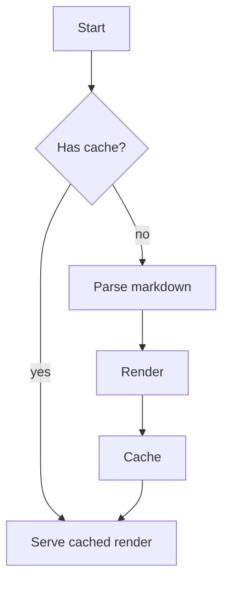

# readit spike sample document


This file exists only to give the M0 spike a realistic ~40 KB Markdown document to load into the editor for the resident-memory measurement. It mixes headings, prose, lists, tables, code fences and math so that CodeMirror, starry-night and MathJax all have something real to chew on.


## 1. Background


Markdown is a lightweight markup language that you can use to add formatting elements to plaintext text documents. Created by John Gruber in 2004, Markdown is now one of the world's most popular markup languages. Markdown is a lightweight markup language that you can use to add formatting elements to plaintext text documents. Created by John Gruber in 2004, Markdown is now one of the world's most popular markup languages.


When you create a Markdown-formatted file, you add Markdown syntax to the text to indicate which words and phrases should look different. For example, to denote a heading, you add a number sign before it. Using Markdown is different than using a WYSIWYG editor. In an application like Microsoft Word, you click buttons to format words and phrases, and the changes are visible immediately. Markdown isn't like that.


Using Markdown is different than using a WYSIWYG editor. In an application like Microsoft Word, you click buttons to format words and phrases, and the changes are visible immediately. Markdown isn't like that. Using Markdown is different than using a WYSIWYG editor. In an application like Microsoft Word, you click buttons to format words and phrases, and the changes are visible immediately. Markdown isn't like that.


- First consideration for this section
- Second consideration, slightly longer to vary line length
- Third consideration with a `code span` inline


```js
function renderMarkdown(source) {
  const tokens = tokenize(source);
  const tree = parse(tokens);
  return toHtml(tree);
}
```


## 2. Motivation


Readit aims to be a small, fast, cross-platform document reader that opens a Markdown file and renders it exactly the way GitHub would, including math, diagrams and syntax-highlighted code fences. Markdown is a lightweight markup language that you can use to add formatting elements to plaintext text documents. Created by John Gruber in 2004, Markdown is now one of the world's most popular markup languages.


Readit aims to be a small, fast, cross-platform document reader that opens a Markdown file and renders it exactly the way GitHub would, including math, diagrams and syntax-highlighted code fences. Because Markdown is a plain text format, files written in Markdown can be opened using virtually any application. This makes Markdown an appealing format for writers who want their words to be accessible on any device.


Markdown is a lightweight markup language that you can use to add formatting elements to plaintext text documents. Created by John Gruber in 2004, Markdown is now one of the world's most popular markup languages. Markdown is a lightweight markup language that you can use to add formatting elements to plaintext text documents. Created by John Gruber in 2004, Markdown is now one of the world's most popular markup languages.


| Metric | Target | Notes |
| --- | --- | --- |
| Cold start | < 300 ms | measured to first paint |
| RSS after open | < 150 MB | 40 KB document |
| Installer size | < 25 MB | arm64 dmg |


## 3. Design goals


Markdown is a lightweight markup language that you can use to add formatting elements to plaintext text documents. Created by John Gruber in 2004, Markdown is now one of the world's most popular markup languages. Using Markdown is different than using a WYSIWYG editor. In an application like Microsoft Word, you click buttons to format words and phrases, and the changes are visible immediately. Markdown isn't like that.


Using Markdown is different than using a WYSIWYG editor. In an application like Microsoft Word, you click buttons to format words and phrases, and the changes are visible immediately. Markdown isn't like that. Readit aims to be a small, fast, cross-platform document reader that opens a Markdown file and renders it exactly the way GitHub would, including math, diagrams and syntax-highlighted code fences.


Readit aims to be a small, fast, cross-platform document reader that opens a Markdown file and renders it exactly the way GitHub would, including math, diagrams and syntax-highlighted code fences. Markdown is a lightweight markup language that you can use to add formatting elements to plaintext text documents. Created by John Gruber in 2004, Markdown is now one of the world's most popular markup languages.


```rust
class DocumentStore {
  constructor(path) {
    this.path = path;
    this.dirty = false;
  }

  load() {
    return fs.readFileSync(this.path, "utf8");
  }
}
```


## 4. Non-goals


Readit aims to be a small, fast, cross-platform document reader that opens a Markdown file and renders it exactly the way GitHub would, including math, diagrams and syntax-highlighted code fences. Because Markdown is a plain text format, files written in Markdown can be opened using virtually any application. This makes Markdown an appealing format for writers who want their words to be accessible on any device.


Using Markdown is different than using a WYSIWYG editor. In an application like Microsoft Word, you click buttons to format words and phrases, and the changes are visible immediately. Markdown isn't like that. Because Markdown is a plain text format, files written in Markdown can be opened using virtually any application. This makes Markdown an appealing format for writers who want their words to be accessible on any device.


Readit aims to be a small, fast, cross-platform document reader that opens a Markdown file and renders it exactly the way GitHub would, including math, diagrams and syntax-highlighted code fences. When you create a Markdown-formatted file, you add Markdown syntax to the text to indicate which words and phrases should look different. For example, to denote a heading, you add a number sign before it.


- First consideration for this section
- Second consideration, slightly longer to vary line length
- Third consideration with a `code span` inline


## 5. Architecture overview


Markdown is a lightweight markup language that you can use to add formatting elements to plaintext text documents. Created by John Gruber in 2004, Markdown is now one of the world's most popular markup languages. Using Markdown is different than using a WYSIWYG editor. In an application like Microsoft Word, you click buttons to format words and phrases, and the changes are visible immediately. Markdown isn't like that.


Because Markdown is a plain text format, files written in Markdown can be opened using virtually any application. This makes Markdown an appealing format for writers who want their words to be accessible on any device. When you create a Markdown-formatted file, you add Markdown syntax to the text to indicate which words and phrases should look different. For example, to denote a heading, you add a number sign before it.


When you create a Markdown-formatted file, you add Markdown syntax to the text to indicate which words and phrases should look different. For example, to denote a heading, you add a number sign before it. Using Markdown is different than using a WYSIWYG editor. In an application like Microsoft Word, you click buttons to format words and phrases, and the changes are visible immediately. Markdown isn't like that.


```js
class DocumentStore {
  constructor(path) {
    this.path = path;
    this.dirty = false;
  }

  load() {
    return fs.readFileSync(this.path, "utf8");
  }
}
```


## 6. Rendering pipeline


When you create a Markdown-formatted file, you add Markdown syntax to the text to indicate which words and phrases should look different. For example, to denote a heading, you add a number sign before it. Markdown is a lightweight markup language that you can use to add formatting elements to plaintext text documents. Created by John Gruber in 2004, Markdown is now one of the world's most popular markup languages.


Markdown is a lightweight markup language that you can use to add formatting elements to plaintext text documents. Created by John Gruber in 2004, Markdown is now one of the world's most popular markup languages. Because Markdown is a plain text format, files written in Markdown can be opened using virtually any application. This makes Markdown an appealing format for writers who want their words to be accessible on any device.


Markdown is a lightweight markup language that you can use to add formatting elements to plaintext text documents. Created by John Gruber in 2004, Markdown is now one of the world's most popular markup languages. When you create a Markdown-formatted file, you add Markdown syntax to the text to indicate which words and phrases should look different. For example, to denote a heading, you add a number sign before it.


| Metric | Target | Notes |
| --- | --- | --- |
| Cold start | < 300 ms | measured to first paint |
| RSS after open | < 150 MB | 40 KB document |
| Installer size | < 25 MB | arm64 dmg |


## 7. Syntax highlighting


When you create a Markdown-formatted file, you add Markdown syntax to the text to indicate which words and phrases should look different. For example, to denote a heading, you add a number sign before it. Readit aims to be a small, fast, cross-platform document reader that opens a Markdown file and renders it exactly the way GitHub would, including math, diagrams and syntax-highlighted code fences.


When you create a Markdown-formatted file, you add Markdown syntax to the text to indicate which words and phrases should look different. For example, to denote a heading, you add a number sign before it. Markdown is a lightweight markup language that you can use to add formatting elements to plaintext text documents. Created by John Gruber in 2004, Markdown is now one of the world's most popular markup languages.


Because Markdown is a plain text format, files written in Markdown can be opened using virtually any application. This makes Markdown an appealing format for writers who want their words to be accessible on any device. Readit aims to be a small, fast, cross-platform document reader that opens a Markdown file and renders it exactly the way GitHub would, including math, diagrams and syntax-highlighted code fences.


- First consideration for this section
- Second consideration, slightly longer to vary line length
- Third consideration with a `code span` inline


```rust
function renderMarkdown(source) {
  const tokens = tokenize(source);
  const tree = parse(tokens);
  return toHtml(tree);
}
```


## 8. Math typesetting


Because Markdown is a plain text format, files written in Markdown can be opened using virtually any application. This makes Markdown an appealing format for writers who want their words to be accessible on any device. Markdown is a lightweight markup language that you can use to add formatting elements to plaintext text documents. Created by John Gruber in 2004, Markdown is now one of the world's most popular markup languages.


Readit aims to be a small, fast, cross-platform document reader that opens a Markdown file and renders it exactly the way GitHub would, including math, diagrams and syntax-highlighted code fences. When you create a Markdown-formatted file, you add Markdown syntax to the text to indicate which words and phrases should look different. For example, to denote a heading, you add a number sign before it.


Readit aims to be a small, fast, cross-platform document reader that opens a Markdown file and renders it exactly the way GitHub would, including math, diagrams and syntax-highlighted code fences. When you create a Markdown-formatted file, you add Markdown syntax to the text to indicate which words and phrases should look different. For example, to denote a heading, you add a number sign before it.


Inline math like $E = mc^2$ and a display equation:

$$\int_0^\infty e^{-x^2}\,dx = \frac{\sqrt{\pi}}{2}$$


## 9. Diagrams


Readit aims to be a small, fast, cross-platform document reader that opens a Markdown file and renders it exactly the way GitHub would, including math, diagrams and syntax-highlighted code fences. Using Markdown is different than using a WYSIWYG editor. In an application like Microsoft Word, you click buttons to format words and phrases, and the changes are visible immediately. Markdown isn't like that.


Markdown is a lightweight markup language that you can use to add formatting elements to plaintext text documents. Created by John Gruber in 2004, Markdown is now one of the world's most popular markup languages. Markdown is a lightweight markup language that you can use to add formatting elements to plaintext text documents. Created by John Gruber in 2004, Markdown is now one of the world's most popular markup languages.


Using Markdown is different than using a WYSIWYG editor. In an application like Microsoft Word, you click buttons to format words and phrases, and the changes are visible immediately. Markdown isn't like that. When you create a Markdown-formatted file, you add Markdown syntax to the text to indicate which words and phrases should look different. For example, to denote a heading, you add a number sign before it.


```js
function renderMarkdown(source) {
  const tokens = tokenize(source);
  const tree = parse(tokens);
  return toHtml(tree);
}
```





## 10. Performance budget


Using Markdown is different than using a WYSIWYG editor. In an application like Microsoft Word, you click buttons to format words and phrases, and the changes are visible immediately. Markdown isn't like that. Markdown is a lightweight markup language that you can use to add formatting elements to plaintext text documents. Created by John Gruber in 2004, Markdown is now one of the world's most popular markup languages.


Because Markdown is a plain text format, files written in Markdown can be opened using virtually any application. This makes Markdown an appealing format for writers who want their words to be accessible on any device. When you create a Markdown-formatted file, you add Markdown syntax to the text to indicate which words and phrases should look different. For example, to denote a heading, you add a number sign before it.


Because Markdown is a plain text format, files written in Markdown can be opened using virtually any application. This makes Markdown an appealing format for writers who want their words to be accessible on any device. When you create a Markdown-formatted file, you add Markdown syntax to the text to indicate which words and phrases should look different. For example, to denote a heading, you add a number sign before it.


- First consideration for this section
- Second consideration, slightly longer to vary line length
- Third consideration with a `code span` inline


| Metric | Target | Notes |
| --- | --- | --- |
| Cold start | < 300 ms | measured to first paint |
| RSS after open | < 150 MB | 40 KB document |
| Installer size | < 25 MB | arm64 dmg |


## 11. Memory budget


Using Markdown is different than using a WYSIWYG editor. In an application like Microsoft Word, you click buttons to format words and phrases, and the changes are visible immediately. Markdown isn't like that. When you create a Markdown-formatted file, you add Markdown syntax to the text to indicate which words and phrases should look different. For example, to denote a heading, you add a number sign before it.


When you create a Markdown-formatted file, you add Markdown syntax to the text to indicate which words and phrases should look different. For example, to denote a heading, you add a number sign before it. Using Markdown is different than using a WYSIWYG editor. In an application like Microsoft Word, you click buttons to format words and phrases, and the changes are visible immediately. Markdown isn't like that.


When you create a Markdown-formatted file, you add Markdown syntax to the text to indicate which words and phrases should look different. For example, to denote a heading, you add a number sign before it. Markdown is a lightweight markup language that you can use to add formatting elements to plaintext text documents. Created by John Gruber in 2004, Markdown is now one of the world's most popular markup languages.


```rust
class DocumentStore {
  constructor(path) {
    this.path = path;
    this.dirty = false;
  }

  load() {
    return fs.readFileSync(this.path, "utf8");
  }
}
```


## 12. Startup time


Readit aims to be a small, fast, cross-platform document reader that opens a Markdown file and renders it exactly the way GitHub would, including math, diagrams and syntax-highlighted code fences. Using Markdown is different than using a WYSIWYG editor. In an application like Microsoft Word, you click buttons to format words and phrases, and the changes are visible immediately. Markdown isn't like that.


Using Markdown is different than using a WYSIWYG editor. In an application like Microsoft Word, you click buttons to format words and phrases, and the changes are visible immediately. Markdown isn't like that. Because Markdown is a plain text format, files written in Markdown can be opened using virtually any application. This makes Markdown an appealing format for writers who want their words to be accessible on any device.


Because Markdown is a plain text format, files written in Markdown can be opened using virtually any application. This makes Markdown an appealing format for writers who want their words to be accessible on any device. When you create a Markdown-formatted file, you add Markdown syntax to the text to indicate which words and phrases should look different. For example, to denote a heading, you add a number sign before it.


## 13. Packaging


Readit aims to be a small, fast, cross-platform document reader that opens a Markdown file and renders it exactly the way GitHub would, including math, diagrams and syntax-highlighted code fences. Using Markdown is different than using a WYSIWYG editor. In an application like Microsoft Word, you click buttons to format words and phrases, and the changes are visible immediately. Markdown isn't like that.


When you create a Markdown-formatted file, you add Markdown syntax to the text to indicate which words and phrases should look different. For example, to denote a heading, you add a number sign before it. Markdown is a lightweight markup language that you can use to add formatting elements to plaintext text documents. Created by John Gruber in 2004, Markdown is now one of the world's most popular markup languages.


Using Markdown is different than using a WYSIWYG editor. In an application like Microsoft Word, you click buttons to format words and phrases, and the changes are visible immediately. Markdown isn't like that. Markdown is a lightweight markup language that you can use to add formatting elements to plaintext text documents. Created by John Gruber in 2004, Markdown is now one of the world's most popular markup languages.


- First consideration for this section
- Second consideration, slightly longer to vary line length
- Third consideration with a `code span` inline


```js
fn word_count(text: &str) -> usize {
    text.split_whitespace().count()
}
```


## 14. Find in document


Because Markdown is a plain text format, files written in Markdown can be opened using virtually any application. This makes Markdown an appealing format for writers who want their words to be accessible on any device. When you create a Markdown-formatted file, you add Markdown syntax to the text to indicate which words and phrases should look different. For example, to denote a heading, you add a number sign before it.


Markdown is a lightweight markup language that you can use to add formatting elements to plaintext text documents. Created by John Gruber in 2004, Markdown is now one of the world's most popular markup languages. Using Markdown is different than using a WYSIWYG editor. In an application like Microsoft Word, you click buttons to format words and phrases, and the changes are visible immediately. Markdown isn't like that.


Readit aims to be a small, fast, cross-platform document reader that opens a Markdown file and renders it exactly the way GitHub would, including math, diagrams and syntax-highlighted code fences. When you create a Markdown-formatted file, you add Markdown syntax to the text to indicate which words and phrases should look different. For example, to denote a heading, you add a number sign before it.


| Metric | Target | Notes |
| --- | --- | --- |
| Cold start | < 300 ms | measured to first paint |
| RSS after open | < 150 MB | 40 KB document |
| Installer size | < 25 MB | arm64 dmg |


## 15. Accessibility


Using Markdown is different than using a WYSIWYG editor. In an application like Microsoft Word, you click buttons to format words and phrases, and the changes are visible immediately. Markdown isn't like that. Because Markdown is a plain text format, files written in Markdown can be opened using virtually any application. This makes Markdown an appealing format for writers who want their words to be accessible on any device.


Because Markdown is a plain text format, files written in Markdown can be opened using virtually any application. This makes Markdown an appealing format for writers who want their words to be accessible on any device. Because Markdown is a plain text format, files written in Markdown can be opened using virtually any application. This makes Markdown an appealing format for writers who want their words to be accessible on any device.


Using Markdown is different than using a WYSIWYG editor. In an application like Microsoft Word, you click buttons to format words and phrases, and the changes are visible immediately. Markdown isn't like that. When you create a Markdown-formatted file, you add Markdown syntax to the text to indicate which words and phrases should look different. For example, to denote a heading, you add a number sign before it.


```rust
class DocumentStore {
  constructor(path) {
    this.path = path;
    this.dirty = false;
  }

  load() {
    return fs.readFileSync(this.path, "utf8");
  }
}
```


## 16. Internationalization


Using Markdown is different than using a WYSIWYG editor. In an application like Microsoft Word, you click buttons to format words and phrases, and the changes are visible immediately. Markdown isn't like that. Readit aims to be a small, fast, cross-platform document reader that opens a Markdown file and renders it exactly the way GitHub would, including math, diagrams and syntax-highlighted code fences.


Readit aims to be a small, fast, cross-platform document reader that opens a Markdown file and renders it exactly the way GitHub would, including math, diagrams and syntax-highlighted code fences. When you create a Markdown-formatted file, you add Markdown syntax to the text to indicate which words and phrases should look different. For example, to denote a heading, you add a number sign before it.


Readit aims to be a small, fast, cross-platform document reader that opens a Markdown file and renders it exactly the way GitHub would, including math, diagrams and syntax-highlighted code fences. Because Markdown is a plain text format, files written in Markdown can be opened using virtually any application. This makes Markdown an appealing format for writers who want their words to be accessible on any device.


- First consideration for this section
- Second consideration, slightly longer to vary line length
- Third consideration with a `code span` inline


## 17. Testing strategy


Readit aims to be a small, fast, cross-platform document reader that opens a Markdown file and renders it exactly the way GitHub would, including math, diagrams and syntax-highlighted code fences. Because Markdown is a plain text format, files written in Markdown can be opened using virtually any application. This makes Markdown an appealing format for writers who want their words to be accessible on any device.


When you create a Markdown-formatted file, you add Markdown syntax to the text to indicate which words and phrases should look different. For example, to denote a heading, you add a number sign before it. Using Markdown is different than using a WYSIWYG editor. In an application like Microsoft Word, you click buttons to format words and phrases, and the changes are visible immediately. Markdown isn't like that.


Using Markdown is different than using a WYSIWYG editor. In an application like Microsoft Word, you click buttons to format words and phrases, and the changes are visible immediately. Markdown isn't like that. Readit aims to be a small, fast, cross-platform document reader that opens a Markdown file and renders it exactly the way GitHub would, including math, diagrams and syntax-highlighted code fences.


```js
SELECT id, title, updated_at
FROM documents
WHERE workspace_id = $1
ORDER BY updated_at DESC
LIMIT 50;
```


## 18. Open questions


Markdown is a lightweight markup language that you can use to add formatting elements to plaintext text documents. Created by John Gruber in 2004, Markdown is now one of the world's most popular markup languages. Markdown is a lightweight markup language that you can use to add formatting elements to plaintext text documents. Created by John Gruber in 2004, Markdown is now one of the world's most popular markup languages.


Markdown is a lightweight markup language that you can use to add formatting elements to plaintext text documents. Created by John Gruber in 2004, Markdown is now one of the world's most popular markup languages. Using Markdown is different than using a WYSIWYG editor. In an application like Microsoft Word, you click buttons to format words and phrases, and the changes are visible immediately. Markdown isn't like that.


Using Markdown is different than using a WYSIWYG editor. In an application like Microsoft Word, you click buttons to format words and phrases, and the changes are visible immediately. Markdown isn't like that. Because Markdown is a plain text format, files written in Markdown can be opened using virtually any application. This makes Markdown an appealing format for writers who want their words to be accessible on any device.


| Metric | Target | Notes |
| --- | --- | --- |
| Cold start | < 300 ms | measured to first paint |
| RSS after open | < 150 MB | 40 KB document |
| Installer size | < 25 MB | arm64 dmg |


## 19. Appendix: glossary


Readit aims to be a small, fast, cross-platform document reader that opens a Markdown file and renders it exactly the way GitHub would, including math, diagrams and syntax-highlighted code fences. Markdown is a lightweight markup language that you can use to add formatting elements to plaintext text documents. Created by John Gruber in 2004, Markdown is now one of the world's most popular markup languages.


Because Markdown is a plain text format, files written in Markdown can be opened using virtually any application. This makes Markdown an appealing format for writers who want their words to be accessible on any device. Because Markdown is a plain text format, files written in Markdown can be opened using virtually any application. This makes Markdown an appealing format for writers who want their words to be accessible on any device.


Readit aims to be a small, fast, cross-platform document reader that opens a Markdown file and renders it exactly the way GitHub would, including math, diagrams and syntax-highlighted code fences. Because Markdown is a plain text format, files written in Markdown can be opened using virtually any application. This makes Markdown an appealing format for writers who want their words to be accessible on any device.


- First consideration for this section
- Second consideration, slightly longer to vary line length
- Third consideration with a `code span` inline


```rust
fn word_count(text: &str) -> usize {
    text.split_whitespace().count()
}
```


## 20. Appendix: references


Readit aims to be a small, fast, cross-platform document reader that opens a Markdown file and renders it exactly the way GitHub would, including math, diagrams and syntax-highlighted code fences. Markdown is a lightweight markup language that you can use to add formatting elements to plaintext text documents. Created by John Gruber in 2004, Markdown is now one of the world's most popular markup languages.


Markdown is a lightweight markup language that you can use to add formatting elements to plaintext text documents. Created by John Gruber in 2004, Markdown is now one of the world's most popular markup languages. Readit aims to be a small, fast, cross-platform document reader that opens a Markdown file and renders it exactly the way GitHub would, including math, diagrams and syntax-highlighted code fences.


When you create a Markdown-formatted file, you add Markdown syntax to the text to indicate which words and phrases should look different. For example, to denote a heading, you add a number sign before it. When you create a Markdown-formatted file, you add Markdown syntax to the text to indicate which words and phrases should look different. For example, to denote a heading, you add a number sign before it.

Markdown is a lightweight markup language that you can use to add formatting elements to plaintext text documents. Created by John Gruber in 2004, Markdown is now one of the world's most popular markup languages. Using Markdown is different than using a WYSIWYG editor. In an application like Microsoft Word, you click buttons to format words and phrases, and the changes are visible immediately. Markdown isn't like that. When you create a Markdown-formatted file, you add Markdown syntax to the text to indicate which words and phrases should look different. For example, to denote a heading, you add a number sign before it. Because Markdown is a plain text format, files written in Markdown can be opened using virtually any application. This makes Markdown an appealing format for writers who want their words to be accessible on any device. Readit aims to be a small, fast, cross-platform document reader that opens a Markdown file and renders it exactly the way GitHub would, including math, diagrams and syntax-highlighted code fences.

Markdown is a lightweight markup language that you can use to add formatting elements to plaintext text documents. Created by John Gruber in 2004, Markdown is now one of the world's most popular markup languages. Using Markdown is different than using a WYSIWYG editor. In an application like Microsoft Word, you click buttons to format words and phrases, and the changes are visible immediately. Markdown isn't like that. When you create a Markdown-formatted file, you add Markdown syntax to the text to indicate which words and phrases should look different. For example, to denote a heading, you add a number sign before it. Because Markdown is a plain text format, files written in Markdown can be opened using virtually any application. This makes Markdown an appealing format for writers who want their words to be accessible on any device. Readit aims to be a small, fast, cross-platform document reader that opens a Markdown file and renders it exactly the way GitHub would, including math, diagrams and syntax-highlighted code fences.

Markdown is a lightweight markup language that you can use to add formatting elements to plaintext text documents. Created by John Gruber in 2004, Markdown is now one of the world's most popular markup languages. Using Markdown is different than using a WYSIWYG editor. In an application like Microsoft Word, you click buttons to format words and phrases, and the changes are visible immediately. Markdown isn't like that. When you create a Markdown-formatted file, you add Markdown syntax to the text to indicate which words and phrases should look different. For example, to denote a heading, you add a number sign before it. Because Markdown is a plain text format, files written in Markdown can be opened using virtually any application. This makes Markdown an appealing format for writers who want their words to be accessible on any device. Readit aims to be a small, fast, cross-platform document reader that opens a Markdown file and renders it exactly the way GitHub would, including math, diagrams and syntax-highlighted code fences.

Markdown is a lightweight markup language that you can use to add formatting elements to plaintext text documents. Created by John Gruber in 2004, Markdown is now one of the world's most popular markup languages. Using Markdown is different than using a WYSIWYG editor. In an application like Microsoft Word, you click buttons to format words and phrases, and the changes are visible immediately. Markdown isn't like that. When you create a Markdown-formatted file, you add Markdown syntax to the text to indicate which words and phrases should look different. For example, to denote a heading, you add a number sign before it. Because Markdown is a plain text format, files written in Markdown can be opened using virtually any application. This makes Markdown an appealing format for writers who want their words to be accessible on any device. Readit aims to be a small, fast, cross-platform document reader that opens a Markdown file and renders it exactly the way GitHub would, including math, diagrams and syntax-highlighted code fences.

Markdown is a lightweight markup language that you can use to add formatting elements to plaintext text documents. Created by John Gruber in 2004, Markdown is now one of the world's most popular markup languages. Using Markdown is different than using a WYSIWYG editor. In an application like Microsoft Word, you click buttons to format words and phrases, and the changes are visible immediately. Markdown isn't like that. When you create a Markdown-formatted file, you add Markdown syntax to the text to indicate which words and phrases should look different. For example, to denote a heading, you add a number sign before it. Because Markdown is a plain text format, files written in Markdown can be opened using virtually any application. This makes Markdown an appealing format for writers who want their words to be accessible on any device. Readit aims to be a small, fast, cross-platform document reader that opens a Markdown file and renders it exactly the way GitHub would, including math, diagrams and syntax-highlighted code fences.

Markdown is a lightweight markup language that you can use to add formatting elements to plaintext text documents. Created by John Gruber in 2004, Markdown is now one of the world's most popular markup languages. Using Markdown is different than using a WYSIWYG editor. In an application like Microsoft Word, you click buttons to format words and phrases, and the changes are visible immediately. Markdown isn't like that. When you create a Markdown-formatted file, you add Markdown syntax to the text to indicate which words and phrases should look different. For example, to denote a heading, you add a number sign before it. Because Markdown is a plain text format, files written in Markdown can be opened using virtually any application. This makes Markdown an appealing format for writers who want their words to be accessible on any device. Readit aims to be a small, fast, cross-platform document reader that opens a Markdown file and renders it exactly the way GitHub would, including math, diagrams and syntax-highlighted code fences.

Markdown is a lightweight markup language that you can use to add formatting elements to plaintext text documents. Created by John Gruber in 2004, Markdown is now one of the world's most popular markup languages. Using Markdown is different than using a WYSIWYG editor. In an application like Microsoft Word, you click buttons to format words and phrases, and the changes are visible immediately. Markdown isn't like that. When you create a Markdown-formatted file, you add Markdown syntax to the text to indicate which words and phrases should look different. For example, to denote a heading, you add a number sign before it. Because Markdown is a plain text format, files written in Markdown can be opened using virtually any application. This makes Markdown an appealing format for writers who want their words to be accessible on any device. Readit aims to be a small, fast, cross-platform document reader that opens a Markdown file and renders it exactly the way GitHub would, including math, diagrams and syntax-highlighted code fences.

Markdown is a lightweight markup language that you can use to add formatting elements to plaintext text documents. Created by John Gruber in 2004, Markdown is now one of the world's most popular markup languages. Using Markdown is different than using a WYSIWYG editor. In an application like Microsoft Word, you click buttons to format words and phrases, and the changes are visible immediately. Markdown isn't like that. When you create a Markdown-formatted file, you add Markdown syntax to the text to indicate which words and phrases should look different. For example, to denote a heading, you add a number sign before it. Because Markdown is a plain text format, files written in Markdown can be opened using virtually any application. This makes Markdown an appealing format for writers who want their words to be accessible on any device. Readit aims to be a small, fast, cross-platform document reader that opens a Markdown file and renders it exactly the way GitHub would, including math, diagrams and syntax-highlighted code fences.

Markdown is a lightweight markup language that you can use to add formatting elements to plaintext text documents. Created by John Gruber in 2004, Markdown is now one of the world's most popular markup languages. Using Markdown is different than using a WYSIWYG editor. In an application like Microsoft Word, you click buttons to format words and phrases, and the changes are visible immediately. Markdown isn't like that. When you create a Markdown-formatted file, you add Markdown syntax to the text to indicate which words and phrases should look different. For example, to denote a heading, you add a number sign before it. Because Markdown is a plain text format, files written in Markdown can be opened using virtually any application. This makes Markdown an appealing format for writers who want their words to be accessible on any device. Readit aims to be a small, fast, cross-platform document reader that opens a Markdown file and renders it exactly the way GitHub would, including math, diagrams and syntax-highlighted code fences.

Markdown is a lightweight markup language that you can use to add formatting elements to plaintext text documents. Created by John Gruber in 2004, Markdown is now one of the world's most popular markup languages. Using Markdown is different than using a WYSIWYG editor. In an application like Microsoft Word, you click buttons to format words and phrases, and the changes are visible immediately. Markdown isn't like that. When you create a Markdown-formatted file, you add Markdown syntax to the text to indicate which words and phrases should look different. For example, to denote a heading, you add a number sign before it. Because Markdown is a plain text format, files written in Markdown can be opened using virtually any application. This makes Markdown an appealing format for writers who want their words to be accessible on any device. Readit aims to be a small, fast, cross-platform document reader that opens a Markdown file and renders it exactly the way GitHub would, including math, diagrams and syntax-highlighted code fences.

Markdown is a lightweight markup language that you can use to add formatting elements to plaintext text documents. Created by John Gruber in 2004, Markdown is now one of the world's most popular markup languages. Using Markdown is different than using a WYSIWYG editor. In an application like Microsoft Word, you click buttons to format words and phrases, and the changes are visible immediately. Markdown isn't like that. When you create a Markdown-formatted file, you add Markdown syntax to the text to indicate which words and phrases should look different. For example, to denote a heading, you add a number sign before it. Because Markdown is a plain text format, files written in Markdown can be opened using virtually any application. This makes Markdown an appealing format for writers who want their words to be accessible on any device. Readit aims to be a small, fast, cross-platform document reader that opens a Markdown file and renders it exactly the way GitHub would, including math, diagrams and syntax-highlighted code fences.
